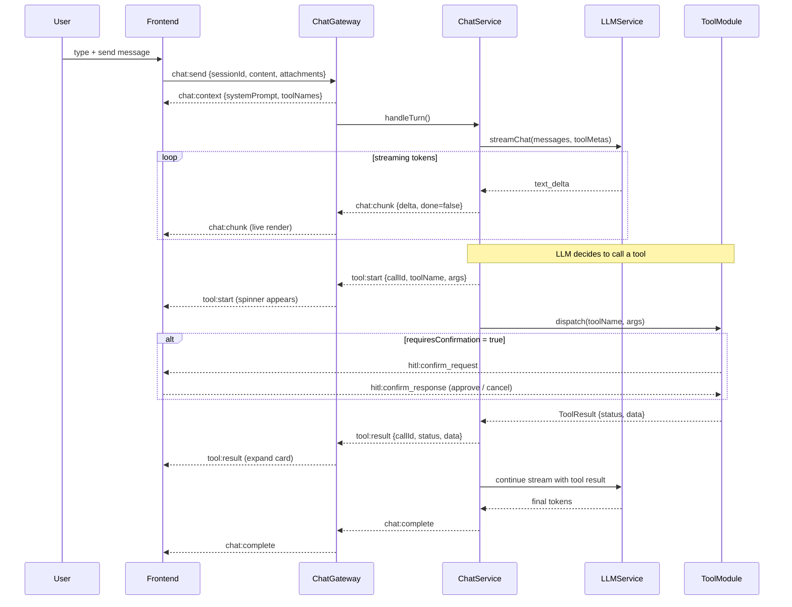
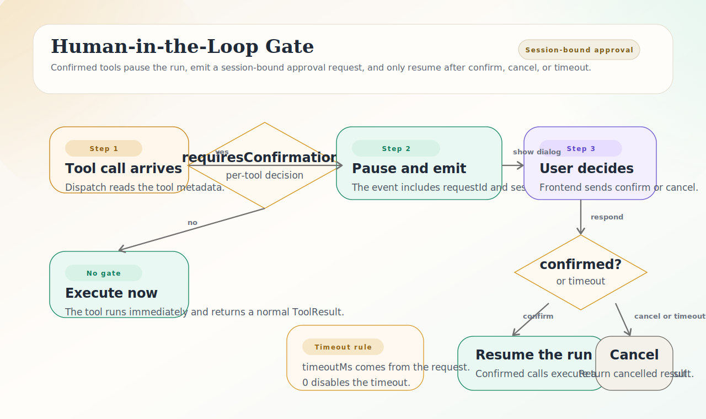

<div align="center">

# Kalio

**Local-first AI workspace — chat with agents that have real memory, real tools, and a real filesystem.**

[](./LICENSE)
[](https://github.com/Radomiej/kalio-forever/actions/workflows/ci.yml)
[](https://www.typescriptlang.org/)
[](https://nodejs.org/)
[](https://nestjs.com/)
[](https://react.dev/)
[](https://pnpm.io/)

</div>

---

Kalio is a **self-hosted AI agent workspace** that connects a streaming React chat interface to a NestJS backend capable of executing real tools: reading and writing files, calling external APIs, running subprocesses, querying a vector memory store, and rendering interactive mini-applications — all with a Human-in-the-Loop confirmation gate for destructive operations.

Every chat session gets its own sandboxed filesystem. Every persona has isolated system prompts, tool access rules, and semantic memory. Any MCP (Model Context Protocol) server can be connected and its tools appear in the agent's toolbox instantly.

> **No cloud relay.** LLM traffic goes directly from your backend to the API. Nothing else leaves your machine.

---

## Features

<table>
<tr>
<td width="50%">

**🤖 Agentic loop**  
Up to 8 tool-call hops per turn. The LLM plans, calls tools, reads results, and iterates until it's done — or asks you.

**⚡ Sub-second streaming**  
Every token arrives live via Socket.IO. The first chunk appears before the full response is generated.

**🛡️ Human-in-the-Loop (HITL)**  
Destructive tools (`fs_delete`, `terminal_exec`, `raapp_call_native`, …) pause and prompt for confirmation before executing.

**📁 Virtual File System**  
Each session gets a sandboxed workspace at `sessions/{id}/files/`. Agents read, write, list, and search files without ever leaving the sandbox.

**🧠 Semantic memory**  
Per-persona vector store powered by `sqlite-vec`. Agents embed episodic memories and retrieve them by meaning, not just keyword.

</td>
<td width="50%">

**🎭 Personas**  
Fully isolated system prompts, default models, MCP policies, skills, and tool access per persona.

**🔌 MCP — dynamic tool discovery**  
Connect any Model Context Protocol server (stdio or HTTP). Tools appear in the agent's toolset immediately with automatic prefixing and HITL inheritance.

**📺 RA-App renderer**  
Agents can produce interactive mini-apps: raw HTML iframes with `postMessage` bridge back to chat, or a declarative GUI DSL that renders as structured UI.

**🖼️ Image generation + vision**  
Attach images to messages. Generate images via any compatible API. Agents can inspect and describe image content.

**🤖 CLI agent runner**  
Invoke Copilot, Claude Code, Gemini CLI, or any subprocess-based agent directly from chat. Live streaming output captured in real time.

</td>
</tr>
</table>

---

## Architecture

<p align="center">
  
</p>

The frontend is a **thin client** — it renders state, dispatches events, and never runs business logic. All intelligence, tool execution, memory, and I/O live in the backend.

---

## How It Works — Streaming Event Flow

Every user message triggers this pipeline:



---

## Human-in-the-Loop Gate

<p align="center">
  
</p>

Tools marked `requiresConfirmation: true` are paused before execution. The user sees a confirmation dialog with the tool name, arguments, and a clear approve/cancel choice. The agent waits. If cancelled, `TOOL_CANCELLED` is injected into the conversation context.

---

## Quick Start

### Requirements

- Node.js ≥ 22
- pnpm ≥ 9

### 1. Install

```bash
git clone https://github.com/your-org/kalio-forever.git
cd kalio-forever
pnpm install
```

### 2. Configure

```bash
cp .env.example .env
```

Open `.env` and set at minimum:

```env
LLM_PROVIDER=openai          # or: mock | openai | openrouter | cometapi | xiaomimimo | deepseek | ollama | bitnet | custom
LLM_API_KEY=sk-...
LLM_BASE_URL=https://api.openai.com/v1
LLM_MODEL=gpt-4o-mini
WORKSPACE_ROOT=./data
CREDENTIALS_MASTER_KEY=replace-with-a-long-random-secret   # required in production to decrypt stored secrets
```

> Use `LLM_PROVIDER=mock` to run fully offline with no API key — great for development and testing.
> `CREDENTIALS_MASTER_KEY` is used to encrypt stored provider secrets at rest. In local development, Kalio falls back to a dev-only key if this variable is missing; in production it must be set explicitly.

### 3. Run

```bash
# Windows (starts both API :3016 and Web :5188)
.\start-dev.ps1

# macOS / Linux
cd apps/kalio-api && pnpm start:dev &
cd apps/kalio-web && pnpm dev
```

Open **http://localhost:5188** and start chatting.

### 4. What success looks like

After `./start-dev.ps1` boots cleanly you should have:

- API listening on `http://localhost:3016`
- Web UI ready on `http://localhost:5188`
- a working Settings page where you can add or activate an LLM provider
- the ability to create a session and send a first message without reloading

### 5. Run Tests

```bash
pnpm test           # unit + integration (Vitest)
pnpm test:e2e       # end-to-end (Playwright — servers must be running)
```

---

## Daily Use

1. Start the stack with `./start-dev.ps1`.
2. Open `http://localhost:5188`.
3. Go to Settings once and either:
  use `mock` for offline development, or
  add a real provider key and activate it.
4. Create a session, pick a persona, and send a message.
5. Approve destructive tool calls when the HITL prompt appears.
6. Inspect results directly in chat: files, tool output, RA-Apps, images, and memory hits all show up inline.

### Where To Change Things

- Persona prompts and policies: `apps/kalio-api/src/modules/persona/`
- Native tools: `apps/kalio-api/src/modules/tool/tools/`
- Chat orchestration and streaming: `apps/kalio-api/src/modules/chat/`
- Runtime settings UI: `apps/kalio-web/src/features/settings/`
- Memory UI: `apps/kalio-web/src/features/memory/`

### Troubleshooting

| Problem | What to check |
|---|---|
| API does not start | Confirm Node 22+, `pnpm install`, and that port `3016` is free |
| Web cannot reach backend | Confirm API is on `http://localhost:3016` and the browser opened `http://localhost:5188` |
| Provider saves fail | Check `CREDENTIALS_MASTER_KEY` and the provider base URL/API key in Settings |
| Secrets cannot be decrypted in production | Set `CREDENTIALS_MASTER_KEY` explicitly; dev fallback keys are only for local development |
| Socket events seem stuck | Check browser console, API logs, and whether the current session was recreated after a restart |

---

## LLM Providers

Any OpenAI-compatible endpoint works out of the box.

| Provider | `LLM_PROVIDER` | Notes |
|---|---|---|
| **Mock** | `mock` | Fully offline. Echoes back messages. Ideal for tests. |
| **OpenAI** | `openai` | GPT-4o, GPT-4.1, o3-mini, … |
| **CometAPI** | `cometapi` | OpenAI-compatible aggregator. Set `LLM_BASE_URL=https://api.cometapi.com/v1` if needed. |
| **Xiaomi MiMo** | `xiaomimimo` | MiMo reasoning/chat models. Default base URL is `https://token-plan-ams.xiaomimimo.com/v1`. |
| **DeepSeek** | `deepseek` | OpenAI-compatible DeepSeek endpoint. Default base URL is `https://api.deepseek.com/v1`. |
| **OpenRouter** | `openrouter` | 200+ models via one key. Set `LLM_BASE_URL=https://openrouter.ai/api/v1`. |
| **Ollama** | `ollama` | Local models (llama3, qwen3, deepseek-r2, …). Set `LLM_BASE_URL=http://localhost:11434/v1`. |
| **BitNet** | `bitnet` | Local BitNet-compatible OpenAI endpoint. Default base URL is `http://localhost:8080/v1`. |
| **Custom** | `custom` | Any OpenAI-compatible endpoint. Set `LLM_BASE_URL` to your server URL. |

Local providers (`ollama`, `bitnet`, and `custom` endpoints on `localhost` / `.local`) can be saved and tested without an API key. Remote providers still require one.

For image generation, set `IMAGE_PROVIDER` and `IMAGE_API_KEY` separately (same format).

---

## Data Storage

| Storage | Purpose | Default path |
|---|---|---|
| `kalio.db` | Sessions, messages, personas, credentials, audit log | `$WORKSPACE_ROOT/kalio.db` |
| `memory/{personaId}.db` | Vector embeddings per persona (sqlite-vec RAG) | `$WORKSPACE_ROOT/memory/` |
| `sessions/{id}/files/` | Per-session sandboxed file workspace | `$WORKSPACE_ROOT/sessions/` |
| `sessions/{id}/_kv.json` | Agent-writable key-value store | (same root) |

Provider secrets stored in `kalio.db` and image provider settings are encrypted at rest with `CREDENTIALS_MASTER_KEY`. This is field-level secret encryption, not a password on the SQLite database file itself.

Each session sandbox is isolated. Agents can only read and write inside `WORKSPACE_ROOT/sessions/{sessionId}/` and the KV namespace attached to that session/persona boundary.

---

## Project Structure

```
kalio-forever/
├── apps/
│   ├── kalio-api/          # NestJS 11 backend
│   │   └── src/
│   │       ├── modules/    # one folder per domain (chat, persona, vfs, tool, …)
│   │       └── database/   # schema.ts + migrations/
│   ├── kalio-web/          # React 19 frontend
│   │   └── src/
│   │       ├── features/   # React feature folders
│   │       ├── store/      # Zustand stores
│   │       └── services/   # eventBus, apiClient
│   └── e2e/                # Playwright E2E tests
├── packages/
│   ├── @kalio/types/       # Shared type contracts (DTOs, Socket events)
│   └── @kalio/sdk/         # Socket.IO client wrapper
├── docs/                   # Architecture diagrams and specs
├── scripts/code-audit/     # Automated LOC and architecture health audit
├── AGENTS.md               # Architecture rules for AI coding agents
├── CONTRIBUTING.md         # Developer guide
├── CODE_OF_CONDUCT.md
└── .env.example
```

---

## Documentation

If you're contributing code or using an AI coding agent, start with [CONTRIBUTING.md](./CONTRIBUTING.md) and [AGENTS.md](./AGENTS.md) before changing implementation details.

| Doc | What it covers |
|---|---|
| [AGENTS.md](./AGENTS.md) | Architecture invariants enforced in every PR (AI-readable) |
| [CONTRIBUTING.md](./CONTRIBUTING.md) | Setup, TDD workflow, tool registration, PR checklist |
| [CODE_OF_CONDUCT.md](./CODE_OF_CONDUCT.md) | Community expectations, moderation scope, and reporting path |
| [scripts/code-audit/README.md](./scripts/code-audit/README.md) | What the automated audit checks and how to run it |
| [docs/sessions/](./docs/sessions/) | Chronological engineering session logs and implementation decisions |
| [docs/chat-streaming-tools-architecture.md](./docs/chat-streaming-tools-architecture.md) | LLM streaming + tool dispatch deep-dive |
| [docs/mcp-architecture.md](./docs/mcp-architecture.md) | MCP integration: discovery, lifecycle, per-persona policy |
| [docs/database-schema-diagram.md](./docs/database-schema-diagram.md) | Full ERD with all 13 tables |
| [docs/tool-architecture.md](./docs/tool-architecture.md) | Tool registration pattern and dispatch pipeline |
| [docs/cli-agent-module-architecture.md](./docs/cli-agent-module-architecture.md) | CLI agent module: adapters, config schema, output streaming |

---

## Roadmap

- [x] Streaming chat with sub-second latency (Socket.IO)
- [x] Agentic loop with tool execution (up to 8 hops)
- [x] Human-in-the-Loop confirmation gate
- [x] Virtual File System (per-session sandboxed)
- [x] Persona system (system prompts, model configs, skills)
- [x] MCP dynamic tool discovery (stdio + HTTP transport)
- [x] RA-App renderer (HTML iframes + GUI DSL)
- [x] Semantic memory (sqlite-vec RAG + episodic)
- [x] Image generation and multimodal input
- [x] CLI agent subprocess runner (Copilot, Claude Code, …)
- [x] Full audit log with token usage and timing
- [ ] Auth / JWT session management (post-MVP)
- [ ] PostgreSQL migration path (Drizzle adapter ready)
- [ ] Remote VFS / S3 offload
- [ ] Multi-user / team workspace features

---

## Contributing

Read [CONTRIBUTING.md](./CONTRIBUTING.md) before opening a PR. Key rules:

1. **TDD** — write a failing test that reproduces the bug, then fix it
2. **500 LOC hard limit** per file (tests exempt)
3. **Zero cross-module imports** — all shared contracts go through `@kalio/types`
4. **No `any`** in TypeScript — use `unknown` + narrowing
5. **No empty catch blocks** — always log with context
6. **Run `pnpm audit:report`** when you touch shared tooling, contributor docs, or architecture guidance
7. **Do not grow existing god objects** — if a file is already past its hard limit, extract or split the touched slice before adding more behavior

---

## License

[MIT](./LICENSE)

---

## Code of Conduct

See [CODE_OF_CONDUCT.md](./CODE_OF_CONDUCT.md). We follow the Contributor Covenant 2.1.
