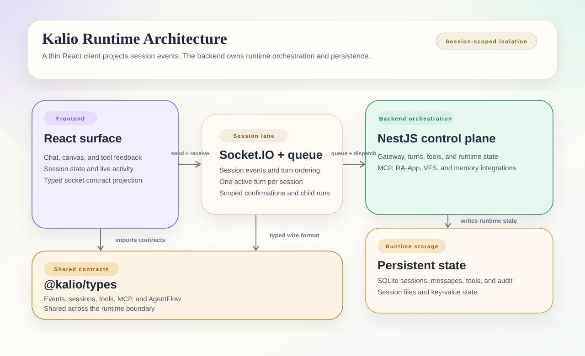

# Kalio

**Local-first runtime for designing, running, and inspecting agent workflows.**

[Install](#quick-start) · [Develop](#for-contributors) · [Architecture](docs/agentflow-architecture-and-workflow.md) · [Docs](#documentation)

Kalio is a **self-hosted agent architecture runtime**. It combines streaming
chat, tools, memory, files, MCP servers, and multi-agent workflows in one
local-first application.

The key idea is simple: an agent workflow is not only a prompt and a model.
It is an editable architecture with roles, personas, routing, context policy,
tool access, durable execution events, and an inspectable result.

> **Local-first by design.** Kalio sends LLM traffic from your backend to the
> provider you configure. Session files, memory, credentials, and execution
> history stay in your local data directory.

## At a glance

| Surface | What it gives you |
| --- | --- |
| **Talk** | Streaming chat with a multi-step tool loop, queues, attachments, and session history. |
| **Architect** | Versioned architecture schemas, role slots, personas, graph nodes, edges, and routing policies. |
| **Inspect** | Timeline, graph, chat, tool calls, runtime events, and audit evidence for each run. |
| **Own your data** | Sandboxed session workspaces, semantic memory, SQLite persistence, and encrypted provider secrets. |

## See it in action

Kalio keeps two graphs separate but connected:

- **Architecture Graph** - how a workflow is designed to think and route.
- **Execution Graph** - what actually happened in a specific run.

~~~mermaid
flowchart TB
  Design["Architecture design"]
  Registry["Versioned schema"]
  Runtime["Runtime execution"]
  Inspect["Execution inspect"]

  Design -->|save graph| Registry
  Registry -->|load version| Runtime
  Runtime -->|project events| Inspect
  Inspect -.->|timeline + graph| Design
~~~

  

The React client projects session state and runtime activity. The backend owns
orchestration, tools, memory, persistence, and I/O. ChatSession scopes history,
files, approvals, and child runs.

Read the [AgentFlow architecture guide](docs/agentflow-architecture-and-workflow.md)
for the full runtime model, or the [Architect User Guide](docs/architect-user-guide.md)
for day-to-day graph editing.

## Quick start

### Install Kalio on Windows

The fastest first run uses the local production profile and the mock provider;
no API key is required.

~~~powershell
irm https://raw.githubusercontent.com/Radomiej/kalio-forever/main/scripts/install.ps1 | iex
~~~

Open **http://localhost:6188**. The API health endpoint is
**http://localhost:4016/api/health**.

1. Open **Settings**.
2. Keep mock for a fully offline first run, or add a provider.
3. Create a session in **Talk**.
4. Send a message and approve tool calls when the HITL prompt appears.

See the [Windows user guide](docs/quickstart-user.md) for upgrades,
uninstall, data locations, and troubleshooting.

### Standalone desktop build

The Windows desktop build packages the web client, the production API, and a
Node.js runtime into a per-user Tauri installer. The backend starts on loopback
and stores the SQLite database, workspaces, memory, embeddings cache, secrets,
and logs under Tauri's local app-data directory (`%LOCALAPPDATA%`, currently
`com.radomiej.kalio`).

Requirements for building: Node.js 22+, pnpm 9+, Rust with the MSVC Windows
target, and WebView2 on the target machine.

~~~powershell
pnpm install
pnpm desktop:build
~~~

The NSIS installer is written to
`src-tauri/target/release/bundle/nsis/Kalio_1.0.0_x64-setup.exe`.
The desktop backend uses `http://127.0.0.1:4516`; this port is reserved for
the installed desktop app and should not be shared with another local service.

### Develop from a clone

#### Requirements

- Node.js >= 22
- pnpm >= 9
- On Windows, use system Node from C:\Program Files\nodejs for installs and
  native modules such as better-sqlite3.

~~~bash
git clone https://github.com/Radomiej/kalio-forever.git
cd kalio-forever
pnpm install
~~~

Create a local configuration:

~~~bash
cp .env.example .env
~~~

For an offline development run, use:

~~~env
LLM_PROVIDER=mock
WORKSPACE_ROOT=./data
CREDENTIALS_MASTER_KEY=replace-with-a-long-random-secret
~~~

CREDENTIALS_MASTER_KEY encrypts stored provider secrets. A development-only
fallback exists when the variable is absent; production requires an explicit
value.

Start the hot-reload stack on Windows:

~~~powershell
pnpm dev
# or
.\start-dev.ps1
~~~

Start the two development processes directly on macOS/Linux:

~~~bash
(cd apps/kalio-api && pnpm dev) &
(cd apps/kalio-web && pnpm dev)
~~~

| Service | URL |
| --- | --- |
| Web UI | http://localhost:5188 |
| API health | http://localhost:3016/api/health |
| Effective LLM config | http://localhost:3016/api/llm/config |

Built QA and production profiles are available when you need a non-hot-reload
stack:

| Profile | Command | UI |
| --- | --- | --- |
| Fixed QA | pnpm qa or pnpm qa:rebuild | http://localhost:5288 |
| Managed QA | pnpm stack:start | random port; use pnpm stack:status |
| Local production profile | pnpm prod or pnpm prod:rebuild | http://localhost:6188 |

See the [local development guide](docs/local-dev-guide.md) for the complete
stack, CI, release, and test command map.

## Core capabilities

| Capability | What it does |
| --- | --- |
| **Agentic loop** | Iterates LLM and tool calls until the turn completes, is interrupted, or reaches its guard. |
| **Architecture Runtime** | Runs schema-driven protocols with role slots, routers, finalizers, graph nodes, context policies, and persisted events. |
| **Streaming** | Delivers live response chunks and tool progress over Socket.IO. |
| **Human-in-the-loop** | Pauses confirmed tools before execution and binds approval/cancel actions to the owning session. |
| **Virtual File System** | Gives every session a sandboxed workspace for reading, writing, listing, and searching files. |
| **Semantic memory** | Stores per-persona vector memory with sqlite-vec retrieval. |
| **Personas** | Isolates system prompts, model defaults, MCP policies, skills, and tool access. |
| **MCP** | Discovers tools from stdio or HTTP servers and exposes them under stable prefixed names. |
| **RA-Apps** | Renders interactive mini-apps through HTML iframes or a declarative GUI DSL. |
| **Vision and images** | Accepts image attachments and supports compatible image-generation providers. |
| **CLI agents** | Streams output from subprocess-based agents such as Copilot, Claude Code, or Gemini CLI. |

## How the runtime works

Every user message follows the same high-level path:

~~~mermaid
%%{init: {"sequence": {"mirrorActors": false}}}%%
sequenceDiagram
  participant U as User
  participant FE as Browser
  participant GW as Gateway
  participant P as Pipeline

  U->>FE: Send message
  FE->>GW: chat:send
  GW->>P: Submit turn

  alt Turn active
    P-->>FE: queued
  else Dispatch now
    P-->>FE: start turn
  end
~~~

~~~mermaid
%%{init: {"sequence": {"mirrorActors": false}}}%%
sequenceDiagram
  participant FE as Browser
  participant P as Pipeline
  participant LLM as Provider
  participant T as Tools

  loop Turn iterations
    P->>LLM: Stream
    LLM-->>FE: Chunks
    opt Tool call
      P->>T: Dispatch
      T-->>FE: Progress / confirm
      T-->>P: Result
    end
  end
  P-->>FE: Complete + done
~~~

Tools with requiresConfirmation=true pause before execution. The frontend shows
the tool name and arguments, then sends tool:confirm or tool:cancel. Both
gateway and dispatch layers enforce the owning sessionId.

### Architecture Runtime

Built-in architecture flows include:

- strategic-decision-council - Pragmatist, Innovator, Analyst, User Advocate,
  Shadow, Router, and Finalizer roles.
- five-minds-council - a five-perspective debate followed by synthesis and
  decision artifact generation.

The registry stores seed schemas and user-created variants. The execution
viewer projects one run into timeline, graph, and chat views; chat is a view of
the run, not its source of truth.

Read the [runtime stack guide](docs/architecture-runtime-stack.md) and
[chat/streaming architecture](docs/chat-streaming-tools-architecture.md) for
implementation detail.

## Providers

Kalio supports OpenAI-compatible providers through the configured backend.
Use mock for offline development and tests.

| Provider | LLM_PROVIDER | Notes |
| --- | --- | --- |
| Mock | mock | Offline provider for development and tests. |
| OpenAI | openai | OpenAI models through the default API shape. |
| CometAPI | cometapi | OpenAI-compatible aggregator. |
| Xiaomi MiMo | xiaomimimo | MiMo reasoning/chat models. |
| DeepSeek | deepseek | OpenAI-compatible DeepSeek endpoint. |
| OpenRouter | openrouter | Multiple models through one key. |
| Ollama | ollama | Local models through http://localhost:11434/v1. |
| BitNet | bitnet | Local BitNet-compatible endpoint. |
| Custom | custom | Any compatible endpoint configured by the user. |

Local providers can be saved and tested without a remote API key. Remote
providers require the credentials expected by that provider.

For image generation, configure IMAGE_PROVIDER and IMAGE_API_KEY separately.

## Data and safety

| Data | Default location | Purpose |
| --- | --- | --- |
| SQLite database | $WORKSPACE_ROOT/kalio.db | Sessions, messages, personas, credentials, and audit log. |
| Semantic memory | $WORKSPACE_ROOT/memory/ | Per-persona vector stores. |
| Session files | $WORKSPACE_ROOT/sessions/{id}/ | Sandboxed workspace for one chat session. |
| Session KV | $WORKSPACE_ROOT/sessions/{id}/_kv.json | Session-scoped key-value state. |
| RA-App catalog | $WORKSPACE_ROOT/ra-apps or RA_APPS_PATH | Versioned stored apps. |

Provider secrets are encrypted at rest with CREDENTIALS_MASTER_KEY. This is
field-level secret encryption, not a password on the SQLite file itself.

Agents can read and write only inside the workspace assigned to their session.
The RA-App catalog is separate from session VFS data.

## Project structure

~~~text
kalio-forever/
├── apps/
│   ├── kalio-api/          # NestJS backend and database
│   ├── kalio-web/          # React/Vite frontend
│   └── e2e/                # Playwright tests
├── packages/
│   ├── @kalio/types/       # Shared DTO and Socket.IO contracts
│   └── @kalio/sdk/         # Shared client SDK
├── docs/                   # Architecture, setup, QA, and session docs
├── scripts/                # Dev, QA, release, audit, and installer tools
├── AGENTS.md               # AI and contributor operating rules
├── CONTRIBUTING.md         # Contribution workflow
└── .env.example            # Local configuration template
~~~

## For contributors

Start with [CONTRIBUTING.md](./CONTRIBUTING.md) and [AGENTS.md](./AGENTS.md).
The most useful local gates are:

~~~powershell
pnpm test
pnpm test:e2e
pnpm typecheck
pnpm lint
pnpm audit:report
~~~

The repository keeps backend logic in services, shared contracts in
@kalio/types, frontend state rebuildable from backend snapshots, and
destructive tools behind confirmation. TypeScript must remain strict: no any,
no empty catches, and no cross-module imports outside the shared contract
boundary.

For targeted work, use the feature folders under
apps/kalio-api/src/modules/ and apps/kalio-web/src/features/. Do not grow
files past the repository's 500 LOC limit; split a touched slice first.

## Documentation

| Document | Purpose |
| --- | --- |
| [Quick start for users](docs/quickstart-user.md) | Windows install, autostart, upgrades, uninstall, and troubleshooting. |
| [Local development guide](docs/local-dev-guide.md) | Dev, QA, prod, CI, release, and test entry points. |
| [AgentFlow architecture](docs/agentflow-architecture-and-workflow.md) | Architecture schemas, workflow execution, and delegation. |
| [Runtime stack](docs/architecture-runtime-stack.md) | Registry, runtime, branch execution, and projections. |
| [MCP architecture](docs/mcp-architecture.md) | Server discovery, lifecycle, and persona policy. |
| [RA-App design](docs/raapp-design-current.md) | Inline apps, catalog apps, iframe bridge, and approvals. |
| [Agent skills index](docs/agent-skills/README.md) | Repo-visible skills for AI-assisted work. |
| [Scripts overview](scripts/README.md) | Root command surface and helper scripts. |
| [Code of Conduct](CODE_OF_CONDUCT.md) | Community expectations and reporting path. |

## Roadmap

### Shipped

- Streaming chat with tool execution and HITL confirmation.
- Sandboxed VFS, semantic memory, personas, and MCP discovery.
- RA-App rendering, image/vision support, and CLI agent streaming.
- Architecture Registry, Architecture Runtime, and Execution Graph views.

### Planned

- Structured router output with accepted/rejected inputs, risks, confidence,
  and explicit next actions.
- First-class registry resources for router policies, output schemas, and
  architecture packages.
- Architecture simulation, token estimates, and JSON/Mermaid/Markdown export.
- Auth/JWT sessions, a PostgreSQL migration path, remote VFS offload, and
  multi-user workspaces.

## Community and licensing

This checkout does not currently contain a tracked `LICENSE` file. Add the
project's chosen license before redistributing the repository. Contributions
follow the [Contributor Covenant 2.1](./CODE_OF_CONDUCT.md).
