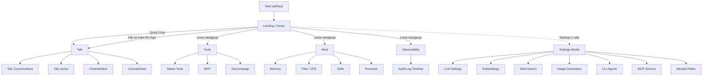
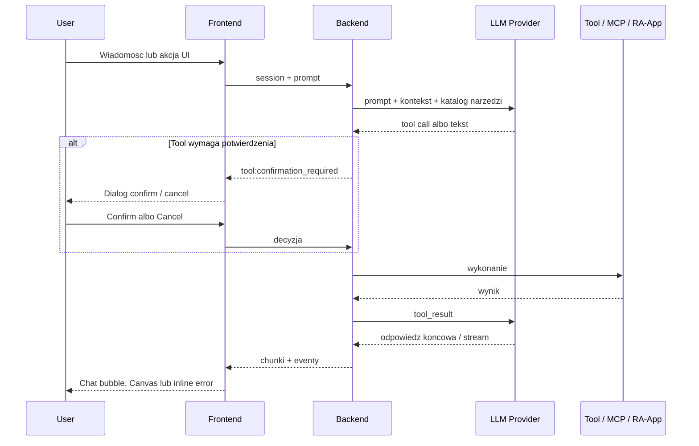

# Kalio Workstation - aktualny UI Flow i mapa opcji

> Status: aktualny stan produktu na branchu `feature/graph-agents`
> Data: 2026-05-16
> Zakres: aktualny web shell workstationu Kalio

---

## 1. Cel dokumentu

Ten dokument porzadkuje aktualny UI flow Kalio Workstation jako glownego produktu. Obecne Kalio jest webowym shell-em do pracy z agentami AI, narzedziami, MCP, RA-Appami, persona/memory oraz obserwowalnoscia.

Dokument ma odpowiedziec na trzy pytania:

1. Jaki jest aktualny przeplyw ekranu i nawigacji.
2. Jakie opcje sa dostepne w kazdej glownej sekcji.
3. Jak wyglada aktualna powierzchnia narzedzi i bezpieczenstwa wykonania.

---

## 2. Aktualny model produktu

Kalio Workstation jest cienkim frontendem i grubym backendem:

- frontend renderuje shell, czat, panele narzedzi i ustawienia,
- backend trzyma stan, rejestr tooli, integracje MCP, VFS, RA-App execution i routing do LLM,
- glowne UX opiera sie o jeden shell aplikacji, a nie o klasyczny router wielostronicowy,
- stan widoku jest zapisywany do `sessionStorage`, wiec ostatnia sekcja i taby wracaja po odswiezeniu.

Glowne sekcje shell-a:

- `Landing`
- `Talk`
- `Tools`
- `Mind`
- `Observability`
- `Settings` jako modal dostepny globalnie

---

## 3. Globalna mapa UI

---

## 4. Głowny UI Flow

### 4.1 Wejscie do aplikacji

Aktualny flow startowy:

1. Uzytkownik laduje app shell.
2. Domyslnie trafia na `Landing`.
3. Z `Landing` moze:
   - zaczac szybki czat,
   - uruchomic RA-App przez kafel,
   - przejsc do `Talk`, `Tools`, `Mind`, `Observability`,
   - otworzyc `Settings`.

### 4.2 Landing

Rola:

- ekran startowy,
- szybkie wejscie do czatu,
- katalog kafli RA-App.

Aktualne elementy:

- branding `KALIO`,
- `QuickChatWidget`,
- siatka kafli aplikacji `RA-App`,
- stany `loading`, `empty`, `ready`.

Aktualne akcje:

- szybka wiadomosc otwiera czat,
- klik na kafel RA-App tworzy sesje pod uruchomienie aplikacji,
- puste repo aplikacji pokazuje empty state z sugestia uploadu ZIP lub zaladowania core apps.

Wazna logika:

- klik w kafel RA-App tworzy sesje czatu i przygotowuje pending prompt do uruchomienia aplikacji,
- landing nie jest tylko ekranem powitalnym, ale realnym punktem wejscia do katalogu RA-App i bootstrapu sesji.

### 4.3 Talk

Rola:

- glowna powierzchnia rozmowy z agentem,
- streaming odpowiedzi,
- obsluga tool calls,
- render canvas / outputow wizualnych.

Aktualne taby:

- `Conversations`
- `Active`

Aktualne elementy:

- lewy sidebar sesji,
- panel aktywnych agent runs / oczekujacych potwierdzen,
- centralny `ChatInterface`,
- prawy `CanvasPanel`.

Aktualne akcje:

- przelaczanie sesji,
- obserwacja aktywnych runow,
- zatwierdzanie lub anulowanie operacji HITL,
- korzystanie z canvas output bez opuszczania czatu.

Wazne zachowania:

- sekcja `Talk` pozostaje zamontowana nawet przy powrocie na landing, zeby nie gubic socket listenerow i streamingu,
- przy opuszczeniu `Talk` canvas jest zamykany,
- tab `Active` pokazuje pulsujacy sygnal, gdy sa oczekujace potwierdzenia.

### 4.4 Tools

Rola:

- katalog i operacyjna powierzchnia wszystkich narzedzi,
- podzial na native tools, MCP i RA-Appy.

Aktualne taby:

- `Native`
- `MCP`
- `RaConsierge`

#### Native

Widok pokazuje:

- liste zarejestrowanych tooli z backendu,
- grupowanie po prefiksach / domenach,
- opis narzedzia,
- badge z wymaganymi parametrami,
- toggle `requiresConfirmation` dla kazdego toola.

To jest dzis glowny widok inspekcji tool registry.

#### MCP

Widok pokazuje:

- liczbe polaczonych serwerow,
- laczna liczbe dostepnych tooli z MCP,
- liste serwerow i ich status,
- restart / remove per server,
- szybkie polaczenie do Docker MCP Gateway,
- dodawanie serwera recznie lub przez import JSON.

#### RaConsierge

Widok obsluguje:

- katalog i zarzadzanie RA-Appami,
- przejscie do plikow / VFS,
- uruchamianie aplikacji przez agenta.

Wazne:

- RA-Appy nie sa dzis rejestrowane jako zwykle first-class tools w registry,
- aktualna sciezka wykonania to `run_raapp` i pokrewne operacje katalogowe.

### 4.5 Mind

Rola:

- stan dlugowieczny i zaplecze robocze agenta.

Aktualne taby:

- `Memory`
- `Files`
- `Skills`
- `Personas`

#### Memory

- podglad i praca z pamiecia systemu,
- zaleznosc od embeddings dla sensownego semantic search.

#### Files

- roboczy workspace / VFS per sesja,
- eksploracja plikow sesji,
- wejscie do artefaktow wygenerowanych przez agenta.

#### Skills

- lista skills,
- wybor skill-a,
- edycja wybranego skill-a w panelu detail.

#### Personas

- dzienne zarzadzanie personami i promptami systemowymi,
- to jest obecna glowna lokalizacja UI dla person.

Wazne:

- persony sa w `Mind -> Personas`, a nie w Settings.

### 4.6 Observability

Rola:

- timeline audytowy i operacyjny,
- inspekcja zdarzen bez wychodzenia do SSH/logow backendu.

Aktualne elementy:

- `Audit Log` jako glowny widok,
- statystyki nad timeline,
- refresh manualny,
- `Clear` logow,
- `Live/Pause` auto-refresh,
- filtry zakresu czasu,
- filtry typow zdarzen,
- search po labelu,
- timeline grupowany po dniach.

Aktualne stany:

- loading,
- empty po filtrach,
- live auto-refresh,
- paused.

### 4.7 Settings

Rola:

- modal globalny dla konfiguracji providerow, integracji i guardrail-i.

Wazne:

- to modal, nie osobna sekcja routingu,
- moze byc otwierany z dowolnego miejsca shell-a,
- nie zawiera person - te zostaja w `Mind`.

---

## 5. Settings - aktualna rozpiska opcji

### 5.1 LLM Settings

Zakres:

- provider credentials,
- aktywny provider,
- test polaczenia,
- model aktywnego providera,
- generation parameters,
- context window,
- max tool attempts,
- tool timeouts.

Aktualne typy providerow:

- `openai`
- `xiaomimimo`
- `deepseek`
- `cometapi`
- `openrouter`
- `ollama`
- `bitnet`
- `custom`

Aktualne opcje w panelu:

- nazwa providera,
- API key,
- base URL,
- model,
- test listy modeli,
- activate / remove credential,
- read-only env provider, jesli runtime bierze config z `.env`,
- `Temperature`,
- `Max Output Tokens`,
- `Context Window`,
- `Max tool attempts`,
- timeouty dla backendowych probe i web search.

### 5.2 Embeddings

Zakres:

- provider dla semantic memory search,
- aktywacja jednego embeddings provider-a,
- testowanie polaczenia,
- fallback gdy embeddings nie sa skonfigurowane.

Aktualne opcje:

- provider,
- API key,
- base URL,
- embedding model,
- dimensions,
- activate / remove,
- test,
- read-only env provider,
- ostrzezenie o dummy embeddings, gdy brak konfiguracji.

Wazne:

- bez poprawnego embeddings semantic memory search nie dziala realnie.

### 5.3 Web Search

Zakres:

- konfiguracja toola `web_search`.

Aktualne opcje:

- provider `perplexity` lub `perplexity-openrouter`,
- API key,
- test polaczenia,
- podglad aktualnego statusu konfiguracji,
- informacja czy config jest zapisany,
- fallback do `.env` z priorytetem ustawien zapisanych w UI.

### 5.4 Image Generation

Zakres:

- konfiguracja tooli `image_generate` i `image_edit`.

Aktualne opcje:

- provider,
- API key,
- base URL,
- domyslny model,
- szybkie presetowe modele per provider,
- profile jakosci / detail,
- limit rozmiaru wyniku,
- zapis konfiguracji.

### 5.5 CLI Agents

Zakres:

- konfiguracja zewnetrznych agentow CLI wykonywanych przez backend.

Aktualne opcje:

- enable / disable adapter,
- CLI path override,
- timeout w ms,
- max output chars,
- extra args,
- probe dostepnosci,
- zapis konfiguracji.

Wazne:

- CLI agenci (GitHub Copilot CLI, Gemini CLI, Claude Code, Codex CLI) sa traktowani jako opcjonalni external coding agents,
- CLI agent wymaga `Allowed Paths`, bo inaczej nie ma gdzie legalnie czytac i pisac plikow.

### 5.6 MCP Servers

Zakres:

- rejestr serwerow MCP i ich stanu.

Aktualne opcje:

- status summary `Connected` i `Tools Available`,
- Docker MCP Gateway quick-connect,
- lista serwerow,
- restart,
- remove,
- add server,
- auto-refresh listy.

Dodawanie serwera wspiera:

- tryb `HTTP`,
- tryb `STDIO`,
- import JSON,
- URL albo command/args/env,
- transport badge i status per server.

### 5.7 Allowed Paths

Zakres:

- guardrail dla filesystem i terminal access poza VFS.

Aktualne opcje:

- dodanie katalogu absolutna sciezka,
- folder picker,
- lista zatwierdzonych katalogow,
- remove,
- walidacja ze katalog istnieje.

Wazne:

- bez `Allowed Paths` agent nie powinien operowac poza VFS,
- to krytyczna warstwa bezpieczenstwa dla `fs_*`, `terminal_*` i CLI agentow.

---

## 6. Aktualna mapa narzedzi

### 6.1 Podzial powierzchni narzedzi

Kalio ma trzy glowne klasy narzedzi:

1. `Native tools` - rejestrowane lokalnie przez backend.
2. `MCP tools` - dynamicznie dostarczane przez serwery MCP.
3. `RA-App tools/runtime` - uruchamianie aplikacji, preview i task-specific UI.

### 6.2 Aktualne grupy native tools

| Grupa | Co obejmuje | Przykladowa konwencja |
|---|---|---|
| Agent | delegowanie zadan do innych agentow | `run_subagent`, `run_cli_agent` |
| Virtual Filesystem | pliki robocze sesji | `vfs_*` |
| Filesystem | realny filesystem poza VFS | `fs_*` |
| Key-Value Store | male dane pomocnicze | `kv_*` |
| Terminal | wykonywanie komend | `terminal_*` |
| RaConsierge | katalog i runtime aplikacji | `raapp_*`, `run_raapp`, `list_raapps` |
| Memory | operacje na pamieci | `memory_*` |
| Search | szybkie przeszukiwanie kodu | `grep_search`, `file_search` |
| Web | wyszukiwanie online | `web_search` |
| Tools | introspekcja tool registry | `list_tools`, `get_tool_details` |
| Images | generacja/edycja obrazow | `image_*` |
| Skills | zarzadzanie skillami | `skill_*` |
| Persona | zarzadzanie persona | `persona_*` |

### 6.3 Aktualne reguly bezpieczenstwa tooli

- destruktywne operacje powinny miec `requiresConfirmation: true`,
- frontend umie pokazac dialog potwierdzenia dla HITL,
- `Active` w sekcji `Talk` sluzy tez do obslugi pending approvals,
- dostep do realnego filesystem poza VFS jest ograniczony przez `Allowed Paths`,
- web search, image tools i wiele providerow bedzie zwracac blad bez konfiguracji w Settings.

### 6.4 RA-App surface - stan obecny

Aktualny stan RA-Appow:

- landing pokazuje katalog aplikacji jako kafle,
- klik w kafel przechodzi przez sesje czatu i agenta,
- uruchomienie idzie przez `run_raapp`,
- `display` i `interactive` sa nadal czescia docelowego modelu,
- metadane typu `expose_as_tool` sa dzis tylko katalogowe - nie oznaczaja jeszcze pelnej rejestracji jako zwykly tool.

---

## 7. Flow wykonania narzedzia i HITL

W praktyce oznacza to:

- narzedzie nie jest osobnym ekranem - zyje w przeplywie czatu i eventow,
- UI shell tylko renderuje stan i prosi o decyzje HITL,
- backend jest odpowiedzialny za katalog narzedzi, approval flow i routing do providerow.

---

## 8. Najwazniejsze aktualne scenariusze uzycia

### 8.1 Szybki start z Landing

1. User wchodzi na `Landing`.
2. Wybiera `Quick Chat` albo kafel RA-App.
3. System otwiera `Talk`.
4. Agent odpowiada, uruchamia tool albo renderuje wynik na canvas.

### 8.2 Praca narzedziowa

1. User przechodzi do `Tools -> Native`.
2. Przeglada dostepne toole.
3. Sprawdza opis i wymagane pola.
4. Dla ryzykownych tooli utrzymuje `requiresConfirmation`.
5. Wlasciwe wywolanie i tak odbywa sie z poziomu czatu/agenta.

### 8.3 Zarzadzanie integracjami MCP

1. User otwiera `Tools -> MCP` albo `Settings -> MCP Servers`.
2. Dodaje serwer recznie albo przez import JSON.
3. Obserwuje status i liczbe tooli.
4. Restartuje lub usuwa serwer, jesli przestanie odpowiadac.

### 8.4 Zarzadzanie stanem agenta

1. User przechodzi do `Mind`.
2. W `Memory` kontroluje semantyczne zaplecze.
3. W `Files` oglada artefakty sesji.
4. W `Skills` edytuje zachowania reusable.
5. W `Personas` ustawia role i prompt systemowy.

### 8.5 Diagnostyka

1. User otwiera `Observability`.
2. Ustawia zakres czasu i typy eventow.
3. Szuka po labelu.
4. Weryfikuje, co dzialo sie w sesjach, toolach i approval flow.

---

## 9. Aktualne ograniczenia i realia produktu

### 9.1 Co juz jest dobrze zdefiniowane

- shell ma jasne sekcje i taby,
- settings maja konkretne bloki konfiguracyjne,
- tool surface ma juz uporzadkowane grupy,
- approval flow dla destruktywnych operacji jest centralnym elementem UX,
- Observability ma osobny ekran zamiast bycia ukrytym log viewerem.

### 9.2 Co trzeba traktowac jako aktualny ograniczony stan

- RA-Appy sa odpalane przez `run_raapp`, a nie jako zwykle first-class tools,
- bez embeddings semantic memory search traci sens i wpada w dummy mode,
- bez web search credentials narzedzie `web_search` formalnie istnieje, ale praktycznie bedzie failowac,
- bez image config narzedzia obrazkowe tez beda failowac,
- bez `Allowed Paths` filesystem i CLI maja byc trzymane przy VFS,
- shell nie jest route-based, tylko state-based - to trzeba uwzgledniac przy przyszlej przebudowie UX.

---

## 10. Proponowana nomenklatura makiet i implementacji

Jesli chcesz rozpisac Figma lub taski implementacyjne, ten stan najlepiej mapowac tak:

1. Landing / Workstation Home
2. Talk / Conversations
3. Talk / Active Runs
4. Chat + Canvas
5. Tools / Native
6. Tools / MCP
7. Tools / RaConsierge
8. Mind / Memory
9. Mind / Files
10. Mind / Skills
11. Mind / Personas
12. Observability / Audit Log
13. Settings / LLM
14. Settings / Embeddings
15. Settings / Web Search
16. Settings / Image Generation
17. Settings / CLI Agents
18. Settings / MCP Servers
19. Settings / Allowed Paths

---

## 11. Krotka synteza

Aktualne Kalio jest operacyjnym workstationem do pracy z agentami, toolami i aplikacjami generowanymi lub uruchamianymi przez backend. Najwazniejsze osie UI to:

- `Talk` jako centrum wykonania,
- `Tools` jako mapa mozliwosci,
- `Mind` jako stan dlugowieczny,
- `Observability` jako diagnostyka,
- `Settings` jako warstwa providerow i guardrail-i.

To jest aktualna baza pod dalsza specyfikacje, mocki, backlog i porzadkowanie UX.