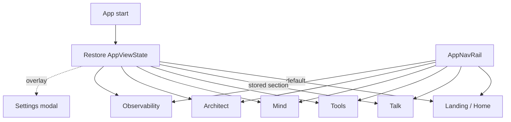
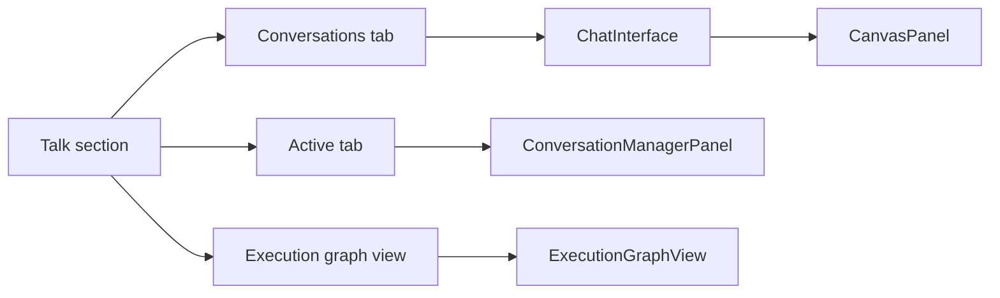
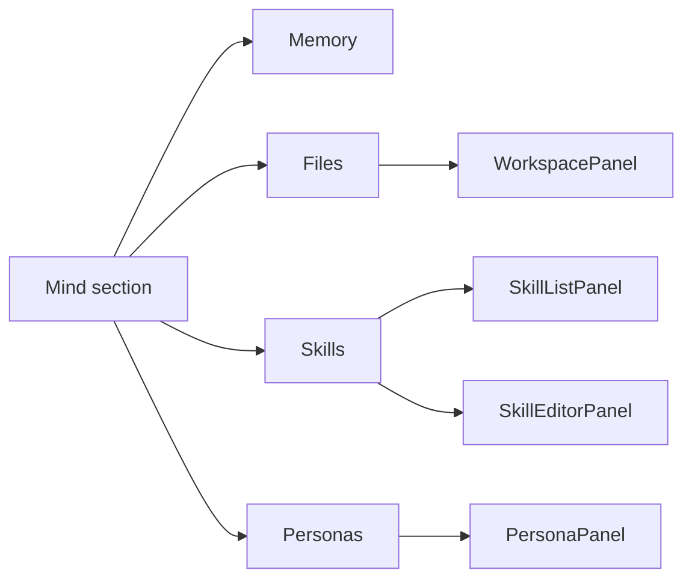
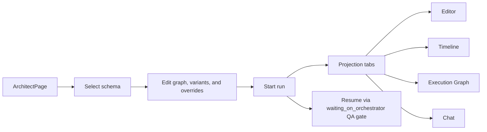

# Kalio Workstation - current UI flow

> Status: current shell navigation and interaction flow
> For FE model and relations, see [frontend-model-current.md](./frontend-model-current.md).

---

## 1. Purpose

This document describes screen flow, navigation, and section behavior for the Kalio shell.
It does not describe state ownership or model relations.

---

## 2. Shell Model

Kalio Workstation is a single shell with a left nav rail and a modal settings surface:

- `Landing`
- `Talk`
- `Tools`
- `Mind`
- `Architect`
- `Observability`
- `Settings` as a modal overlay

Current shell behavior:

- shell selection is persisted in `sessionStorage`
- last Talk activity is tracked in `localStorage`
- `Talk` stays mounted when hidden so socket listeners and in-flight streams survive navigation
- `BackendStatusBadge` is global and visible regardless of section
- the settings modal disables the rest of the shell while it is open

---

## 3. Global Map

```mermaid
flowchart TD
    Start[App start] --> Restore[Restore AppViewState]
    Restore -->|default| Landing[Landing / Home]
    Restore -->|stored section| Talk[Talk]
    Restore --> Tools[Tools]
    Restore --> Mind[Mind]
    Restore --> Architect[Architect]
    Restore --> Observe[Observability]
    Restore -. overlay .-> Settings[Settings modal]

    Nav[AppNavRail] --> Landing
    Nav --> Talk
    Nav --> Tools
    Nav --> Mind
    Nav --> Architect
    Nav --> Observe
```

---

## 4. Current Flows

### 4.1 Startup And Restore

Current startup path:

1. App shell mounts.
2. Backend health polling starts.
3. The shell loads `/api/llm/config`.
4. Sessions are replayed from the backend so root conversations and child sessions can be reopened.
5. If view state exists, the last active section and sub-tab are restored.
6. If no view state exists, the shell starts on `Landing`.

### 4.2 Landing

Landing is the entry point, not a dead-end page.

Current actions:

- `QuickChatWidget` opens Talk in conversation view.
- clicking a session tile opens that session in Talk
- clicking an RA-App tile prepares the pending prompt and routes to Talk
- empty state tells the user to upload a ZIP or load core apps

Landing is intentionally lightweight:

- it launches work
- it does not own conversation state
- it does not own catalog state

### 4.3 Talk

Talk is the main working surface.

Tabs:

- `Conversations`
- `Active` agent runs

Views:

- `Conversation`
- `Execution graph`

Current Talk flow:

```mermaid
flowchart LR
    Talk[Talk section] --> Conversations[Conversations tab]
    Talk --> Active[Active tab]
    Talk --> Graph[Execution graph view]

    Conversations --> ChatInterface[ChatInterface]
    ChatInterface --> Canvas[CanvasPanel]

    Active --> Manager[ConversationManagerPanel]
    Graph --> ExecutionGraphView[ExecutionGraphView]
```

Current behavior:

- `ConversationPanel` renders the session list and lets the user switch sessions
- `ChatInterface` owns the live transcript surface
- `CanvasPanel` is shown only in conversation view on larger screens
- `ExecutionGraphView` is the graph projection for the current session
- child sessions are opened by session id, not by a separate protocol
- moving away from Talk closes the canvas but keeps Talk mounted
- the `Active` tab surfaces live agent runs and pending confirmations

### 4.4 Tools

Tools is the registry and operations surface.

Tabs:

- `Native`
- `MCP`
- `RAApps`

Current tools flow:

- `Native` shows the backend tool registry
- `MCP` shows connected servers, status, and config entry points
- `RAApps` shows the catalog and can route back into Mind or Talk

Current cross-navigation:

- RA-App management can open `Mind -> Files` to inspect the session VFS
- RA-App management can route to Talk to run or inspect the app with an agent
- MCP configuration can jump into Settings on the MCP tab

### 4.5 Mind

Mind is the long-lived workspace surface.

Tabs:

- `Memory`
- `Files`
- `Skills`
- `Personas`

Current Mind flow:

```mermaid
flowchart LR
    Mind[Mind section] --> Memory[Memory]
    Mind --> Files[Files]
    Mind --> Skills[Skills]
    Mind --> Personas[Personas]

    Files --> WorkspacePanel[WorkspacePanel]
    Skills --> SkillList[SkillListPanel]
    Skills --> SkillEditor[SkillEditorPanel]
    Personas --> PersonaPanel[PersonaPanel]
```

Current behavior:

- `Files` opens `WorkspacePanel` for session VFS browsing
- `Skills` is a split view with a list and editor
- `Personas` is the current persona management surface
- `Memory` is the semantic memory page

### 4.6 Architect

Architect is now a first-class nav destination.

Current flow:

```mermaid
flowchart LR
    Architect[ArchitectPage] --> Select[Select schema]
    Select --> Edit[Edit graph, variants, and overrides]
    Edit --> Run[Start run]
    Run --> Projection[Projection tabs]
    Projection --> Editor[Editor]
    Projection --> Timeline[Timeline]
    Projection --> Graph[Execution Graph]
    Projection --> Chat[Chat]
    Run --> Resume[Resume via waiting_on_orchestrator QA gate]
```

Current behavior:

- the page loads schemas, personas, runtime config, and active credential state
- users can select a schema, edit node positions and overrides, and save a variant
- runs open a projection surface with explicit `Editor`, `Timeline`, `Execution Graph`, and `Chat` tabs
- when the run reaches `waiting_on_orchestrator`, the projection shows the QA gate resume form and requires external evidence before resuming
- the page can reopen the linked Talk session or graph projection
- current architecture and AgentFlow proof flows both start here

### 4.7 Observability And Settings

Observability is the audit timeline surface.

Current behavior:

- `ObservabilityPage` shows runtime and audit events
- the page is section-scoped, not a modal

Settings is a global modal overlay.

Current behavior:

- the registry currently exposes `Runtime Settings`, `Conversation`, `Audit Retention`, and `Telegram` blocks
- it configures LLM, embeddings, web search, image generation, CLI agents, MCP, allowed paths, HITL, and conversation title behavior
- it can be opened from any section
- it hides the rest of the shell while active

---

## 5. Flow Rules

- `AppViewState` owns section and tab selection.
- `sessionStorage` keeps the last visible section and sub-tab.
- `localStorage` tracks the last time Talk was active for badge counts.
- `Talk` stays mounted across landing transitions to preserve socket listeners and streaming state.
- `Architect` is a first-class section now; it is not hidden behind Tools or Mind.
- `UI-Flow.md` is navigation only; model ownership lives in `frontend-model-current.md`.
