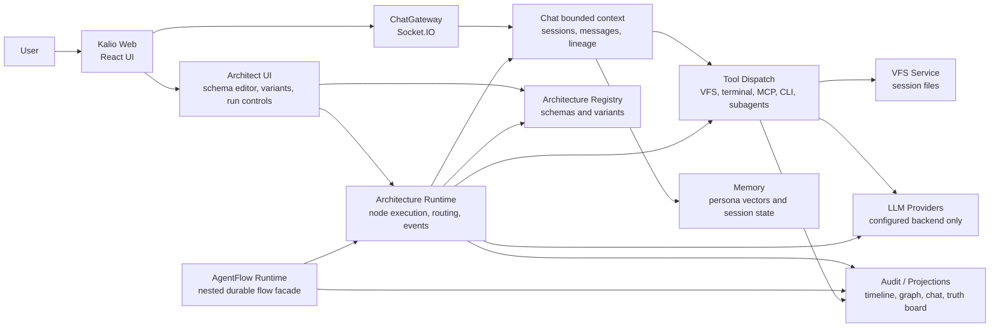
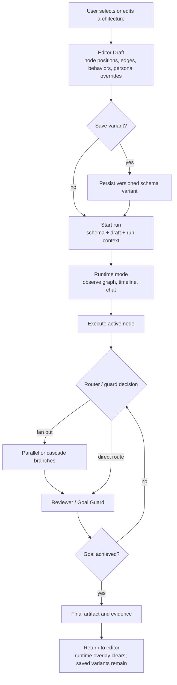
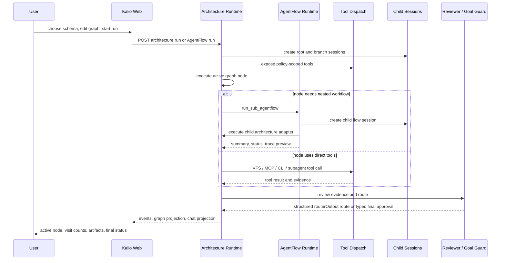

# AgentFlow Architecture And Workflow

This document is the project-level map for Kalio's architecture runtime and AgentFlow work model. It is intended as the short onboarding view before reading the deeper target architecture and refactor plans.

## Runtime Architecture

Key ownership rules:

| Area | Owns | Notes |
| --- | --- | --- |
| Kalio Web | Rendering, editor draft state, run controls, visual projections | It does not execute LLM/tool work and must not infer runtime status from message text or opaque ID prefixes. |
| Chat | Session isolation, parent/child lineage, persisted messages | Chat is a projection surface; turn/chat status must come from backend runtime snapshots and durable events. |
| Architecture Registry | Seed schemas and user-created variants | User graph edits are persisted by saving a variant. |
| Architecture Runtime | Graph node execution, routing, status, events | Runtime state is observable as timeline, graph, and chat projection. |
| AgentFlow Runtime | Durable nested flow facade | Current adapter is the architecture runtime. |
| Tool Dispatch | Tool policy, confirmation, MCP/CLI/VFS integration | Tool availability is policy-driven per context/persona. |

## Runtime Contract Boundary

The backend runtime event history is the source of truth for workflow state. UI projections must consume explicit fields such as `status`, `reasonCode`, `errorCode`, `failure`, `evidence`, `runtimeDecision`, `runId`, `nodeId`, `parentToolCallId`, and `architectureRunId`.

Human-readable fields such as `message`, `detail`, `summary`, `actionSummary`, tool output prose, and LLM text are display-only. They cannot drive retry, finalization, terminal-state routing, graph hydration, or chat/session status.

When an LLM is expected to produce a machine decision, the runtime must request a structured output that maps to the typed contract instead of parsing free-form assistant prose.

## Work Flow

The product behavior should feel like an editor/runtime split:

- **Editor mode:** user edits graph topology, node positions, node behavior, context policy, and persona overrides.
- **Save variant:** user persists those edits as a versioned architecture schema variant.
- **Runtime mode:** user observes active nodes, visit counts, tool activity, timeline events, and child sessions.
- **Runtime reset:** temporary run visualization clears when the run ends or the user returns to editing; only saved variants remain durable.
- **Free-space canvas:** the graph work surface is intentionally larger than the visible node cluster, so users can pan and stage diagrams even when the current graph fits on screen.
- **Auto-layout:** Architect can reflow the graph on demand into ranked columns, with parallel branches vertically centered around the source and merge nodes.
- **Connection semantics:** solid sky edges are forced transitions, dashed amber edges are router/master-agent decisions, dotted violet edges are parallel fan-out, and pulsing emerald edges are runtime-executed transitions.

## Delegation Flow

## Release Gates For Runtime Work

Before using paid/live backends for AgentFlow proof:

1. Focused unit/regression tests pass for changed contracts.
2. Affected app typecheck passes.
3. Affected app build passes.
4. Mock FE/E2E or browser proof verifies the user-visible runtime path.
5. `docs/agentflow-paid-run-readiness-checklist.md` is complete.

Related documents:

- [Sub-AgentFlow Target Architecture](./sub-agentflow-target-architecture.md)
- [Sub-AgentFlow DDD Refactor Plan](./superpowers/plans/2026-05-31-sub-agentflow-ddd-refactor.md)
- [Paid Run Readiness Checklist](./agentflow-paid-run-readiness-checklist.md)
