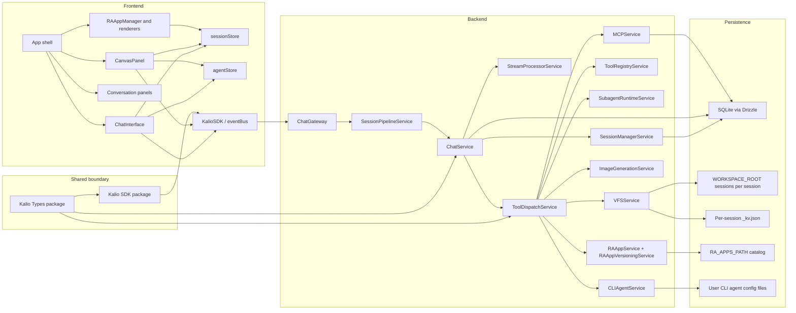
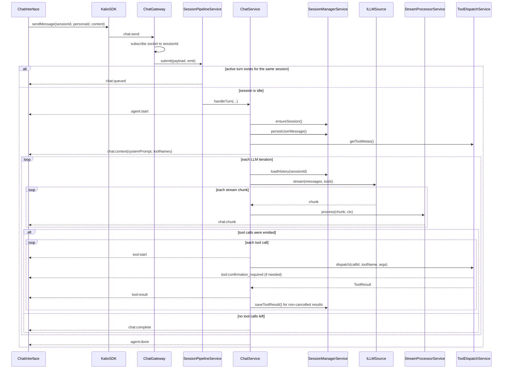
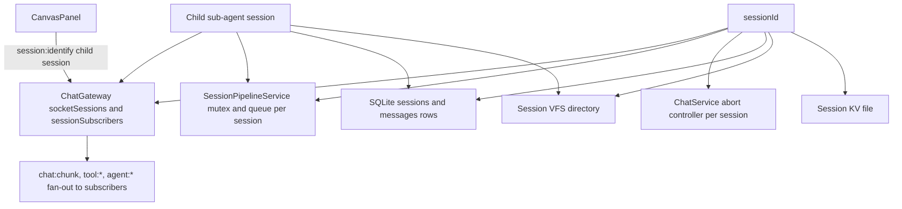
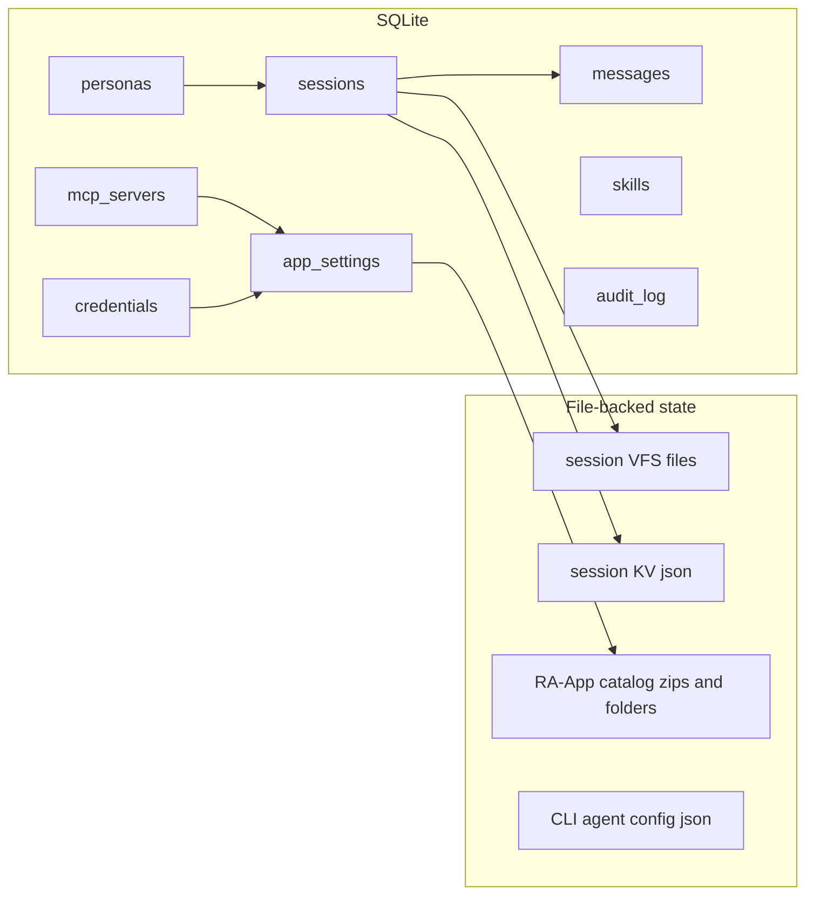

# Application Architecture - Current State

This document is the current top-level map of Kalio-Forever.
It reflects the runtime visible in the codebase today, not older design intent.

Primary source-of-truth areas:

- `apps/kalio-api/src/modules/chat/*`
- `apps/kalio-api/src/modules/tool/*`
- `apps/kalio-api/src/modules/mcp/*`
- `apps/kalio-api/src/modules/raapp/*`
- `apps/kalio-api/src/modules/image/*`
- `apps/kalio-web/src/features/chat/*`
- `apps/kalio-web/src/store/*`
- `packages/@kalio/types/src/index.ts`
- `packages/@kalio/sdk/src/index.ts`

## Reading map

- `chat-streaming-tools-architecture.md` - main chat hot path, per-session queueing, live FE state
- `tool-architecture.md` - native tool registry, dispatch, HITL, MCP merge
- `mcp-architecture.md` - external tool discovery and persona filtering
- `design-tools-architecture-current.md` - final design/prototype workflow: VFS-first preview vs RA-App publish lane
- `raapp-design-current.md` - inline RA-App rendering, catalog, approvals, iframe bridge
- `cli-agent-module-architecture.md` - CLI coding-agent adapter stack

## Core runtime entities

| Entity | Source of truth | What it means in practice |
| --- | --- | --- |
| `ChatSession` | SQLite row plus session-owned files | The isolation unit. Chat history, queueing, aborts, VFS, KV state, tool approvals, and sub-agent parentage all hang off `sessionId`. |
| `ChatMessage` | SQLite row, mirrored into `sessionStore` | Durable history item. Roles are `user`, `assistant`, `tool_result`, `system`. |
| `AgentTurn` | Frontend state in `sessionStore` | Live rendering bracket between `agent:start` and `agent:done`. Rebuilt from message history after reconnect or reload. |
| `ToolActivity` | Frontend state in `agentStore` | Live per-call UI state: running, awaiting confirmation, success, error, cancelled. Not durable by itself. |
| `AgentRunContext` | Shared wire contract in `@kalio/types` | Labels a run as `master` or `subagent`, carries parent linkage, and tells the UI whether a tool/event belongs to a child run. |
| `ToolResult` | Wire result from `ToolDispatchService` | Runtime result of one tool call. Non-cancelled results are also persisted as `tool_result` messages. |
| `SubagentToolResult` | Tool payload plus child session history | Summary returned to the parent chat after a child session run. The child itself is still a normal session with its own history. |
| `RAAppBlock` | Tool payload rendered in chat | Inline app block returned by a tool result. Separate from the long-lived RA-App catalog on disk. |
| `MCPServer` / `MCPTool` | DB rows plus live runtime handles | Dynamic external tool providers. The runtime handle set is separate from the persisted server config rows. |

## System topology

## Main turn lifecycle

Key details that matter for the real runtime:

- `chat:complete` and `agent:done` are different. `chat:complete` means the turn produced a final assistant answer. `agent:done` means the live turn bracket is closed in the UI, including error and interrupt cases.
- `tool_result` messages are durable history. `ToolActivity` rows are live UI state and can be cleared or rebuilt.
- `ChatService` reloads history on every LLM iteration so the next call sees newly persisted tool results in canonical order.

## Session-scoped isolation and fan-out

What this means:

- Different sessions do not block each other. Queueing and interrupts are keyed by session.
- A child sub-agent is not a special stream format. It is another session that reuses the same event contract.
- Canvas previewing of child chats works because the frontend explicitly identifies those child sessions to the gateway and subscribes to their normal session events.

## Backend module map

| Module | Role in the current system |
| --- | --- |
| `chat` | WebSocket gateway, per-session queueing, stream processing, history persistence, turn lifecycle, sub-agent runtime |
| `tool` | Native tool registry plus tool implementations and sub-agent tool adapters |
| `vfs` | Session-scoped file storage and copy helpers |
| `mcp` | External MCP server lifecycle, discovery, paging, restart, status broadcasting |
| `raapp` | Inline app execution, sandboxing, approval workflow, stored catalog, versioning |
| `image` | Image provider config plus generation/edit pipeline writing into session VFS |
| `cli-agent` | Adapter-based external coding-agent execution with progress streaming |
| `persona` | Persona CRUD and per-session config lookup |
| `skills` | Skill prompts injected into the effective system prompt |
| `memory` | Long-term memory ingestion and retrieval for personas |
| `credentials` | LLM config, timeout settings, max tool attempts, encrypted secrets |
| `llm` | Provider abstraction and callback-to-async-stream adapter used by chat runtime |
| `agent-loop` | Separate autonomous/background loop surface; not the main chat hot path |

## Frontend module map

| Area | Current responsibility |
| --- | --- |
| `features/chat` | Socket event wiring, message rendering, tool chips, canvas, token/context indicators, RA-App/image/sub-agent result rendering |
| `store/sessionStore.ts` | Per-session durable-ish UI state: messages, live chunks, agent turns, active turn IDs |
| `store/agentStore.ts` | Live runtime UI state: tool activities, confirmations, contexts, active loops, CLI output, canvas open state |
| `features/sessions` | Session list, conversation switching, active manager panels |
| `features/raapp` | Catalog UI, inline renderers, iframe bridge, GUI DSL renderer |
| `features/mcp` | Server admin UI and status display |
| `features/settings` | LLM, timeout, image, and CLI-agent configuration UI |
| `features/tools` | Native tool browsing and discovery UI |
| `features/memory`, `features/skills`, `features/persona` | Higher-level model management surfaces |

## Storage model

Important distinctions:

- Session VFS and session KV are file-backed and isolated by `sessionId`.
- RA-Apps are not stored in session VFS. They live in a separate catalog path controlled by `RA_APPS_PATH`.
- CLI-agent adapter config is user-machine state, not session state and not DB state.

## Current design rules

- Session is the isolation primitive. There is no separate workspace identity in the chat, tool, or VFS contract.
- `@kalio/types` is the only BE-FE contract boundary. Live behavior can change, but the wire shape should be described there.
- Child sub-agents are normal sessions with parent linkage, not a second protocol.
- `sessionStore` owns message and turn rendering state; `agentStore` owns ephemeral activity state.
- MCP tools are discovered dynamically and then filtered by persona policy plus explicit `allowedTools` names.
- Persistent or destructive tool effects should go through HITL confirmation, ideally via `ConfirmedTool`.
- Inline RA-App results and catalog RA-Apps are related but separate concepts and should be documented separately.