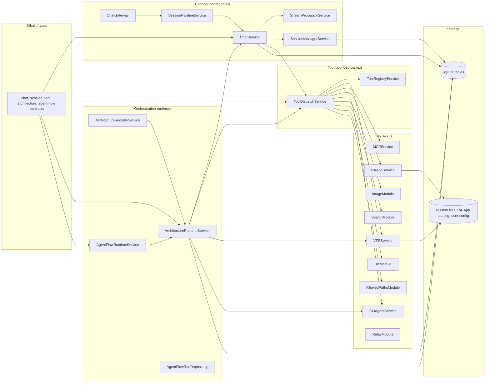
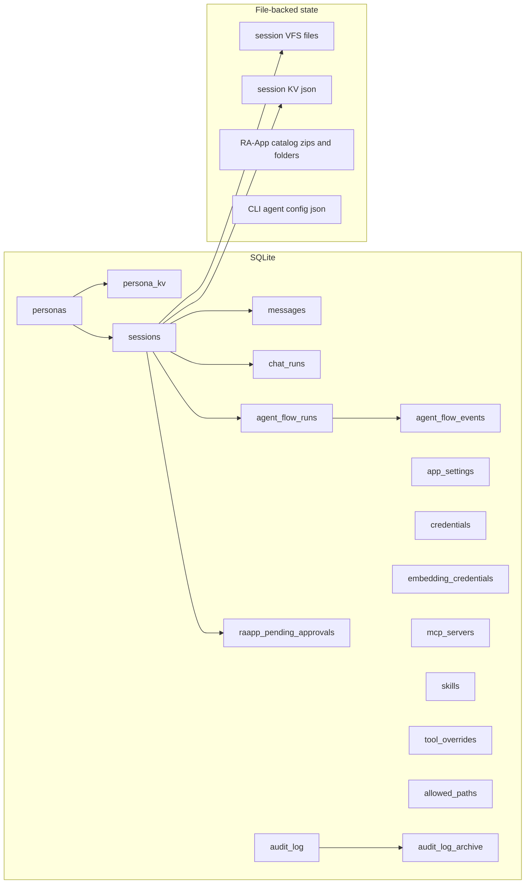

# Application Architecture - Current State

This document is the current top-level map of Kalio Workstation (repository: Kalio-Forever).
It reflects the runtime visible in the codebase today, not older design intent.

Primary source-of-truth areas:

- `apps/kalio-api/src/modules/chat/*`
- `apps/kalio-api/src/modules/tool/*`
- `apps/kalio-api/src/modules/mcp/*`
- `apps/kalio-api/src/modules/raapp/*`
- `apps/kalio-api/src/modules/image/*`
- `apps/kalio-web/src/features/chat/*`
- `apps/kalio-web/src/store/*`
- `packages/@kalio/types/src/index.ts`
- `packages/@kalio/sdk/src/index.ts`

## Reading map

- `chat-streaming-tools-architecture.md` - chat hot path, per-session queueing, live FE state
- `tool-architecture.md` - native tool registry, dispatch, HITL, MCP merge
- `mcp-architecture.md` - external tool discovery and persona filtering
- `architecture-runtime-stack.md` - architecture runtime and stream boundary
- `agentflow-architecture-and-workflow.md` - current AgentFlow and architect workflow
- `sub-agentflow-target-architecture.md` - target nested flow delegation model (`sub_agentflow`)
- `frontend-model-current.md` - FE state ownership and relation model
- `UI-Flow.md` - shell navigation and screen transitions
- `raapp-design-current.md` - inline RA-App rendering, catalog, approvals, iframe bridge
- `cli-agent-module-architecture.md` - CLI coding-agent adapter stack
- `database-schema-diagram.md` - persistence ERD

## Core runtime models

### Session and turn model

| Model | Source of truth | What it means in practice |
| --- | --- | --- |
| `ChatSession` | SQLite row plus session-owned files | Isolation unit for chat, tool approvals, VFS, KV, and parent/child lineage. `kind` now distinguishes `chat`, `subagent`, `cli-agent`, and `agent-flow`. |
| `ChatMessage` | SQLite row, mirrored into FE session state | Durable history item. Roles are `user`, `assistant`, `tool_result`, `system`; assistant `thinking` is stored and reused when building managed LLM context. |
| `ChatRun` | SQLite row in `chat_runs` | Turn-level execution ledger: phase, status, provider/model, retry count, heartbeat, and completion timestamps. |
| `SessionRuntimeContext` | `ChatSession.runtimeContext` | Runtime metadata bridge. Carries architecture launch scope, model override, tool policy, and session surface. |
| `AgentRunContext` | Shared wire contract in `@kalio/types` | Labels a run as `master` or `subagent` and carries parent session, parent turn, and parent tool call linkage. |
| `ToolResult` | Wire result from `ToolDispatchService` | Runtime result of one tool call. Non-cancelled results are also persisted as `tool_result` messages. |
| `SubagentToolResult` | Tool payload plus child session history | Summary returned to the parent chat after a child session run. The child itself remains a normal session. |

### Architecture and AgentFlow model

| Model | Source of truth | What it means in practice |
| --- | --- | --- |
| `ArchitectureSchema` | `architecture` module registry and `@kalio/types` | Current graph schema with role slots, nodes, edges, router policy, context policy, and output schema. |
| `ArchitectureRun` | in-memory runtime state plus audit-backed recovery | Graph runtime execution record: prompt, execution mode, root session, branch sessions, status, and completion timestamps. |
| `ArchitectureExecutionEvent` | runtime events plus `audit_log` recovery rows | Canonical runtime event emitted by the architecture engine for graph and chat projections. |
| `ArchitectureGraphProjection` | computed graph projection | FE-facing graph model with nodes, edges, route hops, and child agent projections. |
| `ArchitectureChatRunSummary` | chat projection summary | FE-facing summary embedded in `ChatMessage.architectureRun` for talk and canvas views. |
| `AgentFlowDefinition` | `AgentFlowModule` facade over architecture runtime | Product-level flow definition with id, version, entry node, optional orchestrator metadata, max iterations, nodes, and edges. Phases live on `AgentFlowNode` and runtime phase progress lives on `agent_flow_runs`. |
| `AgentFlowRun` | `agent_flow_runs` | Durable nested-flow run record with child session, status, return mode, phases, visit counts, checkpoint, and summary. |
| `AgentFlowTraceItem` | `agent_flow_events` | Durable trace item for nested flow execution and resume handling. |
| `AgentFlowRunSnapshot` | API snapshot model | Bundles a run, optional result, and ordered trace events for FE and API consumers. |
| `SubAgentFlowResult` | nested flow result payload | Parent-facing summary payload with trace preview, child session id, and optional graph links. |

### Configuration and policy model

| Model | Source of truth | What it means in practice |
| --- | --- | --- |
| `Persona` | `personas` table | Persona system prompt, default model, allowed tools, skills, MCP policy, avatar settings, and max tool attempts. |
| `PersonaKV` | `persona_kv` table | Key-value store scoped to one persona. |
| `Skill` | `skills` table | Prompt snippet injected into persona/system prompt composition. |
| `Credential` | `credentials` table | LLM provider key, base URL, and model configuration. |
| `EmbeddingCredential` | `embedding_credentials` table | Embedding provider config and vector dimensions. |
| `MCPServer` | `mcp_servers` table | External MCP server lifecycle, discovery, and live status. |
| `AllowedPath` | `allowed_paths` table | Host filesystem allowlist for `fs_*` tools. |
| `RaappPendingApproval` | `raapp_pending_approvals` table | Pending native-effect approvals that must be confirmed or cancelled. |
| `AuditLog` | `audit_log` table | Append-only runtime audit record. |
| `AuditLogArchive` | `audit_log_archive` table | Archived audit rows after retention or rotation. |

## Bounded Context Map

| Module | Role in the current system |
| --- | --- |
| `chat` | WebSocket gateway, per-session queueing, stream processing, history persistence, turn lifecycle, sub-agent runtime, and chat_runs bookkeeping |
| `tool` | Native tool registry, dispatch, confirmation policy, and sub-agent tool adapters |
| `architecture` | Schema registry, graph runtime, execution events, and graph/chat projections |
| `agent-flow` | Durable nested-flow facade over architecture runtime with run repository and trace snapshot APIs |
| `vfs` | Session-scoped file storage, serve-path bridge, and copy helpers |
| `mcp` | External MCP server lifecycle, discovery, paging, restart, and status broadcasting |
| `raapp` | Inline app execution, sandboxing, approval workflow, stored catalog, and versioning |
| `image` | Image provider config plus generation/edit pipeline writing into session VFS |
| `cli-agent` | Adapter-based external coding-agent execution with progress streaming |
| `persona` | Persona CRUD and per-session config lookup |
| `skills` | Skill prompts injected into the effective system prompt |
| `memory` | Long-term memory ingestion and retrieval for personas |
| `credentials` | LLM config, timeout settings, max tool attempts, encrypted secrets |
| `allowed-paths` | Filesystem allowlist for host-path tools |
| `search` | Web search provider integration |
| `hitl` | Approval policy, notification, and decision services |
| `relay` | External command ingress, including Telegram and other relay adapters |
| `llm` | Provider abstraction and callback-to-async-stream adapter used by chat runtime |

## Runtime Relation Map

```mermaid
flowchart LR
    subgraph Contracts["@kalio/types"]
        Types[chat, session, tool, architecture, agent-flow contracts]
    end

    subgraph ChatCtx[Chat bounded context]
        Gateway[ChatGateway]
        Pipeline[SessionPipelineService]
        ChatSvc[ChatService]
        Stream[StreamProcessorService]
        SessionMgr[SessionManagerService]
    end

    subgraph ToolCtx[Tool bounded context]
        Dispatch[ToolDispatchService]
        Registry[ToolRegistryService]
    end

    subgraph RuntimeCtx[Orchestration runtimes]
        ArchRegistry[ArchitectureRegistryService]
        ArchRuntime[ArchitectureRuntimeService]
        AFRuntime[AgentFlowRuntimeService]
        AFRepo[AgentFlowRunRepository]
    end

    subgraph Integrations[Integrations]
        VFS[VFSService]
        MCP[MCPService]
        RAApp[RAAppService]
        CLI[CLIAgentService]
        Image[ImageModule]
        Search[SearchModule]
        Hitl[HitlModule]
        Allowed[AllowedPathsModule]
        Relay[RelayModule]
    end

    subgraph Storage[Storage]
        DB[(SQLite tables)]
        Files[(session files, RA-App catalog, user config)]
    end

    Types --> ChatSvc
    Types --> Dispatch
    Types --> ArchRuntime
    Types --> AFRuntime

    Gateway --> Pipeline --> ChatSvc --> Stream
    ChatSvc --> SessionMgr
    ChatSvc --> Dispatch

    Dispatch --> Registry
    Dispatch --> VFS
    Dispatch --> MCP
    Dispatch --> RAApp
    Dispatch --> CLI
    Dispatch --> Image
    Dispatch --> Search
    Dispatch --> Hitl
    Dispatch --> Allowed

    ArchRegistry --> ArchRuntime
    ArchRuntime --> ChatSvc
    ArchRuntime --> Dispatch
    ArchRuntime --> VFS
    ArchRuntime --> CLI

    AFRuntime --> ArchRuntime
    AFRepo --> DB

    ChatSvc --> DB
    SessionMgr --> DB
    ArchRuntime --> DB
    VFS --> Files
    RAApp --> Files
```

## Storage Model

```mermaid
flowchart LR
    subgraph DB[SQLite]
        Personas[personas]
        PersonaKV[persona_kv]
        Sessions[sessions]
        Messages[messages]
        ChatRuns[chat_runs]
        AgentFlowRuns[agent_flow_runs]
        AgentFlowEvents[agent_flow_events]
        AppSettings[app_settings]
        Credentials[credentials]
        EmbeddingCredentials[embedding_credentials]
        MCPServers[mcp_servers]
        Skills[skills]
        ToolOverrides[tool_overrides]
        AllowedPaths[allowed_paths]
        RaappApprovals[raapp_pending_approvals]
        Audit[audit_log]
        AuditArchive[audit_log_archive]
    end

    subgraph Files[File-backed state]
        SessionFiles[session VFS files]
        SessionKV[session KV json]
        RAAppCatalog[RA-App catalog zips and folders]
        CLIAgentConfig[CLI agent config json]
    end

    Personas --> PersonaKV
    Personas --> Sessions
    Sessions --> Messages
    Sessions --> ChatRuns
    Sessions --> RaappApprovals
    Sessions --> AgentFlowRuns
    AgentFlowRuns --> AgentFlowEvents
    Audit --> AuditArchive
    Sessions --> SessionFiles
    Sessions --> SessionKV
```

Important distinctions:

- Session VFS and session KV are file-backed and isolated by `sessionId`.
- `session.kind` now distinguishes `chat`, `subagent`, `cli-agent`, and `agent-flow`.
- `runtimeContext` is the launch bridge used by the shell and runtime when starting architecture or agent-flow sessions.
- RA-Apps are not stored in session VFS. They live in a separate catalog path controlled by `RA_APPS_PATH`.
- CLI-agent adapter config is user-machine state, not session state and not DB state.
- `chat_runs` is the turn ledger; `agent_flow_runs` is the nested-flow ledger.
- `ArchitectureRun` and `ArchitectureExecutionEvent` are runtime/projection models, not dedicated tables.
- Durable architecture recovery comes from `audit_log` rows plus session message projections, not from a separate `architecture_runs` table.

## Current Flow Snapshots

- Chat hot path: `chat:send` -> `SessionPipelineService` -> `ChatService` -> `chat:chunk` / `tool:*` -> `chat:complete` -> `agent:done`.
- Architecture runtime: schema selection -> graph runtime -> root session + branch sessions -> execution events -> graph and chat projections.
- AgentFlow runtime: `run_sub_agentflow` -> child session -> durable `agent_flow_runs` / `agent_flow_events` -> result snapshot and resume cursor.

## Current Design Rules

- Session is still the isolation primitive.
- `@kalio/types` is the only BE-FE contract boundary.
- Child sub-agents and child agent-flows are normal sessions with parent linkage, not a second protocol.
- `sessionStore` and `agentStore` are FE concerns; backend truth stays in SQLite, runtime services, and file-backed session state.
- MCP tools are discovered dynamically and then filtered by persona policy plus explicit allowed tool names.
- Persistent or destructive tool effects should go through HITL confirmation, ideally via `ConfirmedTool`.
- `ArchitectureModule` is the current graph runtime. `AgentFlowModule` is the durable facade over it.
- FE model and relation details live in `frontend-model-current.md`; this file stays focused on backend state and boundaries.
