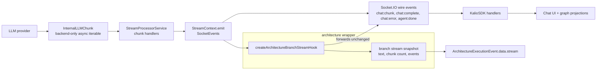
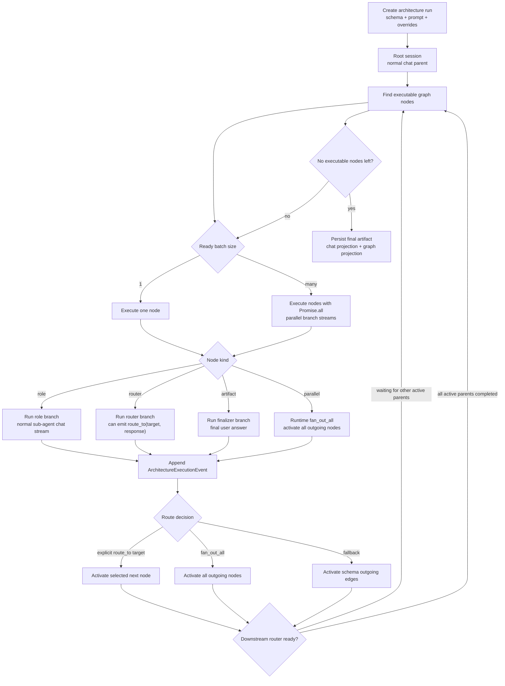
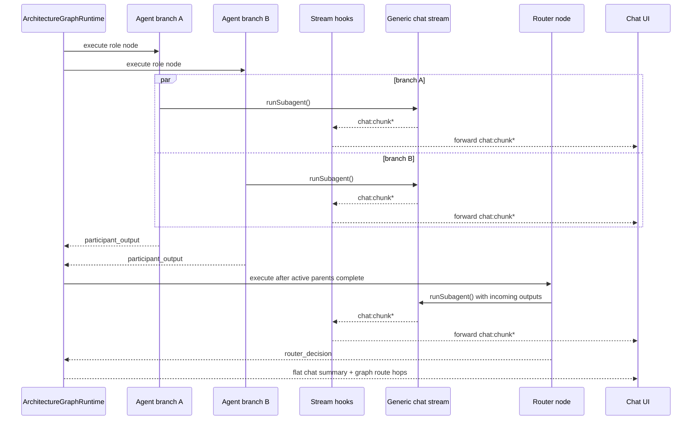

# Architecture Runtime Stack

This document shows the current architecture orchestration layer and the stream boundary it must preserve.

The important design rule: architecture runtime controls graph execution, but the LLM stream remains the normal Kalio chat stream.

For the target nested-flow delegation model, see `sub-agentflow-target-architecture.md`.

## Current Stack

```mermaid
flowchart TB
    subgraph Web["kalio-web"]
        Composer["Chat composer\nprompt + architecture select"]
        Architect["Architect tab\nregistry + graph editor"]
        ChatProjection["Flat chat projection"]
        GraphProjection["Execution graph projection"]
        SDK["KalioSDK\nSocketEvents client"]
    end

    subgraph Api["kalio-api"]
        ChatGateway["ChatGateway\nSocket.IO contract"]
        ChatRuntime["ChatService + StreamProcessorService\ngeneric chat streaming"]
        ArchitectureController["ArchitectureController\nregistry + run API"]
        Registry["ArchitectureRegistryService\nschemas + variants"]
        Runtime["ArchitectureGraphRuntime\nnode routing + fan-out/fan-in"]
        RoleExecutor["ArchitectureRoleExecutor\nrole/router/finalizer execution"]
        StreamHook["Architecture stream hook\nobserve + forward generic events"]
        SubagentRuntime["SubagentRuntimeService\nnormal child chat execution"]
    end

    subgraph Contracts["@kalio/types + @kalio/sdk"]
        SocketEvents["SocketEvents\nchat:chunk, chat:complete, agent:*, tool:*"]
        LLMChunk["LLMStreamChunk\ndelta, done, sessionId, messageId, agentRun"]
        ArchitectureTypes["ArchitectureSchema\nArchitectureExecutionEvent\nArchitectureChatRunSummary"]
    end

    Composer -->|"single-chat"| SDK
    Composer -->|"selected architecture"| ArchitectureController
    Architect --> ArchitectureController
    ArchitectureController --> Registry
    ArchitectureController --> Runtime
    Runtime --> RoleExecutor
    RoleExecutor --> StreamHook
    StreamHook --> SubagentRuntime
    SubagentRuntime --> ChatRuntime
    ChatRuntime --> ChatGateway
    ChatGateway --> SDK
    SDK --> ChatProjection
    SDK --> GraphProjection

    SocketEvents -.typed by.-> SDK
    SocketEvents -.typed by.-> ChatGateway
    LLMChunk -.payload for.-> SocketEvents
    ArchitectureTypes -.typed by.-> Registry
    ArchitectureTypes -.typed by.-> Runtime
    ArchitectureTypes -.typed by.-> ChatProjection
    ArchitectureTypes -.typed by.-> GraphProjection
```

## Generic Stream Boundary

Architecture runs do not introduce a second streaming protocol. A branch is a normal child chat stream with an observer attached.

Extraction target for the future SDK split:

| Boundary | Current owner | Future package |
| --- | --- | --- |
| Wire events | `@kalio/types` `SocketEvents` | shared protocol package |
| Client handlers | `packages/@kalio/sdk` | client SDK |
| Backend stream source | `apps/kalio-api/src/modules/chat/interfaces` | server SDK |
| Stream observer/tee | `architecture-stream-hooks.ts` | server SDK utility, with architecture adapter on top |
| Architecture projections | web + API architecture modules | Kalio app layer |

What must stay generic:

- `LLMStreamChunk` must not get architecture-only fields.
- `chat:chunk`, `chat:complete`, `chat:error`, `agent:start`, `agent:done`, and `tool:*` stay valid for normal chat, sub-agents, CLI agents, and graph branches.
- Architecture-specific metadata lives in `ArchitectureExecutionEvent`, `ArchitectureChatRunSummary`, or an observer snapshot, not in the base chat stream.
- Context filtering is done before a branch chat starts. The streaming contract should not care why a branch received a smaller context.

## Graph Runtime Flow

Current behavior:

- Routers are node-level, not global.
- Parallel nodes can fan out into several normal chat branches.
- A downstream router waits for all currently active incoming branches before it merges or chooses a route.
- Cycles are bounded by runtime step and per-node visit limits.
- Branch output may contain `route_to(targetNodeId, response)` to force the next hop when that target is a valid outgoing node.

## Parallel Stream Shape

## Compatibility Checklist

Before extracting the stream into a standalone library, keep these checks true:

- Normal `chat:send` still reaches `ChatService` without importing architecture modules.
- `SubagentRuntimeService` still emits ordinary `SocketEvents`.
- Architecture uses an observer around `SubagentEmit`; it does not require architecture fields in `LLMStreamChunk`.
- Frontend architecture summaries are projections from `ArchitectureChatRunSummary`, not a replacement for `KalioSDK.onChunk`.
- Tests cover both normal chat streaming and architecture runtime execution with a mock LLM.

## Target Direction: Sub-AgentFlow

The current architecture runtime should evolve into a reusable nested flow runtime rather than a heavyweight workspace orchestrator.

Target delegation kinds:

| Kind | Parent sees | System runs |
| --- | --- | --- |
| `sub_agent` | One child-agent tool call. | Child `ChatSession` with one bounded agent loop. |
| `cli_agent` | External executor delegation. | CLI process/session with status and progress. |
| `sub_agentflow` | One delegated flow tool call. | Child `ChatSession` plus `AgentFlowRun`, graph trace, routers, guards, and final result. |

`sub_agentflow` should reuse the existing session isolation model: history, VFS, KV, approvals, lineage, and graph evidence stay tied to sessions. The parent receives a summary/result while the user can open the child flow as chat or graph.

The first product-critical flow is `goal_guard_delivery_loop`: a two-agent Dev/Implementer and Goal Guard loop. Five Minds-style debate flows remain useful for analysis, but they are not valid substitutes when the user asks to validate implementation/guard ping-pong behavior.
