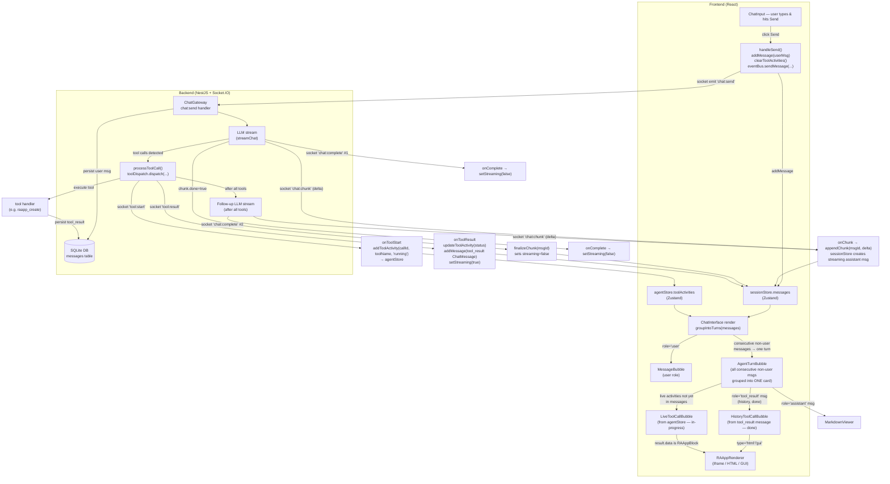
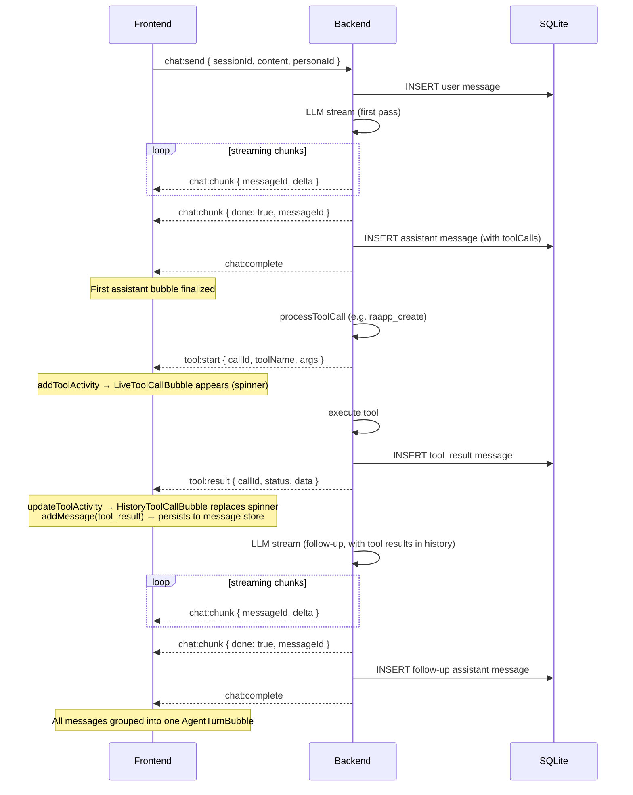

# Chat Message Flow

How a user message travels through the system — from send to rendered UI.

## Architecture overview



## Socket event sequence (single tool call)



## Turn grouping (AgentTurnBubble)

`groupIntoTurns()` in `ChatInterface.tsx` walks `messages` and groups all consecutive non-user messages into a single **agent turn**:

```
messages = [user, assistant_A1, tool_result, assistant_A2, user, assistant_B1]

turns = [
  { type: 'user',  msg: user }
  { type: 'agent', msgs: [assistant_A1, tool_result, assistant_A2], isLast: false }
  { type: 'user',  msg: user }
  { type: 'agent', msgs: [assistant_B1], isLast: true }
]
```

`AgentTurnBubble` renders the agent turn:
1. **Thinking block** (collapsed) — from `thinkingChunks` across all assistant msgs in the turn
2. **Interleaved content** — assistant text via `MarkdownViewer`, tool_result messages via `HistoryToolCallBubble`
3. **Pending live activities** — `LiveToolCallBubble` for tools still running (from `agentStore`, not yet in messages)

`toolActivities` from `agentStore` are only passed to the **last** turn (the active one).

## Key files

| File | Responsibility |
|------|---------------|
| [features/chat/ChatInterface.tsx](../apps/kalio-web/src/features/chat/ChatInterface.tsx) | Socket wiring, turn grouping, rendering |
| [features/chat/AgentTurnBubble.tsx](../apps/kalio-web/src/features/chat/AgentTurnBubble.tsx) | Groups one agent turn into a single bubble |
| [features/chat/ToolCallBubble.tsx](../apps/kalio-web/src/features/chat/ToolCallBubble.tsx) | Renders a single tool invocation (live or history) |
| [features/chat/MessageBubble.tsx](../apps/kalio-web/src/features/chat/MessageBubble.tsx) | User message bubble |
| [store/sessionStore.ts](../apps/kalio-web/src/store/sessionStore.ts) | Messages array (append, stream chunks, finalize) |
| [store/agentStore.ts](../apps/kalio-web/src/store/agentStore.ts) | Live tool activities (cleared per turn) |
| [services/eventBus.ts](../apps/kalio-web/src/services/eventBus.ts) | KalioSDK socket wrapper |
