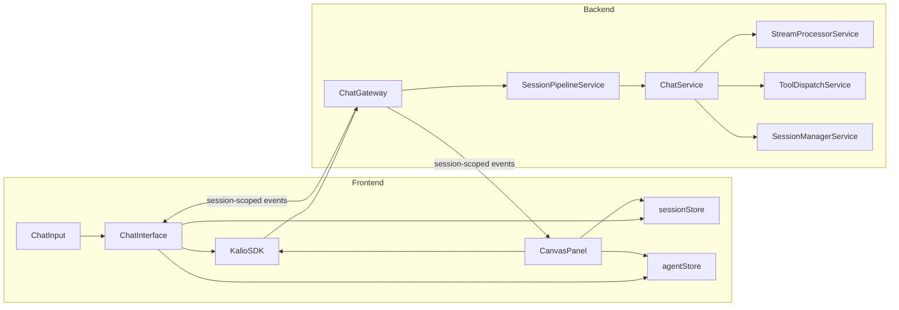
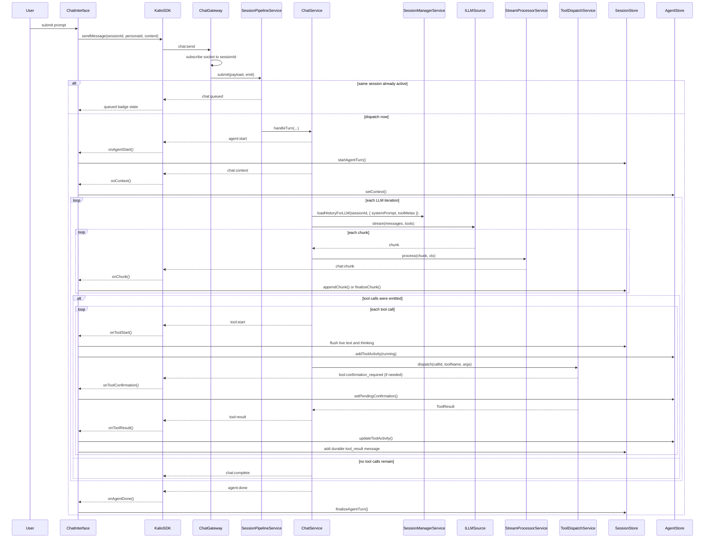
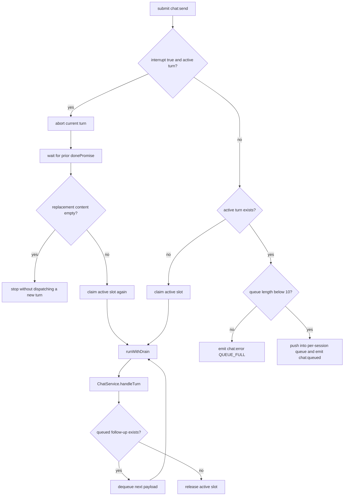
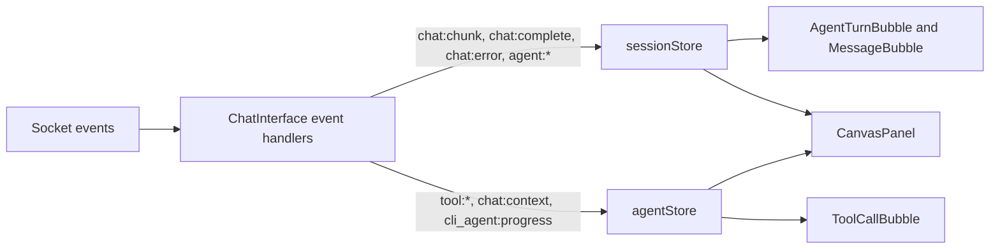
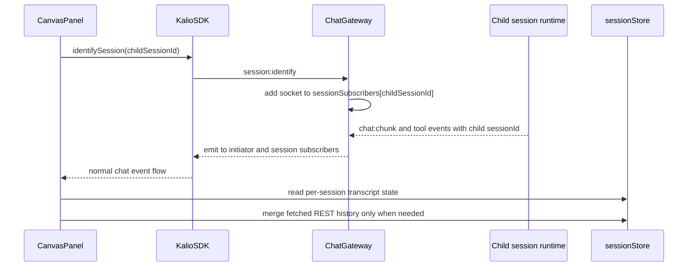

# Chat, Streaming & Tools Architecture

This document describes the current chat hot path.
For the broader module map, see `application-architecture-current.md`.

## Scope

This document covers:

- the socket path from `chat:send` to `agent:done`
- per-session queueing and interrupts in `SessionPipelineService`
- the handoff between streaming and tool execution
- session-scoped event fan-out used by child sessions and canvas previews
- the split between durable message state and live UI activity state in the frontend

## Current component map

## Wire contract that matters on the hot path

| Event | Direction | Role in the runtime |
| --- | --- | --- |
| `chat:send` | FE -> BE | Start a new turn or enqueue a follow-up for the same session |
| `chat:queued` | BE -> FE | A turn is already active for that session, so the new payload is queued |
| `agent:start` | BE -> FE | Opens a live agent turn in the UI before chunks arrive |
| `chat:context` | BE -> FE | Real system prompt plus filtered tool names for this turn |
| `chat:chunk` | BE -> FE | Streaming answer delta; can carry `thinking` chunks and `done=true` |
| `tool:confirmation_required` | BE -> FE | Human-in-the-loop request for a confirmed tool |
| `tool:start` | BE -> FE | One tool call is about to execute |
| `tool:result` | BE -> FE | Final status of one tool call |
| `chat:complete` | BE -> FE | Final assistant answer for the turn is complete |
| `chat:error` | BE -> FE | Structured turn error, interrupt, or queue failure |
| `agent:done` | BE -> FE | Always closes the live turn bracket, even on error |
| `chat:stop` | FE -> BE | Abort the active turn and drop queued follow-ups for that session |
| `session:identify` | FE -> BE | Re-subscribe the socket to a session after reconnect or when watching a child session |

## End-to-end sequence

Important runtime facts:

- `agent:start` comes before the first chunk so the UI has a place to attach streaming items.
- `tool:start` intentionally flushes pending thinking/text chunks in the frontend. Otherwise the cursor would keep blinking while the model has already moved into tool use.
- `tool_result` messages are persisted into session history. They are not just transient UI artifacts.
- `agent:done` is the event the UI trusts to close the live turn, not `chat:complete` alone.
- `ChatService` does not hand raw database history to the provider. It asks `SessionManagerService.loadHistoryForLLM(...)` for already-managed messages.
- `SubagentRuntimeService` uses the same `loadHistoryForLLM(...)` path, so child sessions do not bypass context compaction or reasoning accounting.

## Managed LLM context boundary

`SessionManagerService.loadHistoryForLLM(...)` is the single path that prepares provider-ready messages for both `ChatService` and `SubagentRuntimeService`.

Before each provider call, that boundary currently:

- loads canonical session history and maps it into backend-only `ContextManagedLLMMessage`
- rehydrates user attachments and sanitizes oversized or inline-binary `tool_result` payloads
- preserves assistant `thinking` as backend-only `reasoningContent` so it is counted during compaction and can be replayed by providers that support it
- prepends the active system prompt and compacts the whole payload against the configured context window

At the provider boundary, `BaseOpenAICompatibleProvider` is the shared serializer and stream parser for OpenAI-style providers. `OpenAICompatibleProvider` stays a thin subclass so new providers do not create a second request-shaping path, and only providers that opt into reasoning-history replay emit `reasoning_content` on the wire.

## SessionPipelineService: queue and interrupt model

`SessionPipelineService` is the traffic controller between the gateway and `ChatService`.

Real behavior today:

- one active turn per `sessionId`
- queue cap is 10 follow-up messages per session
- `interrupt: true` aborts the active turn, waits for its completion boundary, then dispatches the interrupting payload itself
- `chat:stop` aborts the active turn and drops queued follow-ups
- different sessions remain independent and can run concurrently

## Frontend state split

`ChatInterface.tsx` is the socket event adapter. It receives normal `KalioSDK` events and pushes them into two stores with different jobs.

| State slice | Owner | Durable? | Why it exists |
| --- | --- | --- | --- |
| `sessionMessages` and `messages` | `sessionStore` | Yes, rebuilt from history | The current and cached message transcript per session |
| `streamingChunks`, `thinkingChunks`, `chunkSessionIds` | `sessionStore` | No | Incremental deltas keyed by message ID and session ID |
| `sessionAgentTurns`, `sessionActiveTurnIds` | `sessionStore` | Rebuildable | UI turn structure between `agent:start` and `agent:done` |
| `sessionToolActivities` and `toolActivities` | `agentStore` | No | Live tool chips and canvas sections |
| `pendingConfirmations` | `agentStore` | No | One pending HITL request per session |
| `sessionContexts` | `agentStore` | No | Current system prompt and tool list per session |
| `activeAgentLoops` | `agentStore` | No | Live tracking for master and sub-agent runs |
| `cliAgentOutput` | `agentStore` | No | Incremental stdout and stderr for `run_cli_agent` |

Two practical rules follow from this split:

- If a piece of state must survive reload or reconnect, it should exist as message history or be rebuildable from history.
- If a piece of state is purely live-progress UI, it belongs in `agentStore` and can be cleared when the turn finishes.

## Session-scoped fan-out for child sessions and canvas

The child-session experience does not use a second protocol.
Canvas and child chat navigation work by subscribing the current socket to additional session IDs and consuming normal chat events for those sessions.

That design has a few consequences:

- Child sessions can be opened as normal chats because they are normal chats.
- Canvas can stay live for child runs without inventing a custom sub-agent stream.
- The REST transcript fetch in canvas is hydration, not the primary live data source.

## Runtime invariants worth preserving

- One session must never emit overlapping live turns in the frontend.
- `agent:done` must be emitted on success, error, and interrupt paths.
- `chat:stop` must clear queued follow-ups as well as aborting the current run.
- `session:identify` must be sent both after reconnect and when the UI starts watching another session.
- `tool:start` and `tool:result` ordering must stay stable, because the frontend uses those to build turn items and persistent result messages.