# Chat, Streaming & Tools Architecture

## Overview

This document describes the architecture of chat, streaming, and tools handling in Kalio.

## Architecture Diagram

```mermaid
graph TB
    subgraph Frontend["Frontend (React)"]
        ChatInterface["ChatInterface.tsx"]
        ChatInput["ChatInput.tsx"]
        MessageBubble["MessageBubble.tsx"]
        AgentTurnBubble["AgentTurnBubble.tsx"]
        ToolCallBubble["ToolCallBubble.tsx"]
        EventBus["eventBus (KalioSDK)"]
        SessionStore["sessionStore"]
        AgentStore["agentStore"]
    end

    subgraph Backend["Backend (NestJS)"]
        ChatGateway["ChatGateway"]
        ChatService["ChatService"]
        LLMService["LLMService"]
        ToolRegistry["ToolRegistryService"]
        ToolDispatch["ToolDispatchService"]
        MCPService["MCPService"]
        ForeverAgent["ForeverAgentService"]
        AgentLoopService["AgentLoopService"]
    end

    subgraph LLMProviders["LLM Providers"]
        ILLMProvider["ILLMProvider (interface)"]
        BaseProvider["BaseOpenAICompatibleProvider"]
        MockProvider["MockLLMProvider"]
        OpenRouter["OpenRouterProvider"]
        OpenAI["OpenAIProvider"]
        Ollama["OllamaProvider"]
        Perplexity["PerplexityProvider"]
    end

    subgraph Tools["Tool Implementations"]
        VFS["VFSWriteTool<br/>VFSReadTool<br/>VFSListTool"]
        FS["FsWriteTool<br/>FsReadTool<br/>FsListTool"]
        KV["KVWriteTool<br/>KVReadTool<br/>KVListTool<br/>KVDeleteTool"]
        Search["GrepSearchTool<br/>FileSearchTool"]
        Terminal["TerminalSpawnTool<br/>TerminalListTool<br/>TerminalOutputTool<br/>TerminalKillTool"]
        RAApp["RaAppCreateTool<br/>RaAppCompileTool<br/>RunRaAppTool<br/>ListRaAppsTool"]
        Memory["MemoryIngestTool<br/>MemorySearchTool<br/>MemoryIngestConversationTool"]
        Subagent["SubagentTool"]
    end

    subgraph MCP["MCP Servers"]
        MCPClient["MCP Client"]
        MCPTools["External MCP Tools"]
    end

    subgraph Database["Database"]
        Sessions["sessions"]
        Messages["messages"]
        AgentLoops["agentLoops"]
        AgentTasks["agentTasks"]
        MCPServers["mcpServers"]
    end

    %% Frontend connections
    ChatInterface --> EventBus
    ChatInput --> EventBus
    EventBus --> ChatGateway
    SessionStore --> ChatInterface
    AgentStore --> ChatInterface

    %% WebSocket Gateway
    ChatGateway --> ChatService

    %% Chat Service Flow
    ChatService --> LLMService
    ChatService --> ToolRegistry
    ChatService --> ToolDispatch
    ChatService --> Sessions
    ChatService --> Messages

    %% LLM Service Flow
    LLMService --> ILLMProvider
    ILLMProvider --> BaseProvider
    ILLMProvider --> MockProvider
    ILLMProvider --> OpenRouter
    ILLMProvider --> OpenAI
    ILLMProvider --> Ollama
    ILLMProvider --> Perplexity

    %% Tool Registry & Dispatch
    ToolRegistry --> ToolDispatch
    ToolDispatch --> VFS
    ToolDispatch --> FS
    ToolDispatch --> KV
    ToolDispatch --> Search
    ToolDispatch --> Terminal
    ToolDispatch --> RAApp
    ToolDispatch --> Memory
    ToolDispatch --> Subagent
    ToolDispatch --> MCPService

    %% MCP Service
    MCPService --> MCPClient
    MCPClient --> MCPTools
    MCPService --> MCPServers

    %% Agent Loop
    ForeverAgent --> AgentLoopService
    ForeverAgent --> LLMService
    ForeverAgent --> ToolRegistry
    AgentLoopService --> AgentLoops
    AgentLoopService --> AgentTasks

    %% Database connections
    ChatService --> Sessions
    ChatService --> Messages
    MCPService --> MCPServers

    %% Styling
    classDef frontend fill:#e1f5ff,stroke:#0288d1,stroke-width:2px
    classDef backend fill:#fff3e0,stroke:#f57c00,stroke-width:2px
    classDef providers fill:#f3e5f5,stroke:#7b1fa2,stroke-width:2px
    classDef tools fill:#e8f5e9,stroke:#388e3c,stroke-width:2px
    classDef mcp fill:#fce4ec,stroke:#c2185b,stroke-width:2px
    classDef database fill:#cfd8dc,stroke:#455a64,stroke-width:2px

    class ChatInterface,ChatInput,MessageBubble,AgentTurnBubble,ToolCallBubble,EventBus,SessionStore,AgentStore frontend
    class ChatGateway,ChatService,LLMService,ToolRegistry,ToolDispatch,MCPService,ForeverAgent,AgentLoopService backend
    class ILLMProvider,BaseProvider,MockProvider,OpenRouter,OpenAI,Ollama,Perplexity providers
    class VFS,FS,KV,Search,Terminal,RAApp,Memory,Subagent tools
    class MCPClient,MCPTools,MCPService mcp
    class Sessions,Messages,AgentLoops,AgentTasks,MCPServers database
```

## Class Descriptions

### Frontend Components

#### ChatInterface
Main chat UI component that manages:
- Message display and rendering
- Streaming state management
- Tool confirmation dialogs
- Context statistics
- Integration with eventBus for WebSocket communication

#### ChatInput
Input component for user messages with persona selection.

#### MessageBubble
Renders individual user messages.

#### AgentTurnBubble
Renders complete agent turns (including text, thinking, and tool calls).

#### ToolCallBubble
Renders individual tool call activities with status indicators.

#### EventBus (KalioSDK)
WebSocket client that handles:
- Sending chat messages
- Receiving streaming chunks
- Tool confirmation requests
- Tool execution results
- Agent loop events

### Backend Services

#### ChatGateway
WebSocket gateway that:
- Handles `chat:send` messages
- Handles `tool:confirm` and `tool:cancel` events
- Handles `agentLoop:start/pause/stop` events
- Broadcasts events to connected clients

**Important:** confirmation events are session-bound. The gateway validates that
the socket resolving a pending confirmation currently owns that `sessionId`.
This closes the old gap where a different connected client could attempt to
confirm or cancel a tool request for another session.

#### ChatService
Core chat orchestration service that:
- Manages agent loop (LLM → tools → repeat)
- Streams LLM responses
- Processes tool calls with confirmation
- Builds conversation history with context window trimming
- Persists messages to database
- Handles HITL (Human-in-the-Loop) confirmations

#### LLMService
LLM provider management:
- Selects active provider (DB credential > .env fallback)
- Delegates streaming to provider implementations
- Manages provider configuration

#### ToolRegistryService
Tool metadata registry:
- Registers all native tools via decorators
- Integrates MCP tools
- Filters tools by persona skills
- Provides tool metadata (name, description, parameters, confirmation requirement)

#### ToolDispatchService
Tool execution dispatcher:
- Routes tool calls to appropriate executor
- Handles MCP tool calls via MCPService
- Executes native tools
- Returns standardized ToolResult

It also owns the Human-in-the-Loop wait state for confirmed tools:
- pending confirmations are stored per request and tied to the originating session
- `tool:confirm` and `tool:cancel` must echo the same `sessionId`
- destructive tools should use `requiresConfirmation: true`, preferably via the generic `@ConfirmedTool(...)` wrapper

## Tool Confirmation Flow

For tools marked `requiresConfirmation: true`, the turn pauses after the model
emits a tool call and before the executor runs:

1. `ChatService` emits `tool:start`
2. `ToolDispatchService` registers a pending confirmation for the current session
3. Frontend shows the inline confirmation UI for that same session
4. `ChatGateway` accepts `tool:confirm` / `tool:cancel` only from the socket that owns the session
5. The tool either resumes execution or returns a cancelled result back into the turn

This keeps HITL approval aligned with the same session isolation rules as VFS,
KV state, and subagent session ownership.

#### MCPService
Model Context Protocol service:
- Manages MCP server connections (stdio/HTTP)
- Discovers tools from connected servers
- Handles tool calls to MCP servers
- Health checking and auto-restart
- Prefixes tool names with `mcp_{serverId}_{toolName}`

#### ForeverAgentService
Autonomous agent loop manager:
- Executes tasks from agent loop
- Streams LLM responses for each task
- Manages loop lifecycle (start/pause/stop)
- Handles watchdog mode
- Emits progress events via gateway

#### AgentLoopService
Database operations for agent loops:
- CRUD operations for loops, tasks, iterations
- Task prioritization and scheduling
- Iteration tracking

### LLM Providers

#### ILLMProvider (interface)
Defines contract for LLM providers with `streamChat` method.

#### BaseOpenAICompatibleProvider
Base implementation for OpenAI-compatible APIs:
- Handles SSE streaming
- Parses content, thinking, and tool calls
- Supports DeepSeek-style reasoning tokens

#### Provider Implementations
- **MockLLMProvider**: Testing provider with canned responses
- **OpenRouterProvider**: OpenRouter API
- **CometAPIProvider**: CometAPI
- **OpenAIProvider**: OpenAI API
- **OllamaProvider**: Local Ollama instance
- **XiaomiMiMoProvider**: Xiaomi MiMo API

### Tool Implementations

#### VFS Tools
- `VFSWriteTool`: Write files to virtual filesystem
- `VFSReadTool`: Read files from virtual filesystem
- `VFSListTool`: List virtual filesystem contents

#### Filesystem Tools
- `FsWriteTool`: Write files to real filesystem
- `FsReadTool`: Read files from real filesystem
- `FsListTool`: List real filesystem contents

#### Key-Value Tools
- `KVWriteTool`: Write key-value pairs
- `KVReadTool`: Read key-value pairs
- `KVListTool`: List keys
- `KVDeleteTool`: Delete keys

#### Search Tools
- `GrepSearchTool`: Search with regex (ripgrep)
- `FileSearchTool`: Search files by name

#### Terminal Tools
- `TerminalSpawnTool`: Spawn terminal processes
- `TerminalListTool`: List active terminals
- `TerminalOutputTool`: Get terminal output
- `TerminalKillTool`: Kill terminal processes

#### RAApp Tools
- `RaAppCreateTool`: Create RA-App from DSL
- `RaAppCompileTool`: Compile RA-App
- `RunRaAppTool`: Run RA-App in sandbox
- `ListRaAppsTool`: List available RA-Apps

#### Memory Tools
- `MemoryIngestTool`: Ingest text into vector store
- `MemorySearchTool`: Search vector store
- `MemoryIngestConversationTool`: Ingest conversation history

#### Subagent Tool
- `SubagentTool`: Spawn subagent for delegated tasks

## Data Flow

### Chat Message Flow
1. User sends message via `ChatInput`
2. `EventBus` sends `chat:send` via WebSocket
3. `ChatGateway` receives and forwards to `ChatService.handleMessage`
4. `ChatService`:
   - Persists user message to database
   - Emits `agent:start` to frontend
   - Enters agent loop:
     - Builds conversation history
     - Calls `LLMService.streamChat` with tools
     - Streams chunks via `chat:chunk` events
     - Collects tool calls from LLM
     - For each tool call:
       - Emits `tool:start`
       - Checks confirmation requirement
       - If required, emits `tool:confirmation_required`
       - Waits for `tool:confirm` or `tool:cancel`
       - Dispatches via `ToolDispatchService`
       - Emits `tool:result`
       - Persists tool result to database
     - Repeats until no more tool calls
   - Emits `agent:done` to frontend

### Streaming Flow
1. `LLMService.streamChat` calls provider
2. Provider opens SSE connection to LLM API
3. Provider parses SSE chunks:
   - Content chunks → `onChunk({ delta, done: false })`
   - Thinking chunks → `onChunk({ delta, done: false, thinking: true })`
   - Tool call chunks → buffered and assembled
4. `ChatService` emits each chunk via `chat:chunk`
5. Frontend `EventBus` receives chunks
6. `ChatInterface` updates message content in real-time

### Tool Execution Flow
1. LLM returns tool call
2. `ChatService.processToolCall`:
   - Checks tool registry for metadata
   - Validates against persona skills
   - Checks confirmation requirement
   - If confirmation required:
     - Emits `tool:confirmation_required`
     - Waits for user decision via `resolveConfirmation`
     - If cancelled, returns cancelled status
   - Calls `ToolDispatchService.dispatch`
3. `ToolDispatchService`:
   - If MCP tool (starts with `mcp_`):
     - Resolves server ID and original name
     - Calls `MCPService.callTool`
   - If native tool:
     - Retrieves executor from map
     - Calls `executor.execute(request)`
4. Tool executor performs operation
5. Returns `ToolResult` with status and data/error
6. Result emitted via `tool:result`
7. Result persisted to database as `tool_result` message

## Socket.IO Events

### Client → Server
- `chat:send`: Send chat message
- `tool:confirm`: Confirm tool execution
- `tool:cancel`: Cancel tool execution
- `agentLoop:start`: Start agent loop
- `agentLoop:pause`: Pause agent loop
- `agentLoop:stop`: Stop agent loop

### Server → Client
- `chat:chunk`: Streaming text chunk
- `chat:complete`: Message streaming complete
- `chat:context`: System prompt and available tools
- `chat:error`: Chat error
- `tool:start`: Tool execution started
- `tool:result`: Tool execution result
- `tool:confirmation_required`: Request user confirmation
- `agent:start`: Agent turn started
- `agent:done`: Agent turn completed
- `mcp:server:status`: MCP server status update
- `agentLoop:stateChange`: Agent loop state changed
- `agentLoop:taskStarted`: Agent loop task started
- `agentLoop:taskDone`: Agent loop task completed
- `agentLoop:error`: Agent loop error
- `agentLoop:idle`: Agent loop idle (no tasks)
- `agentLoop:watchdog`: Agent loop watchdog message
