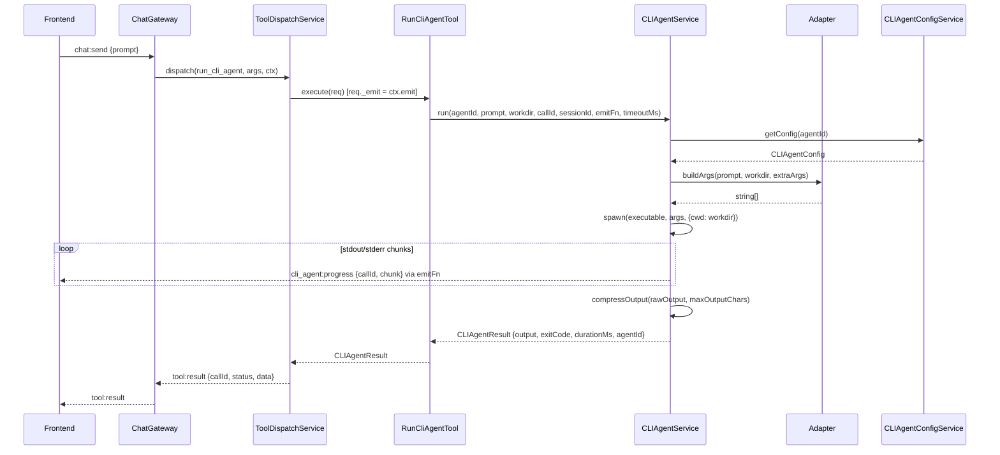
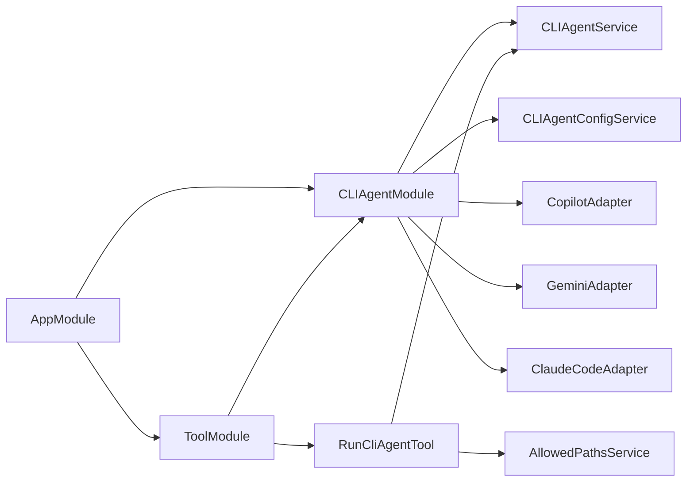

# CLI Agent Module — Architecture

## Motivation

The original `run_cli_agent` tool was tightly coupled to GitHub Copilot CLI: it used `execFile` directly, hard-coded the Windows `.cmd` wrapper, and had no streaming. This refactor introduces a generic **CLI Agent Module** that:

- Supports multiple CLI coding agents (Copilot, Gemini, Claude Code) via an adapter pattern
- Streams real-time output to the frontend via a new `cli_agent:progress` Socket.IO event
- Stores per-adapter config at `~/.kalio/cli-agents/{id}.json`
- Compresses large outputs before handing them to the LLM context
- Is fully backward-compatible (`agentId` defaults to `'copilot'` when omitted)

---

## Module Structure

```
apps/kalio-api/src/modules/cli-agent/
  adapters/
    cli-agent.adapter.ts        ← ICLIAgentAdapter interface
    copilot.adapter.ts          ← GitHub Copilot CLI adapter
    gemini.adapter.ts           ← Google Gemini CLI adapter
    claude-code.adapter.ts      ← Anthropic Claude Code adapter
  cli-agent-config.service.ts  ← Per-adapter ~/.kalio/cli-agents/{id}.json config
  cli-agent.service.ts         ← Spawn + stream + probe logic
  cli-agent.controller.ts      ← REST endpoints: GET /api/cli-agents, PUT /api/cli-agents/:id/config
  cli-agent.module.ts          ← NestJS module: exports CLIAgentService + CLIAgentConfigService
  output-compressor.ts         ← Tail-keeps to maxChars, prepends truncation note
```

---

## Adapter Interface

```typescript
interface ICLIAgentAdapter {
  readonly id: string;                          // 'copilot' | 'gemini' | 'claude'
  readonly displayName: string;
  readonly installUrl: string;
  executable(platform: NodeJS.Platform): string; // handles Windows .cmd shim
  wrapperArgs(platform: NodeJS.Platform): string[]; // e.g. ['/c', 'copilot'] on Windows
  buildArgs(prompt: string, workdir: string, extra?: string[]): string[];
  probeArgs(): string[];                         // e.g. ['--version']
}
```

Adding a new adapter = one new file, registered in `CLIAgentModule` providers and `CLIAgentService` constructor.

---

## Config Schema (`CLIAgentConfig`)

Stored at `~/.kalio/cli-agents/{agentId}.json`. Defined in `@kalio/types`.

```typescript
interface CLIAgentConfig {
  enabled: boolean;        // whether this adapter is allowed
  cliPath: string;         // '' = use adapter default (resolved via PATH)
  timeoutMs: number;       // default 600 000 ms (10 min)
  maxOutputChars: number;  // default 16 000 chars (~4 000 tokens cl100k_base)
  extraArgs: string[];     // appended after adapter's default args
}
```

---

## Output Compression

Large CLI runs can output megabytes of logs. `compressOutput(output, maxChars)` in `output-compressor.ts`:

1. If `output.length <= maxChars` → returns as-is
2. Otherwise: keeps the **tail** (`output.slice(-maxChars)`)
3. Prepends: `[Output truncated — kept last N chars (~M tokens). Full output was P chars.]`

Rationale: the tail of a CLI agent run contains the outcome (final file edits, test results, error messages), not the preamble setup steps. Tail-keeping maximises signal per token.

---

## Full Execution Sequence



---

## Module Dependency Graph



No circular dependencies. `CLIAgentModule` exports `CLIAgentService` and `CLIAgentConfigService` for `ToolModule` consumption.

---

## REST API (`CLIAgentController`)

| Method | Path | Description |
|--------|------|-------------|
| `GET` | `/api/cli-agents` | Probe all adapters in parallel → `CLIAgentAdapterInfo[]` |
| `GET` | `/api/cli-agents/:id/probe` | Probe a single adapter → `{ available, version }` |
| `GET` | `/api/cli-agents/:id/config` | Read per-adapter config |
| `PUT` | `/api/cli-agents/:id/config` | Save per-adapter config |

The old `GET /api/tools/cli-agent/probe` endpoint was removed from `ToolController` (replaced by the above).

---

## Socket.IO Events

### New: `cli_agent:progress`

```typescript
// Added to SocketEvents in @kalio/types
'cli_agent:progress': {
  callId: ID;
  sessionId: ID;
  agentId: string;
  chunk: string;   // raw stdout/stderr fragment
}
```

Emitted by `CLIAgentService` whenever the spawned process emits a `stdout`/`stderr` data chunk. The emitter function is injected into the tool via `ToolCallRequest._emit`.

---

## `ToolCallRequest._emit`

```typescript
// @kalio/types — backend-only, never serialized to DB or client
interface ToolCallRequest {
  // ... existing fields ...
  readonly _emit?: <K extends keyof SocketEvents>(event: K, data: SocketEvents[K]) => void;
}
```

`ToolDispatchService` sets `_emit: ctx.emit` when constructing the request. Tools that need to push progress events during execution use this — no new NestJS injection required.

---

## Frontend Changes

| File | Change |
|------|--------|
| `packages/@kalio/sdk/src/index.ts` | Added `onCLIAgentProgress(handler)` |
| `apps/kalio-web/src/store/agentStore.ts` | Added `cliAgentOutput: Record<callId, string>`, `appendCLIAgentChunk()`, `clearCLIAgentOutput()` |
| `apps/kalio-web/src/features/chat/ChatInterface.tsx` | Subscribe to `eventBus.onCLIAgentProgress`, dispatch to `appendCLIAgentChunk` |
| `apps/kalio-web/src/features/chat/LiveCLIAgentBlock.tsx` | **NEW** — live terminal block for in-flight `run_cli_agent` calls |
| `apps/kalio-web/src/features/chat/ToolCallBubble.tsx` | Render `LiveCLIAgentBlock` in `LiveToolCallBubble` when running; pass `agentId` to `TerminalOutputBlock` |
| `apps/kalio-web/src/features/chat/TerminalOutputBlock.tsx` | Accept `agentId?` prop, resolve display name from static map |
| `apps/kalio-web/src/features/settings/CLIAgentPanel.tsx` | **NEW** — multi-adapter settings panel with probe status + config editor |
| `apps/kalio-web/src/features/settings/registry.tsx` | Replace `ToolsPanel` with `CLIAgentPanel` |

---

## Migration Table

| Before | After |
|--------|-------|
| `run_cli_agent` only supported Copilot | Supports `agentId: 'copilot' \| 'gemini' \| 'claude'` (default `'copilot'`) |
| Direct `execFile` in `RunCliAgentTool` | Delegates to `CLIAgentService` via adapter pattern |
| No streaming | `cli_agent:progress` chunks arrive in real time |
| No config file | `~/.kalio/cli-agents/{id}.json` per adapter |
| `GET /api/tools/cli-agent/probe` (Copilot only) | `GET /api/cli-agents` (all adapters) |
| "Copilot CLI" hardcoded in `TerminalOutputBlock` | Dynamic label from `agentId` |

---

## Windows Notes

Copilot CLI installs as a `.cmd` shim on Windows. Using `spawn` with `shell: false` and `cmd /c copilot [args]` ensures:
- No shell metacharacter injection (args passed as array, not interpolated string)
- No Node.js `DeprecationWarning` about shell: true
- Consistent behaviour with `execFile` pattern used elsewhere

Gemini CLI and Claude Code install as proper binaries on all platforms — no wrapper needed.
