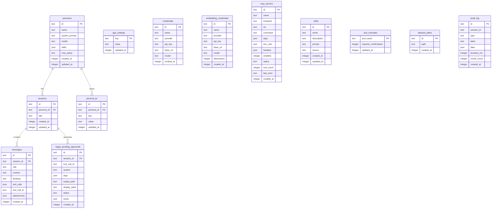

# Database Schema Diagram

Kalio uses **SQLite** via **Drizzle ORM**. Schema source of truth: `apps/kalio-api/src/database/schema.ts`.  
All migrations live in `apps/kalio-api/src/database/migrations/`.

---

## Entity Relationship Diagram

---

## Table Reference

### `personas`
Stores AI personas. Each persona defines a system prompt, a default model, an MCP access policy, and an optional list of allowed skills.

### `sessions`
Chat sessions. Each session belongs to one persona. Scopes all messages, VFS files (`sessions/{id}/files/`), and KV state (`sessions/{id}/_kv.json`).

### `messages`
Ordered turn history per session. `role` can be `user`, `assistant`, `tool_result`, or `system`. Stores tool call metadata and file attachments.

### `persona_kv`
Key-value store per persona. Used by the `kv_*` tools (LLM-writable persistent state).

### `app_settings`
Single-table key-value config store. Used for persisting global settings (e.g. default model).

### `credentials`
LLM provider API keys + base URLs. Referenced when building LLM clients for chat sessions.

### `embedding_credentials`
Embedding provider API keys (OpenAI, custom). Used by `MemoryModule` for vector storage.

### `mcp_servers`
MCP server configs. `MCPService` reads this on boot and connects to all `enabled` servers.  
`status` is live-updated and broadcast via Socket.IO events.

### `skills`
User- or agent-defined prompt snippets injected into the system prompt. Also used as an `allow_list` filter for native and MCP tools.

### `tool_overrides`
Per-tool overrides for the `requiresConfirmation` flag (primary key: `tool_name`). Allows users to disable HITL for specific tools or enable it for safe-by-default ones.

### `allowed_paths`
Filesystem roots the agent can access via `fs_*` tools. Enforced by `AllowedPathsService` before any read/write.

### `raapp_pending_approvals`
Stores `call_native` approval requests that require explicit user confirmation before the tool executes. Status transitions: `pending → approved | cancelled | executed | error`.

### `audit_log`
Full audit trail per session. Records every LLM request/response, tool call, tool result, and error with timing and token data.  
`type` enum: `llm_request`, `llm_response`, `tool_call`, `tool_result`, `error`, `raapp_native_call`, `raapp_native_approved`.

---

## Notes

- All timestamps use `integer({ mode: 'timestamp_ms' })` — Unix milliseconds stored as integers.
- `api_key` fields are stored in plaintext in the MVP. Post-MVP plan: `libsodium` secretbox encryption.
- `sessions` and `messages` cascade-delete: removing a persona removes all its sessions and messages.
- There is no `workspaceId` — session is the unit of isolation.
