# Kalio Database Schema - Entity Relationship Diagram

```mermaid
erDiagram
    personas ||--o{ sessions : "persona_id (cascade)"
    personas ||--o{ persona_kv : "persona_id (cascade)"
    personas ||--o{ agent_loops : "persona_id (cascade)"
    sessions ||--o{ messages : "session_id (cascade)"
    agent_loops ||--o{ agent_tasks : "loop_id (cascade)"
    agent_loops ||--o{ agent_iterations : "loop_id (cascade)"

    personas {
        text id PK
        text name
        text system_prompt
        text model
        text skills "JSON"
        integer created_at "timestamp_ms"
        integer updated_at "timestamp_ms"
    }

    sessions {
        text id PK
        text persona_id FK
        text title
        integer created_at "timestamp_ms"
        integer updated_at "timestamp_ms"
    }

    messages {
        text id PK
        text session_id FK
        text role "enum: user|assistant|tool_result|system"
        text content
        text thinking
        text tool_calls "JSON"
        text tool_call_id
        text attachments "JSON"
        integer created_at "timestamp_ms"
    }

    persona_kv {
        text id PK
        text persona_id FK
        text key
        text value
        integer updated_at "timestamp_ms"
    }

    app_settings {
        text key PK
        text value
        integer updated_at "timestamp_ms"
    }

    embedding_credentials {
        text id PK
        text name
        text provider
        text api_key
        text base_url
        text model
        integer dimensions "default: 1536"
        integer created_at "timestamp_ms"
    }

    credentials {
        text id PK
        text name
        text provider
        text api_key
        text base_url
        text model
        integer created_at "timestamp_ms"
    }

    mcp_servers {
        text id PK
        text name
        text transport "enum: stdio|http"
        text url
        text command
        text args "JSON"
        text env_vars "JSON"
        text headers "JSON"
        integer enabled "boolean"
        text status "enum: connecting|connected|disconnected|error|stopped"
        integer tool_count
        text last_error
        integer created_at "timestamp_ms"
    }

    skills {
        text id PK
        text name
        text description
        text prompt
        text source "enum: user|agent"
        integer created_at "timestamp_ms"
        integer updated_at "timestamp_ms"
    }

    agent_loops {
        text id PK
        text name
        text persona_id FK
        text system_prompt
        text status "enum: idle|running|paused|stopped|error|completed"
        text config "JSON"
        text current_task_id
        text chat_session_id
        integer iteration_count
        integer created_at "timestamp_ms"
        integer updated_at "timestamp_ms"
    }

    agent_tasks {
        text id PK
        text loop_id FK
        text title
        text description
        integer priority
        text status "enum: pending|running|done|failed|skipped"
        text result_summary
        integer order_index
        integer created_at "timestamp_ms"
        integer updated_at "timestamp_ms"
    }

    agent_iterations {
        text id PK
        text loop_id FK
        text task_id
        integer iteration_number
        text action "enum: execute_task|pause|resume|error|watchdog"
        text prompt_used
        text result_summary
        integer duration_ms
        integer created_at "timestamp_ms"
    }

    allowed_paths {
        text id PK
        text path
        integer created_at "timestamp_ms"
    }

    raapp_pending_approvals {
        text id PK
        text session_id
        text tool_call_id
        text system
        text args "JSON"
        text output_path
        text display_label
        text status "enum: pending|approved|cancelled|executed|error"
        text result "JSON"
        integer created_at "timestamp_ms"
    }

    audit_log {
        text id PK
        text session_id
        text type "enum: llm_request|llm_response|tool_call|tool_result|error|raapp_native_call|raapp_native_approved"
        text label
        text data "JSON"
        integer duration_ms
        integer created_at "timestamp_ms"
    }
```

## Schema Overview

The Kalio database consists of 15 tables organized into the following functional groups:

### Core Chat System
- **personas**: AI agent configurations with system prompts, models, and skills
- **sessions**: Chat sessions linked to personas
- **messages**: Individual messages within sessions with role, content, and optional tool calls

### Agent Automation
- **agent_loops**: Long-running agent processes with status tracking
- **agent_tasks**: Individual tasks within agent loops
- **agent_iterations**: Execution history of agent loop iterations

### Configuration & Credentials
- **credentials**: LLM provider credentials
- **embedding_credentials**: Embedding provider credentials (separate from LLM credentials)
- **mcp_servers**: Model Context Protocol server configurations
- **skills**: Reusable skill prompts that can be attached to personas
- **app_settings**: Global application key-value settings
- **allowed_paths**: Filesystem paths the agent is permitted to access

### Persona Metadata
- **persona_kv**: Key-value storage for persona-specific data

### Audit & Approval
- **audit_log**: System event logging (LLM requests, tool calls, errors, etc.)
- **raapp_pending_approvals**: Pending approval requests for native system calls

## Foreign Key Relationships

| Child Table | Foreign Key | Parent Table | On Delete |
|-------------|-------------|--------------|-----------|
| sessions | persona_id | personas | CASCADE |
| persona_kv | persona_id | personas | CASCADE |
| agent_loops | persona_id | personas | CASCADE |
| messages | session_id | sessions | CASCADE |
| agent_tasks | loop_id | agent_loops | CASCADE |
| agent_iterations | loop_id | agent_loops | CASCADE |

## Indexes

- `raapp_pending_approvals(session_id)`
- `raapp_pending_approvals(status)`
