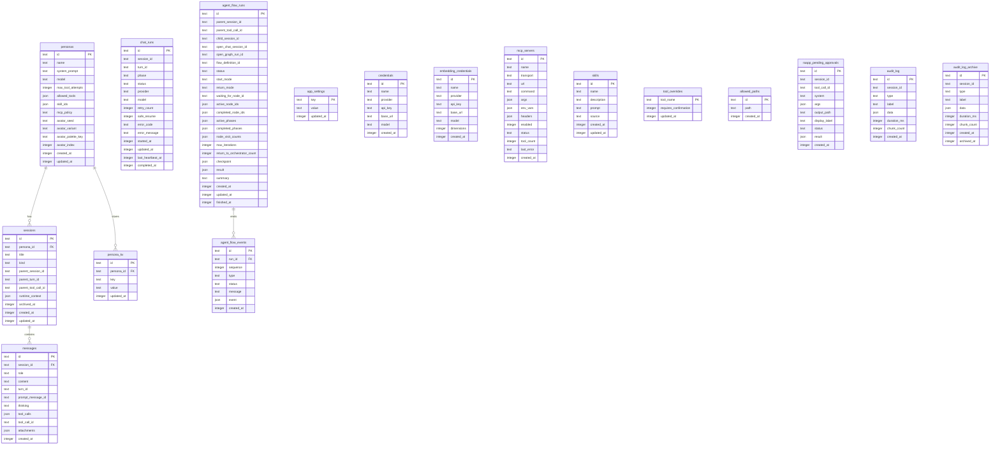

# Database Schema Diagram

Kalio uses **SQLite** via **Drizzle ORM**.
Schema source of truth: `apps/kalio-api/src/database/schema.ts`.
All migrations live in `apps/kalio-api/src/database/migrations/`.

This ERD reflects the current tables in code, not older design intent.

---

## Entity Relationship Diagram

```mermaid
erDiagram

    personas {
        text id PK
        text name
        text system_prompt
        text model
        integer max_tool_attempts
        json allowed_tools
        json skill_ids
        text mcp_policy
        text avatar_seed
        text avatar_variant
        text avatar_palette_key
        integer avatar_index
        integer created_at
        integer updated_at
    }

    sessions {
        text id PK
        text persona_id FK
        text title
        text kind
        text parent_session_id
        text parent_turn_id
        text parent_tool_call_id
        json runtime_context
        integer archived_at
        integer created_at
        integer updated_at
    }

    messages {
        text id PK
        text session_id FK
        text role
        text content
        text turn_id
        text prompt_message_id
        text thinking
        json tool_calls
        text tool_call_id
        json attachments
        integer created_at
    }

    chat_runs {
        text id PK
        text session_id
        text turn_id
        text phase
        text status
        text provider
        text model
        integer retry_count
        integer safe_resume
        text error_code
        text error_message
        integer started_at
        integer updated_at
        integer last_heartbeat_at
        integer completed_at
    }

    agent_flow_runs {
        text id PK
        text parent_session_id
        text parent_tool_call_id
        text child_session_id
        text open_chat_session_id
        text open_graph_run_id
        text flow_definition_id
        text status
        text start_mode
        text return_mode
        text waiting_for_node_id
        json active_node_ids
        json completed_node_ids
        json active_phases
        json completed_phases
        json node_visit_counts
        integer max_iterations
        integer return_to_orchestrator_count
        json checkpoint
        json result
        text summary
        integer created_at
        integer updated_at
        integer finished_at
    }

    agent_flow_events {
        text id PK
        text run_id FK
        integer sequence
        text type
        text status
        text message
        json event
        integer created_at
    }

    persona_kv {
        text id PK
        text persona_id FK
        text key
        text value
        integer updated_at
    }

    app_settings {
        text key PK
        text value
        integer updated_at
    }

    credentials {
        text id PK
        text name
        text provider
        text api_key
        text base_url
        text model
        integer created_at
    }

    embedding_credentials {
        text id PK
        text name
        text provider
        text api_key
        text base_url
        text model
        integer dimensions
        integer created_at
    }

    mcp_servers {
        text id PK
        text name
        text transport
        text url
        text command
        json args
        json env_vars
        json headers
        integer enabled
        text status
        integer tool_count
        text last_error
        integer created_at
    }

    skills {
        text id PK
        text name
        text description
        text prompt
        text source
        integer created_at
        integer updated_at
    }

    tool_overrides {
        text tool_name PK
        integer requires_confirmation
        integer updated_at
    }

    allowed_paths {
        text id PK
        text path
        integer created_at
    }

    raapp_pending_approvals {
        text id PK
        text session_id
        text tool_call_id
        text system
        json args
        text output_path
        text display_label
        text status
        json result
        integer created_at
    }

    audit_log {
        text id PK
        text session_id
        text type
        text label
        json data
        integer duration_ms
        integer chunk_count
        integer created_at
    }

    audit_log_archive {
        text id PK
        text session_id
        text type
        text label
        json data
        integer duration_ms
        integer chunk_count
        integer created_at
        integer archived_at
    }

    personas ||--o{ sessions : "has"
    personas ||--o{ persona_kv : "stores"
    sessions ||--o{ messages : "contains"
    agent_flow_runs ||--o{ agent_flow_events : "emits"
```

---

## Table Reference

### `personas`

Stores AI personas. Each persona defines a system prompt, a default model, tool allowlists, skill bindings, MCP policy, avatar settings, and an optional per-persona tool attempt budget.

### `sessions`

Chat sessions and child runtime sessions. `kind` now distinguishes `chat`, `subagent`, `cli-agent`, and `agent-flow`. The session row also carries parent linkage and `runtime_context`.

### `messages`

Ordered turn history per session. `role` can be `user`, `assistant`, `tool_result`, or `system`. Stores tool call metadata, reasoning text, attachments, and chat transcript content. Architecture chat projections are synthesized from messages and served through the architecture run chat endpoint, not stored in this table.

### `chat_runs`

Turn execution ledger. Tracks provider/model, retry count, heartbeat, and completion state for the current chat hot path.

### `agent_flow_runs`

Durable nested-flow run ledger. Stores parent session linkage, child session linkage, open chat / open graph targets, return mode, phases, visit counts, resume checkpoint, and result snapshot.

### `agent_flow_events`

Durable event stream for nested flows. This is the persisted trace used by the AgentFlow facade and resume path.

### `persona_kv`

Key-value store per persona. Used by the `kv_*` tools.

### `app_settings`

Single-table key-value config store for global settings.

### `credentials`

LLM provider API keys, base URLs, and model selections.

### `embedding_credentials`

Embedding provider configuration and dimensions.

### `mcp_servers`

MCP server configs and live status.

### `skills`

Prompt snippets injected into the effective system prompt.

### `tool_overrides`

Per-tool overrides for `requiresConfirmation`.

### `allowed_paths`

Filesystem roots the agent can access via `fs_*` tools.

### `raapp_pending_approvals`

Pending RA-App native-effect approvals that require explicit user confirmation before the action executes.

### `audit_log`

Append-only runtime audit trail for LLM requests/responses, tool calls, architecture events, errors, and other operational events.

### `audit_log_archive`

Archived audit rows after retention or rotation.

---

## Notes

- All timestamps use integer milliseconds.
- `architecture_event` is an audit log type, not a dedicated architecture table.
- `ArchitectureRun` and `ArchitectureExecutionEvent` are runtime/projection models recovered from runtime state and audit rows.
- `chat_runs`, `agent_flow_runs`, `raapp_pending_approvals`, and `audit_log` tables keep session linkage as plain text correlation fields, not enforced foreign keys.
- `agent_flow_runs` and `agent_flow_events` are the durable nested-flow persistence path.
- There is no `workspaceId`; session is still the unit of isolation.
