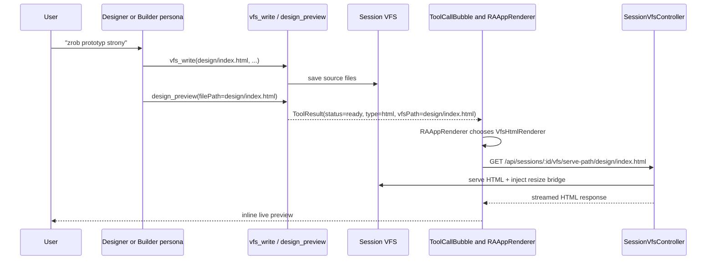
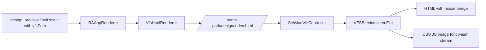
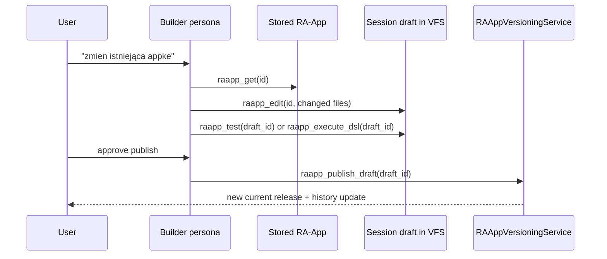

# Design Tools Architecture - Current State

Ten dokument opisuje finalny model pracy z designem i prototypami w Kalio.
Najwazniejsza zmiana wzgledem starszego podejscia jest prosta:

- prototyp strony lub landing page nie powinien zaczynac sie od `raapp_create`
- prototyp powinien zaczynac sie w sesyjnym VFS i konczyc na `design_preview`
- publikacja do katalogu RA-App jest osobnym krokiem, wykonywanym tylko gdy user tego chce

Jesli chcesz zrozumiec stricte runtime RA-App po stronie katalogu, ZIP-ow i approvals,
zobacz tez `raapp-design-current.md`.

## TL;DR

Sa dzis dwie osobne sciezki:

1. **Prototype lane** - szybka iteracja w sesji:
   `vfs_write` -> `design_preview` -> poprawki w VFS -> kolejny `design_preview`
2. **Release lane** - zapisany artefakt RA-App:
   - nowy one-shot app: `raapp_create`
   - edycja istniejacego appa: `raapp_get` -> `raapp_edit` -> `raapp_test` / `raapp_execute_dsl` -> `raapp_publish_draft`

Najwazniejsza praktyczna regula:

- **prototyp = session VFS**
- **publikacja = RA-App catalog**

## Kiedy uzywac czego

| Intencja | Gdzie pracujesz | Gdzie trafia wynik | Zalecane narzedzia |
| --- | --- | --- | --- |
| Prosty landing page, layout, eksperyment wizualny | session VFS | inline preview w czacie | `vfs_list`, `vfs_read`, `vfs_write`, `design_preview` |
| Multi-file prototyp HTML z assetami | session VFS | inline preview w czacie | `vfs_*`, `design_preview` |
| Jednorazowy zapisany app | RA-App catalog | chat + katalog | `raapp_create` |
| Edycja istniejacego user appa | draft w session VFS | draft + pozniej katalog | `raapp_get`, `raapp_edit`, `raapp_test`, `raapp_execute_dsl`, `raapp_publish_draft` |
| Odpalenie juz zapisanego appa | RA-App catalog | inline runtime w czacie | `list_raapps`, `run_raapp` |

## Cztery powierzchnie, ktorych nie wolno mylic

| Powierzchnia | Owner | Gdzie zyje | Do czego sluzy |
| --- | --- | --- | --- |
| Session VFS source | `VFSService` | `WORKSPACE_ROOT/sessions/<sessionId>/files` | robocze HTML, CSS, JS, drafty i assety |
| Inline VFS preview | `design_preview` + `RAAppRenderer` | historia czatu + session VFS | szybki preview bez publikacji |
| Draft working copy | `raapp_edit` / `raapp_create_draft` | session VFS `drafts/...` | bezpieczna edycja przed publikacja |
| Published RA-App | `RAAppService` / `RAAppVersioningService` | `RA_APPS_PATH` | dlugowieczny artefakt widoczny w katalogu |

To jest najwazniejszy model mentalny na dzis:

- `design_preview` niczego nie publikuje
- `raapp_create` publikuje od razu
- `raapp_edit` nie mutuje release ZIP bezposrednio, tylko pracuje przez draft w VFS

## Tool glossary

| Tool | Rola | Skutek uboczny | Kiedy uzywac |
| --- | --- | --- | --- |
| `vfs_list` | lista plikow w sesji | brak | sprawdzenie stanu roboczego |
| `vfs_read` | odczyt pliku z sesji | brak | iteracja i review |
| `vfs_write` | zapis pliku do sesji | zapis do session VFS | podstawowe tworzenie prototypu |
| `design_preview` | inline preview HTML z VFS | brak publikacji; tylko walidacja pliku i preview block | finalny krok kazdej iteracji prototypu |
| `raapp_create` | tworzy inline app i zapisuje go do katalogu | zapis do RA-App catalog, confirmation | tylko gdy user chce zapisany app |
| `raapp_create_draft` | tworzy nowy draft DSL/UI | zapis draftu do session VFS | draft-first dla GUI/logic apps |
| `raapp_execute_dsl` | uruchamia draft | brak publikacji | review / runtime check draftu |
| `raapp_test` | testuje draft albo release | brak | przed publikacja |
| `raapp_publish_draft` | publikuje draft do versioned lifecycle | zmienia katalog release | dopiero po review |
| `raapp_get` | pobiera source zapisanej appki | brak | przed edycja release |
| `raapp_edit` | tworzy/aktualizuje working copy release w VFS | zapis draftu w VFS | edycja istniejacego appa |
| `list_raapps` | lista zapisanych appek | brak | discovery |
| `run_raapp` | odpalenie zapisanej appki | brak mutacji source | runtime gotowego appa |

## Architektura odpowiedzialnosci

| Komponent | Rola w design flow |
| --- | --- |
| `DesignPreviewTool` | zamienia `filePath` z VFS na inline `RAAppBlock` z `vfsPath` |
| `VFSService` | trzyma session files, serwuje HTML i assety, dokleja resize bridge do HTML |
| `SessionVfsController` | wystawia REST do `read`, `write`, `serve`, `serve-path`, `download` |
| `ToolCallBubble.extractRAAppBlock()` | rozpoznaje wynik `design_preview` i `raapp_*` jako blok renderowalny |
| `RAAppRenderer` | decyduje: zwykly HTML, GUI albo VFS-backed HTML preview |
| `VfsHtmlRenderer` | buduje iframe `src` do session VFS |
| `HtmlIframeRenderer` | osadza iframe, obsluguje resize i `kalio_send_message` bridge |
| `RAAppService` | runtime i zapis publikowanych RA-Appow |
| `RAAppVersioningService` | `current`, `draft`, `history`, rollback i approve/discard |
| `RAAppManager` | UI katalogu release artifacts, nie raw prototypow z VFS |
| `App.tsx` | trzyma shell navigation; po hot reload remount przywraca aktualna sekcje/tab z `sessionStorage` |

## Finalny prototype lane

To jest preferowany flow dla design taskow, stron, landing page i eksperymentow wizualnych.

Interpretacja tego flow:

- zrodlem prawdy jest plik w VFS, nie payload wewnatrz message bubble
- preview mozna odswiezyc przez kolejny `design_preview` po zmianach w plikach
- dopoki nie ma explicite decyzji o publikacji, nie dotykamy katalogu RA-App

## Multi-file HTML preview i relative assets

To jest wazny szczegol implementacyjny, bo starszy model `fetch + srcDoc` byl za slaby dla realnych prototypow.

Aktualnie preview HTML dziala przez iframe `src`, nie przez samo `srcDoc`.
Frontend korzysta z URL budowanego do path-based route:

- `/api/sessions/:id/vfs/serve-path/<path>`

To daje dwie rzeczy:

1. relative asset paths dzialaja normalnie (`./styles.css`, `./app.js`, `./images/x.png`)
2. backend moze streamowac nie-HTML assets bez buforowania wszystkiego jako string

Aktualna regula runtime:

- HTML dostaje server-side injected resize bridge
- CSS / JS / obrazy / fonty / wasm sa tylko streamowane z poprawnym MIME type

## Release lane: gdy prototyp ma stac sie artefaktem

Sa dwa warianty publikacji.

### A. Nowy, jednorazowy app

Jesli user mowi wprost: "zapisz to jako RA-App", wtedy mozna uzyc `raapp_create`.

Konsekwencje `raapp_create`:

- zwraca inline wynik do czatu
- zapisuje app do katalogu user RA-App
- wymaga confirmation, bo zapisuje trwaly artefakt

### B. Edycja istniejacego appa

Jesli app juz istnieje, finalny flow jest draft-first i VFS-first.

Kluczowa regula:

- release ZIP nie jest juz glowna powierzchnia edycji
- glowna powierzchnia edycji to working copy w session VFS

## Persona contract dzis

Wbudowane persony maja juz ustawiony finalny kontrakt pracy:

- `RaBuilder` - preferuje VFS-first dla prototypow, draft/release dla RA-App lifecycle
- `UX Designer` - preferuje `vfs_write` + `design_preview` dla stron i layoutow
- `Fullstack Dev` - moze robic prototyp HTML w VFS albo wejsc w kod repo przez CLI agent
- `Jony` - ma ten sam VFS-first prototyping path dla szybkich taskow
- `Orchestrator` - deleguje prototyp do child persona i moze domknac preview w parent session, bo ma `design_preview` w allowliscie

Praktyczna regula dla delegacji:

- child moze pracowac w isolated VFS
- po `copyOutputs` parent dostaje pliki z powrotem
- jesli parent ma pokazac finalny preview u siebie, musi miec `design_preview`

## Co user powinien zobaczyc w UI

Podczas normalnej pracy designowej finalny obraz powinien byc taki:

1. agent zapisuje pliki do VFS
2. preview pokazuje sie inline w czacie
3. pliki sa widoczne w session files / VFS
4. katalog RA-App nie zmienia sie, dopoki nie bylo explicite publikacji

Wazny niuans UX:

- shell aplikacji pamieta aktualna sekcje i tab po remount / hot reload, wiec przy pracy live nie powinno juz wyrzucac z powrotem na landing page tylko dlatego, ze frontend sie odswiezyl

## Rules of thumb

1. Jesli celem jest **design iteration**, zaczynaj od VFS i `design_preview`.
2. Jesli celem jest **saved artifact**, przechodz do `raapp_create` albo draft/publish workflow.
3. `run_raapp` sluzy do odpalania gotowych appow, nie do iteracji designu.
4. `raapp_edit` tworzy working copy w VFS, nie edytuje release in-place.
5. Dla multi-file preview zakladaj `serve-path`, nie `srcDoc` jako glowny runtime model.
6. RA-App Manager pokazuje katalog artefaktow, nie surowe pliki prototypu z sesji.

## Recommended reading order

1. Ten dokument - finalny workflow i granice narzedzi
2. `raapp-design-current.md` - runtime RA-App, approvals, iframe bridge, katalog
3. `tool-architecture.md` - dispatch, registry, confirmation policy
4. `application-architecture-current.md` - mapa calego systemu