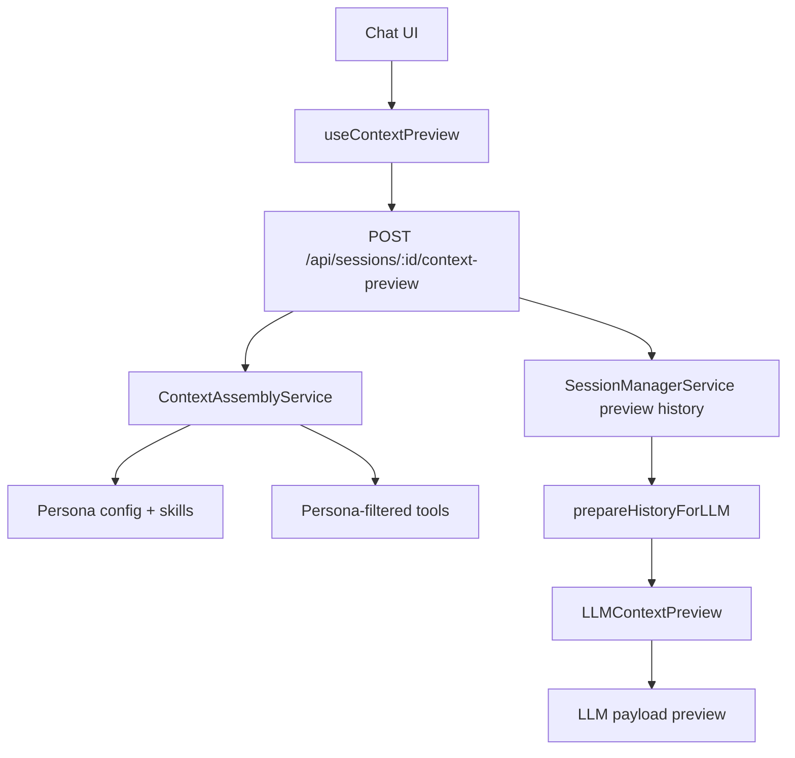
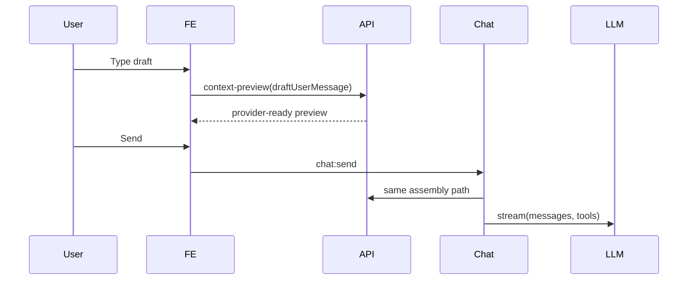

# Context Management and LLM Payload Preview

## Goal

The context management feature gives the user a real backend-owned measurement and inspection path for the payload that will be sent to the chat LLM on the next turn. The preview is not a frontend estimate: it is produced by the same backend assembly and history preparation utilities used before `llmSource.stream(...)`.

The panel must answer one concrete question: "what effective system prompt, messages, tools, and compaction state will the model receive if I send this next message?"

## Current Completeness

After this slice, the preview is authoritative for normal chat turns using:

- persisted transcript history,
- current composer draft appended in memory,
- draft attachments hydrated in memory,
- persona prompt,
- active skill prompt sections,
- persona-filtered tools,
- provider-ready history sanitation,
- backend history compaction metadata.

The preview does not yet cover nested subagent turns, architecture graph payloads, or child-session payload previews. Those flows should reuse `ContextAssemblyService`, `SessionManagerService.loadPreviewHistoryForLLM(...)`, and the same response contract when they are wired.

## API

`POST /api/sessions/:id/context-preview`

Request:

```ts
{
  personaId: string;
  draftUserMessage?: string;
  attachments?: ChatAttachment[];
}
```

Response:

```ts
LLMContextPreview
```

The response includes the session id, persona id, active model label, context limit, token estimates, compaction metadata, effective system prompt, provider-visible tools, and provider-ready messages. Draft input is included as `source: 'draft'` and is never persisted.

## Runtime Behavior

`ChatService` and `ContextPreviewService` both use `ContextAssemblyService` for persona, skills, tool filtering, tool prompt section assembly, and `effectiveSystemPrompt`. This removes the old split where UI context showed a base prompt while the LLM received a different prompt.

`SessionManagerService.loadPreviewHistoryForLLM(...)` loads persisted history, appends the optional draft user message in memory, hydrates draft attachments, and calls the same LLM history preparation path as live chat turns. Existing sanitation behavior for oversized tool results and binary content is preserved.

The frontend section is named `LLM payload preview`. It renders loading, stale, and error states so old context is not silently presented as current. When the backend preview is available, the token badge uses backend totals; frontend estimates remain only fallback/loading data.

## Event Refresh

`useContextPreview` owns fetching and stale response handling. Socket event wiring stays in `useChatSocketEvents`, which invalidates the preview on context-changing events instead of duplicating listeners inside the panel.

Refresh triggers:

- session switch,
- successful `chat:context`,
- history reload after reconnect,
- `chat:complete`,
- `tool:result`,
- debounced composer draft change,
- persona change.

## Compaction Hook Point

The current compaction strategy is backend default history preparation. The preview reports whether compaction was applied, unbounded and final message counts, and the safe target token budget.

Future strategies should use the shared contract:

```ts
type ContextCompactionStrategy = 'backend-default' | 'summary' | 'evidence_only';
```

The current `Compact` UI action remains a temporary local action. LLM summarization compaction is intentionally not implemented in this slice.

## Data Flow



## Send Sequence



