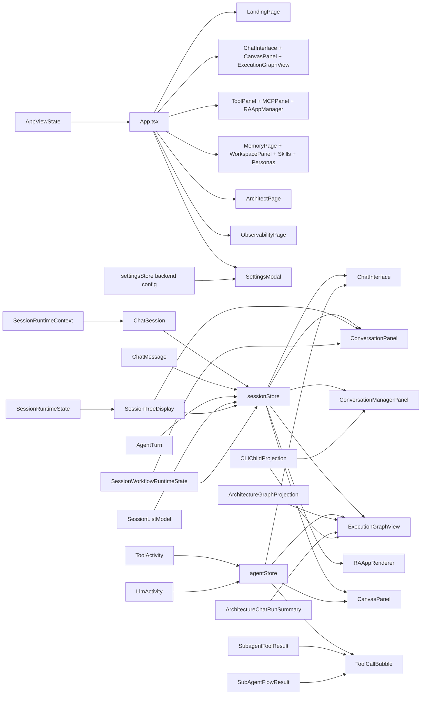

# Frontend Model - Current State

This document describes the current FE domain model for Kalio Workstation.
It is intentionally separate from `UI-Flow.md`, which documents screen flow and navigation.
For the backend runtime model, see `application-architecture-current.md`.

## Source Of Truth

- `apps/kalio-web/src/App.tsx`
- `apps/kalio-web/src/App.types.ts`
- `apps/kalio-web/src/App.viewState.ts`
- `apps/kalio-web/src/store/sessionStore.ts`
- `apps/kalio-web/src/store/agentStore.ts`
- `apps/kalio-web/src/features/settings/settingsStore.ts`
- `apps/kalio-web/src/features/sessions/sessionTreeDisplay.ts`
- `apps/kalio-web/src/features/sessions/sessionRowRuntimeState.ts`
- `apps/kalio-web/src/features/sessions/sessionWorkflowRuntimeState.ts`
- `apps/kalio-web/src/features/sessions/sessionListModel.ts`
- `apps/kalio-web/src/features/chat/cliChildProjection.model.ts`
- `apps/kalio-web/src/features/chat/architectureChatSummary.ts`
- `apps/kalio-web/src/features/chat/architectureSubagentToolResult.ts`
- `apps/kalio-web/src/features/chat/subAgentFlowResult.parser.ts`
- `apps/kalio-web/src/features/chat/graph/executionGraphModel.types.ts`
- `apps/kalio-web/src/features/chat/graph/executionGraphModel.ts`
- `apps/kalio-web/src/features/chat/graph/ExecutionGraphView.tsx`
- `apps/kalio-web/src/features/architect/ArchitectRunProjection.tsx`
- `apps/kalio-web/src/features/architect/ArchitectPage.tsx`
- `apps/kalio-web/src/features/raapp/RAAppRenderer.tsx`

## What This Model Covers

- shell state and persisted view selection
- per-session conversation transcript and turn state
- live tool, approval, CLI, and graph activity
- settings and backend config mirrors
- FE projections for architecture and agent-flow runs

## Core FE Models

| Model | Owner | Meaning |
| --- | --- | --- |
| `AppViewState` | `App.viewState.ts` | Persisted shell state in `sessionStorage`: active section, Talk tab, Talk view, Tools tab, Mind tab, selected skill. |
| `ChatSession` | `sessionStore` mirror of BE state | Session row rendered by the shell and session panels. Feeds active session selection, conversation lists, and graph projections. |
| `ChatMessage` | `sessionStore` mirror of BE state | Durable transcript item. Used by `ChatInterface`, `MessageBubble`, `ToolCallBubble`, and `ExecutionGraphView`. |
| `AgentTurn` | `sessionStore` | Visual bracket between `agent:start` and `agent:done`. Rebuilt from history after reconnect or reload. |
| `ToolActivity` | `agentStore` | Live per-call status for tool chips, canvas panels, and execution graph overlays. |
| `LlmActivity` | `agentStore` | Auxiliary LLM sub-call status used by session manager and debug views. |
| `CanvasFocusTarget` | `agentStore` | Selected focus target for the canvas / graph surface. |
| `SessionRuntimeContext` | `@kalio/types` + `sessionStore` | Persisted launch/runtime metadata attached to `ChatSession.runtimeContext`. Carries architecture launch context and project scope. |
| `SessionListModel` | `sessionListModel.ts` | Sorted and filtered sidebar entries for session navigation, origin filters, and tree rendering. |
| `SessionTreeDisplay` / `SessionRuntimeState` | `sessionTreeDisplay.ts` + `sessionRowRuntimeState.ts` | Derived sidebar tree and row runtime state used for hierarchy, badges, and live status labels. |
| `SessionWorkflowRuntimeState` | `sessionWorkflowRuntimeState.ts` | Workflow-envelope projection for sessions that carry architecture or AgentFlow runtime summaries. |
| `SettingsStore` backend config | `settingsStore` | In-memory mirror of `/api/llm/config`, plus conversation title settings and settings-tab requests. |
| `ExecutionGraphModel` | `features/chat/graph/executionGraphModel.ts` | Layout model for the graph view. Derived from sessions, session messages, agent turns, tool activities, personas, and collapse rules. |
| `ArchitectureGraphProjection` | backend projection consumed by FE | Graph projection for architecture runs. Used by `ExecutionGraphView` and graph/inspector surfaces. |
| `ArchitectureChatRunSummary` | chat projection model | Chat-facing architecture run summary embedded into `ChatMessage.architectureRun`. |
| `SubagentToolResult` | BE result projected into FE | Durable sub-agent result bubble with child session history and copied files. |
| `SubAgentFlowResult` | BE result projected into FE | Durable agent-flow result bubble with trace preview, child session, and graph run links. |
| `CLIChildProjection` | `cliChildProjection.model.ts` | Live child-process/session projection shown in Talk, canvas, and graph surfaces. |
| `Persona` / `ToolMeta` | backend-driven config mirrors | FE management surfaces for persona setup and tool registry views; these are not pure read-only mirrors. |

## Model Relations

## Shell Surface Map

| Section | Main models | Notes |
| --- | --- | --- |
| `Landing` | `ChatSession`, `ToolActivity`, `AppViewState` | Quick chat and app tiles launch sessions and reuse the same session model as Talk. |
| `Talk` | `ChatSession`, `ChatMessage`, `AgentTurn`, `ToolActivity`, `CanvasFocusTarget` | Main transcript surface. Conversation and graph are just two projections of the same session state. |
| `Tools` | `ToolMeta`, `MCPServer`, RA-App catalog data | Registry and operational surfaces. Tool data is backend-driven, with inline management actions in the RA-App and MCP views. |
| `Mind` | `Persona`, `Skill`, `WorkspacePanel`, VFS session data | Long-lived workspace and knowledge surfaces, including persona and skill authoring. |
| `Architect` | `ArchitectureSchema`, `ArchitectureRun`, `AgentFlowRun`, `SessionRuntimeContext`, `ArchitectureGraphProjection` | Schema editor, run controls, projection tabs, and QA-gated resume flow live here. |
| `Observability` | audit and runtime logs | Timeline and truth-board style inspection. |
| `Settings` | `settingsStore`, backend config, provider settings | Modal overlay for runtime config, not a separate section state. |

## Ownership Rules

- `sessionStore` owns transcript and turn state that must survive reconnect or be rebuildable from history.
- `agentStore` owns live-progress UI state that can disappear when the turn ends.
- `settingsStore` is in-memory only and mirrors backend config.
- `AppViewState` owns shell chrome selection and is persisted independently from session data.
- `ChatInterface` and `ExecutionGraphView` are adapters over the state model, not state owners.
- `ArchitectPage` writes launch/runtime context into sessions so the shell can reopen the same architecture state after reload.

## Practical Boundaries

- If the user should still see it after reload, it belongs in session history or a persisted shell state.
- If the user only needs it while a tool or model is still running, it belongs in `agentStore`.
- If the view is derived from backend truth, keep the canonical data in BE and project it into FE models.
- Do not treat navigation flow as the same thing as domain state; that is why this document exists separately from `UI-Flow.md`.
