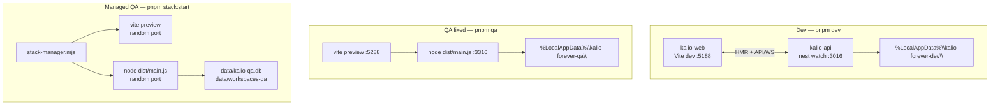
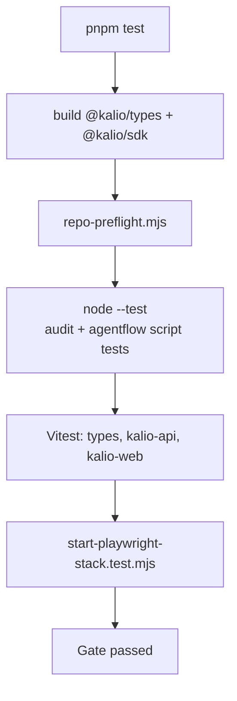
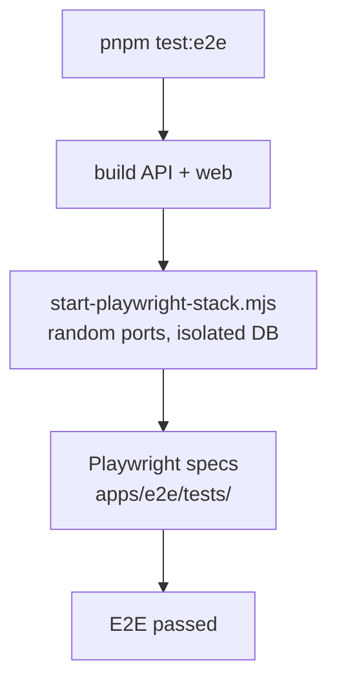
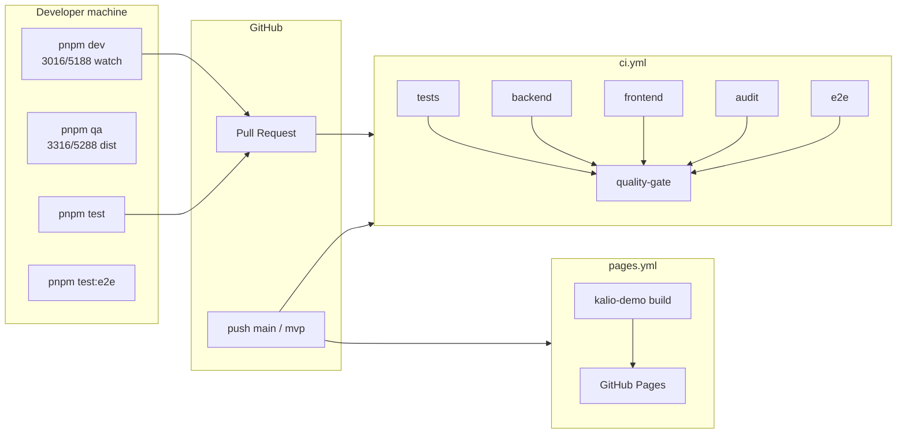
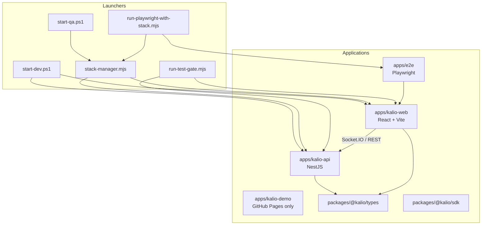
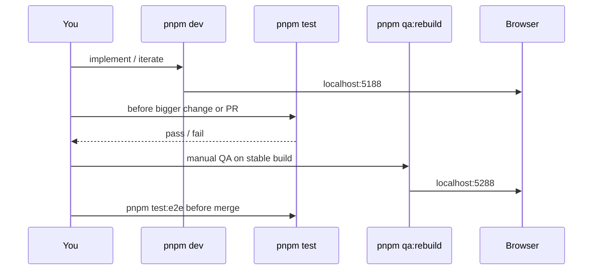

# Local Development, QA, CI, and Test Entry Points

Canonical guide for running Kalio locally, choosing the right stack, and understanding how tests and release automation fit together.

**Quick picks**

| Goal | Command | UI URL |
|---|---|---|
| **Windows user install** | `irm .../install.ps1 \| iex` | http://localhost:6188 |
| Code with hot reload | `pnpm dev` | http://localhost:5188 |
| Stable manual QA (built dist) | `pnpm qa` or `pnpm qa:rebuild` | http://localhost:5288 |
| Prod profile (built dist) | `pnpm prod` or `pnpm prod:rebuild` | http://localhost:6188 |
| Isolated QA (random ports) | `pnpm stack:start` | see `pnpm stack:status` |
| Local test gate before PR | `pnpm test` | — |
| Full Playwright E2E | `pnpm test:e2e` | auto-started random ports |

There is **no Docker** and **no automated deploy of the main Kalio API/web stack** in this repo. The only automated release is **GitHub Pages** for the marketing demo (`apps/kalio-demo`).

---

## Prerequisites

- Node.js **≥ 22**
- pnpm **≥ 9**
- Windows: use **system Node** (`C:\Program Files\nodejs\node.exe`), not Cursor's bundled Node, for installs and native modules such as `better-sqlite3`.

```powershell
$env:PATH = "C:\Program Files\nodejs;" + $env:PATH
node -p "process.execPath"   # must be C:\Program Files\nodejs\node.exe

cd C:\Projekty\kalio-forever
pnpm install
cp .env.example .env         # optional; mock LLM works offline
```

---

## Stack modes

### Dev — hot reload (`pnpm dev`)

Launcher: `start-dev.ps1` (also exposed as root `pnpm dev`).

| | |
|---|---|
| Backend | `nest start --watch` |
| Frontend | Vite dev server |
| Ports | API **3016**, FE **5188** |
| `NODE_ENV` | `development` from `.env` (default in `.env.example`) |
| Data | `%LocalAppData%\kalio-forever-dev\` (`kalio-dev.db`, `workspaces`, memory, embeddings cache) |
| LLM default | `mock` if unset in `.env` |

```powershell
pnpm dev
# or
.\start-dev.ps1
.\start-dev.ps1 -UseMockLLM          # force mock provider

# Stop: Ctrl+C in that terminal
```

Health checks:

- Frontend: http://localhost:5188
- API: http://localhost:3016/api/health
- Provider: http://localhost:3016/api/llm/config

Use **`localhost:5188`** for ordinary manual browser QA in dev. For browser MCP or extension-driven automation, prefer **`127.0.0.1`** if localhost bootstrap requests fail. The stack must keep both `localhost` and `127.0.0.1` CORS origins working.

### QA fixed — stable built stack (`pnpm qa`)

Launcher: `start-qa.ps1` → `scripts/stack-manager.mjs`.

| | |
|---|---|
| Backend | `node dist/main.js` |
| Frontend | `vite preview --strictPort` |
| Ports | API **3316**, FE **5288** |
| `NODE_ENV` | `production` |
| Data | `%LocalAppData%\kalio-forever-qa\` (isolated from dev) |
| LLM | `.env` / process env unless `-UseMockLLM`; `-UseMockLLM` also forces env/mock so stale active DB credentials cannot override QA mock mode |
| Rebuild | `pnpm qa` builds API + web first; `pnpm qa:fast` is the explicit existing-`dist` shortcut |

```powershell
pnpm qa              # build API + web, then start
pnpm qa:fast         # fast start from existing dist
pnpm qa:rebuild      # compatibility alias for build + start
pnpm qa:status
pnpm qa:stop

# or
.\start-qa.ps1
.\start-qa.ps1 -SkipBuild
.\start-qa.ps1 -UseMockLLM
```

Health checks:

- Frontend: http://localhost:5288
- API: http://localhost:3316/api/health

Use this for **normal manual testing** when you want prod-like behavior without hot reload.

### Managed QA — isolated random ports (`pnpm stack:start`)

Same built stack as fixed QA, but:

- ports allocated dynamically (or pass explicit ports),
- default data under repo `data/kalio-qa.db` and `data/workspaces-qa`,
- mock LLM unless `--use-env-llm` or provider flags.

```powershell
pnpm stack:start
pnpm stack:status
pnpm stack:stop

# live provider example
pnpm stack:start -- --use-env-llm --provider xiaomimimo --model mimo-v2.5-pro
pnpm llm:probe -- --provider xiaomimimo --model mimo-v2.5-pro
```

State and logs:

- `.tmp/qa-stack/qa-stack-state.json`
- `.tmp/qa-stack/qa-stack-last-state.json`
- `.tmp/qa-stack-logs/backend-*.log`
- `.tmp/qa-stack-logs/frontend-*.log`

`stack-manager.mjs` usage:

```text
node scripts/stack-manager.mjs <start|status|stop>
  [--json]
  [--backend-port <port|0>] [--frontend-port <port|0>]
  [--skip-build] [--use-env-llm]
  [--data-root <path>] [--database-path <path>] [--workspace-root <path>]
  [--provider ...] [--model ...] [--base-url ...]
```

Port rule: dev uses `3016/5188`, fixed QA uses `3316/5288`, prod client uses `4016/6188`. **E2E must not depend on those ports** — Playwright allocates random ports per run.

### Prod install — Windows (`install.ps1`)

End-user production path. Installs to `%LocalAppData%\kalio-forever\app`, stores data in `%LocalAppData%\kalio-forever\`, registers Scheduled Task **Kalio-Forever** for autostart after **user sign-in**.

```powershell
irm https://raw.githubusercontent.com/Radomiej/kalio-forever/main/scripts/install.ps1 | iex
```

| | |
|---|---|
| UI | http://localhost:6188 |
| API | http://localhost:4016 |
| Data | `%LocalAppData%\kalio-forever\kalio.db` + workspaces/memory |
| Autostart | Scheduled Task `Kalio-Forever` → `scripts/kalio-autostart.ps1` |
| Uninstall | `scripts/uninstall.ps1` (see [quickstart-user.md](./quickstart-user.md)) |

Contributor local prod profile (same ports/data layout, no Scheduled Task):

```powershell
pnpm prod
pnpm prod:rebuild
```

From repo root for full client simulation:

```powershell
pnpm prod:install
pnpm prod:uninstall
```

---

## Architecture — local stacks



---

## Command reference

### Daily

| Command | What it does |
|---|---|
| `pnpm dev` | Dev stack with hot reload (`3016` / `5188`) |
| `pnpm qa` | Build + fixed-port QA stack (`3316` / `5288`) |
| `pnpm qa:fast` | Fixed-port QA stack from existing dist, explicit skip build |
| `pnpm qa:rebuild` | Compatibility alias for build + fixed-port QA stack |
| `pnpm qa:status` / `pnpm qa:stop` | Inspect or stop fixed QA stack |
| `pnpm stack:start` | Built stack, random ports, repo QA data dir |
| `pnpm stack:status` / `pnpm stack:stop` | Managed stack lifecycle |
| `pnpm build` | Build types, sdk, api, web |
| `pnpm typecheck` | Turbo typecheck across workspaces |
| `pnpm lint` | Turbo lint (api + web) |
| `pnpm preflight` | Workspace integrity check |
| `pnpm repair` | Attempt repair after preflight failure |

### Tests

| Command | What it does |
|---|---|
| `pnpm test` | Local gate: preflight + Vitest + script tests + E2E stack preflight |
| `pnpm test:e2e` | Playwright E2E — **starts its own stack** on random ports |
| `pnpm test:e2e:qa-ac13` | QA stack + AC-13 anti-spam spec |
| `pnpm --filter kalio-api test` | Backend Vitest only |
| `pnpm --filter kalio-web test` | Frontend Vitest only |
| `pnpm --filter kalio-api test:cov` | Backend coverage (CI thresholds) |
| `pnpm --filter kalio-web test:cov` | Frontend coverage (CI thresholds) |
| `pnpm turbo run test` | All workspace `test` scripts (CI `tests` job) |
| `pnpm agentflow:paid-readiness` | Gate before paid/live AgentFlow runs |
| `pnpm release:workflow-gate -- --project-path <path>` | Comprehensive mock workflow/edge gate (no paid completion) |
| `pnpm release:paid-canary -- --confirm-paid --expected-provider <provider> --expected-model <model>` | One capped live workflow canary without project context |
| `pnpm release:paid-tool-canary -- --safe-project-path <disposable-path> --confirm-paid --expected-provider <provider> --expected-model <model>` | One manually confirmed live `fs_write` canary with cleanup |
| `pnpm release:demo-gate -- ...` | Mock gate, persistent live QA restart, then paid canary |

### Focused iteration

```powershell
pnpm --filter kalio-api test -- src/modules/chat/chat.gateway.spec.ts
pnpm --filter kalio-web test -- src/features/chat/hooks/useChatSocketEvents.cliChild.test.ts
pnpm --filter @kalio/e2e test:e2e -- --project=chromium
pnpm --filter @kalio/e2e test:e2e:ui
```

### App-level scripts

**`apps/kalio-api`:** `dev`, `build`, `start`, `test`, `test:watch`, `test:cov`, `typecheck`, `lint`, `db:*`

**`apps/kalio-web`:** `dev`, `build`, `preview`, `test`, `test:watch`, `test:cov`, `typecheck`, `lint`, `storybook`

**`apps/e2e`:** `test:e2e`, `test:e2e:ui`, `stack:playwright`

**`packages/@kalio/types`:** `build`, `test`, `typecheck`

---

## Test gate flow

`pnpm test` runs `scripts/run-test-gate.mjs`:



`pnpm test:e2e` runs `apps/e2e/scripts/run-playwright-with-stack.mjs`:



E2E defaults: mock LLM, isolated DB under `data/playwright-stack/<runId>/`, rejects legacy ports `3016/3316/5188/5288` unless `KALIO_PLAYWRIGHT_ALLOW_LEGACY_PORTS=1`.

---

## CI and release

### CI (`.github/workflows/ci.yml`)

Triggers: `push` to `main` / `mvp`, all `pull_request`.

| Job | Runs |
|---|---|
| `tests` | `pnpm turbo run test` |
| `backend` | api typecheck + `test:cov` |
| `frontend` | web typecheck + `test:cov` |
| `audit` | `pnpm audit:report` |
| `e2e` | Playwright chromium (`pnpm --filter @kalio/e2e test:e2e -- --project=chromium`) |
| `quality-gate` | Aggregator — all jobs must pass |

### GitHub Pages (`.github/workflows/pages.yml`)

Deploys **only** the static marketing demo (`kalio-demo`), not the live Kalio runtime.



Production Kalio (self-hosted) is manual: `pnpm build`, then run `node apps/kalio-api/dist/main.js` and serve the built web bundle (`vite preview` or any static host).

---

## Project entry points



| Area | Path |
|---|---|
| API bootstrap | `apps/kalio-api/src/main.ts` (bootstrap only — avoid drive-by edits) |
| Chat / Socket.IO | `apps/kalio-api/src/modules/chat/` |
| Web UI root | `apps/kalio-web/src/main.tsx` |
| Shared contracts | `packages/@kalio/types/src/index.ts` |
| E2E specs | `apps/e2e/tests/` |
| E2E config | `apps/e2e/playwright.config.ts` |
| Script map | `scripts/README.md` |
| Manual QA skill (repo copy) | `docs/agent-skills/kalio-manual-qa.md` |
| Paid AgentFlow gate | `docs/agentflow-paid-run-readiness-checklist.md` |

---

## Recommended workflow



1. **Code** → `pnpm dev`
2. **Focused check** → single Vitest file in api or web
3. **Pre-PR** → `pnpm test` + `pnpm typecheck`
4. **Manual QA** → `pnpm qa:rebuild`
5. **Full E2E** → `pnpm test:e2e`
6. **Demo release proof** → mock `release:workflow-gate`, explicit `release:paid-canary`, then optional disposable-path `release:paid-tool-canary`
7. **Push** → CI on PR

---

## Troubleshooting

| Problem | What to do |
|---|---|
| Port already in use | `pnpm qa:stop` / `pnpm stack:stop`; dev script also kills port owners on start |
| `ERR_DLOPEN_FAILED` (sqlite) | Use system Node on PATH, then `pnpm rebuild better-sqlite3` |
| FE cannot reach API | Open `http://localhost:5188` (dev) or `http://localhost:5288` (QA) |
| QA shows stale code | Use `pnpm qa`; reserve `pnpm qa:fast` only when intentionally reusing existing dist |
| Wrong Node on Windows | Prepend `C:\Program Files\nodejs` to PATH |
| Tailwind / Vite crash on Windows | Do not pipe Vite stdout; use `start-dev.ps1` as written |
| E2E hits dev ports | E2E must use random ports; do not start dev stack on 3016/5188 before E2E unless intentional |

---

## Related docs

| Doc | Topic |
|---|---|
| [README.md](../README.md) | Product overview and quick start |
| [CONTRIBUTING.md](../CONTRIBUTING.md) | TDD workflow and PR rules |
| [AGENTS.md](../AGENTS.md) | Architecture invariants for agents |
| [scripts/README.md](../scripts/README.md) | Script command surface |
| [docs/agent-skills/kalio-manual-qa.md](./agent-skills/kalio-manual-qa.md) | Manual QA from the UI |
| [docs/QA/xiaomi-mimo-2.5-manual-qa.md](./QA/xiaomi-mimo-2.5-manual-qa.md) | Live provider QA on managed stack |
| [docs/agentflow-paid-run-readiness-checklist.md](./agentflow-paid-run-readiness-checklist.md) | Before paid AgentFlow runs |
