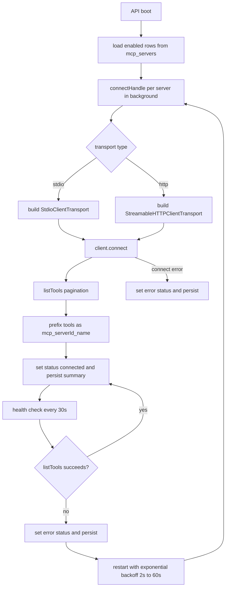
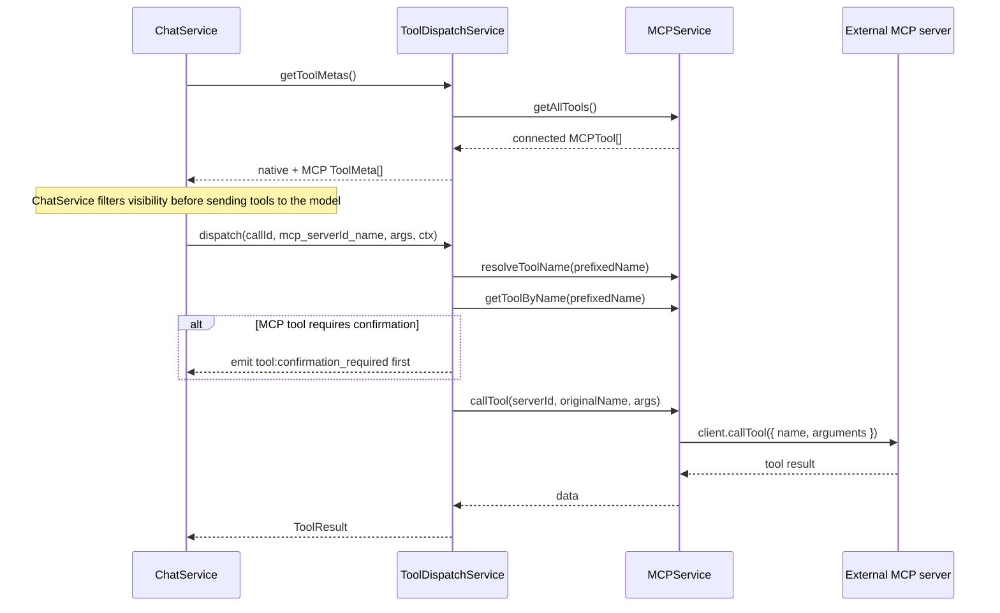
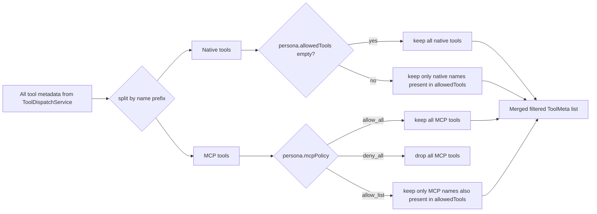

# MCP Architecture

This document describes the current MCP runtime in Kalio: how server configs are stored, how connections are established, how tools are discovered, and how those tools are filtered and dispatched.

## Main components

| Component | Current responsibility |
| --- | --- |
| `MCPService` | Owns live server handles, transport creation, connection lifecycle, tool discovery, health checks, and restart attempts |
| `MCPController` | REST API for list, add, remove, restart, and current tool listing |
| `ToolDispatchService` | Merges MCP tools into the runtime tool list and routes prefixed tool names back to `MCPService` |
| `ChatService` | Filters MCP visibility per persona before the LLM sees the tool set |
| `mcp_servers` table | Stores persistent server configuration and last known status summary |

## Data model split: persisted config vs live handle

MCP has two parallel models and they should not be confused.

| Layer | What lives there |
| --- | --- |
| Persisted row (`mcp_servers`) | `id`, `name`, `transport`, `url` or `command`, args, env vars, headers, enabled flag, last status summary |
| Live runtime handle (`ServerHandle`) | instantiated `Client`, raw transport, discovered `MCPTool[]`, restart counter, last runtime error, connection state |

Only connected handles contribute tools to the live tool list.

## Startup and server lifecycle

`MCPService` does not block Nest startup waiting for MCP servers.
Enabled rows are loaded from the database, connection attempts are kicked off in the background, and health checks continue every 30 seconds.



Important runtime details from the code:

- Tool discovery paginates through `client.listTools(...)` until there is no cursor or the 100-iteration safety cap is reached.
- `transport.onclose` marks the handle as errored and can trigger a restart attempt.
- `findAll()` returns database-backed server summaries, but the status and tool count are patched with live handle data when available.

## Tool naming and dispatch

Discovered MCP tools are not exposed to the model under their original server-local names.
Each one is rewritten into a single global namespace:

```text
mcp_<serverId>_<originalName>
```

The runtime keeps the reverse mapping in `toolNameMap`, so dispatch can resolve the prefixed name back to `{ serverId, originalName }`.



Current nuance:

- `ToolDispatchService` is already capable of applying HITL confirmation to MCP tools.
- The current discovery path sets discovered MCP tools to `requiresConfirmation: false`, so most MCP tools will run without a confirmation gate unless that metadata is changed upstream.

## Persona filtering

The filter boundary is `ChatService.filterTools(...)`, not `MCPService`.
That means MCP discovery remains global, while per-session visibility is decided only when a persona starts a turn.



This is the real behavior in code today:

- `allow_all` means all connected MCP tools are visible.
- `deny_all` means none are visible.
- `allow_list` uses concrete tool names in `persona.allowedTools`, including prefixed MCP names.

## REST surface

Current controller endpoints:

| Method | Path | Behavior |
| --- | --- | --- |
| `GET` | `/mcp/servers` | List stored servers with live status merged in when present |
| `POST` | `/mcp/servers` | Insert a row and immediately attempt connection |
| `DELETE` | `/mcp/servers/:id` | Disconnect and remove the server |
| `POST` | `/mcp/servers/:id/restart` | Force a reconnect cycle for one server |
| `GET` | `/mcp/tools` | Return only currently connected, discovered MCP tools |

## Status events

The live service pushes status snapshots through the gateway reference using:

- `mcp:server:status`

Payload includes:

- `serverId`
- `serverName`
- `status`
- `toolCount`
- optional `lastError`

This is the main push-based observability channel for MCP connectivity in the current runtime.

## Current invariants and caveats

- MCP startup must stay non-blocking for the main API boot path.
- Only connected handles should contribute tools to `getAllTools()`.
- Prefixed tool names must remain stable for persona allow-lists and chat history to stay meaningful.
- Filtering belongs at the chat/session boundary, not in the discovery layer.
- Connection errors and health-check failures must be persisted back to the DB summary, otherwise the admin UI will drift from runtime reality.