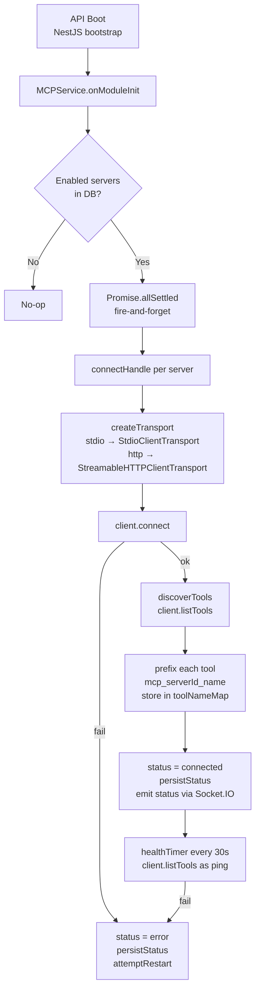
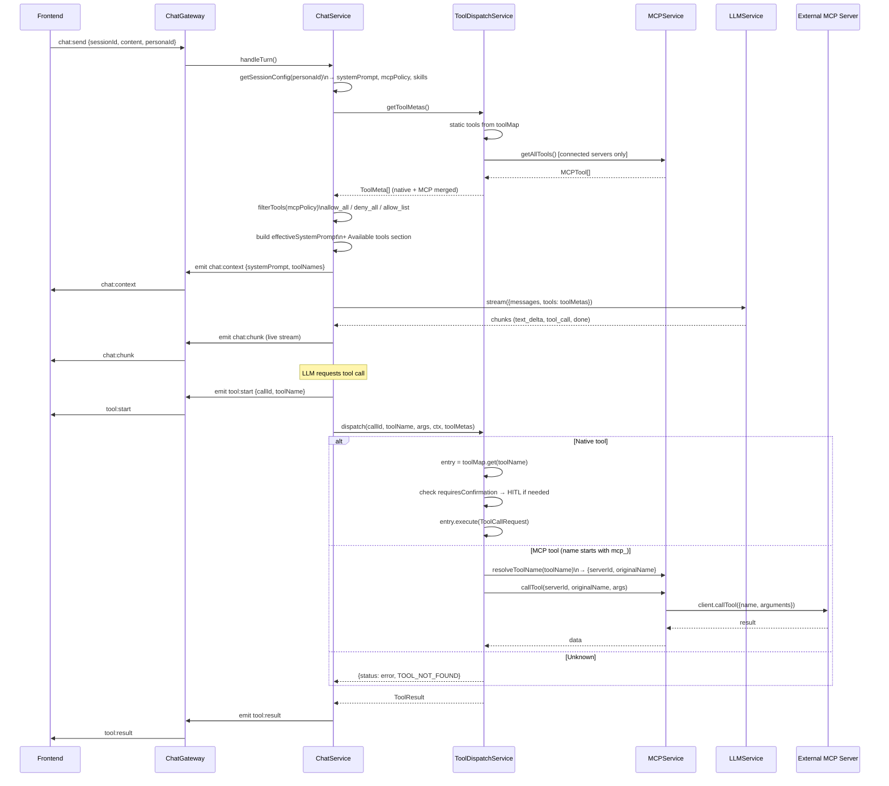
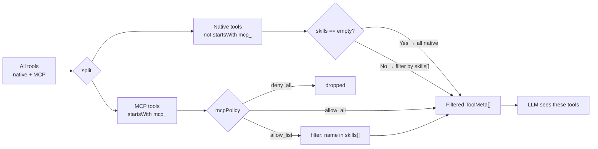

# MCP Architecture

This document describes how MCP (Model Context Protocol) integration works in Kalio — from server configuration and tool discovery through to LLM-driven tool invocation.

---

## Modules and Services

| Service / Class | Location | Responsibility |
|---|---|---|
| `MCPService` | `modules/mcp/mcp.service.ts` | MCP server lifecycle: connect, reconnect, health-check, tool discovery |
| `MCPController` | `modules/mcp/mcp.controller.ts` | REST API: `GET/POST /mcp/servers`, `DELETE /mcp/servers/:id`, `POST /mcp/servers/:id/restart`, `GET /mcp/tools` |
| `MCPModule` | `modules/mcp/mcp.module.ts` | NestJS module; exports `MCPService` |
| `MCPWatchdogService` | `modules/mcp/mcp-watchdog.service.ts` | Watchdog stub (planned Phase 8) |
| `ToolDispatchService` | `modules/chat/tool-dispatch.service.ts` | Merges native + MCP tools into a single `getToolMetas()` call; routes `dispatch()` to either native tools or MCP servers |
| `ChatService` | `modules/chat/chat.service.ts` | Orchestrates each turn: filters tools per `MCPPolicy`, builds `effectiveSystemPrompt` |
| `ChatModule` | `modules/chat/chat.module.ts` | Imports `MCPModule` — enables `@Optional()` injection of `MCPService` into `ToolDispatchService` |

---

## Wire Types (`@kalio/types`)

```ts
type MCPPolicy = 'allow_all' | 'deny_all' | 'allow_list';

interface MCPServer {
  id: ID;
  name: string;
  transport: 'stdio' | 'http';
  url?: string;
  command?: string;
  status: 'connecting' | 'connected' | 'disconnected' | 'error' | 'stopped';
  toolCount?: number;
  lastError?: string;
  createdAt: Timestamp;
}

interface MCPTool {
  name: string;          // prefixed: "mcp_{serverId}_{originalName}"
  description: string;
  serverId: ID;
  requiresConfirmation: boolean;
  parameters: Record<string, unknown>;
}

interface CreateMCPServerDto {
  name: string;
  transport: 'stdio' | 'http';
  url?: string;          // for http transport
  command?: string;      // for stdio transport
  args?: string[];
  env?: Record<string, string>;
  headers?: Record<string, string>;
}
```

### Database Schema (`mcp_servers`)

| Column | Type | Description |
|---|---|---|
| `id` | TEXT PK | nanoid assigned at `addServer()` |
| `name` | TEXT | Display name shown in UI |
| `transport` | `'stdio'\|'http'` | Transport type |
| `url` | TEXT | URL for http transport (e.g. `http://localhost:3000/mcp`) |
| `command` | TEXT | Command for stdio transport (e.g. `docker`) |
| `args` | JSON | stdio command arguments |
| `env_vars` | JSON | Environment variables for stdio transport |
| `headers` | JSON | Extra HTTP headers |
| `enabled` | BOOLEAN | Whether to connect on startup |
| `status` | TEXT | Last known connection status |
| `tool_count` | INTEGER | Number of discovered tools |
| `last_error` | TEXT | Last error message |
| `created_at` | INTEGER | Unix timestamp (ms) |

---

## Per-Persona MCP Access Strategy

`personas.mcp_policy` controls which MCP tools are visible to the LLM in any given session:

| Value | Behavior |
|---|---|
| `allow_all` | LLM sees all tools from all connected MCP servers |
| `deny_all` | LLM sees no MCP tools |
| `allow_list` | LLM sees only MCP tools whose names appear in `persona.skills[]` |

---

## Tool Naming Convention

MCP tools are **prefixed** during discovery:

```
mcp_{serverId}_{originalName}
```

Example: server `abc123` with tool `run_container` → `mcp_abc123_run_container`

The mapping is stored in `MCPService.toolNameMap: Map<prefixedName, { serverId, originalName }>`.

At dispatch time: `dispatch("mcp_abc123_run_container", ...)` → `resolveToolName()` → `callTool("abc123", "run_container", args)`.

---

## Diagrams

### Startup — tool discovery



### Per-turn — from message to tool call



### Per-persona tool filtering


