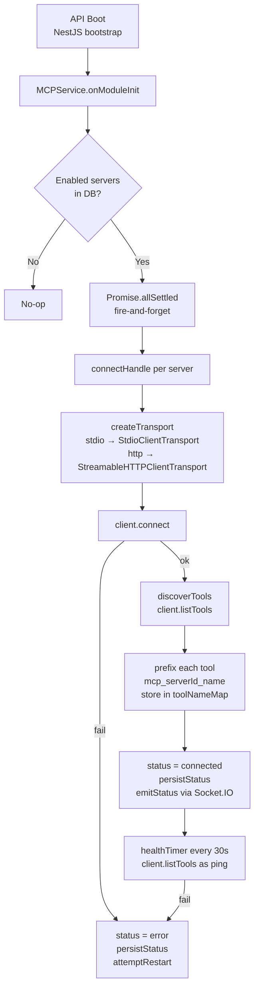
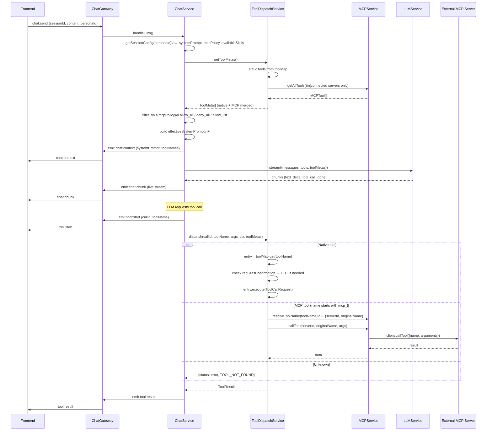

# MCP Architecture

Dokument opisuje jak działa integracja MCP (Model Context Protocol) w kalio-forever v2 — od konfiguracji serwerów przez discovery narzędzi aż po wywołanie ich przez LLM.

---

## Moduły i serwisy

| Serwis / klasa | Lokalizacja | Odpowiedzialność |
|---|---|---|
| `MCPService` | `modules/mcp/mcp.service.ts` | Lifecycle serwerów MCP: connect, reconnect, health-check, discovery |
| `MCPController` | `modules/mcp/mcp.controller.ts` | REST API: `GET/POST /mcp/servers`, `DELETE /mcp/servers/:id`, `POST /mcp/servers/:id/restart`, `GET /mcp/tools` |
| `MCPModule` | `modules/mcp/mcp.module.ts` | NestJS moduł; eksportuje `MCPService` |
| `MCPWatchdogService` | `modules/mcp/mcp-watchdog.service.ts` | Stub watchdog (Phase 8) |
| `ToolDispatchService` | `modules/chat/tool-dispatch.service.ts` | Łączy narzędzia natywne + MCP w jeden `getToolMetas()`; routuje `dispatch()` do natywnych lub MCP |
| `ChatService` | `modules/chat/chat.service.ts` | Orkiestruje turę: filtruje narzędzia wg `MCPPolicy` persony, buduje `effectiveSystemPrompt` |
| `ChatModule` | `modules/chat/chat.module.ts` | Importuje `MCPModule` — umożliwia `@Optional()` wstrzyknięcie `MCPService` do `ToolDispatchService` |

---

## Typy danych (wire contracts — `@kalio/types`)

```ts
type MCPPolicy = 'allow_all' | 'deny_all' | 'allow_list';

interface MCPServer {
  id: ID;
  name: string;
  transport: 'stdio' | 'http';
  url?: string;
  command?: string;
  status: 'connecting' | 'connected' | 'disconnected' | 'error' | 'stopped';
  toolCount?: number;
  lastError?: string;
  createdAt: Timestamp;
}

interface MCPTool {
  name: string;          // prefixowane: "mcp_{serverId}_{originalName}"
  description: string;
  serverId: ID;
  requiresConfirmation: boolean;
  parameters: Record<string, unknown>;
}

interface CreateMCPServerDto {
  name: string;
  transport: 'stdio' | 'http';
  url?: string;          // dla http
  command?: string;      // dla stdio
  args?: string[];
  env?: Record<string, string>;
  headers?: Record<string, string>;
}
```

### Schemat bazy danych (`mcp_servers`)

| Kolumna | Typ | Opis |
|---|---|---|
| `id` | TEXT PK | nanoid nadawany przy `addServer()` |
| `name` | TEXT | Nazwa przyjazna (wyświetlana w UI) |
| `transport` | `'stdio'\|'http'` | Typ transportu |
| `url` | TEXT | URL dla http transport (np. `http://localhost:3000/mcp`) |
| `command` | TEXT | Komenda dla stdio (np. `docker`) |
| `args` | JSON | Argumenty komendy stdio |
| `env_vars` | JSON | Zmienne środowiskowe (stdio) |
| `headers` | JSON | Dodatkowe nagłówki HTTP |
| `enabled` | BOOLEAN | Czy serwer łączyć przy starcie |
| `status` | TEXT | Ostatnio znany status |
| `tool_count` | INTEGER | Liczba wykrytych narzędzi |
| `last_error` | TEXT | Ostatni błąd |
| `created_at` | INTEGER | Unix ms |

---

## Strategie dostępu MCP per-persona

`personas.mcp_policy` (dodane w migracji `0005`) kontroluje jakie narzędzia MCP widzi LLM w danej sesji:

| Wartość | Zachowanie |
|---|---|
| `allow_all` | LLM widzi wszystkie narzędzia ze wszystkich połączonych serwerów MCP |
| `deny_all` | LLM nie widzi żadnych narzędzi MCP |
| `allow_list` | LLM widzi tylko te narzędzia MCP, których nazwy są w `persona.skills[]` |

---

## Konwencja nazewnictwa narzędzi

Narzędzia MCP są **prefixowane** przy discovery:

```
mcp_{serverId}_{originalName}
```

Przykład: serwer `abc123` z narzędziem `run_container` → `mcp_abc123_run_container`

Odwzorowanie przechowywane w `MCPService.toolNameMap: Map<prefixed, {serverId, originalName}>`.

Przy wywołaniu: `dispatch("mcp_abc123_run_container", ...)` → `resolveToolName()` → `callTool("abc123", "run_container", args)`.

---

## Diagramy

### Startup — discovery narzędzi



### Per-turn — od wiadomości do wywołania narzędzia



### Filtrowanie narzędzi per-persona

```mermaid
flowchart LR
    ALL[Wszystkie narzędzia\nnative + MCP] --> SPLIT{split}
    SPLIT --> NAT[Native tools\nnot startsWith mcp_]
    SPLIT --> MCPT[MCP tools\nstartsWith mcp_]

    NAT --> NS{skills == empty?}
    NS -- Yes → all native --> MERGE
    NS -- No → filter by skills[] --> MERGE

    MCPT --> MP{mcpPolicy}
    MP -- allow_all --> MERGE
    MP -- deny_all --> DROP[dropped]
    MP -- allow_list --> MF["filter: name in skills[]"]
    MF --> MERGE

    MERGE[Filtered ToolMeta[]] --> LLM[LLM sees these tools]
```

---

## Znane ograniczenia i potencjalne problemy

### 1. Brak paginacji w `discoverTools()`

`client.listTools()` zwraca paginowane wyniki (pole `nextCursor`). Obecny kod wywołuje je raz:

```ts
const result = await client.listTools();  // tylko pierwsza strona!
```

Jeśli serwer MCP zwraca >N narzędzi (limit zależy od implementacji serwera, często 50–100), **pozostałe narzędzia nigdy nie są odkrywane**.

Docker MCP Gateway ma 110 narzędzi — jeśli limit strony to ≤110, narzędzia mogą być pokazane w pełni. Ale przy dodaniu kolejnych serwerów lub wzroście liczby narzędzi problem się ujawni.

**Fix**: Zapętlić `listTools()` i podążać za `nextCursor` aż `nextCursor === undefined`.

### 2. Race condition na starcie

`onModuleInit` łączy się z serwerami **asynchronicznie w tle** (`void Promise.allSettled(...)`). Jeśli pierwsze zapytanie chat trafi do API zanim serwery MCP się połączą, `getToolMetas()` zwróci pustą listę narzędzi MCP — agent ich nie zobaczy.

**Fix**: Dla krytycznych serwerów można dodać flagę `awaitOnStartup` i await ich połączenia w `onModuleInit`.

### 3. `requiresConfirmation` nie jest sprawdzane dla narzędzi MCP

Narzędzia natywne przechodzą przez HITL check:
```ts
if (entry.meta.requiresConfirmation) { await this.awaitConfirmation(...) }
```

Narzędzia MCP **omijają ten check** — wywołują się natychmiast nawet jeśli `MCPTool.requiresConfirmation === true`.

### 4. `chat:context` emituje oryginalny `systemPrompt` zamiast `effectiveSystemPrompt`

```ts
// chat.service.ts
trackingEmit('chat:context', {
  sessionId,
  systemPrompt,         // ← brakuje sekcji ## Available tools
  toolNames: toolMetas.map(t => t.name),
});
```

Frontend nie widzi które narzędzia zostały dodane do promptu — utrudnia to debugowanie.

### 5. Docker MCP Gateway — potencjalne przyczyny niewidoczności narzędzi

Docker MCP Gateway to **agregujący serwer MCP** — wystawia narzędzia wszystkich swoich podłączonych serwerów jako jeden endpoint. Możliwe przyczyny problemów:

| Przyczyna | Diagnoza | Rozwiązanie |
|---|---|---|
| Paginacja (>100 narzędzi) | `toolCount` w UI < rzeczywista liczba | Fix #1: paginacja |
| Race na starcie | Narzędzia nie pokazują się po restarcie API | Fix #2: await connect |
| `mcpPolicy: deny_all` na personie | Narzędzia widoczne w MCP tab ale nie w chacie | Sprawdzić persona settings |
| Narzędzia MCP nie mają `requiresConfirmation` i HITL blokuje | Narzędzie nie wykonuje się | Fix #3 |
| Transport auth | Gateway wymaga nagłówków / Bearer token | Dodać `headers` w konfiguracji serwera |

**Szybka diagnoza**: po stronie API sprawdź `GET /api/mcp/tools` — jeśli zwraca 110 narzędzi, discovery działa. Następnie sprawdź `GET /api/tools` — powinien też zwracać te 110 jako MCP tools. Jeśli tak, problem leży w persona `mcpPolicy`.

---

## REST API reference

| Endpoint | Metoda | Opis |
|---|---|---|
| `/api/mcp/servers` | GET | Lista wszystkich skonfigurowanych serwerów |
| `/api/mcp/servers` | POST | Dodaj serwer (`CreateMCPServerDto`) |
| `/api/mcp/servers/:id` | DELETE | Usuń serwer i rozłącz |
| `/api/mcp/servers/:id/restart` | POST | Reconnect serwera |
| `/api/mcp/tools` | GET | Lista wszystkich odkrytych narzędzi (wszystkich serwerów) |
| `/api/tools` | GET | Lista narzędzi NATYWNYCH + MCP merged (używane przez LLM) |
