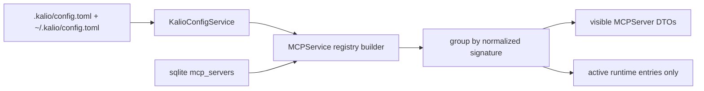
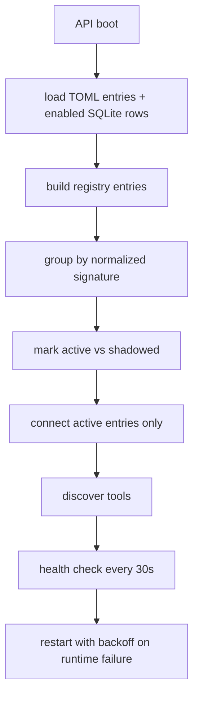
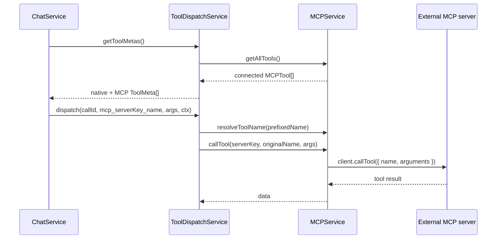

# MCP Architecture

This document describes the current MCP runtime in Kalio after the dual-store
rewire: where config is stored, how conflicts are resolved, how live runtime
handles are chosen, and how MCP tools are exposed to the rest of the app.

## Main components

| Component | Current responsibility |
| --- | --- |
| `KalioConfigService` | Loads `.kalio/config.toml` and produces the effective TOML-managed MCP config |
| `MCPService` | Builds the visible registry, resolves conflicts, owns live server handles, manages connection lifecycle, discovers tools, and restarts active servers |
| `MCPExternalImportService` | Discovers external `mcp.json` files and imports selected entries into SQLite with provenance |
| `MCPController` | REST API for list, add, remove, restart, reload-config, import discovery/apply, and current tool listing |
| `ToolDispatchService` | Merges connected MCP tools into the runtime tool list and routes prefixed tool names back to `MCPService` |
| `ChatService` | Filters MCP visibility per persona before the LLM sees the tool set |
| `mcp_servers` table | Stores SQLite-backed MCP configuration, provenance, and last known runtime status summary |

## Persistent stores vs runtime registry

Kalio now has two durable MCP config stores:

| Store | Purpose |
| --- | --- |
| `.kalio/config.toml` and `~/.kalio/config.toml` | Canonical repo/dev-managed MCP config |
| `mcp_servers` in SQLite | App-local MCP config created through Settings UI, imports, and manual add flows |

Those stores are not merged by raw `id`.

Instead, `MCPService` builds an explicit registry entry for every TOML and
SQLite row, computes a normalized config signature, groups equivalent entries,
and then applies the runtime policy:

- both stores remain visible in the API/UI,
- only one entry per conflict group becomes runtime-active,
- current winner policy is `TOML > SQLite`.


```mermaid
flowchart LR
    TOML[".kalio/config.toml + ~/.kalio/config.toml"] --> CFG["KalioConfigService"]
    CFG --> REG["MCPService registry builder"]
    DB["sqlite mcp_servers"] --> REG
    REG --> GROUP["group by normalized signature"]
    GROUP --> VIEW["visible MCPServer DTOs"]
    GROUP --> ACTIVE["active runtime entries only"]
```

## Data model split

MCP has three layers that should not be confused.

| Layer | What lives there |
| --- | --- |
| Durable TOML entry | repo/home managed config keyed by TOML table name |
| Durable SQLite row | `id`, `name`, `transport`, `url` or `command`, args, env vars, headers, origin source, enabled flag, last status summary |
| Live runtime handle (`ServerHandle`) | instantiated `Client`, raw transport, discovered `MCPTool[]`, restart counter, current connection state, current runtime error |

The public `MCPServer` DTO now carries dual-store metadata:

- `serverKey`
- `store`
- `originSource`
- `effectiveState`
- optional `conflictGroup`

That means `visible != active`: a row can be listed in Settings even when it is
not the runtime winner.

## Startup and runtime reconciliation

`MCPService` does not block Nest startup waiting for MCP servers. It reconciles
the active registry in the background and only connects active winners.


```mermaid
flowchart TD
    Boot["API boot"] --> Load["load TOML entries + enabled SQLite rows"]
    Load --> Registry["build registry entries"]
    Registry --> Group["group by normalized signature"]
    Group --> Resolve["mark active vs shadowed"]
    Resolve --> Connect["connect active entries only"]
    Connect --> Discover["discover tools"]
    Discover --> Health["health check every 30s"]
    Health --> Reconnect["restart with backoff on runtime failure"]
```

Important runtime details:

- Tool discovery paginates through `client.listTools(...)` until there is no cursor or the 100-iteration safety cap is reached.
- `findAll()` returns both TOML and SQLite entries with resolved `effectiveState`.
- `reloadManagedServers()` invalidates the TOML cache and re-runs runtime reconciliation; it does not delete SQLite rows.
- `removeServer(serverKey)` only removes SQLite entries. TOML entries must be removed from `.kalio/config.toml`.

## Tool naming and dispatch

Discovered MCP tools are exposed under a prefixed global name:

```text
mcp_<serverKey>_<originalName>
```

`serverKey` is origin-qualified, for example `toml::docs` or `sqlite::abc123`.
`toolNameMap` keeps the reverse mapping so dispatch can resolve the prefixed
name back to `{ serverId: serverKey, originalName }`.


```mermaid
sequenceDiagram
    participant Chat as ChatService
    participant Dispatch as ToolDispatchService
    participant MCP as MCPService
    participant Ext as External MCP server

    Chat->>Dispatch: getToolMetas()
    Dispatch->>MCP: getAllTools()
    MCP-->>Dispatch: connected MCPTool[]
    Dispatch-->>Chat: native + MCP ToolMeta[]

    Chat->>Dispatch: dispatch(callId, mcp_serverKey_name, args, ctx)
    Dispatch->>MCP: resolveToolName(prefixedName)
    Dispatch->>MCP: callTool(serverKey, originalName, args)
    MCP->>Ext: client.callTool({ name, arguments })
    Ext-->>MCP: tool result
    MCP-->>Dispatch: data
```

## Persona filtering

The filter boundary remains `ChatService.filterTools(...)`, not `MCPService`.
MCP discovery is global; per-session visibility is decided when a persona starts
a turn.

- `allow_all` means all connected MCP tools are visible.
- `deny_all` means none are visible.
- `allow_list` uses concrete prefixed MCP tool names in `persona.allowedTools`.

## REST surface

Current controller endpoints:

| Method | Path | Behavior |
| --- | --- | --- |
| `GET` | `/mcp/servers` | List visible TOML and SQLite entries with resolved state and live status |
| `POST` | `/mcp/servers` | Insert a SQLite row and immediately reconcile runtime |
| `DELETE` | `/mcp/servers/:serverKey` | Disconnect and remove a SQLite entry; TOML entries reject removal |
| `POST` | `/mcp/servers/:serverKey/restart` | Force a reconnect cycle for one visible entry |
| `POST` | `/mcp/servers/reload-config` | Reload TOML-managed config and reconcile runtime |
| `POST` | `/mcp/servers/import/external/discover` | Discover external MCP configs and annotate equivalent entries |
| `POST` | `/mcp/servers/import/external/apply` | Import selected entries into SQLite |
| `GET` | `/mcp/tools` | Return only currently connected, discovered MCP tools |

## External import semantics

External import is no longer a hard dedupe gate.

- Equivalent config is reported as `equivalentToExisting`.
- Equivalent entries remain selectable in the import modal.
- Import still writes to SQLite with provenance such as `cursor`, `windsurf`, `codex`, `copilot`, or `manual`.
- Conflict resolution happens later in the runtime registry, not during import discovery.

## Agent QA profile

Architecture and AgentFlow validation should use a small, explicit MCP profile:

| Server | Purpose |
| --- | --- |
| `mcp-dev-servers` | Kalio lifecycle, logs, stack health, managed service restart |
| `mcp-playwright-orchestrator` | Browser flow execution, screenshots, visual/WCAG/focus/runtime audits |

For Kalio-Forever development, manage that profile primarily through
`docs/examples/kalio-agent-qa-mcp.config.toml`. The repo `.vscode/mcp.json`
remains a legacy/manual import source, not the canonical dev path. Do not use
`~/.codex/config.toml` as evidence for Kalio MCP state.

## Status events

The live service pushes status snapshots through:

- `mcp:server:status`

Payload currently includes:

- `serverId`
- `serverKey`
- `serverName`
- `status`
- `toolCount`
- optional `lastError`

## Current invariants and caveats

- MCP startup must stay non-blocking for the main API boot path.
- Only active connected handles should contribute tools to `getAllTools()`.
- Equivalent TOML and SQLite entries must remain separately visible in API/UI.
- Conflict resolution belongs in the registry layer, not in import discovery.
- Removing TOML entries from runtime requires editing TOML, not deleting SQLite rows.
- Prefixed tool names must remain stable enough for persona allow-lists and chat history to stay meaningful.
