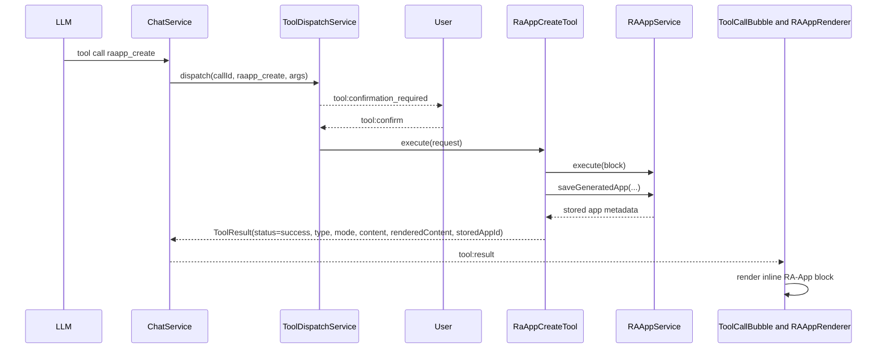
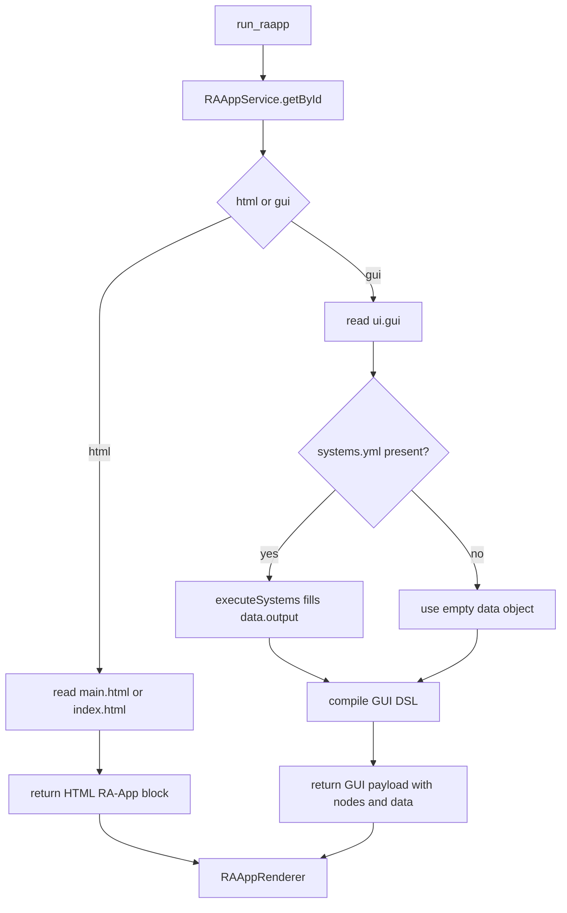
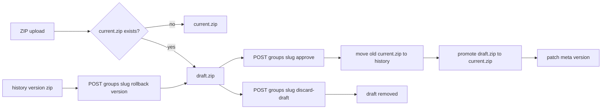
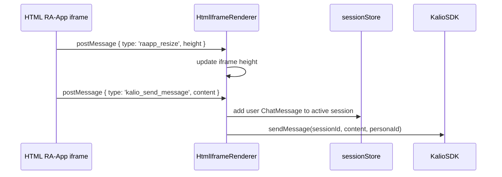
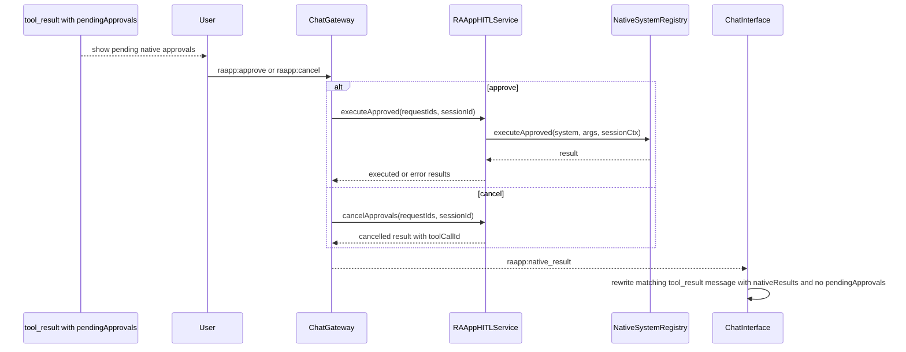

# RA-App Design - stan aktualny

Ten dokument opisuje runtime i powierzchnie renderowania RA-App w Kalio Workstation.
Jesli chcesz zrozumiec aktualny VFS-first workflow roboczy, wersjonowany release lane,
porownanie z legacy V1 oraz status testow przed merge, zacznij od
`raapp-v2-architecture-current.md`.

Jesli chcesz zrozumiec finalny workflow pracy z designem i prototypami
(`vfs_write` + `design_preview` + draft/publish lane), zacznij od
`design-tools-architecture-current.md`.

Najwazniejsze jest rozroznienie trzech rzeczy, ktore latwo pomylic:

1. inline wynik toola w historii czatu
2. zapisany app w katalogu RA-App
3. pending approvals dla natywnych efektow wykonywanych z poziomu RA-App

## TL;DR

- RA-App moze byc `html` albo `gui`.
- `raapp_create` zwraca inline blok do czatu i jednoczesnie zapisuje wygenerowany app do katalogu RA-App.
- `raapp_create` jest dzis narzedziem wymagajacym potwierdzenia, bo zapisuje stan na dysku.
- Zapisane appki zyja poza sesyjnym VFS.
- Katalog RA-App ma dwa poziomy: plaskie appki ladowane przez `RAAppService` oraz wersjonowane grupy zarzadzane przez `RAAppVersioningService`.
- Interaktywne HTML RA-App rozmawiaja z czatem przez `window.parent.postMessage(...)` przechwytywane w `HtmlIframeRenderer`.
- Natywne efekty RA-App z approvalem przechodza przez `RAAppHITLService`; manualne decyzje wracaja jako `raapp:native_result`, a auto-zatwierdzone batch-e wracaja od razu w `tool_result.nativeResults`.
- Auto-zatwierdzone `call_native` z `outputPath` sa patchowane z powrotem do `data.output` przed renderem GUI, wiec bindingi `output.*` dzialaja tak samo w trybie manual i auto.

## Co jest czym

| Powierzchnia | Owner | Gdzie zyje | Jak trafia do UI |
| --- | --- | --- | --- |
| Inline RA-App block | `ToolResult` / `tool_result` message | Historia czatu | `ToolCallBubble` -> `RAAppRenderer` |
| Stored RA-App | `RAAppService` / `RAAppVersioningService` | `RA_APPS_PATH/core` i `RA_APPS_PATH/user` | `RAAppManager` przez REST |
| Pending native approvals | `raapp_pending_approvals` + `RAAppHITLService` | DB | inline pending approvals, inline `nativeResults` dla auto-sciezki, plus `raapp:native_result` dla pozniejszych decyzji manualnych |

## Modulowy podzial odpowiedzialnosci

| Komponent | Rola |
| --- | --- |
| `RAAppService` | ladowanie ZIP-ow, czytanie `main.html` / `index.html` / `ui.gui` / `systems.yml`, inline execute dla `raapp_create` |
| `RAAppVersioningService` | grupy user-apps: `current.zip`, `draft.zip`, `history/`, rollback, approve, discard |
| `RAAppController` | REST dla listy appow, grup wersji i uploadow |
| `RAAppHITLService` | zapis pending approvals, approve/cancel, wykonanie natywnych systemow po zatwierdzeniu |
| `RAAppRenderer` | router FE: HTML iframe albo GUI DSL renderer |
| `HtmlIframeRenderer` | iframe `srcDoc`, resize bridge, fullscreen, `kalio_send_message` bridge |
| `RAAppManager` | katalog w UI, laczy stored apps z inline wynikami z historii sesji |

## `raapp_create`: create + persist + render

Aktualny flow nie konczy sie na samym renderze w czacie.
`raapp_create` robi dwa skutki uboczne:

- przygotowuje blok do inline renderu
- zapisuje wygenerowany app do katalogu user RA-App



Praktyczna konsekwencja:

- to nie jest tylko "chwilowy widget w jednej sesji"
- po sukcesie masz tez zapisany artefakt, ktory moze wejsc do katalogu RA-App

## `run_raapp`: realny runtime HTML vs GUI

`run_raapp` odpala juz zapisany app z katalogu, a sciezka zalezy od typu appki.



## HTML vs GUI - realne roznice

| Tryb | Zrodla | Render path | Dobre do | Obecne ograniczenia |
| --- | --- | --- | --- | --- |
| `html` | `main.html` albo `index.html` | iframe przez `srcDoc` | bogatsze UI, wieloekranowe flow, wlasny JS i CSS | nadal jeden dokument; brak serwowania assetow z ZIP-a pod URL-ami |
| `gui` | `ui.gui` plus opcjonalne `systems.yml` | `compileGui(...)` -> JSON wire format -> `GuiDslRenderer` | prostsze dashboardy, panele, deklaratywne widoki | to nie jest pelny frontend framework ani router |

Wazne niuanse:

- dla GUI backend moze policzyc `data.output` z `systems.yml`
- dla HTML nie ma analogicznego mechanizmu automatycznego wstrzykiwania danych do DOM
- HTML moze byc interaktywny tylko wtedy, gdy sam wykona `postMessage` do hosta

## Katalog i wersjonowanie user-apps

User RA-Appy nie musza zyc tylko jako plaskie ZIP-y.
Obecny backend obsluguje wersjonowane grupy z draftem, current i historia.



Layout na dysku dla wersjonowanej grupy:

```text
RA_APPS_PATH/user/<slug>/
  current.zip
  draft.zip
  history/
    1.0.0.zip
    1.1.0.zip
  .manifest.json
```

Aktualne endpointy kontrolera:

- `GET /ra-apps`
- `GET /ra-apps/:id`
- `POST /ra-apps/upload`
- `DELETE /ra-apps/:id`
- `GET /ra-apps/groups`
- `GET /ra-apps/groups/:slug`
- `POST /ra-apps/groups/:slug/draft`
- `POST /ra-apps/groups/:slug/approve`
- `POST /ra-apps/groups/:slug/discard-draft`
- `POST /ra-apps/groups/:slug/rollback/:version`
- `DELETE /ra-apps/groups/:slug`
- `POST /ra-apps/groups/slug`

## HTML iframe bridge: resize + user answer -> chat

`HtmlIframeRenderer` robi cos wiecej niz zwykle osadzenie `srcDoc`.
Wstrzykuje mostek do resize i nasluchuje wiadomosci z iframe.



To oznacza, ze interaktywny HTML RA-App nie potrzebuje nowego backendowego API do wyslania odpowiedzi do czatu.
Wystarczy ten kontrakt:

```javascript
window.parent.postMessage({ type: 'kalio_send_message', content: 'user answer' }, '*');
```

## Pending approvals i natywne efekty

Inline RA-App moze wygenerowac pending approvals dla natywnych systemow.
To nie jest wykonywane bezposrednio w iframe. Najpierw approval trafia do bazy, a potem UI wysyla decyzje przez socket.

Jest tez druga sciezka: jezeli globalny HITL policy auto-zatwierdzi caly batch,
backend nadal zapisuje approvale, ale od razu wykonuje wszystkie natywne wywolania,
zwraca `nativeResults` w tym samym `tool_result` i aplikuje `outputPath` patch-e
z powrotem do `data.output` jeszcze przed `raapp.execute(...)`.
Frontend nie widzi wtedy pending approvals, ale moze pokazac wykonane wyniki inline.



Wazne szczegoly z implementacji:

- approvals sa zapisywane w tabeli `raapp_pending_approvals`
- approve wykonuje realny natywny system dopiero po zatwierdzeniu
- cancel nie wykonuje efektu, ale zwraca wynik do UI tak, zeby bubble mogla sie zaktualizowac
- `ChatInterface` aktualizuje istniejacy `tool_result` message zamiast tworzyc nowy typ historii
- auto-sciezka `resolvePendingApprovals()` zwraca jednoczesnie `nativeResults` i `outputPatches`; `RunRaAppTool` oraz `RaAppExecuteDslTool` musza zastosowac patch-e przed finalnym renderem GUI

## Co jest prawda dzis, a co nie

Prawda dzis:

- RA-App catalog nie jest podpiety pod sesyjny VFS.
- `RAAppManager` korzysta z REST katalogu, ale jednoczesnie potrafi pokazac inline appki znalezione w historii sesji.
- `RAAppService` laduje tylko znane pliki: `meta.yml`, `main.html` lub `index.html`, `ui.gui`, `systems.yml`.
- wersjonowanie dotyczy user-apps; core apps pozostaja read-only.

Nieprawda dzis:

- RA-App nie jest pelnym bundlerem ani serwerem assetow.
- GUI DSL nie jest odpowiednikiem Reacta ani wielostronicowego frameworka.
- HTML RA-App nie ma automatycznego dostepu do host filesystem ani session VFS.
- inline wynik `raapp_create` nie jest tym samym co wersjonowana grupa w katalogu, nawet jesli oba reprezentuja ten sam pomysl na appke.