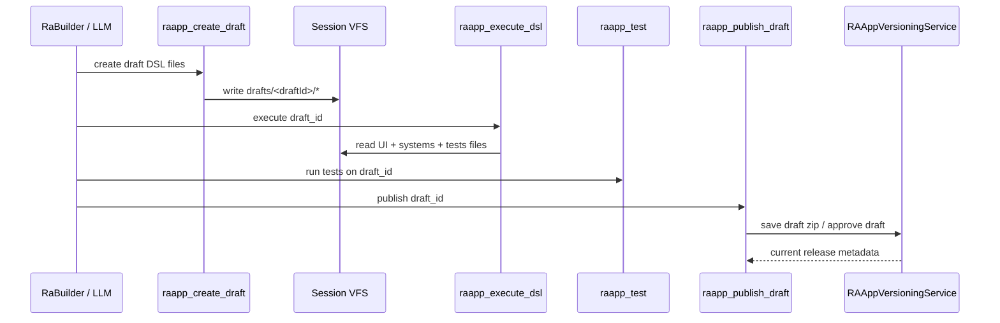

# RA-App V2 Architecture - current flow

This document describes the current RA-App model after the VFS-first draft/edit/publish work.
It answers four practical questions:

1. What is the current end-to-end flow?
2. How close is it to legacy V1, and what changed?
3. Do we already have a manager and enough agent guidance to avoid tool confusion?
4. Is the home/catalog surface already unified around latest releases without duplicates?

## TL;DR

- Raw working copies now live in session VFS under `drafts/<draftId>` or `drafts/edit-<appId>`.
- Publishing no longer edits a released ZIP in place. `raapp_publish_draft` builds a ZIP from the VFS draft and hands it to `RAAppVersioningService`.
- Released grouped apps live under `data/ra-apps/user/<slug>/current.zip`, optional `draft.zip`, and `history/*.zip`.
- The actual manager already exists. `RAAppManager` has three sections: Catalog, Work, and Session.
- Landing page and manager already share the same catalog bucketing helper, so grouped current releases are shown once and draft/history IDs are filtered out of the flat user list.
- Agents are much less likely to get lost now because persona prompts split launch, build, and design workflows explicitly.
- The main remaining architectural split is no longer the storage engine. One-shot `raapp_create` now also persists through `RAAppVersioningService.saveAsDraft(...)`; the open question is workflow semantics, because draft-first flows keep an explicit review/publish boundary while `raapp_create` can still create a durable catalog artifact directly from chat.

## The current model

There are now three distinct RA-App states, and treating them as different things is the main conceptual improvement over the older model.

| State | Purpose | Storage | Main entry points |
| --- | --- | --- | --- |
| Raw working copy | Editable draft, per-session iteration | `sessions/<sessionId>/files/drafts/<draftId>/...` | `raapp_create_draft`, `raapp_edit`, `vfs_write`, `design_preview` |
| Released grouped app | Stable publishable catalog version | `data/ra-apps/user/<slug>/current.zip`, `draft.zip`, `history/*.zip` | `raapp_publish_draft`, versioning endpoints, `run_raapp` |
| Generated draft artifact | One-shot saved result from chat | versioned user-app draft managed by `RAAppVersioningService` | `raapp_create` |

That separation is the core of V2.

## End-to-end flows

### 1. Build a new draft-first RA-App

Properties of this flow:

- Raw authoring happens in session-scoped files, not in release storage.
- `raapp_execute_dsl` reads directly from VFS and returns a rendered HTML/GUI block.
- `raapp_test` can target either `draft_id` or a stored app `id`.
- `raapp_publish_draft` is the only place that promotes the raw draft into the release lifecycle.

### 2. Edit an already published app

`raapp_edit` no longer mutates a release ZIP.

Current behavior:

1. Read the published app source through `RAAppService.getSourceFiles()`.
2. Materialize or refresh a working copy in `drafts/edit-<appId>/` inside the active session VFS.
3. Iterate there with `raapp_execute_dsl` / `raapp_test`.
4. Publish with `raapp_publish_draft`.

That is the critical behavioral break from legacy V1. A release is now branched into a working copy before edits happen.

### 3. Prototype HTML pages before deciding to publish

For raw website or page work, the preferred path is even lighter than RA-App drafting:

1. Write HTML/CSS/JS into VFS with `vfs_write`.
2. Render it inline with `design_preview`.
3. Iterate in place until the user wants a publishable artifact.
4. Only then convert or publish as an RA-App.

This flow is stronger than the older inline-only HTML path because VFS previews now render by served path, not only by `srcDoc`, so relative assets resolve correctly.

### 4. Run an existing released app

For users, the launch path is simpler than the build path:

1. Catalog or landing page surfaces expose the current release.
2. RaConsierge resolves the app via `list_raapps`.
3. RaConsierge runs it via `run_raapp`.
4. The frontend renders the returned GUI/HTML block in chat.

## Runtime and storage responsibilities

| Component | Responsibility now |
| --- | --- |
| `RAAppService` | Load stored apps, execute GUI/HTML payloads, keep backward-compatible standalone ZIP loading |
| `RAAppVersioningService` | Grouped release lifecycle: current, draft, history, rollback |
| `raapp_create_draft` | Save raw DSL files into session VFS |
| `raapp_edit` | Branch a published release into a VFS working copy |
| `raapp_execute_dsl` | Run a VFS draft through systems/UI rendering |
| `raapp_test` | Run `tests.yml` against either a draft or a stored release |
| `raapp_publish_draft` | Convert a VFS working copy into the grouped release lifecycle |
| `design_preview` | Inline preview for VFS HTML files before publication |
| `RAAppManager` | Unified UI surface for Catalog, Work drafts, and Session inline apps |
| `LandingPage` | Home tiles for current grouped releases, core apps, and standalone apps |

## V2 vs legacy V1

The new system is not a total rewrite. The DSLs and executor model are intentionally still recognizable.

### What stayed the same

- GUI DSL still compiles to the same wire format and renders through `RAAppRenderer`.
- `systems.yml` still drives ECS/effect execution.
- Stored releases are still ZIP-based artifacts.
- `run_raapp` is still the main runtime tool for launching stored apps.

### What changed materially

| Area | Legacy V1 | Current V2 |
| --- | --- | --- |
| Editing published apps | Edit the stored ZIP directly | Branch to VFS working copy first |
| Draft isolation | Weak / artifact-oriented | Session-scoped raw files under VFS |
| Publish boundary | More implicit | Explicit `raapp_publish_draft` step |
| HTML preview | Inline-oriented, weaker asset story | Served VFS paths with relative assets working |
| Manager UX | More catalog-oriented | Catalog + Work + Session in one surface |
| Agent guidance | Easier to misuse generic RA-App tools | Persona prompts explicitly split launch/build/design |

### What is still legacy-ish

The migration is not blocked by the old flat-ZIP write path anymore. `raapp_create` now writes a generated archive through `RAAppVersioningService.saveAsDraft(...)`, so the remaining caveat is workflow, not storage.

- draft-first flows still keep an explicit review and publish boundary
- `raapp_create` still creates a durable catalog artifact directly from chat
- the open policy question is whether delegated child agents should ever be able to create that durable artifact without explicit user approval

## Manager and agent guidance

### Do we already have a manager?

Yes.

`RAAppManager` is already the live manager surface. It has:

- `Catalog`: grouped current releases, core apps, standalone user apps
- `Work`: raw drafts discovered from active-session VFS
- `Session`: inline RA-App blocks found in current chat history

The `Work` section already exposes direct actions for:

- test draft
- run draft
- publish draft
- open VFS

So the manager is not missing. It already reflects the new architecture.

### Will agents still get confused?

Much less than before, because the persona layer now encodes the intended tool paths explicitly.

Current split:

- `ra-apps` / RaConsierge: `list_raapps` -> `run_raapp`
- `builder` / RaBuilder: `raapp_create_draft` or `raapp_edit` -> `raapp_execute_dsl` -> `raapp_test` -> `raapp_publish_draft`
- `designer`: `vfs_write` -> `design_preview` loop for HTML-first prototype work

That is a real improvement over the older situation where creation, editing, preview, and launch could all collapse into one vague RA-App path.

Residual confusion risk still exists in one place: generic one-shot `raapp_create` can create a durable versioned draft directly from chat instead of forcing the explicit draft-review-publish lane. That makes it easier for a generic agent to create an app that is valid but not yet aligned with the stricter review workflow.

## Home page and duplicate control

The home page is already partially unified with the manager.

Both `LandingPage` and `RAAppManager` use the same `bucketCatalogApps()` helper.

What that helper does today:

- removes grouped current IDs from the flat user list
- removes grouped draft IDs from the flat user list
- removes grouped history IDs from the flat user list
- keeps core apps separate
- keeps truly standalone user apps separate

What the landing page adds on top:

- it builds tiles from grouped `current` releases, not from history or draft entries
- it merges grouped current + core + standalone
- it applies a final `seen` set by tile ID to prevent duplicates

So for grouped versioned apps, the home page already shows the newest current version and suppresses duplicate flat entries.

The remaining caveat is architectural, not UI logic: standalone generated apps from `raapp_create` are still a separate persistence lane, so they appear as standalone user apps until or unless they are migrated into grouped versioned storage.

## Cleanup decision: `RAAppService.updateApp()`

It can be removed, and in this branch it was removed.

Reasoning:

- there were no active TypeScript call sites
- the intended edit flow is now `raapp_edit` -> VFS working copy -> `raapp_publish_draft`
- leaving `updateApp()` in place would preserve an obsolete ZIP-in-place edit model next to the new VFS-first one

This removal does not finish the entire V1-to-V2 migration, but it does remove one of the clearest dead branches from the old model.

## Verification status before merge

### Vitest

- Backend full Vitest: passing (`102` files, `1277` tests)
- Frontend full Vitest: passing (`37` files, `369` tests)

One backend spec needed stabilization during this pass: `effects-processor.service.spec.ts` had a file-wide VM timeout mock of `7ms`, which was fine in isolation but flaky under full-suite load. The fix was to use a normal timeout by default and scope the `7ms` override only to the single assertion that verifies timeout propagation.

### Playwright / E2E

I ran the existing RA-App-focused Playwright slice in this pass.

Passing:

- landing page RA-App rendering/navigation smoke
- tool registry smoke for RA-App tools
- ECS socket snapshot smoke

Failing:

- `tests/ac-raapp-ecs-live.spec.ts` still fails in `run_raapp returns GUI block for Visual Calculator`
- the failure is not a registry problem; the chat input stays disabled and never re-enables after launch

So the honest status is: unit/integration coverage is green, but RA-App E2E is not fully green yet.

### Manual MCP / browser validation

No fresh manual MCP validation was done in this pass.

This pass covered:

- full backend Vitest
- full frontend Vitest
- existing RA-App Playwright specs

It did not include a new manual browser walkthrough or a new MCP-specific manual scenario.

## Remaining architectural gap

If we want the model to be fully unified, the next migration target is clear:

- route one-shot `raapp_create` outputs into the same grouped release manager, or at least into a compatible promotion path

Until that happens, the system is best described as:

- VFS-first for serious authoring and published edits
- versioned for grouped releases
- still partially legacy for one-shot auto-saved generated apps