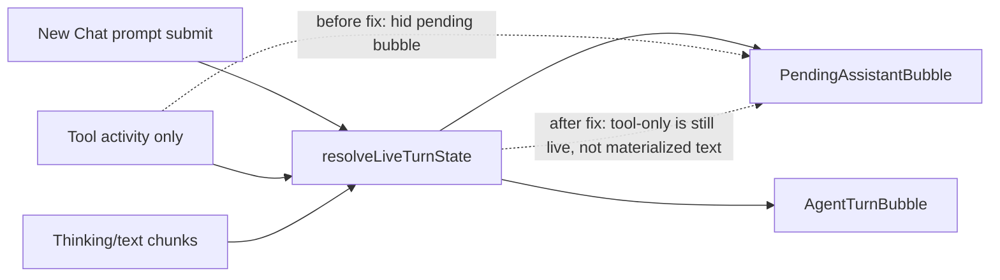

# FE Live Shell Pending Bubble Proof

Date: 2026-06-14

## Result

- Fixed the FE live-shell regression where a tool-only active turn could suppress the optimistic assistant bubble before any user-facing text appeared.
- Kept the `New Chat` shell aligned with current React guidance: one explicit live-turn model instead of multiple contradictory booleans deciding whether the UI is still running.
- Demoted manual-stop `INTERRUPTED` logging from red `console.error` noise to neutral debug/group logging in both the FE socket hook and `@kalio/sdk`.
- Removed the last global `isStreaming` leaks from `CanvasPanel`, `RAAppRenderer`, and `ConversationManagerPanel`; those views now derive state from the session-scoped live-turn model or explicit runtime signals instead of a cross-session flag.
- Tightened the session renderability contract so legacy architecture placeholder branches do not surface as real conversations without transcript or live runtime evidence, while explicit `sessionSurface: 'conversation-branch'` still remains visible immediately.
- Added an accessibility fix in the conversation header so the icon-only copy action now exposes `aria-label="Copy chat to clipboard"` and no longer shows up as an unnamed button in browser audits.
- Added a reusable repo-side `ast-grep` audit pack for FE shell/workflow regressions in `tools/ast-grep/fe-shell-audits/` and updated the repo skill guidance with the official ast-grep rule/scan references.
- Added regression coverage for:
  - tool-only live turns preserving the optimistic pending bubble,
  - first-prompt stop visibility from the `New Chat` launch form,
  - `INTERRUPTED` and cancelled tool-result logging not surfacing as runtime errors,
  - session-scoped live-state behavior in canvas / RA-App / activity manager,
  - legacy placeholder branch hiding without regressing explicit conversation branches.

## Architecture Shape

## Verification

- Web research:
  - React state-structure guidance: [Choosing the State Structure](https://react.dev/learn/choosing-the-state-structure)
  - React shared ownership guidance: [Sharing State Between Components](https://react.dev/learn/sharing-state-between-components)
  - Socket reconnect guidance: [Connection state recovery](https://socket.io/docs/v4/connection-state-recovery/)
- Focused FE gate:
  - `corepack pnpm --filter kalio-web exec vitest run src/features/chat/liveTurnState.test.ts src/features/chat/ChatInterface.test.tsx`
  - `corepack pnpm --filter kalio-web exec vitest run src/store/agentStore.spec.ts src/features/chat/hooks/useChatSocketEvents.queued.test.ts`
  - `corepack pnpm --filter kalio-web exec vitest run src/features/chat/liveTurnState.test.ts src/features/chat/ChatInterface.test.tsx src/features/chat/hooks/useChatSocketEvents.reconnect.test.ts src/features/chat/hooks/useChatSocketEvents.queued.test.ts src/store/agentStore.spec.ts`
  - `corepack pnpm --filter kalio-web exec vitest run src/features/chat/liveTurnState.test.ts src/features/chat/ChatInterface.test.tsx src/services/kalioSdkLogging.test.ts src/store/agentStore.spec.ts src/features/chat/hooks/useChatSocketEvents.queued.test.ts`
  - `corepack pnpm --filter kalio-web exec vitest run src/features/sessions/sessionRenderableFilter.test.ts src/features/raapp/RAAppRenderer.test.tsx src/features/sessions/ConversationManagerPanel.test.tsx src/features/chat/CanvasPanel.test.tsx src/features/chat/liveTurnState.test.ts src/features/chat/ChatInterface.test.tsx`
  - `corepack pnpm --filter kalio-web exec tsc --noEmit`
  - `corepack pnpm --filter @kalio/sdk run typecheck`
- Manual browser proof on dev stack `http://127.0.0.1:5188`:
  - verified `pending-agent-bubble` appears after the first prompt from `New Chat`,
  - verified `chat-stop-btn` is visible in the same pre-chunk live state.
- Follow-up Playwright MCP browser pass on the current `5188` stack:
  - could reproduce `Talk -> New`,
  - but the live page manifest still did not expose the launch-form controls after clicking `New`,
  - so final demo proof remains blocked on a dev-stack restart or confirmation that the hot-reload stack is not serving stale UI.
- Refreshed QA proof on an isolated random-port stack:
  - `node scripts/stack-manager.mjs start --backend-port 0 --frontend-port 0`
  - assigned frontend `52589`, backend `52588`
  - verified `Talk -> New -> welcome form -> Run` transitions cleanly into the normal chat shell without a blank panel,
  - verified the post-launch page manifest no longer reports the unnamed copy button,
  - evidence bundle still reports medium visual-layout warnings on intentionally truncated sidebar badges/activity chips.

## Evidence

- Playwright Orchestrator session: `edef1888-ba59-4bd6-87b7-79e5fdd5ec71`
- Snapshot artifact:
  - `C:\Projekty\mcp-playwrigh-master\.local-data\mcp-playwright-orchestrator\snapshots\edef1888-ba59-4bd6-87b7-79e5fdd5ec71--94a822ad-b2ef-4bdf-b511-1be42ac4e129--fe-shell-live-bubble-proof--document\2026-06-14T21-08-18-984Z-684b0acb-0735-4c23-8ecc-27b04c8ca9b6.png`
- Playwright Orchestrator session: `955ea9df-eb5b-433f-b2b4-a5b94dd160d8`
- Random-port QA snapshot artifact:
  - `C:\Projekty\mcp-playwrigh-master\.local-data\mcp-playwright-orchestrator\snapshots\955ea9df-eb5b-433f-b2b4-a5b94dd160d8--a3d5a935-d822-4ebc-9e4d-f91ac66dc2ed--fe-new-chat-random-port-proof--document\2026-06-14T22-36-09-743Z-894195c7-bbe1-414b-aa89-3a17f6500029.png`

## Live Readiness

- The specific missing-pending-bubble regression is fixed and manually verified.
- The `INTERRUPTED` console-noise root cause is fixed in code and covered by regression tests.
- `New Chat` launch-form -> chat-shell path is now re-proven on an isolated QA stack, so that part is no longer blocked by stale dev HMR state.
- Full demo readiness still needs one equivalent workflow-shell proof on isolated ports, not just single-chat launch.

## Remaining Risk

- The earlier `5188` hot-reload confusion was real enough that manual QA should continue using isolated random-port stacks rather than the user's dev ports.
- The new evidence bundle still flags clipped/truncated sidebar chips; this looks like intentional overflow handling, but it deserves a visual judgment before demo.
- Follow-up workflow continuity, workflow launch-form parity, and reload/reconnect still need one more real-browser pass before calling the FE shell fully demo-ready.
