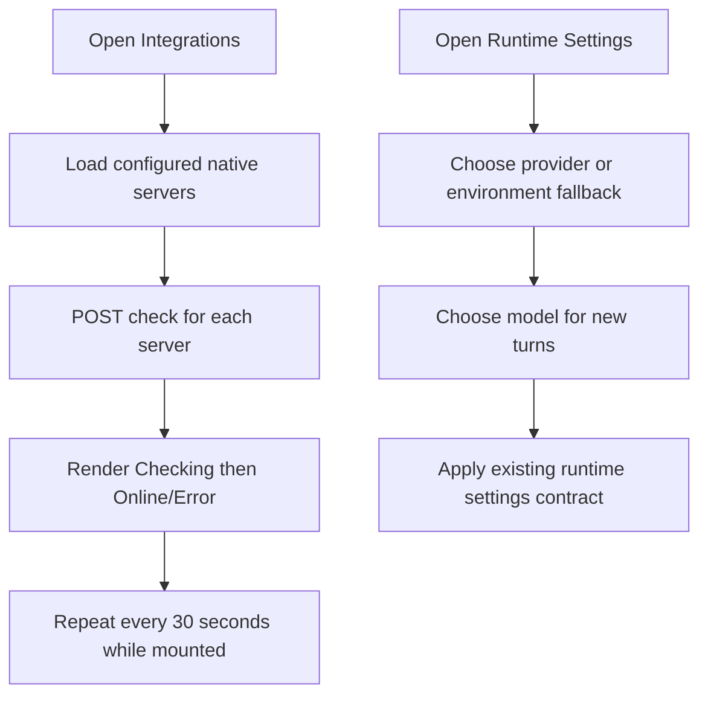

# 2026-08-22 — Runtime settings and native integration check UX

## Purpose

Make the Kalio settings and chat surfaces explain the active runtime clearly, while removing the need to manually start the native Codex status check.

## Scope and constraints

- Keep the native integration policy and backend contracts unchanged.
- Keep the mock runtime explicit; do not present it as ChatGPT or Codex.
- Preserve unrelated dirty worktree changes.
- Verify the local development surface through Chrome at `http://localhost:5188/` and backend calls through the existing dev stack.

## Acceptance criteria

1. Entering Integrations automatically checks each configured native app server and repeats the check while the page is open.
2. The Integrations page presents compact provider cards, with technical details collapsed.
3. Chat headers show a friendly provider/model label and no raw `mock` label for Codex sessions.
4. Runtime Settings exposes an explicit provider selector, a model selector, and honest generation-parameter scope.
5. New Chat does not repeat routing/runtime labels in its footer.

## Starting evidence

The Integrations page previously required a manual `Check` action and exposed process, profile, and policy implementation details inline. Chat headers displayed the raw model value. Runtime Settings showed duplicate provider context and had no provider selector.

## Investigation or execution method

- Inspected the existing React settings/runtime components, their tests, and the backend-facing endpoints.
- Used `rg` after the VS Code LSP bridge was unavailable in the active tool context.
- Implemented the smallest frontend slice, then verified unit behavior, type safety, production build output, and the rendered browser states.

## Root causes and decisions

- The native page loaded status but did not chain a health check; it now loads the configured integrations, checks each one sequentially, and repeats every 30 seconds while mounted. The manual action remains as `Recheck`.
- Runtime provider selection was only available indirectly from the provider-management page. Runtime Settings now activates a saved credential or the environment fallback directly, then exposes its model.
- Generation settings are still backed by the existing shared endpoint. The UI therefore labels them as defaults for the selected runtime and states that providers such as Codex may ignore unsupported fields; no fake per-provider persistence was added.
- `mock` is rendered as `mock · environment` in Runtime Settings and as `Local LLM` when used as a generic chat runtime; Codex sessions resolve to `Codex`.

## Implementation sequence

1. Replaced raw chat runtime text with a provider/model badge and removed the redundant New Chat routing footer.
2. Simplified Native app servers and VS Code integration cards, moving diagnostics under `Details`.
3. Added mount-time and 30-second native integration checks, optimistic `Checking` state, and a regression test.
4. Added provider selection to Runtime Settings and kept model input usable while model discovery is pending.
5. Ran focused tests, typecheck, build, and Chrome checks at desktop and 390 px widths.

## Flow diagram

## Files and boundaries changed

Task-owned frontend changes were committed in `24486dd` (`Polish runtime and native integration settings UX`), covering chat labels, New Chat, Integrations, Runtime Settings, and their focused tests. The backend and other pre-existing dirty paths were not staged by this slice.

## Verification evidence

| Boundary | Result | Evidence |
| --- | --- | --- |
| Focused frontend tests | PASS | `corepack pnpm --dir apps/kalio-web exec vitest run ...` — 5 files, 86 tests passed |
| Native integration regression | PASS | 4 tests passed, including automatic check on mount |
| Frontend typecheck | PASS | `corepack pnpm --filter kalio-web run typecheck` |
| Frontend production build | PASS | `corepack pnpm --filter kalio-web run build` |
| Desktop browser | PASS | Chrome DOM/screenshot showed `Codex`, `Online`, `Connected`, compact Details, and `Codex · gpt-5.6-luna` |
| Mobile browser | PASS | Chrome at 390×844 showed the compact Integrations card without horizontal overflow in the rendered surface |
| Browser console | PASS | Chrome warning/error log query returned `[]` |

## Caveats and inconclusive checks

- A full-page CDP screenshot timed out; a normal viewport screenshot succeeded for both desktop and mobile evidence.
- The local dev stack reported Codex online and connected; this does not prove production availability or restart recovery.
- The backend still supports mock defaults in development/install paths. This slice does not change production provider boot policy or add provider-specific generation-settings storage.

## Remaining boundary and production closure

- `[P1] Required before prod`: decide and implement the production boot policy so mock is available only through an explicit opt-in, with a clear first-run configuration path.
- `[P2] Recommended`: add provider-specific generation settings only after the backend contract supports them; keep unsupported Codex controls visibly disabled or documented.
- No production deployment or paid/live LLM run was performed in this slice.
