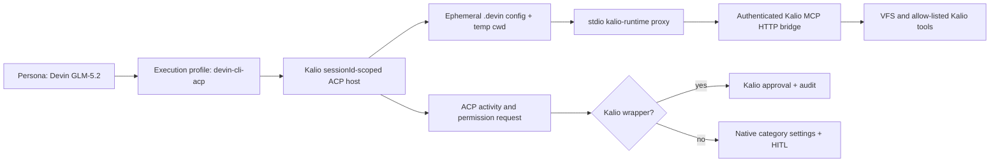

# Devin ACP MCP tool-call close — 2026-08-23

## Purpose

Close the Devin ACP vertical slice for the provider/profile/persona model and prove that Kalio MCP calls are executed through the bridge independently of Devin's native filesystem, web, and terminal settings.

## Scope and constraints

- Project: `kalio-forever`
- Repository: `E:\Projekty\kalio-forever`
- Runtime canary: `E:\Projekty\test-kalio`
- Provider profile: `devin-local-glm-5-2` (`devin-cli-acp`, model `glm-5-2`)
- Native Devin categories stayed `filesystem=false`, `web=false`, `terminal=false`.
- No deploy or production mutation was performed.
- Unrelated worktree changes and deploy archives were not staged.

## Acceptance criteria

1. Each bridge-enabled Kalio session is isolated to its own Devin ACP host and scoped MCP configuration.
2. Devin receives a Kalio MCP server through a portable stdio proxy and can list and call Kalio tools.
3. A Kalio MCP wrapper is accepted without enabling native provider tools.
4. The approval audit identifies the wrapped Kalio tool instead of recording a null tool name.
5. Provider/profile/persona routing remains compatible with multiple sessions and models.

## Starting evidence

The installed Devin CLI was authenticated, ACP-capable, and exposed `glm-5-2` and `swe-1-7`, but reported version `3000.2.17` and no usable HTTP MCP capability. The existing implementation therefore could not rely on the ACP `session/new` MCP list alone.

## Investigation and execution method

Official Devin documentation was checked for MCP transports, local configuration precedence, and ACP startup configuration. The implementation was validated against the installed CLI rather than assuming the newer documentation behavior. An ephemeral project overlay is created per bridge-enabled host, with both the legacy `config.local.json` shape and the newer dedicated `mcp_config.local.json` shape. The child process starts in that temporary project directory and the ACP session still receives the real project cwd.

## Root causes and decisions

- Observed: Devin `3000.2.17` advertises ACP but does not reliably consume per-session HTTP MCP entries. Decision: use the compiled Kalio stdio proxy and an ephemeral Devin project configuration for this installed version.
- Observed: one shared model host would mix bridge credentials and allow-lists across Kalio sessions. Decision: key bridge-enabled hosts by `model + sessionId`; non-bridge hosts retain the normal model scope.
- Observed: ACP permission requests for `mcp_call_tool` can omit the tool name while the activity title contains `Calling <tool> from kalio-runtime`. Decision: merge activity metadata and infer the tool name from that bounded title format for auditable approval.
- Observed: native tool settings are independent of the Kalio MCP wrapper. Decision: accept only the named Kalio wrapper automatically; native categories still use the existing settings and HITL policy.

## Implementation sequence

1. Added per-session Devin host scoping and ephemeral `.devin` MCP configuration.
2. Routed the bridge through the compiled stdio proxy with server name `kalio-runtime`.
3. Injected a concise Kalio system policy directing the model to `mcp_list_tools` and `mcp_call_tool` and distinguishing native tools.
4. Correlated ACP tool activity with permission requests and recorded the resolved Kalio tool name.
5. Reset the host registry after runtime verification while preserving the settings state.

## Flow diagram

## Files and boundaries changed

Owned source and tests:

- `apps/kalio-api/src/modules/agent-runtime/devin-cli-acp.host.ts`
- `apps/kalio-api/src/modules/agent-runtime/devin-cli-acp.llm-source.ts`
- `apps/kalio-api/src/modules/agent-runtime/devin-cli-acp.llm-source.spec.ts`
- `apps/kalio-api/src/modules/agent-runtime/devin-cli-config.ts`
- `apps/kalio-api/src/modules/agent-runtime/devin-cli-config.spec.ts`
- `apps/kalio-api/src/modules/agent-runtime/devin-cli-mcp-bridge.ts`
- `apps/kalio-api/src/modules/agent-runtime/devin-native-tools.ts`
- `apps/kalio-api/src/modules/agent-runtime/devin-native-tools.spec.ts`
- `apps/kalio-api/src/common/kalio-mcp-bridge-config.ts`

## Verification evidence

### Implemented

- Provider/profile/persona routing uses the existing `ExecutionProfile` and persona selection; no parallel provider architecture was added.
- Native settings endpoint remained `filesystem=false`, `web=false`, `terminal=false`; the Kalio bridge remained enabled.

### Test-verified

- Focused Vitest: 5 files, 15 tests passed.
- API typecheck: `pnpm.cmd exec tsc --noEmit`, exit code 0.
- API build: `pnpm.cmd run build`, TSC found 0 issues and SWC compiled 631 files.
- `git diff --check`: no whitespace errors.

### Runtime-verified

- Live GLM-5.2 canary on `E:\Projekty\test-kalio` used a bridge-enabled session and produced audit evidence for:
  - `mcp_list_tools` completed for `kalio-runtime`;
  - `mcp_call_tool` completed for `vfs_list` through the same server;
  - bridge transport `stdio`, `toolCount=62`, `httpMcpSupported=false`;
  - native categories all disabled.
- After the canary, the local settings PATCH reset the registry. A fresh status read reported `authenticated=true`, `acp=true`, models `glm-5-2`/`swe-1-7`, and `hostCount=0`.

### Saved and committed boundary

This note and the scoped source changes are ready for one feature commit. No deployment or production proof is claimed.

## Caveats and inconclusive checks

- The installed CLI remains `3000.2.17`; the official update installer was not executed. The current path is a compatibility adapter for that build, not proof that every newer Devin build has the same behavior.
- Native Devin filesystem/web/terminal enablement was not re-run as a live write-capable canary in this slice; the settings remain deny-by-default and the negative native-policy/unit coverage is retained.
- The stdio proxy introduces one Devin process per bridge-enabled Kalio session. This is intentional isolation, but startup cost and process limits belong to the separate runtime-profile work.

## Remaining boundary and production closure

- RAD-127 (bridge approval separated from native Devin tools) is proven for the installed local Devin path after this change.
- RAD-128 (versioned cross-provider context), RAD-129 (scoped external/public gateway), RAD-130 (project runtime profiles and health checks), and RAD-114 (persona tool override completeness) remain separate follow-ups.
- Required before production: scoped-token lifecycle/rate limiting/revocation and a production security gate for any external bridge. Localhost runtime evidence is not production evidence.
