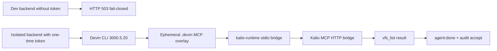

# Devin CLI 3000.5 MCP compatibility — 2026-08-23

## Purpose

Diagnose the reported Devin MCP 503 and prove the current host-local Devin integration through the Kalio bridge without enabling native filesystem, web, or terminal tools.

## Scope and constraints

- Repository: `E:/Projekty/kalio-forever`.
- Target runtime: installed Devin CLI `3000.5.20`, model `glm-5-2`, isolated rebuilt Kalio API on port `3026`.
- Real-project canary: `E:/Projekty/test-kalio`, read-only `vfs_list`.
- The user's global Devin MCP configuration and production/public bridge were not changed.
- The bridge token used for the isolated canary was one-time environment configuration and is not recorded here.

## Acceptance criteria

- The current dev 503 has a reproducible root cause and response body.
- The token-enabled bridge initializes over Streamable HTTP.
- Devin discovers the session-scoped `kalio-runtime` server on the current CLI.
- Devin calls `vfs_list {}` once through Kalio while native categories remain disabled.
- The actual tool result and scoped approval are present in runtime/audit evidence.

## Starting evidence

- `GET /api/runtime/devin-cli/settings` on the existing dev backend reported `mcpBridge.enabled=false` and `configuredBy=none`.
- `POST /api/mcp/bridge` on that backend returned HTTP 503 with `Kalio MCP bridge is disabled. Configure a token in Settings or KALIO_MCP_BRIDGE_TOKEN.`
- Before this fix, the current CLI discovered the wrong/global server and classified `Calling vfs_list from kalio-runtime` as `native_approval`.

## Investigation and execution

1. Updated the host against the current Devin `.devin/mcp_config.local.json` format and kept the ephemeral overlay in a valid Git project root.
2. Kept the ACP session `cwd` on the config workspace and exposed the requested project through `additionalDirectories` when advertised by ACP, so project-local MCP discovery remains session-scoped.
3. Matched Devin 3000.5 permission requests that use the real MCP tool name and carry the server in the title.
4. Rebuilt the API, started an isolated canary backend with a one-time token, and ran a real Socket.IO Devin session.

## Root causes and decisions

- Observed 503 with no configured token; the bridge is intentionally fail-closed. Therefore the first failure was configuration, not a Devin transport outage.
- Observed the current ACP permission shape as `name: vfs_list` plus `title: Calling vfs_list from kalio-runtime`; the old resolver only recognized `mcp_call_tool`. Therefore the resolver now accepts the server-qualified direct-name shape while preserving wrong-server rejection.
- The bridge remains a separate policy class from native provider tools. Native settings continue to control native tools only.

## Implementation sequence

- `315295e` — `fix(devin): accept scoped MCP calls on current ACP`.
- Updated `DevinAcpHost` workspace payload for current ACP `additionalDirectories` capability.
- Updated `isKalioMcpToolCall` and added current-shape plus wrong-server regression coverage.

## Flow

## Files and boundaries changed

- `apps/kalio-api/src/modules/agent-runtime/devin-cli-acp.host.ts`
- `apps/kalio-api/src/modules/agent-runtime/devin-native-tools.ts`
- `apps/kalio-api/src/modules/agent-runtime/devin-native-tools.spec.ts`
- This session record.
- No global Devin config, public endpoint, production environment, or unrelated worktree files were changed.

## Verification evidence

- Devin CLI official installer reports `3000.5.20`; `devin acp --help` succeeds.
- Focused Vitest: 4 files, 13 tests passed.
- API typecheck: `pnpm --filter kalio-api typecheck`, exit code 0.
- API build: `pnpm --filter kalio-api build`, TSC found 0 issues and SWC compiled 631 files.
- `git diff --check`, exit code 0.
- Isolated API health: `GET http://127.0.0.1:3026/api/health` returned 200.
- Token-enabled bridge initialize: HTTP 200 with MCP session id.
- Real Devin canary: model `glm-5-2`, `agent:done`, marker `KALIO_DEVIN_MCP_CANARY_OK`, actual result `{files: []}` from one `vfs_list {}` call.
- Audit: `devin-cli-acp.mcp_bridge` completed with 62 scoped tools and native filesystem/web/terminal all false; `devin-cli-acp.mcp_approval` completed with `decision: accept`, `server: kalio-runtime`, `toolName: vfs_list`; no `native_approval` was emitted.
- The isolated canary process was stopped after verification; port `3026` was confirmed free.

## Caveats and inconclusive checks

- The proof is local/dev runtime evidence, not public or production deployment proof.
- A forced client interruption after the successful canary caused a follow-up DELETE to return HTTP 500 because the runtime had already reaped the session; a subsequent GET returned 404. This is a non-blocking cleanup-race observation outside bridge execution.
- The existing dev backend on port `3016` remains a pre-existing process with bridge disabled; its settings were not mutated.

## Remaining boundary and production closure

- `[P2]` RAD-129 remains open for scoped external gateway lifecycle, expiry, rate limits, revocation, and public/production security gates.
- `[P3]` Harden idempotent session deletion when an interrupted client has already caused runtime reaping.
- Local Devin integration for the tested read-only `vfs_list` slice is runtime-verified and committed; it is not a production-ready public bridge.
