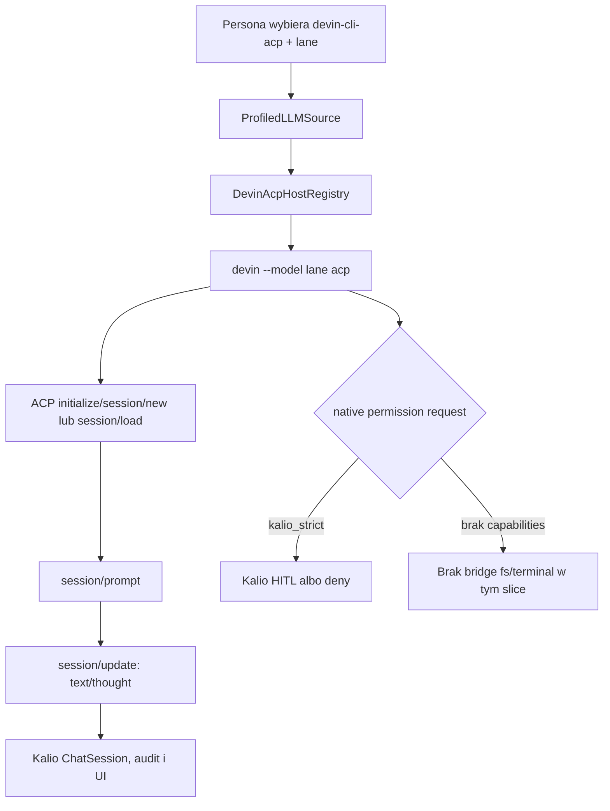

# 2026-08-23 — hostowy Devin ACP dla Kalio

## Purpose

Dodać natywną integrację z lokalnym, zalogowanym Devin CLI na hoście przez ACP. Zakres dotyczy hostowego Windsurf/Devin, nie `CLIAgentService`, `spawn_cli_agent`, Devin Cloud REST ani nowej integracji Claude.

## Scope and constraints

- używany hostowy executable: `devin.exe`;
- darmowe lane’y zweryfikowane lokalnie: `glm-5-2` i `swe-1-7`;
- proces uruchamiany dokładnie jako `devin --model <lane> acp`;
- Kalio zachowuje własną sesję, audyt, scheduler i approval boundary;
- pierwszy slice nie przekazuje schematów narzędzi Kalio i nie reklamuje ACP filesystem/terminal capabilities;
- smoke run odbywał się w pustym katalogu, ponieważ prompt/kontekst prywatnego repo byłby wysłany do zewnętrznej usługi;
- istniejącej integracji Claude nie usuwano ani nie używano jako podstawy tej ścieżki.

## Acceptance criteria

| Kryterium | Stan | Dowód |
| --- | --- | --- |
| Hostowy executable i login | PASS | `devin --version` → `3000.2.17`; `devin auth status` → zalogowany |
| Darmowe modele | PASS | `devin models list` zawiera `glm-5-2` i `swe-1-7` |
| ACP handshake/session/turn | PASS | pusty katalog: `initialize`, `session/new`, `session/prompt`, `stopReason=end_turn`, strumień tekstu/myśli |
| Routing profilu Kalio | PASS | profile `devin-local-glm-5-2` i `devin-local-swe-1-7`, typ `devin-cli-acp` |
| Status API | PASS | `GET http://localhost:3016/api/runtime/devin-cli/status` zwrócił `authenticated=true`, `acp=true`, oba modele |
| Settings/Chrome | PASS | `http://localhost:5188/`, Settings → Integrations, karta `Devin CLI (host)` z `Online`, `Logged in`, `ACP available` |
| Kalio tool bridge | NOT IMPLEMENTED | pierwszy slice jawnie pomija schematy Kalio oraz capabilities fs/terminal |
| Prywatny workspace canary | BLOCKED | wymaga osobnej, jawnej zgody na wysłanie kontekstu repo do Devina |

## Starting evidence

Przed zmianą istniały profile direct/Codex/Claude/Devin Cloud oraz osobna ścieżka `CLIAgentService`. Hostowy Devin executable był dostępny na hoście i miał aktywną sesję, ale Kalio nie miał adaptera ACP, profili hostowych ani statusu w Settings.

## Investigation or execution method

1. Odczytano istniejący runtime, kontrakty profili, lifecycle sesji i panel native integrations.
2. Zweryfikowano lokalny CLI: wersję, login, ACP help i listę modeli.
3. Sprawdzono oficjalny ACP TypeScript SDK i użyto `@agentclientprotocol/sdk` 1.3.0.
4. Uruchomiono realny ACP smoke test w pustym katalogu: handshake, nowa sesja i pełny turn.
5. Dodano focused testy API/web, typecheck/build oraz ręczną weryfikację w Chrome.
6. Zebrano pełne suite’y osobno, bez maskowania istniejących awarii niezwiązanych z tym slice’em.

## Root causes and decisions

- **Zaobserwowano:** hostowy Devin udostępnia ACP i `session/load`; **ograniczenie:** Kalio musi utrzymać własny binding sesji i nie może tracić `cwd`; **decyzja:** jeden długo żyjący host na lane, `externalThreadId` przechowuje opaque ACP `sessionId`, a restart używa `session/load`.
- **Zaobserwowano:** agent może żądać natywnych uprawnień; **ograniczenie:** pierwszy slice nie ma jeszcze bezpiecznego mapowania host FS/terminal do polityk Kalio; **decyzja:** nie reklamować tych capabilities, a permission request domyślnie odrzucać lub kierować do istniejącego HITL w `kalio_strict`.
- **Zaobserwowano:** prywatne repo wymagałoby transmisji lokalnego kontekstu do usługi zewnętrznej; **ograniczenie:** brak jawnej zgody na taki transfer; **decyzja:** live smoke tylko w pustym katalogu.

## Implementation sequence

1. Dodano oficjalny SDK ACP i typ `devin-cli-acp` z allowlistą dwóch darmowych lane’ów.
2. Dodano `DevinAcpHost`/`DevinAcpHostRegistry`: proces, NDJSON guard, handshake, session restore, serializację turnów, stream update, permission boundary i lifecycle.
3. Dodano `DevinCliAcpLLMSource`, routing w `ProfiledLLMSource`, profil seedujący migrację `0034` oraz korelację `externalThreadId`.
4. Dodano status `GET /api/runtime/devin-cli/status`, wybór modelu w persona selectorze i kartę hostowego Devina w Settings.
5. Dodano testy kontraktu oraz dokumentację `project-spec.md` i `docs/technical-documentation-kalio.md`.

## Flow diagram

## Files and boundaries changed

Commit `b95cab4` (`feat(runtime): add host-local Devin ACP`) obejmuje 26 plików: adapter ACP i testy, status controller, typy/profile/migrację, routing czatu, selector persona, panel Settings, lockfile i dokumentację. Nie zmieniano `CLIAgentService`, ścieżki `spawn_cli_agent` ani istniejących adapterów Claude.

## Verification evidence

- `corepack pnpm --filter kalio-api typecheck` — PASS.
- `corepack pnpm --filter kalio-api build` — PASS.
- `corepack pnpm --filter kalio-api test -- src/modules/agent-runtime` — 13 plików, 49 testów PASS.
- `corepack pnpm --filter kalio-web typecheck` — PASS.
- `corepack pnpm --filter kalio-web build` — PASS; istnieje tylko ostrzeżenie o dużym chunku Vite.
- `corepack pnpm --filter kalio-web test -- src/features/persona/persona-runtime-selection.test.ts src/features/chat/runtimeProfileLabel.test.ts src/features/settings/NativeCliIntegrationsPanel.test.tsx` — 3 pliki, 11 testów PASS.
- API live: `GET http://localhost:3016/api/runtime/devin-cli/status` — `devin.exe`, `3000.2.17`, `authenticated=true`, `acp=true`, `models=[glm-5-2,swe-1-7]`.
- Chrome live: `http://localhost:5188/` → Settings → Integrations; karta hostowego Devina widoczna jako Online/Logged in/ACP available. Wykonano screenshot viewportu jako dowód wizualny w sesji QA.
- `git diff --cached --check` — PASS; commit utworzony jako `b95cab4`.

## Caveats and inconclusive checks

- Pełny API suite zakończył się `235 passed`, `17 failed` w `239` plikach. Najważniejsze obserwacje: test migracji ma hard-coded oczekiwanie 28 wpisów przy aktualnym journalu 35, a część testów KV/CLI widzi brakujące kolumny w bazie testowej. To pozostały baseline/release gate, nie dowód działania hostowego adaptera.
- Pełny web suite zakończył się `196 passed`, `5 failed` w `198` plikach; awarie dotyczą testów Execution Graph i nie dotknęły focused testów panelu/persona.
- Nie wykonano prywatnego repo canary ani deployu zewnętrznego. Dev hot-reload na localhost był już uruchomiony; dowód obejmuje lokalny runtime, nie produkcję.
- Live ACP odpowiedział `stopReason=end_turn` i streamował komunikację, ale smoke prompt zawierał żądanie literalnej odpowiedzi, którego agent nie zachował dokładnie. Potwierdza to transport/lifecycle, nie jakość instruction-following.

## Remaining boundary and production closure

- **[P2] Required before broader release:** zaprojektować i przetestować jawne ustawienia host-native tools (filesystem/web/terminal) oraz mapowanie ich do VFS, allowlist i HITL; obecny slice bezpiecznie ich nie udostępnia.
- **[P2] Required before production:** naprawić lub formalnie sklasyfikować pełne API/web suite’y, a następnie powtórzyć pełny gate.
- **[P3] Recommended:** dodać osobny, autoryzowany workspace canary z kontrolowanym testowym katalogiem, gdy będzie zgoda na transmisję kontekstu do Devina.
- Produkcja nie jest potwierdzona: brak deployu, publicznego health checku i produkcyjnego testu tego runtime’u.
