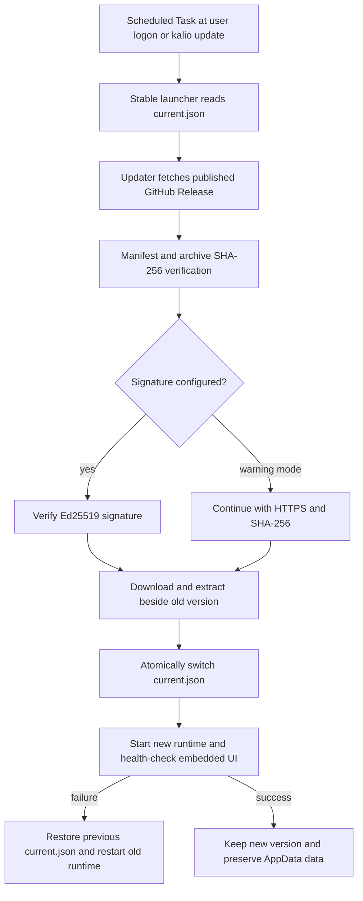

# Standalone runtime updater verification

## Decision

Kalio standalone installations use a stable launcher in `%LOCALAPPDATA%\Kalio\bin` and keep each runtime under `app\versions\<version>`. The updater runs as a separate Node or Bun process because the active runtime executable cannot safely replace itself on Windows.

The update flow is:

## Evidence

- `pnpm build` passed with the system Node runtime.
- `node --test scripts/kalio-updater.test.mjs` passed: version comparison and Ed25519 manifest verification.
- `bun test scripts/kalio-updater.test.mjs` passed with Bun 1.2.18.
- `node --test scripts/runtime-scripts.test.mjs` passed: 24 tests.
- Final Windows Node archive was built and installed in an isolated directory. `doctor` selected `runtime=node`, and `/api/runtime/info` returned `sqliteDriver=node` and `embeddedUi=true`.
- Final Windows Bun archive was built and installed in an isolated directory. `doctor` selected `runtime=bun`, and `/api/runtime/info` returned `sqliteDriver=bun` and `embeddedUi=true`.
- Final test archives and installation directories were removed after verification.

## Release boundary

- A plain push to `main` does not create a desktop release. `.github/workflows/desktop-release.yml` runs desktop builds for `v*` tags or manual dispatch; the release job creates a draft GitHub Release. The draft must be published before `releases/latest` or the updater can use it.
- Runtime update manifests are generated for the standalone archives. Without `KALIO_RUNTIME_SIGNING_PRIVATE_KEY`, the manifest is unsigned and the updater logs a warning by default. Strict signature enforcement is available through `KALIO_REQUIRE_UPDATE_SIGNATURE=true`.
- Tauri updater signing and Windows Authenticode signing remain separate optional lanes. Authenticode is intentionally disabled for now.
- The built-in updater and Windows installer currently validate Windows x64 ZIP assets. Linux archives are built by CI, but Linux self-update is not proven by this slice and must not be advertised as complete.

## Remaining blockers

- `pnpm test` is not green in the current checkout. Existing API tests fail against missing `personas.execution_profile_id` and `personas.provider_tool_names` columns, and three frontend `ExecutionGraphView` tests expect a missing `graph-empty-routing-summary` test id. These are separate from the runtime updater and remain P2 release-gate blockers.
- A public release still needs a unique version tag, published Release, and the GitHub Actions runtime signing secrets/variable if cryptographic update verification is required.
