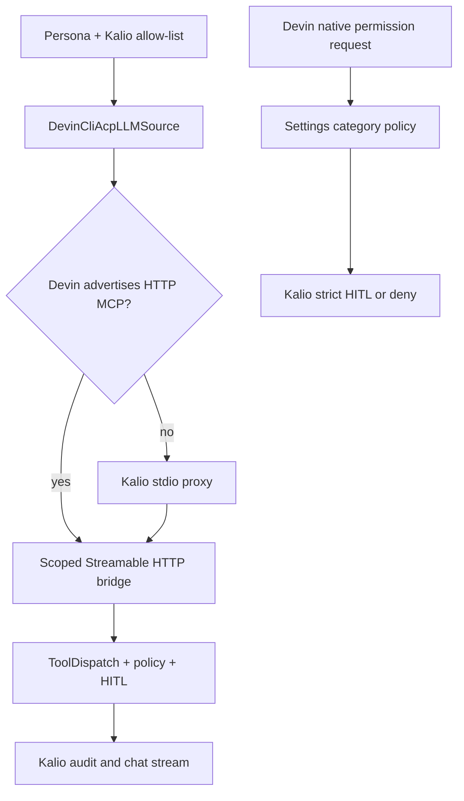

# 2026-08-23 — Devin ACP stdio bridge i stabilizacja narzędzi

## Purpose

Domknąć hostową integrację Devin ACP bez mieszania jej z `CLIAgentService`,
`spawn_cli_agent` ani integracją Claude. Avatar feature został wcześniej
zamknięty osobnym commitem; ten zapis dotyczy mostu narzędzi i weryfikacji
runtime.

## Scope and constraints

- używany hostowy executable: `devin.exe 3000.2.17`;
- test live używał wyłącznie darmowego lane'u `glm-5-2`;
- Kalio pozostaje właścicielem allow-listy narzędzi, tokenu, sesji/VFS,
  kontekstu turnu, HITL i audytu;
- natywne narzędzia Devina pozostają kategoriami `filesystem`, `web`,
  `terminal`, domyślnie wyłączonymi w Settings;
- zmiany deployowe oraz obcy `scripts/kalio-updater.mjs` i katalogi `tmp/*`
  nie były stagingowane ani usuwane;
- nie wykonywano deployu ani restartu działającego dev stacka.

## Acceptance criteria

| Kryterium | Stan | Dowód |
| --- | --- | --- |
| Avatar feature osobno zamknięty | PASS | commit `f1dc364`; 8 web test files / 26 tests PASS w bieżącym gate |
| Devin ACP może otrzymać Kalio MCP bez HTTP capability | PASS (konfiguracja) | stdio fallback w `DevinCliAcpLLMSource`; test źródła sprawdza URL, token, sesję i allow-listę |
| Proxy nie omija bramki | PASS | skompilowany proxy smoke: `listTools` i `callTool` przeszły przez disposable HTTP MCP bridge; wynik `bridge:kalio_probe` |
| Realny ACP handshake z stdio wpisem | PASS | darmowy `glm-5-2`: `initialize`, `session/new`, `protocolVersion=1`, `sessionIdPresent=true` |
| Realny Devin `callTool` przez nasz HTTP bridge | BLOCKED / INCONCLUSIVE | ACP wysłał aktywność `kalio_probe`, ale mock HTTP bridge otrzymał `0` żądań; build nie deklaruje `mcpCapabilities.http` ani `sse` |
| Native tool policy | PASS | focused policy/ACP/bridge gate: 4 files / 16 tests PASS; Settings policy pozostaje default-deny |
| API typecheck/build | PASS | API typecheck; Nest build, 629 plików, 0 błędów TSC |

## Starting evidence

Istniejący adapter Devin ACP umiał uruchomić sesję i streamować tekst/myśli,
ale przy `mcpCapabilities.http=false` pomijał konfigurację Kalio MCP. Bridge
HTTP, token Settings i polityka kategorii native tools już istniały.

## Investigation or execution method

1. Sprawdzono aktualny worktree i zachowano avatar commit oraz obce zmiany.
2. Dodano mały proxy stdio, który jest uruchamiany przez ACP i łączy się z
   istniejącym bearer-protected Streamable HTTP bridge.
3. Dodano capability fallback: HTTP, gdy Devin je deklaruje; stdio proxy w
   przeciwnym razie.
4. Uruchomiono focused Vitest, typecheck i build API oraz focused Vitest web.
5. Uruchomiono dwa disposable canary: bezpośredni proxy forwarding oraz realny
   Devin ACP na darmowym GLM-5.2 poza sandboxem.

## Root causes and decisions

- **Observed:** Devin `3000.2.17` handshake reports `{http:false,sse:false}`.
  **Decision:** do not pretend HTTP support; pass a compiled stdio proxy that
  still calls only Kalio's authenticated bridge.
- **Observed:** ACP session setup accepted the stdio configuration, but the
  provider canary did not produce an observable request to the disposable HTTP
  bridge. **Decision:** keep the fallback implemented and fail the live
  `callTool` acceptance row until a Devin build/runtime proves the invocation.
- **Observed:** ACP exposes permission requests, not a stable per-provider
  native tool-name catalog. **Decision:** keep Devin native controls at the
  existing Settings categories and keep Kalio tools at persona allow-list +
  bridge policy; do not invent a per-name Devin picker.

## Implementation sequence

1. `devin-cli-mcp-bridge.ts` builds an absolute Node stdio server config with
   explicit bridge URL and scoped environment values.
2. `kalio-mcp-bridge-stdio.ts` forwards MCP `listTools`/`callTool` over HTTP
   while preserving bearer, session, VFS, client and tool-name headers.
3. `DevinCliAcpLLMSource` selects HTTP or stdio and audits the selected
   transport; provider-native tool omission is no longer confused with Kalio
   MCP forwarding.
4. `project-spec.md`, `docs/mcp-architecture.md` and this session note record
   the boundary and proof status.

## Flow diagram

## Files and boundaries changed

Task-owned runtime files:

- `apps/kalio-api/src/modules/agent-runtime/devin-cli-acp.llm-source.ts`
- `apps/kalio-api/src/modules/agent-runtime/devin-cli-acp.llm-source.spec.ts`
- `apps/kalio-api/src/modules/agent-runtime/devin-cli-mcp-bridge.ts`
- `apps/kalio-api/src/modules/mcp-bridge/kalio-mcp-bridge-stdio.ts`
- `project-spec.md`
- `docs/mcp-architecture.md`
- `docs/technical-documentation-kalio.md`

Avatar files are in separate commit `f1dc364`. Deploy-owned files were not
added.

## Verification evidence

- `pnpm.cmd --filter kalio-api exec vitest run ...` — 4 files / 16 tests PASS.
- `pnpm.cmd --filter kalio-api typecheck` — PASS.
- `pnpm.cmd --filter kalio-api build` — PASS; 629 files, 0 TSC issues.
- `pnpm.cmd --filter kalio-web exec vitest run ...` — 8 files / 26 tests PASS
  for avatar/persona/runtime allow-list coverage.
- Disposable compiled proxy smoke — PASS: `kalio_probe` listed and called;
  returned `bridge:kalio_probe`.
- Real Devin ACP canary outside sandbox — handshake/session PASS with
  `glm-5-2`; live tool invocation remains visibly inconclusive as stated above.
- No deployment or production proof was attempted.

## Caveats and inconclusive checks

- The real Devin canary emitted `Listed MCP tools for kalio` and
  `Calling kalio_probe from kalio`, but the disposable HTTP bridge saw no
  request. This is not sufficient evidence that the installed CLI executed
  the supplied stdio server; it is not marked PASS for live `callTool`.
- Full API/web suites were not rerun in this slice; prior baseline failures
  remain a separate release gate.
- UI browser proof was not repeated for this runtime-only change; prior avatar
  browser evidence remains separate from this commit.

## Remaining boundary and production closure

- **[P2] Required before broader Devin release:** repeat the canary with a
  Devin build/runtime that exposes an observable stdio MCP request, or use a
  provider-supported HTTP MCP capability. Until then, managed Devin live
  `callTool` is not proven.
- **[P2] Required before production:** resolve or formally accept the existing
  full API/web suite failures, then rerun the release gate.
- **[P3] Recommended:** add a controlled, explicitly approved workspace
  canary after the tool path is observable.
- Production remains unverified; this slice is committed source plus local
  and disposable runtime evidence only.
