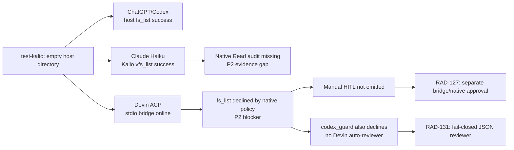

# Real provider usage canary: `test-kalio`

Date: 2026-08-23  
Target: `E:/Projekty/test-kalio`  
Scope: read-only provider and Kalio runtime canaries

## Purpose

Establish whether the external-agent bridge is usable through Kalio, whether Devin's native-tool settings are visible and fail closed, and whether manual or automatic approval can produce a real Kalio tool result.

## Scope and constraints

- Target project: `E:/Projekty/test-kalio`; read-only `fs_list` only.
- Providers: ChatGPT/Codex, Claude Haiku, and Devin GLM-5.2.
- No production mutation, no source changes in the target project, and no native filesystem/web/terminal access left enabled.

## Acceptance criteria

1. Verify the effective provider/model and bridge wiring from Kalio runtime evidence.
2. Verify the three native-tool settings in Chrome and the persisted API state.
3. Exercise Devin manual and automatic approval paths with a single bridge call.
4. Restore a deny-by-default safe state and record unresolved blockers.

## Starting evidence

The dev stack was reachable at `http://localhost:5188/`; API health was `200`. Devin CLI probing reported version `3000.2.17`, authenticated ACP, and models `glm-5-2` and `swe-1-7`. The bridge reported 62 Kalio tools and used stdio fallback for Devin because the ACP host did not advertise HTTP MCP support.

## Investigation and execution method

Used the Kalio Chrome UI for session/persona/project selection, the Kalio session/messages/audit endpoints for durable runtime evidence, and the Devin settings/profile endpoints for controlled temporary policy changes. Each temporary change was followed by an explicit restore and host-registry reset.

## Root causes and decisions

Observed `mcp_call_tool` entering the Devin ACP permission path and being recorded as `native_approval=decline` before a Kalio result. The current adapter only invokes the HITL callback for `kalio_strict` when a classified native category is enabled; `codex_guard` has no Devin reviewer implementation. Therefore bridge/native approval must be separated before enabling any bypass or automatic reviewer.

## Implementation sequence

The existing integration exposed the bridge and native-tool settings. This follow-up added only the evidence record and external task/documentation updates; it did not change runtime source code. Linear tasks RAD-127 through RAD-131 track the implementation slices.

## Outcome

The target directory was empty before and after the managed tests. ChatGPT/Codex completed a host `fs_list` through Kalio. Claude Haiku completed the Kalio VFS canary. Devin ACP started with the stdio bridge and discovered Kalio MCP tools, but its `fs_list` call was declined by the native-tool policy boundary. This is not a full integration closure.

## Evidence matrix

| Provider | Runtime evidence | Result | Boundary |
| --- | --- | --- | --- |
| ChatGPT/Codex | Kalio session `SFd2Bk89ifM3qiQTLkYzr`; profile `codex-luna`; `gpt-5.6-luna`; audit `fs_list` success for the host path; assistant marker `TEST_KALIO_CHATGPT_OK` | PASS | Standalone `codex login status` is not logged in; Kalio App Server `chatgpt-default` is the proven path |
| Claude Haiku | Kalio session `2EuHr3cyzkXWtnp37IL7K`; managed Claude Code `2.1.240`; `vfs_list` success with zero files; marker `TEST_KALIO_CLAUDE_OK` | PARTIAL PASS | Follow-up claiming provider-native `Read` has `toolCallCount: 0` and no tool result in audit, so native host-file access is not proven |
| Devin GLM-5.2 | Kalio session `ai6mvv_rJhknhgeaUgJXy`; ACP `glm-5-2`; cwd `E:/Projekty/test-kalio`; bridge enabled over stdio; 62 Kalio tools discovered | PARTIAL / BLOCKED | `mcp_call_tool fs_list` reached the ACP host but `devin-cli-acp.native_approval` recorded `decision: decline` with native filesystem/web/terminal settings false |
| Claude Code CLI | CLI `2.1.220`, Claude.ai-authenticated Haiku run, zero top-level entries, marker `TEST_KALIO_CLAUDE_OK` | PASS for empty-workspace canary | Direct CLI is separate from the managed Kalio profile; managed version is `2.1.240` |
| Devin CLI | CLI `3000.2.17`, GLM-5.2 read-only run, marker `TEST_KALIO_DEVIN_OK` | PASS for ACP/text canary | The run created `supermemory.db` in the empty target; process stopped and the file was moved to OS-temp quarantine `kalio-devin-canary-20260823` |

### Approval and settings follow-up

| Check | Evidence | Result | Boundary |
| --- | --- | --- | --- |
| Native-tool settings | Chrome Settings > Integrations rendered independent File System, Web, and Terminal checkboxes; final API state is all `false` | PASS | UI controls are present; this does not prove bridge approval |
| Manual Devin bridge approval | Sessions `QL05qqN0pjcqqhh03GVS6` / `burly-kiwi` and `NGtteC2EgURmeAl43uRwV` / `defiant-shoemaker`; bridge `mcp_call_tool` ended with `devin-cli-acp.native_approval=decline`; no `tool:confirmation_required` or Kalio result | BLOCKED | No confirmation UI was emitted, including during a temporary native-category enablement |
| Devin `codex_guard` | Session `6tBuw_h32_tg64tDdmAfR` / `pepper-calendula`, temporary profile mode `codex_guard`; audit again recorded `decision: decline` and failed tool | BLOCKED | Devin has no automatic reviewer path in the current ACP adapter |
| Safe final state | Profile restored to `kalio_strict`; bridge enabled; native tools all `false`; Devin `3000.2.17` authenticated/ACP available; API health `200`; host registry `hostCount=0` after reset | PASS | Local/dev evidence only, not production proof |

## Findings and remaining risks

- `[P2]` Devin bridge calls are over-blocked by the optional native-tool approval gate. The bridge is reachable and stdio fallback is selected correctly, but a Kalio MCP call does not produce a tool result when native filesystem is disabled.
- `[P2]` Devin bridge/native approval classification is still conflated. `mcp_call_tool` is rejected before the Kalio gateway can return a result, and there is no supported bypass mode.
- `[P3]` The `codex_guard` execution mode does not provide a free-model JSON reviewer for Devin; a fail-closed deterministic/GLM reviewer remains design work.
- `[P2]` Claude native provider-tool execution is not audit-proven. The model text alone is not accepted as evidence when the audit reports zero tool calls.
- `[P2]` The empty target does not cover edits, deletes, approvals, non-empty project inspection, or long-running tool loops.
- The final target filesystem count is `0`; no source files in `kalio-forever` were changed by this test. Pre-existing deploy-owned worktree changes remain untouched.

## Files and boundaries changed

- Task-owned file changed: `docs/sessions/2026-08-23_real-provider-usage-test-kalio.md`.
- No application source, target-project file, credential, bridge token, or production resource was changed.
- Notion and Linear were updated externally; those records are linked below.

## Verification evidence

- Browser DOM: Settings > Integrations showed independent Devin File System, Web, and Terminal controls.
- Runtime API: Devin profile ended at `approvalMode=kalio_strict`; native settings ended at `filesystem=false`, `web=false`, `terminal=false`; bridge remained enabled; health returned `200`; status ended at `hostCount=0`.
- Audit API: auto session `6tBuw_h32_tg64tDdmAfR` recorded `devin-cli-acp.native_approval` with `decision=decline`, a failed `mcp_call_tool`, and no Kalio tool result.
- Git: the working tree contains only this task-owned session-note edit; the note is committed separately from runtime/deploy changes.

## Caveats and inconclusive checks

- Manual approval was not proven because the ACP adapter declined before emitting a confirmation event; this is a blocker, not a successful denial UX.
- Automatic approval was not proven because Devin has no reviewer path behind `codex_guard`; the canary proves the current fail-closed behavior only.
- The local mock `/api/llm/config` value is not evidence of the external provider used by these Devin sessions; session audit/model fields are the source for this canary.

## Remaining boundary and production closure

Status is **CONDITIONAL / NO-GO for Devin bridge approval**. ChatGPT/Codex and the Claude Haiku Kalio VFS canary remain proven for their recorded read-only scope. Devin authentication, ACP startup, bridge discovery, and settings UI are proven, but a trustworthy bridge tool result is not. Production closure requires RAD-127 first, then scoped public bridge hardening (RAD-129), project runtime/health lifecycle (RAD-130), and an explicitly fail-closed auto-review design (RAD-131).

## Durable references

- Notion Agent Note: `Real provider usage QA: test-kalio` (created 2026-08-23)
- Linear project `test-kalio` comment: `2af94a68-792b-4b65-9769-d37e57a13a61`
- Linear RAD-114 runtime-policy comment: `12d348fc-aec4-4721-a6cd-7a0a2fc30c73`
- Linear RAD-100 ChatGPT comment: `d1d7606d-6fce-498b-be13-ff2e29bdd988`
- Notion architecture page: `https://app.notion.com/p/3c5c847d182581e495a7eb19ced0c292?pvs=204` (updated with approval evidence)
- Linear RAD-127 QA comment: `9be325d6-75ac-482c-937d-a6f943c7fa03`
- Linear follow-up tasks: RAD-127 (approval separation), RAD-128 (system-context injection), RAD-129 (scoped external bridge), RAD-130 (project runtime profiles), RAD-131 (fail-closed auto-review)

