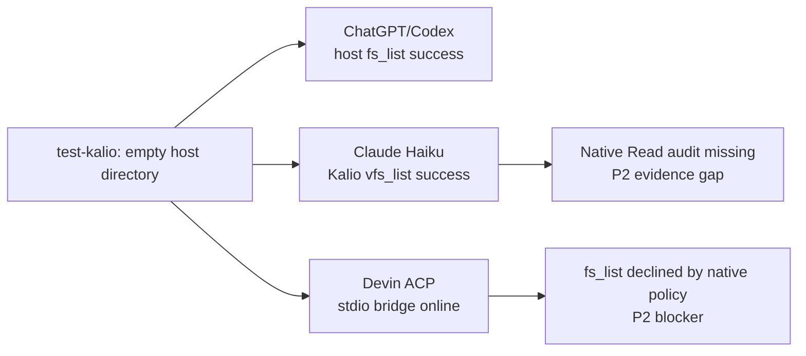

# Real provider usage canary: `test-kalio`

Date: 2026-08-23  
Target: `E:/Projekty/test-kalio`  
Scope: read-only provider and Kalio runtime canaries

## Outcome

The target directory was empty before and after the managed tests. ChatGPT/Codex completed a host `fs_list` through Kalio. Claude Haiku completed the Kalio VFS canary. Devin ACP started with the stdio bridge and discovered Kalio MCP tools, but its `fs_list` call was declined by the native-tool policy boundary. This is not a full integration closure.

## Evidence matrix

| Provider | Runtime evidence | Result | Boundary |
| --- | --- | --- | --- |
| ChatGPT/Codex | Kalio session `SFd2Bk89ifM3qiQTLkYzr`; profile `codex-luna`; `gpt-5.6-luna`; audit `fs_list` success for the host path; assistant marker `TEST_KALIO_CHATGPT_OK` | PASS | Standalone `codex login status` is not logged in; Kalio App Server `chatgpt-default` is the proven path |
| Claude Haiku | Kalio session `2EuHr3cyzkXWtnp37IL7K`; managed Claude Code `2.1.240`; `vfs_list` success with zero files; marker `TEST_KALIO_CLAUDE_OK` | PARTIAL PASS | Follow-up claiming provider-native `Read` has `toolCallCount: 0` and no tool result in audit, so native host-file access is not proven |
| Devin GLM-5.2 | Kalio session `ai6mvv_rJhknhgeaUgJXy`; ACP `glm-5-2`; cwd `E:/Projekty/test-kalio`; bridge enabled over stdio; 62 Kalio tools discovered | PARTIAL / BLOCKED | `mcp_call_tool fs_list` reached the ACP host but `devin-cli-acp.native_approval` recorded `decision: decline` with native filesystem/web/terminal settings false |
| Claude Code CLI | CLI `2.1.220`, Claude.ai-authenticated Haiku run, zero top-level entries, marker `TEST_KALIO_CLAUDE_OK` | PASS for empty-workspace canary | Direct CLI is separate from the managed Kalio profile; managed version is `2.1.240` |
| Devin CLI | CLI `3000.2.17`, GLM-5.2 read-only run, marker `TEST_KALIO_DEVIN_OK` | PASS for ACP/text canary | The run created `supermemory.db` in the empty target; process stopped and the file was moved to OS-temp quarantine `kalio-devin-canary-20260823` |

## Findings and remaining risks

- `[P2]` Devin bridge calls are over-blocked by the optional native-tool approval gate. The bridge is reachable and stdio fallback is selected correctly, but a Kalio MCP call does not produce a tool result when native filesystem is disabled.
- `[P2]` Claude native provider-tool execution is not audit-proven. The model text alone is not accepted as evidence when the audit reports zero tool calls.
- `[P2]` The empty target does not cover edits, deletes, approvals, non-empty project inspection, or long-running tool loops.
- The final target filesystem count is `0`; no source files in `kalio-forever` were changed by this test. Pre-existing deploy-owned worktree changes remain untouched.

## Durable references

- Notion Agent Note: `Real provider usage QA: test-kalio` (created 2026-08-23)
- Linear project `test-kalio` comment: `2af94a68-792b-4b65-9769-d37e57a13a61`
- Linear RAD-114 runtime-policy comment: `12d348fc-aec4-4721-a6cd-7a0a2fc30c73`
- Linear RAD-100 ChatGPT comment: `d1d7606d-6fce-498b-be13-ff2e29bdd988`

