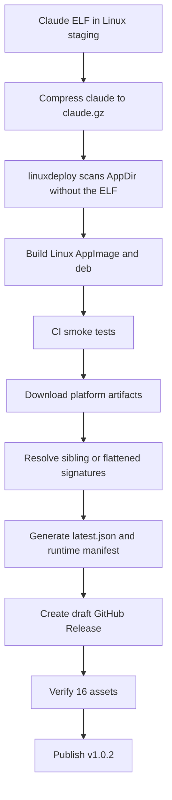

# Kalio v1.0.2 release and Linux AppImage closure — 2026-09-17

## Purpose

Close the Kalio `v1.0.2` release requested by the user. The release must build Windows and Linux desktop artifacts, retain Node and Bun runtime archives, generate updater metadata when signing secrets are available, and publish the GitHub Release only after the platform jobs pass.

## Scope and constraints

- Repository: `E:\Projekty\kalio-forever`.
- Release tag: `v1.0.2`.
- Windows Authenticode signing remains disabled by product decision; this is a warning, not a build failure.
- Preserve the existing runtime and Claude Agent SDK capability; do not remove Claude or ONNX only to reduce the bundle.
- Keep the change surgical and do not rewrite `main` or unrelated work.

## Acceptance criteria

1. The Linux Tauri/AppImage build no longer aborts in linuxdeploy while scanning the Claude SDK ELF.
2. The extracted Claude executable is usable by the SDK after packaging.
3. Windows and Linux build jobs pass, including platform smoke tests.
4. The release metadata generator handles signatures downloaded as flattened GitHub artifact files.
5. A public, non-draft `v1.0.2` release contains the expected desktop and runtime artifacts.

## Starting evidence

- Workflow `35205854893` failed in Linux `linuxdeploy-plugin-gtk` while recursively running `ldd` on the dynamically linked Claude SDK executable.
- The exact public Claude SDK Linux x64 package contained a roughly 342.6 MB uncompressed `claude` ELF. A direct `ldd` check succeeded on Ubuntu 24.04; the failure was specific to linuxdeploy's AppDir scan.
- Workflow `35208492718` proved the AppImage fix, but its release job failed because the generator looked for a signature beside a nested artifact while GitHub artifact download flattened the signature file.

## Investigation and execution method

The release path was reproduced with local source inspection, a focused failing extraction test, system-Node API gates, and two authenticated GitHub Actions runs. The first corrected workflow was inspected at job/step level; the second was accepted only after both platform jobs and the release job reported success. Release asset names and sizes were then read from the GitHub API before publishing the draft.

## Root causes and decisions

### Linux AppImage

Observed that linuxdeploy scans regular ELF files below the Tauri AppDir, including the bundled Claude executable. The executable is required at runtime but does not need to remain an ELF file during bundling. Therefore the Linux staging scripts now gzip `claude`, remove the original staged ELF, and the backend extracts it to a private temporary cache on first Claude SDK use. The SDK receives the extracted path through `pathToClaudeCodeExecutable`.

### Updater manifest

Observed that `actions/upload-artifact` downloaded signature-only artifacts at the release root while desktop artifacts retained their source directory structure. Therefore the generator now prefers a sibling signature and otherwise resolves the exact `<artifact-name>.sig` basename anywhere below the assets root.

## Implementation sequence

1. Added the runtime extraction helper and Vitest coverage for valid, cached, and corrupt gzip payloads.
2. Integrated the resolved executable path into the Claude Agent SDK query options.
3. Added the shared Linux staging compressor to both runtime archive and Tauri preparation paths, guarded by the target platform.
4. Added release QA for compression and flattened signature layouts.
5. Fixed the updater manifest generator and force-updated the release tag after verification.

## Flow diagram

## Files and boundaries changed

- `apps/kalio-api/src/modules/agent-runtime/claude-agent-sdk-executable.ts`
- `apps/kalio-api/src/modules/agent-runtime/claude-agent-sdk-executable.spec.ts`
- `apps/kalio-api/src/modules/agent-runtime/claude-agent-sdk.llm-source.ts`
- `scripts/compress-claude-agent-sdk.mjs`
- `scripts/tauri-prepare.mjs`
- `scripts/build-runtime-package.mjs`
- `scripts/generate-tauri-latest-json.mjs`
- `scripts/release-experienced-qa.test.mjs`

Release commits:

- `d64656a` — compress the Linux Claude SDK payload and extract it at runtime.
- `d84303e` — resolve updater signatures flattened by GitHub artifact download.

The remote branch `codex/kalio-runtime-installer` and tag `v1.0.2` point to `d84303e`.

## Verification evidence

### Local

- Claude extraction tests: 2/2 passed.
- Claude source focused tests: 5/5 passed across the extraction and LLM source suites.
- API typecheck: passed, 0 issues.
- API build: passed, 633 files compiled.
- Full API Vitest: 247 test files, 2708 tests passed.
- Release experienced QA: 7/7 tests passed.
- `node --check` passed for the release scripts.
- `git diff --check` passed.

### GitHub Actions

Workflow `35209978560` for commit `d84303e` completed successfully:

- `build-linux`: success.
- `build-windows`: success.
- `release`: success.

The Linux job passed both the unsigned and updater-configured Tauri paths. The Windows job passed the installer smoke test and artifact upload.

### Published release

GitHub Release: https://github.com/Radomiej/kalio-forever/releases/tag/v1.0.2

- `draft=false`, `prerelease=false`.
- Published at `2026-09-17T10:38:39Z`.
- 16 assets verified, including Windows setup, Linux AppImage and deb, Node/Bun runtime archives for Windows/Linux, updater signatures, `latest.json`, runtime manifest, SHA-256 sums, license files, and third-party notices.

## Caveats and inconclusive checks

- Windows Authenticode is not present; the workflow reports this as an intentional warning. Tauri updater signatures are present in this release lane, but that is separate from Authenticode.
- The largest desktop/runtime artifacts remain large: the published AppImage is about 291 MB and runtime archives are about 201–228 MB. The change fixes the Linux bundler failure and removes the uncompressed Claude ELF from the staged AppDir; it is not a complete bundle-size optimization pass.
- Local extraction coverage uses a fake gzip payload, and CI desktop smoke tests prove startup/health. A real Claude API turn with a user credential was not run.
- Historical repository credential exposure and the broader dependency/security audit are outside this release closure and must not be treated as resolved by a green build.

## Remaining boundary and production closure

### Required before prod

- [P1] Revoke/rotate any historical credential still considered exposed and independently verify the provider account usage.
- [P1] Complete the outstanding API/VFS authorization and dependency-security review before treating the public repository as production-safe.
- [P2] Download and run the published Windows installer and Linux AppImage on target machines; verify first start, data directory creation, update check, and one real configured-provider turn.

### Recommended

- [P2] Revisit bundle-size optimization after the release is functionally accepted, especially large runtime/model/provider payloads.
- [P2] Add a target-machine smoke path that invokes the compressed Claude executable without a paid/live provider call.

### Optional

- [P3] Add Windows Authenticode once a certificate and protected signing workflow are available.

## Closure state

Implemented, locally test-verified, CI build-verified, and deployed as a public GitHub Release. Target-machine and production-provider proof remain open as described above.
