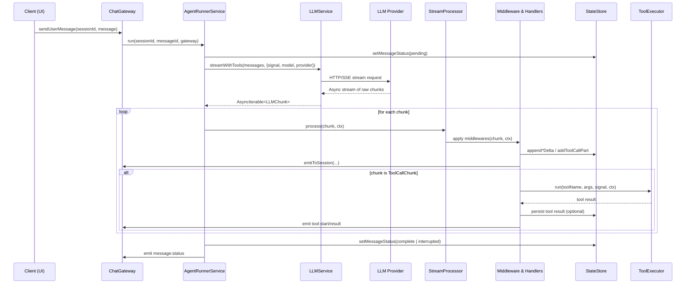

# Zobacz jak na github są zbudowane open source rozwiązania czatu z llm czy nasze podejście jest dobre co byś zaproponował by je ulepszyć i zrób raport oraz spec driven doc oto wstępny plan Jakbyś to rozbił bez switcha za pomocą oop i kompozycji?

Bez switcha, trzy wzorce razem: **Registry** (zamiast dispatcha), **Middleware Pipeline** (cross-cutting concerns), i **Composition** w handlerach. Każdy chunk type to osobna klasa injectable.

## Warstwa 1 — Kontekst i interfejs

Wszystko co handler potrzebuje trafia do jednego obiektu kontekstu, żeby handlery nie wiedziały o sobie nawzajem:

```typescript
// stream-context.ts
export interface StreamContext {
  sessionId: string;
  messageId: string;
  signal: AbortSignal;
  gateway: ChatGateway;
  stateStore: StateStore;
  nextSeq: () => Promise<number>;
}

// chunk-handler.interface.ts
export interface ChunkHandler<T extends LLMChunk = LLMChunk> {
  readonly chunkType: T['type'];
  handle(chunk: T, ctx: StreamContext): Promise<void>;
}

// Middleware — cross-cutting concerns (abort, error boundary, logging)
export type StreamMiddleware = (
  chunk: LLMChunk,
  ctx: StreamContext,
  next: () => Promise<void>
) => Promise<void>;
```


## Warstwa 2 — Konkretne Handlery

Każdy handler to mała, testowalna klasa z jedną odpowiedzialnością [1]:

```typescript
// thinking-delta.handler.ts
@Injectable()
export class ThinkingDeltaHandler implements ChunkHandler<ThinkingDeltaChunk> {
  readonly chunkType = 'thinking_delta' as const;

  async handle(chunk: ThinkingDeltaChunk, ctx: StreamContext) {
    await ctx.stateStore.appendThinkDelta(ctx.sessionId, ctx.messageId, chunk.delta);
    ctx.gateway.emitToSession(ctx.sessionId, 'think:delta', {
      messageId: ctx.messageId,
      thinkId: chunk.thinkId,
      delta: chunk.delta,
      seq: await ctx.nextSeq(),
    });
  }
}

// text-delta.handler.ts
@Injectable()
export class TextDeltaHandler implements ChunkHandler<TextDeltaChunk> {
  readonly chunkType = 'text_delta' as const;

  async handle(chunk: TextDeltaChunk, ctx: StreamContext) {
    await ctx.stateStore.appendTextDelta(ctx.sessionId, ctx.messageId, chunk.delta);
    ctx.gateway.emitToSession(ctx.sessionId, 'text:delta', {
      messageId: ctx.messageId,
      textId: chunk.textId,
      delta: chunk.delta,
      seq: await ctx.nextSeq(),
    });
  }
}
```


### ToolCallHandler — kompozycja z ToolExecutor

Tool call jest złożony — wewnętrznie komponuje `ToolExecutorService` zamiast wszystko robić samemu [2]:

```typescript
// tool-call.handler.ts
@Injectable()
export class ToolCallHandler implements ChunkHandler<ToolCallChunk> {
  readonly chunkType = 'tool_call' as const;

  constructor(private readonly toolExecutor: ToolExecutorService) {}

  async handle(chunk: ToolCallChunk, ctx: StreamContext) {
    const seq = await ctx.nextSeq();

    ctx.gateway.emitToSession(ctx.sessionId, 'tool:start', {
      messageId: ctx.messageId,
      toolCallId: chunk.toolCallId,
      toolName: chunk.toolName,
      args: chunk.args,
      seq,
    });

    await ctx.stateStore.addToolCallPart(ctx.sessionId, ctx.messageId, chunk);

    try {
      const result = await this.toolExecutor.run(
        chunk.toolName,
        chunk.args,
        ctx.signal, // AbortSignal propaguje do toola!
      );
      ctx.gateway.emitToSession(ctx.sessionId, 'tool:result', {
        messageId: ctx.messageId,
        toolCallId: chunk.toolCallId,
        result,
        seq: await ctx.nextSeq(),
      });
    } catch (err) {
      ctx.gateway.emitToSession(ctx.sessionId, 'tool:error', {
        messageId: ctx.messageId,
        toolCallId: chunk.toolCallId,
        error: err.message,
        seq: await ctx.nextSeq(),
      });
    }
  }
}

// tool-executor.service.ts — sam też jest registry tooli
@Injectable()
export class ToolExecutorService {
  private registry = new Map<string, Tool>();

  constructor(@Inject(TOOLS_TOKEN) tools: Tool[]) {
    tools.forEach(t => this.registry.set(t.name, t));
  }

  async run(name: string, args: unknown, signal: AbortSignal) {
    const tool = this.registry.get(name);
    if (!tool) throw new Error(`Unknown tool: ${name}`);
    return tool.execute(args, signal);
  }
}
```


## Warstwa 3 — Middleware Pipeline

Cross-cutting concerns (abort check, error boundary, metryki) jako osobne obiekty [2]:

```typescript
// middlewares/abort-check.middleware.ts
export const abortCheckMiddleware: StreamMiddleware = async (chunk, ctx, next) => {
  if (ctx.signal.aborted) return; // zatrzymaj pipeline cicho
  await next();
};

// middlewares/error-boundary.middleware.ts
export const errorBoundaryMiddleware: StreamMiddleware = async (chunk, ctx, next) => {
  try {
    await next();
  } catch (err) {
    ctx.gateway.emitToSession(ctx.sessionId, 'message:error', {
      messageId: ctx.messageId,
      error: err.message,
      seq: await ctx.nextSeq(),
    });
    throw err; // re-throw żeby AgentRunner mógł zakończyć stream
  }
};

// middlewares/metrics.middleware.ts
export const metricsMiddleware: StreamMiddleware = async (chunk, ctx, next) => {
  const start = performance.now();
  await next();
  metrics.recordChunkDuration(chunk.type, performance.now() - start);
};
```


## Warstwa 4 — StreamProcessor jako Kompozytor

`StreamProcessor` łączy registry z pipeline'em. Handler wywołujesz jak ostatnią warstwę middlewara [1]:

```typescript
// stream-processor.service.ts
@Injectable()
export class StreamProcessor {
  private readonly registry: ReadonlyMap<string, ChunkHandler>;

  constructor(
    @Inject(CHUNK_HANDLERS_TOKEN) handlers: ChunkHandler[],
    @Inject(STREAM_MIDDLEWARES_TOKEN) private readonly middlewares: StreamMiddleware[],
  ) {
    this.registry = new Map(handlers.map(h => [h.chunkType, h]));
  }

  async process(chunk: LLMChunk, ctx: StreamContext): Promise<void> {
    const handler = this.registry.get(chunk.type);
    if (!handler) return; // nieznany typ — ignoruj lub loguj

    // Pipeline: middleware1 → middleware2 → handler.handle()
    const execute = () => handler.handle(chunk, ctx);

    const pipeline = this.middlewares.reduceRight<() => Promise<void>>(
      (next, middleware) => () => middleware(chunk, ctx, next),
      execute,
    );

    await pipeline();
  }
}
```


## Warstwa 5 — AgentRunner po refaktorze

Pętla `for-await` redukuje się do jednej linii [3]:

```typescript
// agent-runner.service.ts
@Injectable()
export class AgentRunnerService {
  private controllers = new Map<string, AbortController>();

  constructor(
    private readonly streamProcessor: StreamProcessor,
    private readonly stateStore: StateStore,
    private readonly llm: LLMService,
  ) {}

  async run(sessionId: string, messageId: string, gateway: ChatGateway) {
    const ac = new AbortController();
    this.controllers.set(messageId, ac);

    const ctx: StreamContext = {
      sessionId,
      messageId,
      signal: ac.signal,
      gateway,
      stateStore: this.stateStore,
      nextSeq: () => this.stateStore.nextSeq(sessionId),
    };

    try {
      const stream = await this.llm.streamWithTools(messages, { signal: ac.signal });

      // ← cała logika chunków jest teraz poza AgentRunnerem
      for await (const chunk of stream) {
        await this.streamProcessor.process(chunk, ctx);
      }

      const status = ac.signal.aborted ? 'interrupted' : 'complete';
      await this.stateStore.setMessageStatus(sessionId, messageId, status);
      gateway.emitToSession(sessionId, `message:${status}`, { messageId });
    } finally {
      this.controllers.delete(messageId);
    }
  }

  interrupt(messageId: string) {
    this.controllers.get(messageId)?.abort();
  }
}
```


## NestJS Module — wszystko spięte przez DI

```typescript
// agent.module.ts
export const CHUNK_HANDLERS_TOKEN = 'CHUNK_HANDLERS';
export const STREAM_MIDDLEWARES_TOKEN = 'STREAM_MIDDLEWARES';

@Module({
  providers: [
    // Handlery chunków
    ThinkingDeltaHandler,
    TextDeltaHandler,
    ToolCallHandler,

    // Registry handlerów — factory zbiera je razem
    {
      provide: CHUNK_HANDLERS_TOKEN,
      useFactory: (...handlers: ChunkHandler[]) => handlers,
      inject: [ThinkingDeltaHandler, TextDeltaHandler, ToolCallHandler],
    },

    // Middleware pipeline — kolejność ma znaczenie!
    {
      provide: STREAM_MIDDLEWARES_TOKEN,
      useValue: [abortCheckMiddleware, errorBoundaryMiddleware, metricsMiddleware],
    },

    // Tool registry
    {
      provide: TOOLS_TOKEN,
      useFactory: (...tools: Tool[]) => tools,
      inject: [SearchTool, CodeExecutorTool, FileReaderTool],
    },

    SearchTool,
    CodeExecutorTool,
    FileReaderTool,
    ToolExecutorService,
    StreamProcessor,
    AgentRunnerService,
    StateStore,
  ],
})
export class AgentModule {}
```


## Struktura Finalna

```
agent/
├── handlers/
│   ├── chunk-handler.interface.ts   ← kontrakt
│   ├── thinking-delta.handler.ts
│   ├── text-delta.handler.ts
│   └── tool-call.handler.ts
├── middlewares/
│   ├── abort-check.middleware.ts    ← cross-cutting
│   ├── error-boundary.middleware.ts
│   └── metrics.middleware.ts
├── tools/
│   ├── tool.interface.ts
│   ├── search.tool.ts
│   └── code-executor.tool.ts
├── stream-processor.service.ts      ← kompozytor
├── tool-executor.service.ts         ← registry tooli
├── agent-runner.service.ts          ← tylko flow
└── agent.module.ts
```

Kluczowa przewaga nad switchem: **dodanie nowego chunk type** = stworzenie jednej klasy + rejestracja w module. Zero modyfikacji istniejącego kodu — klasyczne Open/Closed [1]. Każdy handler i middleware jest testowalny w izolacji bez mockowania całego runnera.

Twoje podejście (registry + middleware pipeline + kompozycja handlerów) jest na poziomie tego, co robią współczesne frameworki agentowe – architektonicznie jest bardzo dobre, wyraźnie dojrzalsze niż typowe open‑source’owe „switch po typie chunku”.[^1_1][^1_2][^1_3] Największe zyski na dalszym etapie to dopracowanie kontraktów (chunk/event), adaptery providerów, bogatszy middleware (limity, safety, koszt) i lifecycle wiadomości/narzędzi, żeby z czatu zrobić platformę agentową.[^1_4][^1_5][^1_6]

## Czy kierunek jest dobry

- Większość OSS czatów LLM ma prosty `for await` po strumieniu i obsługę wszystkiego w jednym callbacku lub w `switch` na `chunk.type` – bez podziału na dedykowane handlery i middleware.[^1_1][^1_7][^1_8]
- Nowsze frameworki (LangGraph, Neuron, NeMo Guardrails, BeeAI, LangChain middleware) idą dokładnie w to, co masz: typowane obiekty chunków, stream jako sekwencja eventów, middleware jako pipeline, osobne „tool execution layer”.[^1_9][^1_2][^1_3][^1_6][^1_10]

Na tym tle Twój design:

- Eliminuje `switch` na rzecz rejestru handlerów – to daje Open/Closed i czytelność.
- Trzyma cross‑cutting concerns (abort, error, metryki) w pipeline, a nie w handlerach.
- Komponuje ToolCallHandler z ToolExecutorService, który sam jest registry – zgodne z patternami używanymi w bibliotekach agentowych Node/TS.[^1_5]

Krótko: kierunek jest bardzo dobry. To już jest „frameworkowa” architektura, a nie „appowa”.

## Co bym ulepszył – w punktach

Poniżej konkretne propozycje, które możesz łatwo wpasować w istniejącą strukturę.

### 1. Ustandaryzowany model chunków i eventów

Zainspirowane Neuron/NeMo/LangGraph, które mają osobne typy `TextChunk`, `ReasoningChunk`, `ToolCallChunk`, `ToolResultChunk` i jednolity format streamu.[^1_9][^1_2][^1_3]

Propozycje:

- Dodefiniuj „oficjalne” typy chunków domenowych, np.:
    - `TextDeltaChunk`, `ThinkingDeltaChunk`, `ToolCallChunk`, `ToolResultChunk`, ewentualnie `SystemChunk`.
    - Wspólne pola: `chunkId?`, `ts`, `model`, `provider`, `raw?`.
- Ustal jeden kontrakt eventu gatewaya, np.:
    - `type: 'text_delta' | 'think_delta' | 'tool_started' | 'tool_result' | 'message_status' | 'message_error'`
    - `meta: { sessionId, messageId, seq, traceId?, model?, provider? }`

To pozwoli:

- Zmieniać transport (WS/SSE/gRPC/kolejka) bez ruszania handlerów.
- Wersjonować protokół między backendem a UI.


### 2. Warstwa adapterów providerów (SSE → LLMChunk)

W multi‑provider setupach popularne są wzorce typu „UnifiedSSEParser + per‑provider transformer”, jak w LiteLLM‑RS.[^1_11][^1_12]

Propozycje:

- Wprowadź interfejs `LLMStreamAdapter` z metodą:

```ts
interface LLMStreamAdapter {
  adapt(rawStream: AsyncIterable<unknown>): AsyncIterable<LLMChunk>;
}
```

- Zaimplementuj np.: `OpenAIStreamAdapter`, `AnthropicStreamAdapter`, `LocalModelStreamAdapter`.
- `LLMService.streamWithTools` zwraca już strumień znormalizowanych `LLMChunk`, a cała brudna robota (SSE, JSONDelta, różnice providerów) dzieje się w adapterach.

Efekt: `AgentRunner` + `StreamProcessor` są provider‑agnostic; dodanie nowego providera to nowy adapter, nie przebudowa core’u.[^1_4][^1_11]

### 3. Rozszerzony middleware pipeline (limity, koszt, safety)

Frameworki typu LangChain / LangGraph / BeeAI dokładają middleware dla limitów, kosztów, walidacji tooli, itp.[^1_13][^1_14][^1_6][^1_10]

Dołóż dodatkowe middlewares:

- `RateLimitMiddleware` – liczy chunk/tokens per session/user i może abortować, gdy przekroczysz limit.
- `CostTrackingMiddleware` – na podstawie metadanych modelu zbiera koszt per wiadomość/sesję.[^1_15][^1_4]
- `ToolCallLimitMiddleware` – maksymalna liczba tool calls na message/run, analogiczna do middleware limitów w LangChain.[^1_14][^1_16]
- `SafetyMiddleware` – skanuje text/thinking chunk przed wysyłką do gatewaya i ewentualnie maskuje/blokuje.

To wszystko możesz podpiąć jako kolejne elementy tablicy `STREAM_MIDDLEWARES_TOKEN` i konfigurować per moduł / per tenant.

### 4. Lifecycle wiadomości jako osobny serwis

Dzisiaj masz tylko `setMessageStatus(..., 'interrupted' | 'complete')` na końcu. W bardziej zaawansowanych systemach jest jawna maszyna stanów (pending, running, waiting_for_tools, streaming_response, completed, failed).[^1_4][^1_3]

Propozycje:

- Dodaj `MessageLifecycleService`, który:
    - Trzyma dozwolone stany i przejścia.
    - Udostępnia metody `startMessage`, `enterWaitingForTools`, `enterStreamingResponse`, `completeMessage`, `failMessage`, `interruptMessage`.
- `AgentRunner`, `ToolCallHandler` i middleware wywołują go, zamiast ustawiać statusy bezpośrednio w `StateStore`.

Zyski: łatwe logowanie/metryki po stanach, bardziej rozbudowane retry/timeboxy, integracja z kolejkami.

### 5. Rozwinięcie ToolExecutorService

Obecnie to prosty registry `Map<string, Tool>`. W duchu nowszych bibliotek agentowych (np. Agentic) możesz tam dołożyć sporo wartości.[^1_5]

Propozycje:

- Przechowuj metadane narzędzia:
    - `argsSchema`, `timeout`, `maxCallsPerMessage`, `requiredRole`, `tags` (np. „io‑heavy”, „internal”).
- Dodaj wewnętrzny pipeline dla narzędzi:
    - Walidacja argumentów względem schematu (jak `ToolArgValidationMiddleware` w LangChain).[^1_13]
    - Audit log (kto, kiedy, jakie parametry).
    - Retry/polityki błędów (np. exponential backoff dla narzędzi sieciowych).
- Pozwól rejestrować toolpacki / moduły: np. paczki NPM z zestawem tooli, włączane per workspace.

Dzięki temu ToolExecutor stanie się „mini‑platformą” narzędziową, a nie tylko mapą nazw do funkcji.

### 6. Tracing i observability end‑to‑end

Nowoczesne frameworki (BeeAI, LangGraph) mocno stawiają na śledzenie przebiegu agentów i narzędzi.[^1_3][^1_6]

Propozycje:

- Dodaj `traceId` i `spanId` do `StreamContext` i payloadów gatewaya.
- Każdy middleware/handler loguje z tymi identyfikatorami.
- Metryki:
    - Latencja per typ chunku, model, tenant.
    - Ilość tool calls, średni czas narzędzia.
    - Fail rate per narzędzie/model.

Potem możesz to dograć do Prometheusa, OpenTelemetry, itp.

### 7. Integracja z „agent graph” / workflow

Twoja warstwa streamingowa jest świetną cegiełką pod wyższy poziom: graf agentów, orkiestrację kroków, itp., podobnie jak LangGraph czy agentowe tutoriale Next.js.[^1_3][^1_17]

Do rozważenia:

- Zdefiniuj prosty API poziom wyżej: „uruchom task i streamuj eventy agenta”, gdzie Twój `AgentRunnerService` to tylko jeden z workerów/nodów.
- Umożliw, by nad `AgentRunner`em siedział orchestrator (np. planujący sekwencję: retrieval → reasoning → tools → response), który korzysta z tej samej infrastruktury streamingu.

To pozwoli Ci przejść płynnie od „czatu z narzędziami” do pełnoprawnych agentów/flowów bez przepisywania warstwy strumieniowej.

***

W raporcie, który dołączyłem, masz to wszystko rozpisane bardziej „spec‑driven” – z kontraktami typów, wymaganiami i extension‑points w stylu dokumentu architektonicznego. Obejmuje: porównanie do OSS, ocenę obecnego designu i propozycję formalnej specyfikacji (LLMChunk, StreamContext, ToolExecutor, adaptery, lifecycle).
<span style="display:none">[^1_18][^1_19][^1_20][^1_21][^1_22][^1_23][^1_24][^1_25][^1_26][^1_27][^1_28][^1_29][^1_30]</span>

<div align="center">⁂</div>

[^1_1]: https://docs.openhands.dev/sdk/guides/llm-streaming

[^1_2]: https://www.langchain.com/blog/streaming-support-in-langchain

[^1_3]: https://docs.nvidia.com/nemo/guardrails/latest/configure-rails/yaml-schema/streaming/global-streaming.html

[^1_4]: https://docs.neuron-ai.dev/agent/streaming

[^1_5]: https://docs.langchain.com/oss/python/langgraph/streaming

[^1_6]: https://framework.beeai.dev/modules/middleware

[^1_7]: https://reference.langchain.com/python/langchain/middleware/

[^1_8]: https://dev.to/young_gao/building-ai-ready-backends-streaming-responses-tool-use-and-llm-integration-patterns-2pb9

[^1_9]: https://dev.to/obaydmerz/build-function-calling-agents-in-nodejs-with-agentic-315c

[^1_10]: https://githubhelp.com/mickymultani/streaming-llm-chat

[^1_11]: https://www.reddit.com/r/AI_Agents/comments/1ic8lo5/how_do_llms_handle_function_calls_with_external/

[^1_12]: https://github.com/langchain-ai/langchain/issues/36700

[^1_13]: https://github.com/langchain-ai/langchain/issues/34139

[^1_14]: https://lobehub.com/bg/skills/majiayu000-litellm-rs-streaming-architecture

[^1_15]: https://lobehub.com/skills/majiayu000-litellm-rs-streaming-architecture

[^1_16]: https://www.youtube.com/watch?v=oL6am5UqODY

[^1_17]: https://techcommunity.microsoft.com/blog/azuredevcommunityblog/the-importance-of-streaming-for-llm-powered-chat-applications/4459574

[^1_18]: https://www.youtube.com/watch?v=piK5WTXAEAQ

[^1_19]: https://github.com/microsoft/autogen/issues/3021

[^1_20]: https://github.com/llm-tools/chat-bot-nextjs-template/blob/master/README.md

[^1_21]: https://help.ovhcloud.com/csm/en-public-cloud-ai-endpoints-streaming-chatbot-langchain4j-quarkus?id=kb_article_view\&sysparm_article=KB0067358

[^1_22]: https://github.com/luthfiarifin/nestjs-chat-app

[^1_23]: https://github.com/Privado-Inc/MuroChat-UI

[^1_24]: https://www.youtube.com/watch?v=uZLhQ55JI-8

[^1_25]: https://getstream.io/blog/multi-model-ai-chat/

[^1_26]: https://github.com/hienngm/nestjs-scalable-chat-app

[^1_27]: https://github.com/llm-tools/chat-bot-nextjs-template

[^1_28]: https://github.com/mickymultani/Streaming-LLM-Chat

[^1_29]: https://github.com/zbigniewsobiecki/llmist

[^1_30]: https://github.com/digihunch/chat-service


---

# Przygotuj mi na bazie raportu, spec driven wraz z modelem domenowym obiektów oraz interfejsami oraz diagram sekwencji i architektury w

mermaid

Poniżej masz spec‑driven dokument: model domenowy z interfejsami w TypeScript oraz przykładowy diagram sekwencji i architektury w Mermaid.

## Cel i zakres

Projektuje się warstwę serwerową strumieniowania LLM dla czatu/agentów, która:

- Normalizuje strumienie wielu providerów do ujednoliconego modelu `LLMChunk`.
- Przetwarza każdy chunk przez pipeline middleware i wyspecjalizowane handlery.
- Zapewnia obsługę tool calls, reasoning, tekstu, statusów wiadomości.
- Udostępnia stabilny kontrakt zdarzeń dla frontendu (gateway).
- Umożliwia rozszerzanie przez rejestry handlerów, narzędzi i adapterów.


## Model domenowy – typy i obiekty

### Typy bazowe

```ts
export type LLMChunkType =
  | 'text_delta'
  | 'thinking_delta'
  | 'tool_call'
  | 'tool_result'
  | 'system';

export interface LLMChunkBase {
  type: LLMChunkType;
  /** Unikalny identyfikator chunku lub encji (np. toolCallId) */
  id?: string;
  /** Znacznik czasu wygenerowania chunku */
  ts?: number;
  /** Nazwa modelu, np. gpt-4.1 */
  model?: string;
  /** Provider, np. openai, anthropic, local */
  provider?: string;
  /** Surowe dane z providera (debug/observability) */
  raw?: unknown;
}

export interface TextDeltaChunk extends LLMChunkBase {
  type: 'text_delta';
  textId: string;
  delta: string;
}

export interface ThinkingDeltaChunk extends LLMChunkBase {
  type: 'thinking_delta';
  thinkId: string;
  delta: string;
}

export interface ToolCallChunk extends LLMChunkBase {
  type: 'tool_call';
  toolCallId: string;
  toolName: string;
  args: unknown;
}

export interface ToolResultChunk extends LLMChunkBase {
  type: 'tool_result';
  toolCallId: string;
  result: unknown;
}

export interface SystemChunk extends LLMChunkBase {
  type: 'system';
  level: 'info' | 'warning' | 'error';
  message: string;
}

export type LLMChunk =
  | TextDeltaChunk
  | ThinkingDeltaChunk
  | ToolCallChunk
  | ToolResultChunk
  | SystemChunk;
```


### Kontekst strumienia

```ts
export interface StreamContext {
  sessionId: string;
  messageId: string;
  signal: AbortSignal;

  gateway: ChatGateway;
  stateStore: StateStore;
  lifecycle: MessageLifecycleService;

  /** Monotoniczny numer sekwencji eventów w ramach wiadomości */
  nextSeq: () => Promise<number>;

  /** Identyfikatory do trace’owania (OTel itp.) */
  traceId?: string;
  spanId?: string;

  /** Metadane tenanta/użytkownika */
  tenantId?: string;
  userId?: string;
}
```


### Handlery chunków i middleware

```ts
export interface ChunkHandler<T extends LLMChunk = LLMChunk> {
  readonly chunkType: T['type'];
  handle(chunk: T, ctx: StreamContext): Promise<void>;
}

export type StreamMiddleware = (
  chunk: LLMChunk,
  ctx: StreamContext,
  next: () => Promise<void>,
) => Promise<void>;
```


### Narzędzia i egzekutor narzędzi

```ts
export interface ToolMetadata {
  name: string;
  description?: string;
  argsSchema?: unknown; // np. Zod/JSON Schema
  timeoutMs?: number;
  maxCallsPerMessage?: number;
  rolesAllowed?: string[];
  tags?: string[]; // np. ['io', 'internal', 'unsafe']
}

export interface Tool {
  readonly meta: ToolMetadata;
  execute(
    args: unknown,
    signal: AbortSignal,
    ctx?: ToolExecutionContext,
  ): Promise<unknown>;
}

export interface ToolExecutionContext {
  sessionId: string;
  messageId: string;
  tenantId?: string;
  userId?: string;
  traceId?: string;
}

export interface ToolExecutorService {
  run(
    name: string,
    args: unknown,
    signal: AbortSignal,
    ctx?: ToolExecutionContext,
  ): Promise<unknown>;

  getToolMetadata(name: string): ToolMetadata | undefined;
}
```


### Gateway i zdarzenia dla klienta

```ts
export type StreamEventType =
  | 'text:delta'
  | 'think:delta'
  | 'tool:start'
  | 'tool:result'
  | 'tool:error'
  | 'message:status'
  | 'message:error';

export interface BaseStreamEvent {
  sessionId: string;
  messageId: string;
  seq: number;
  traceId?: string;
  ts: number;
}

export interface TextDeltaEvent extends BaseStreamEvent {
  type: 'text:delta';
  textId: string;
  delta: string;
}

export interface ThinkDeltaEvent extends BaseStreamEvent {
  type: 'think:delta';
  thinkId: string;
  delta: string;
}

export interface ToolStartEvent extends BaseStreamEvent {
  type: 'tool:start';
  toolCallId: string;
  toolName: string;
  args: unknown;
}

export interface ToolResultEvent extends BaseStreamEvent {
  type: 'tool:result';
  toolCallId: string;
  result: unknown;
}

export interface ToolErrorEvent extends BaseStreamEvent {
  type: 'tool:error';
  toolCallId: string;
  error: string;
}

export interface MessageStatusEvent extends BaseStreamEvent {
  type: 'message:status';
  status: 'pending' | 'running' | 'waiting_for_tools' | 'streaming' | 'complete' | 'interrupted' | 'failed';
}

export interface MessageErrorEvent extends BaseStreamEvent {
  type: 'message:error';
  error: string;
}

export type StreamEvent =
  | TextDeltaEvent
  | ThinkDeltaEvent
  | ToolStartEvent
  | ToolResultEvent
  | ToolErrorEvent
  | MessageStatusEvent
  | MessageErrorEvent;

export interface ChatGateway {
  emitToSession(sessionId: string, event: StreamEvent): void | Promise<void>;
}
```


### State store i lifecycle wiadomości

```ts
export type MessageStatus =
  | 'pending'
  | 'running'
  | 'waiting_for_tools'
  | 'streaming'
  | 'complete'
  | 'interrupted'
  | 'failed';

export interface StateStore {
  nextSeq(sessionId: string): Promise<number>;

  appendTextDelta(
    sessionId: string,
    messageId: string,
    textId: string,
    delta: string,
  ): Promise<void>;

  appendThinkDelta(
    sessionId: string,
    messageId: string,
    thinkId: string,
    delta: string,
  ): Promise<void>;

  addToolCallPart(
    sessionId: string,
    messageId: string,
    chunk: ToolCallChunk,
  ): Promise<void>;

  setMessageStatus(
    sessionId: string,
    messageId: string,
    status: MessageStatus,
  ): Promise<void>;
}

export interface MessageLifecycleService {
  start(sessionId: string, messageId: string): Promise<void>;
  markWaitingForTools(sessionId: string, messageId: string): Promise<void>;
  markStreaming(sessionId: string, messageId: string): Promise<void>;
  complete(sessionId: string, messageId: string): Promise<void>;
  fail(sessionId: string, messageId: string, error: Error): Promise<void>;
  interrupt(sessionId: string, messageId: string): Promise<void>;
}
```


### Adaptery providerów i serwis LLM

```ts
export interface LLMStreamAdapter {
  adapt(rawStream: AsyncIterable<unknown>): AsyncIterable<LLMChunk>;
}

export interface LLMService {
  streamWithTools(
    messages: unknown[],
    options: { signal: AbortSignal; model: string; provider: string },
  ): Promise<AsyncIterable<LLMChunk>>;
}
```


### Kompozytor streamu i runner

```ts
export interface StreamProcessor {
  process(chunk: LLMChunk, ctx: StreamContext): Promise<void>;
}

export interface AgentRunnerService {
  run(sessionId: string, messageId: string, gateway: ChatGateway): Promise<void>;
  interrupt(messageId: string): void;
}
```


## Przykładowe implementacje klas

### Przykład handlera tekstu

```ts
export class TextDeltaHandler implements ChunkHandler<TextDeltaChunk> {
  readonly chunkType = 'text_delta' as const;

  async handle(chunk: TextDeltaChunk, ctx: StreamContext): Promise<void> {
    await ctx.stateStore.appendTextDelta(
      ctx.sessionId,
      ctx.messageId,
      chunk.textId,
      chunk.delta,
    );

    const seq = await ctx.nextSeq();

    await ctx.gateway.emitToSession(ctx.sessionId, {
      type: 'text:delta',
      sessionId: ctx.sessionId,
      messageId: ctx.messageId,
      textId: chunk.textId,
      delta: chunk.delta,
      seq,
      ts: Date.now(),
      traceId: ctx.traceId,
    });
  }
}
```


### Przykład handlera tool call

```ts
export class ToolCallHandler implements ChunkHandler<ToolCallChunk> {
  readonly chunkType = 'tool_call' as const;

  constructor(private readonly toolExecutor: ToolExecutorService) {}

  async handle(chunk: ToolCallChunk, ctx: StreamContext): Promise<void> {
    await ctx.stateStore.addToolCallPart(ctx.sessionId, ctx.messageId, chunk);
    await ctx.lifecycle.markWaitingForTools(ctx.sessionId, ctx.messageId);

    const seqStart = await ctx.nextSeq();

    await ctx.gateway.emitToSession(ctx.sessionId, {
      type: 'tool:start',
      sessionId: ctx.sessionId,
      messageId: ctx.messageId,
      toolCallId: chunk.toolCallId,
      toolName: chunk.toolName,
      args: chunk.args,
      seq: seqStart,
      ts: Date.now(),
      traceId: ctx.traceId,
    });

    try {
      const result = await this.toolExecutor.run(
        chunk.toolName,
        chunk.args,
        ctx.signal,
        {
          sessionId: ctx.sessionId,
          messageId: ctx.messageId,
          tenantId: ctx.tenantId,
          userId: ctx.userId,
          traceId: ctx.traceId,
        },
      );

      const seqResult = await ctx.nextSeq();

      await ctx.gateway.emitToSession(ctx.sessionId, {
        type: 'tool:result',
        sessionId: ctx.sessionId,
        messageId: ctx.messageId,
        toolCallId: chunk.toolCallId,
        result,
        seq: seqResult,
        ts: Date.now(),
        traceId: ctx.traceId,
      });
    } catch (err: any) {
      const seqError = await ctx.nextSeq();

      await ctx.gateway.emitToSession(ctx.sessionId, {
        type: 'tool:error',
        sessionId: ctx.sessionId,
        messageId: ctx.messageId,
        toolCallId: chunk.toolCallId,
        error: String(err?.message ?? err),
        seq: seqError,
        ts: Date.now(),
        traceId: ctx.traceId,
      });

      await ctx.lifecycle.fail(ctx.sessionId, ctx.messageId, err);
      throw err;
    }
  }
}
```


### StreamProcessor – kompozytor pipeline’u

```ts
export class DefaultStreamProcessor implements StreamProcessor {
  private readonly registry: ReadonlyMap<string, ChunkHandler>;

  constructor(
    handlers: ChunkHandler[],
    private readonly middlewares: StreamMiddleware[],
  ) {
    this.registry = new Map(handlers.map((h) => [h.chunkType, h]));
  }

  async process(chunk: LLMChunk, ctx: StreamContext): Promise<void> {
    const handler = this.registry.get(chunk.type);
    if (!handler) return;

    const execute = () => handler.handle(chunk as any, ctx);

    const pipeline = this.middlewares.reduceRight<() => Promise<void>>(
      (next, middleware) => () => middleware(chunk, ctx, next),
      execute,
    );

    await pipeline();
  }
}
```


## Diagram sekwencji (Mermaid)

Poniższy diagram pokazuje przepływ dla jednej wiadomości od momentu wywołania `AgentRunnerService.run` do zakończenia strumienia (happy path z tool callem). Mermaid używa słowa kluczowego `sequenceDiagram`, a strzałki `->>`/`-->>` oznaczają odpowiednio wywołanie i odpowiedź.[^2_1][^2_2]




## Diagram architektury (Mermaid)

Diagram architektury pokazuje główne komponenty i przepływ danych między nimi.

```mermaid
graph LR
    subgraph ClientSide[Client]
        UI[Web / App UI]
    end

    subgraph ServerSide[Server]
        GW[ChatGateway<br/>WS/SSE/HTTP]
        AR[AgentRunnerService]
        LC[MessageLifecycleService]
        ST[StateStore]

        subgraph LLMLayer[LLM Layer]
            LS[LLMService]
            AD[LLMStreamAdapters<br/>(OpenAI, Anthropic, Local)]
        end

        subgraph StreamLayer[Stream Layer]
            SP[StreamProcessor]
            MW[StreamMiddlewares<br/>(abort, error, metrics, limits, safety)]
            HD[ChunkHandlers<br/>(text, thinking, tool_call,...)]
        end

        subgraph ToolsLayer[Tools Layer]
            TE[ToolExecutorService]
            TL1[Tool A]
            TL2[Tool B]
            TLN[Tool ...]
        end
    end

    subgraph LLMProviders[LLM Providers]
        P1[OpenAI]
        P2[Anthropic]
        P3[Local Model]
    end

    UI --> GW
    GW --> AR
    AR --> LC
    AR --> ST
    AR --> LS
    LS --> AD
    AD --> P1
    AD --> P2
    AD --> P3

    LS --> AR
    AR --> SP
    SP --> MW
    MW --> HD
    HD --> ST
    HD --> GW

    HD --> TE
    TE --> TL1
    TE --> TL2
    TE --> TLN

    ST -. metrics/logs .-> MW
    LC -. status events .-> GW
```

Jeśli chcesz, mogę to teraz przełożyć na konkretny moduł NestJS (tokeny DI, moduły `AgentModule`, `ToolsModule`, `LLMModule`) albo doprecyzować np. osobne pipeline’y middleware dla chunków i narzędzi.
<span style="display:none">[^2_10][^2_3][^2_4][^2_5][^2_6][^2_7][^2_8][^2_9]</span>

<div align="center">⁂</div>

[^2_1]: https://blog.starmorph.com/blog/mermaid-js-tutorial

[^2_2]: https://mermaid.ai/open-source/syntax/sequenceDiagram.html

[^2_3]: https://newdevsguide.com/2023/04/10/mermaid-sequence-diagrams/

[^2_4]: https://github.com/mermaidjs/mermaid-gitbook/blob/master/content/sequenceDiagram.md

[^2_5]: https://mermaid.ai/open-source/syntax/examples.html

[^2_6]: https://mermaid.js.org/intro/syntax-reference.html

[^2_7]: https://mermaid.js.org/syntax/examples.html

[^2_8]: https://www.mintlify.com/mermaid-js/mermaid/diagrams/sequence-diagram

[^2_9]: https://mermaid.js.org/syntax/timeline.html

[^2_10]: https://mermaid.js.org

