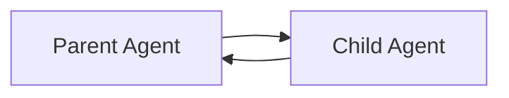
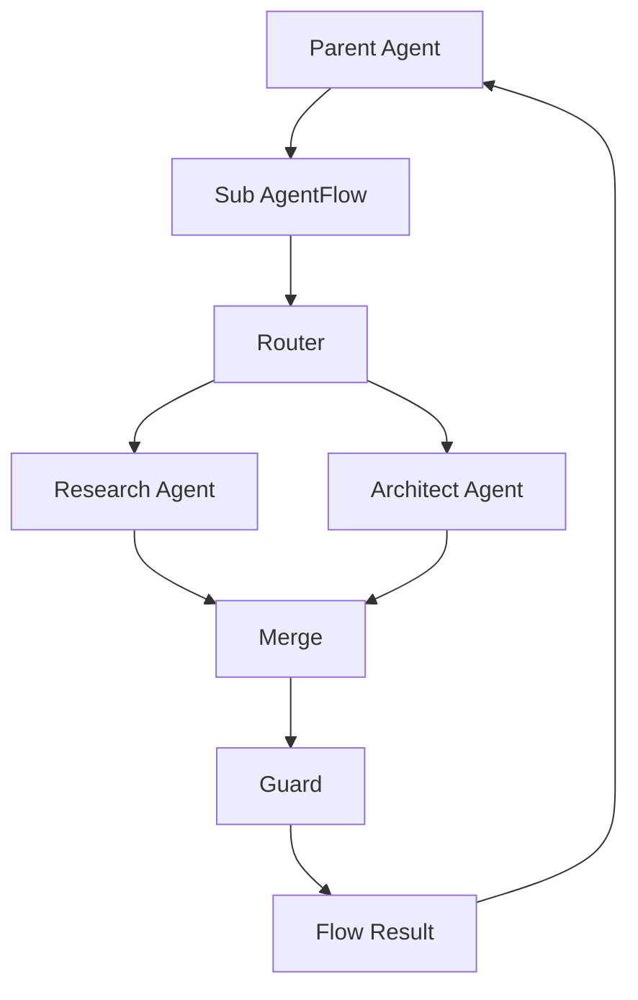

Tak, dokładnie. Nie trzeba od razu robić ciężkiego “workspace super-orchestratora”. Wystarczy wprowadzić trzeci typ delegacji:

```text
sub_agent       = prosty child chat / jednoagentowy wątek
cli_agent       = delegacja do zewnętrznego toola/procesu
sub_agentflow   = child conversation uruchamiana jako graf/architektura agentów
```

I to jest bardzo dobre rozróżnienie.

## Różnica semantyczna

```text
run_subagent
  → “zrób mi jedną rzecz jako osobny agent”

run_cli_agent
  → “odpal zewnętrznego wykonawcę, np. Copilot/Claude Code/Gemini CLI”

run_sub_agentflow
  → “stwórz nową rozmowę/architekturę i przeprowadź ją według wybranego grafu”
```

Czyli `sub_agentflow` nie jest kolejnym agentem. To jest **zagnieżdżony flow run**, który może mieć wielu agentów, guardy, routery, parallel branches i własny final result.

## Proponowany model

```ts
type ChildExecutionKind =
  | 'sub_agent'
  | 'cli_agent'
  | 'sub_agentflow';
```

A tool mógłby wyglądać tak:

```ts
type RunSubAgentFlowArgs = {
  flowId: string;
  goal: string;
  context?: string;
  parentSessionId: string;
  vfsMode?: 'isolated' | 'shared';
  copyBack?: boolean;
  returnMode?: 'summary' | 'full_trace' | 'artifacts_only';
  maxSteps?: number;
};
```

Wynik:

```ts
type SubAgentFlowResult = {
  flowRunId: string;
  childSessionId: string;
  status: 'done' | 'failed' | 'cancelled' | 'blocked';
  summary: string;
  decisions: string[];
  nextActions: string[];
  artifacts: string[];
  tracePreview?: AgentFlowTraceItem[];
};
```

## Jak to się różni od `sub_agent`

`sub_agent`:



`sub_agentflow`:



Czyli rodzic nie musi zarządzać każdym agentem ręcznie. Rodzic mówi:

> “Odpal mi flow `architecture_debate` dla tego problemu i wróć z decyzjami.”

## To pasuje do obecnej architektury Kalio

Kalio już ma obecnie izolację na poziomie `ChatSession`: historia, VFS, KV, approvale i lineage sub-agentów są związane z sesją . Ma też rodzinę tooli sub-agentowych `run_subagent`, `spawn_subagent`, `message_subagent` oraz `SubagentRuntimeService` . Więc `sub_agentflow` można potraktować jako naturalne rozszerzenie tego samego modelu, tylko zamiast jednego child agent loopa uruchamiasz child graph runtime.

## Minimalna implementacja

Nie robiłbym od razu nowych projektów/workspace’ów. Tylko:

```text
Parent ChatSession
  └─ run_sub_agentflow(...)
       ├─ creates Child ChatSession
       ├─ creates FlowRun
       ├─ executes AgentFlowRuntime
       ├─ streams flow events
       └─ returns summary to parent
```

Czyli wystarczą nowe byty:

```ts
type AgentFlowDefinition = {
  id: string;
  name: string;
  version: number;
  entryNodeId: string;
  nodes: AgentFlowNode[];
  edges: AgentFlowEdge[];
};

type AgentFlowRun = {
  id: string;
  parentSessionId: string;
  childSessionId: string;
  flowDefinitionId: string;
  status: 'running' | 'done' | 'failed' | 'cancelled';
  summary?: string;
  createdAt: number;
  finishedAt?: number;
};
```

I nowy tool:

```text
run_sub_agentflow
```

## Najlepszy UX

W czacie rodzica pokazujesz bubble:

```text
AgentFlow: Architecture Debate
status: running
nodes:
  ✓ Context Builder
  ✓ Pragmatic Architect
  ✓ Skeptic Reviewer
  ⏳ Merge
  pending: Guard
```

Po kliknięciu otwiera się child conversation / graf.

Czyli użytkownik widzi:

```text
Parent conversation
  └─ Sub AgentFlow #42
      ├─ open as chat
      ├─ open as graph
      ├─ see tool calls
      └─ copy artifacts back
```

To jest dużo czytelniejsze niż “super orkiestrator tworzy projekty”. Najpierw wystarczy zagnieżdżony flow.

## Najważniejsza zasada

`sub_agentflow` powinien być traktowany jak **tool delegacyjny**, ale jego wykonanie powinno być **pełnym flow runtime**.

Czyli:

```text
Dla parent agenta:
  sub_agentflow = tool call

Dla systemu:
  sub_agentflow = osobny AgentFlowRun + child session + trace
```

To daje prosty interfejs dla LLM, ale mocny model dla backendu i UI.

## Proponowana hierarchia

```text
Agent delegation tools:

1. run_subagent
   - szybka analiza
   - jeden agent
   - prosta odpowiedź

2. run_cli_agent
   - zewnętrzny proces
   - kodowanie/testy
   - streaming terminala

3. run_sub_agentflow
   - złożony protokół
   - wielu agentów
   - guardy/routery/merge
   - osobny trace/graf
```

## Przykładowe użycie

User:

> Zaprojektuj mi AgentFlowRuntime, ale zrób debatę architektoniczną.

Parent agent robi:

```json
{
  "tool": "run_sub_agentflow",
  "args": {
    "flowId": "architecture_debate",
    "goal": "Zaprojektować AgentFlowRuntime dla Kalio",
    "returnMode": "summary",
    "vfsMode": "isolated",
    "copyBack": false
  }
}
```

A wynik wraca jako:

```text
Sub AgentFlow completed.

Decision:
- AgentFlowRuntime powinien być nad ChatService, a nie w ChatService.
- NodeRunner powinien odpalać ChatService per node.
- Flow events powinny być osobną rodziną socket eventów.
- Guardy powinny działać jako node’y, nie jako tool post-processing.

Next actions:
1. Dodać tabele agent_flow_definitions i agent_flow_runs.
2. Dodać run_sub_agentflow tool.
3. Dodać FlowTracePanel w UI.
```

## Moja rekomendacja

Tak — zacząłbym właśnie od `sub_agentflow`, nie od pełnego workspace orchestratora.

Najprostsza ścieżka:

```text
Etap 1:
  AgentFlowDefinition jako JSON
  AgentFlowRuntimeService
  run_sub_agentflow tool
  Child session + summary result

Etap 2:
  Streaming eventów flow:node_start/result/edge_taken
  UI bubble + graf trace

Etap 3:
  Biblioteka gotowych flow:
    - architecture_debate
    - coding_review
    - deep_research
    - release_guard

Etap 4:
  Dopiero potem project/workspace orchestrator
```

Czyli najpierw budujesz **kompozycyjność agentów**, a dopiero potem **zarządzanie projektami**.

To jest lepsze MVP, bo daje największą wartość bez rozdmuchiwania domeny.
