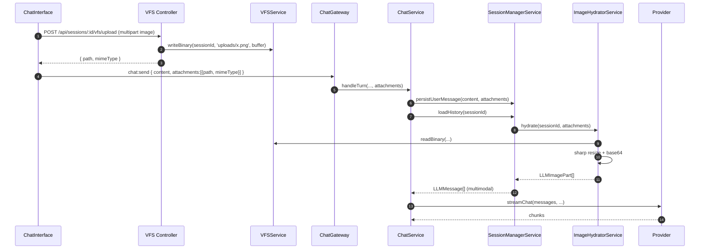

# Image Attachments — Design Spec

**Status:** Draft, awaiting approval before implementation.
**Goal:** End-user pastes/drops an image into chat → image is stored in session VFS → on next LLM turn the model receives the actual image (not a text reference) → if image is large, it is downscaled before being sent to the LLM.

---

## 1. Requirements

### Functional
- **R1.** User can attach one or more images to a chat message via paste, drag-drop, or file picker.
- **R2.** Image is uploaded to per-session VFS under `files/uploads/<id>.<ext>`. The session sandbox path-traversal rules from `VFSService.resolveSafe` apply unchanged.
- **R3.** The user message is persisted with `attachments: [{ path, mimeType }, ...]`.
- **R4.** When building the LLM request history, every assistant-visible image is materialised into an OpenAI-compatible multimodal `content` array containing `{ type: 'text', ... }` and `{ type: 'image_url', image_url: { url: 'data:<mime>;base64,...' } }` parts.
- **R5.** Images larger than the resize threshold are downscaled before being base64-encoded.
- **R6.** Frontend renders attached images inside the user bubble (thumbnail + click-to-open).

### Non-functional
- **NF1.** Resize budget: longest side ≤ 1568 px (Anthropic guidance; safe for OpenAI/Gemini), output JPEG q85 when source > 1 MB.
- **NF2.** Hard ceiling: per-image base64 ≤ 5 MB. If the resized result is still over, hydration emits a structured error and the turn fails fast (no silent truncation).
- **NF3.** Backwards compatibility: existing string-only messages stay unchanged. `LLMMessage.content` becomes `string | LLMContentPart[]`.
- **NF4.** Streaming pipeline (`StreamProcessor`, handlers, middleware) is **not** modified — image support is a content-layer concern only.
- **NF5.** No image bytes ever flow over the WebSocket. Upload uses HTTP multipart; only paths cross WS in `chat:send`.

### Forbidden
- No filesystem access outside `VFSService` (rule from `AGENTS.md`).
- No `any` types.
- No new endpoints under `/sessions/:id/...` outside the modules that already own that namespace (chat for sessions, vfs for files).

---

## 2. Data Contracts

### 2.1 `@kalio/types` additions

```ts
// Multimodal content
export interface LLMTextPart   { type: 'text'; text: string }
export interface LLMImagePart  { type: 'image_url'; image_url: { url: string } }   // url is a data URL
export type    LLMContent      = string | Array<LLMTextPart | LLMImagePart>;

export interface LLMMessage {
  role: LLMRole;
  content: LLMContent;            // was: string
  toolCallId?: string;
  toolCalls?: LLMToolCall[];
}

// Persistence-level attachment reference
export interface ChatAttachment {
  path: string;                    // VFS-relative, e.g. 'uploads/abc123.png'
  mimeType: string;                // e.g. 'image/png'
}

export interface ChatMessage {
  // ...existing fields...
  attachments?: ChatAttachment[];
}

// Socket contract
'chat:send': { sessionId: ID; content: string; personaId: ID; attachments?: ChatAttachment[] };
```

### 2.2 DB schema (`messages` table)

Add nullable JSON column:

```ts
attachments: text('attachments', { mode: 'json' }).$type<ChatAttachment[] | null>(),
```

Migration: `drizzle-kit push` against the SQLite dev DB (column is nullable, no backfill needed). For existing prod DBs the same push works because SQLite tolerates nullable column adds.

---

## 3. New REST endpoint

### `POST /api/sessions/:id/vfs/upload`

**Module:** `VFSModule` (extends existing `SessionVfsController`).
**Body:** `multipart/form-data` with field `file` (single image).
**Limits:** 10 MB request body; only `image/png|jpeg|webp|gif` accepted.
**Behaviour:**
1. Generate `id = nanoid()` and infer `ext` from MIME.
2. Save to VFS via `VFSService.writeBinary(sessionId, 'uploads/<id>.<ext>', buffer)` (new method, see §4.1).
3. Return `{ path: 'uploads/<id>.<ext>', mimeType }`.

**Errors:** 413 (too large), 415 (bad MIME), 400 (no file), 404 (session not found is implicit because VFS is sandboxed by `sessionId`).

---

## 4. Backend components

### 4.1 `VFSService.writeBinary(sessionId, filePath, buffer)`

Mirror of `writeFile` but accepts `Buffer` and writes binary. Uses the same `resolveSafe` traversal guard. Required because current `writeFile` writes UTF-8 strings.

### 4.2 `ImageHydratorService` (new, in `chat/`)

```ts
@Injectable()
class ImageHydratorService {
  constructor(private readonly vfs: VFSService) {}

  async hydrate(sessionId: string, attachments: ChatAttachment[]): Promise<LLMImagePart[]>;
}
```

Pipeline per attachment:
1. Read raw bytes via `VFSService` (new `readBinary` helper).
2. If `bytes > 1 MB` OR `width/height > 1568` → run `sharp(buffer).rotate().resize({ width: 1568, height: 1568, fit: 'inside', withoutEnlargement: true }).jpeg({ quality: 85 })`.
3. Encode to base64 data URL.
4. Reject (`PAYLOAD_TOO_LARGE` typed error) if final base64 > 5 MB.

Pure dependency on `sharp` (new dep). No FS access outside VFS.

### 4.3 `SessionManagerService` changes

`toChatMessages(msg: ChatMessage)` becomes async to allow image hydration:

- For `role === 'user'` with `attachments?.length > 0`:
  - text part = `{ type: 'text', text: msg.content }`
  - image parts = `await hydrator.hydrate(sessionId, msg.attachments)`
  - emit `LLMMessage { role: 'user', content: [textPart, ...imageParts] }`
- Otherwise behaviour unchanged.

`loadHistory` changes signature to `Promise<LLMMessage[]>` (already is) and takes `sessionId` (already does). Hydrator injected via constructor.

### 4.4 `ChatService.handleTurn`

New optional parameter:
```ts
handleTurn(sessionId, content, personaId, emit, attachments?)
```

`SessionManagerService.persistUserMessage` extended to accept `attachments`. `ChatGateway` forwards `payload.attachments`.

### 4.5 Provider

`BaseOpenAICompatibleProvider` already passes `messages` through unchanged. Confirm by inspection — no code change expected.

---

## 5. Frontend (minimum viable)

### 5.1 Upload flow
- `ChatInterface`: paste handler (`onPaste`) and drop handler (`onDrop`) build `FormData`, POST to `/api/sessions/:id/vfs/upload`, append result to local `pendingAttachments` state.
- Render preview chips above the textarea (thumbnail + remove button).
- On send: include `attachments: pendingAttachments` in `chat:send`, then clear.

### 5.2 Bubble rendering
- For user messages with `attachments`, render images inline (``). The download endpoint already exists.

---

## 6. Sequence — full happy path



---

## 7. Tests (V-Model targets)

| Layer | Spec | What it proves |
|------|------|---------------|
| Unit | `image-hydrator.service.spec.ts` | Resize triggered above threshold; below-threshold passthrough; oversize → typed error; reads through VFS only. |
| Unit | `session-vfs.controller.upload.spec.ts` | 200 happy path; 415 bad MIME; 413 too large; path traversal blocked. |
| Unit | `vfs.service.write-binary.spec.ts` | Buffer write hits sandbox dir; traversal denied. |
| Integration | `session-manager.service.spec.ts` (extend) | History conversion produces multimodal `content` array when attachments present; preserves string content otherwise. |
| Integration | `chat.service.spec.ts` (extend) | Attachments are persisted with the user message and forwarded into history. |

No changes required to existing handler/middleware specs — pipeline is content-agnostic (NF4).

---

## 8. Out of scope (deferred)

- Multi-image bubble layout polish.
- Server-side OCR or alt-text generation.
- Per-persona toggle to disable vision (can be added later via persona config).
- Audio/video attachments — dedicated spec when needed.

---

## 9. Risks & mitigations

| Risk | Mitigation |
|-----|------------|
| Provider rejects multimodal content | Provider list in this repo (OpenRouter, OpenAI, CometAPI, MiMo, Ollama) all support OpenAI multimodal schema. Document required model variants in persona config. |
| Sharp native binary install issues on Windows | Pin to a known-good version (`^0.33`) and run `pnpm install --recursive` once. |
| Base64 inflation breaks 5 MB ceiling for HEIC/large PNG | `sharp` re-encodes to JPEG when input > 1 MB; threshold tuned in NF1. |
| Stale upload files clutter VFS | Cleanup is out of scope here; VFS already supports zip/download so admin can prune. Add TTL job in a follow-up. |

---

## 10. Acceptance criteria

- [ ] Pasting a 4 MB PNG into the chat input shows a thumbnail.
- [ ] Sending the message triggers an upload + chat turn.
- [ ] LLM (a vision-capable model configured in active persona) responds correctly describing the image.
- [ ] DB row for the user message has `attachments` JSON populated.
- [ ] Image file exists in VFS under `uploads/`.
- [ ] All existing 81 chat tests still pass; new specs from §7 are green.
- [ ] No regression in non-image chat flows.
