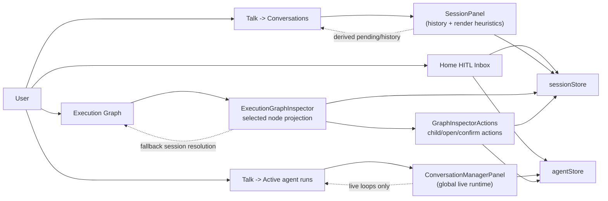
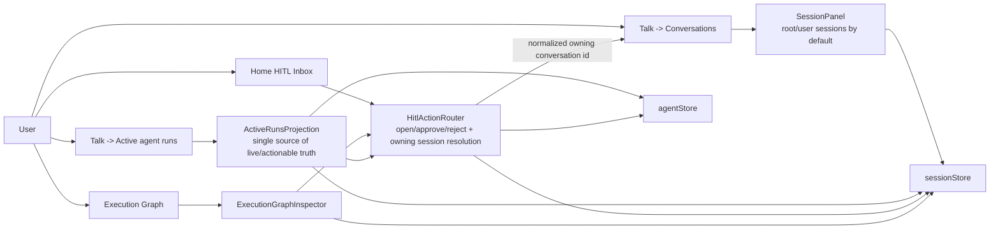
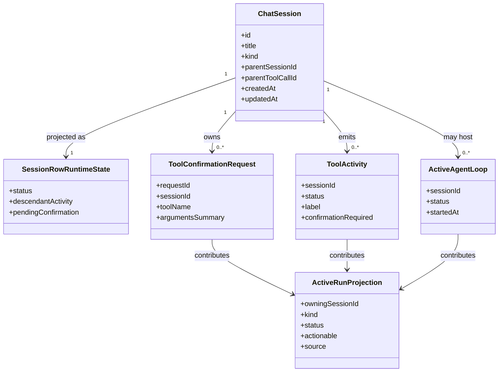

# Active Agent Runs and HITL Repair Plan

> **For agentic workers:** REQUIRED SUB-SKILL: use `superpowers:subagent-driven-development` or `superpowers:executing-plans` to implement this plan in small verified slices.

**Goal:** Repair the Talk experience so `Active agent runs` reflects real live activity, stale architecture/sub-agent history does not masquerade as active work, and HITL confirmations remain actionable from at least one obvious surface.

**Manual repro date:** 2026-06-14

## Acceptance Criteria

- [ ] `Talk -> Active agent runs` shows only real live runs, live tool activity, or pending HITL confirmations for the current runtime state.
- [ ] `Talk -> Conversations -> All` does not promote stale architecture branch sessions into the primary list as if they were active.
- [ ] `Talk -> Conversations -> Agents` no longer floods the sidebar with historical child sessions that are not currently actionable.
- [ ] A session marked `Awaiting confirmation` is actionable from a visible surface:
  - `Active agent runs`, or
  - the owning conversation, or
  - the execution graph inspector.
- [ ] Opening a HITL item always lands in the owning conversation session, not a child/projection mismatch.
- [ ] Graph inspector actions for pending confirmations and child-session navigation are covered by tests.

## Verified Repro

Manual Playwright orchestration on local dev stack (`http://127.0.0.1:5188/`) produced a stable mismatch:

1. `Talk -> New`
2. `Talk -> Active agent runs`
3. Empty state appears: `No active agent runs. Start a chat to see live tool calls here.`
4. `Talk -> Conversations -> filter=Agents`
5. Sidebar shows `210 chats` with many historical `Sub-agent` / `CLI agent` sessions, many marked `pending` or `completed`
6. Example session `Please review` is marked `Awaiting confirmation`
7. Opening `Please review` works, but the conversation surface does not expose obvious `Approve/Reject` controls
8. Switching back to `Active agent runs` returns to the empty state

This means the product currently has two conflicting truths:

- the conversation/session tree says there are many agent items and pending descendants
- the active-runs projection says there are zero active runs

## Root Cause Summary

### 1. Session list regression: stale architecture branches are now renderable and pending

Local diffs in these files changed the list semantics:

- `apps/kalio-web/src/features/sessions/sessionRenderableFilter.ts`
- `apps/kalio-web/src/features/sessions/sessionRowRuntimeState.ts`
- `apps/kalio-web/src/features/sessions/SessionPanel.tsx`
- `apps/kalio-web/src/features/sessions/SessionPanelRow.tsx`

Observed effect:

- architecture branch sessions are treated as renderable immediately
- branch sessions can be labeled `pending` without live runtime evidence
- descendant activity bubbles up into root rows even when the runtime is already idle

### 2. `Active agent runs` and `Conversations > Agents` are driven by different concepts

- `apps/kalio-web/src/features/sessions/ConversationManagerPanel.tsx` reads global live runtime state (`activeAgentLoops`, `toolActivities`, `llmActivities`, `isStreaming`)
- `apps/kalio-web/src/features/sessions/SessionPanel.tsx` / `sessionTreeDisplay` read persisted session history plus projection heuristics

Observed effect:

- `Active agent runs` is effectively a live-runtime dashboard
- `Agents` filter is effectively a history browser of child sessions
- both are placed next to each other as if they describe the same thing

### 3. HITL ownership and navigation are fragmented

Relevant files:

- `apps/kalio-web/src/features/landing/HomeHitlInbox.tsx`
- `apps/kalio-web/src/features/landing/LandingPage.tsx`
- `apps/kalio-web/src/App.tsx`
- `apps/kalio-web/src/features/sessions/SessionPanel.tsx`
- `apps/kalio-web/src/features/chat/graph/ExecutionGraphInspector.tsx`
- `apps/kalio-web/src/features/chat/graph/GraphInspectorActions.tsx`

Observed effect:

- Landing inbox can approve/reject, but session-opening is separately wired
- `App.openSessionInConversation(sessionId)` uses raw session ids
- `SessionPanel` normalizes to the owning/root conversation before navigation
- graph inspector display falls back to `activeSessionId`, while actions require a concrete `node.sessionId`

Result:

- the UI can know that a confirmation exists, but the action surface and the owning conversation are not consistently resolved

## Current Architecture

## Target Architecture

## Affected Models

## Repair Slices

### Slice 1: Stop false-positive session rendering

**Files:**

- `apps/kalio-web/src/features/sessions/sessionRenderableFilter.ts`
- `apps/kalio-web/src/features/sessions/sessionRowRuntimeState.ts`
- `apps/kalio-web/src/features/sessions/sessionRenderableFilter.test.ts`
- `apps/kalio-web/src/features/sessions/sessionRowRuntimeState.test.ts`

**Change:**

- restore the rule that architecture child/branch sessions are not first-class renderable rows without evidence
- only show `pending` when live runtime state, pending confirmation, or actionable descendant evidence exists
- remove branch-only fallback that marks sessions `pending` merely because they belong to an architecture run

**Verification:**

- focused Vitest for renderability/runtime-state helpers
- manual check: `Talk -> Conversations -> All` no longer shows stale agent children as active

### Slice 2: Redefine the `Agents` filter

**Files:**

- `apps/kalio-web/src/features/sessions/SessionPanel.tsx`
- `apps/kalio-web/src/features/sessions/sessionTreeDisplay.ts`
- `apps/kalio-web/src/features/sessions/sessionListModel.ts`
- related tests in `SessionPanel.test.tsx`

**Change options:**

1. Preferred: `Agents` becomes an actionable agent-session view, not a raw history dump.
2. Alternative: keep it as history, but rename and visually separate it from `Active agent runs`.

**Recommendation:**

- pick option 1 now, because the current naming creates a direct contradiction with `Active agent runs`
- show grouped owning conversations first, then only currently actionable or explicitly expanded child sessions

**Verification:**

- manual check: `Talk -> Conversations -> Agents` should not show hundreds of stale rows by default
- regression tests for grouping/order/filter behavior

### Slice 3: Centralize HITL routing

**Files:**

- `apps/kalio-web/src/App.tsx`
- `apps/kalio-web/src/features/landing/HomeHitlInbox.tsx`
- `apps/kalio-web/src/features/landing/LandingPage.tsx`
- `apps/kalio-web/src/features/sessions/ConversationManagerPanel.tsx`
- new small helper if needed: `apps/kalio-web/src/features/sessions/resolveOwningConversationSession.ts`

**Change:**

- normalize session opening through one shared helper
- ensure `Open`, `Approve`, and `Reject` surfaces can resolve the owning conversation session
- add an explicit `Open conversation` action anywhere a pending confirmation is visible

**Verification:**

- landing-page test for open-session callback
- manual check: opening a HITL item lands in the right conversation

### Slice 4: Repair graph inspector actions

**Files:**

- `apps/kalio-web/src/features/chat/graph/ExecutionGraphInspector.tsx`
- `apps/kalio-web/src/features/chat/graph/GraphInspectorActions.tsx`
- `apps/kalio-web/src/features/chat/graph/ExecutionGraphInspector.test.tsx`
- possibly `apps/kalio-web/src/features/chat/graph/ExecutionGraphView.tsx`

**Change:**

- unify session ownership used for inspector display and action buttons
- ensure pending confirmation nodes expose `Approve` / `Reject`
- ensure child/open-session actions use normalized owning conversation ids where needed
- consider mounting the live sidebar if it is part of the intended navigation model

**Verification:**

- dedicated tests for:
  - confirmation buttons
  - open-session behavior
  - hidden actions for ghost nodes
- manual graph check from a session with pending confirmation

### Slice 5: Align `Active agent runs` with actionable truth

**Files:**

- `apps/kalio-web/src/features/sessions/ConversationManagerPanel.tsx`
- `apps/kalio-web/src/features/sessions/ConversationManagerPanel.test.tsx`
- possibly a new projection helper near `agentStore` consumers

**Change:**

- treat pending HITL confirmations as actionable live items even when token streaming already stopped
- add `Open conversation` affordance to each actionable run item
- optionally show a separate empty state for `no active runs, but pending approvals exist elsewhere` only if product intentionally wants that distinction

**Verification:**

- component test for empty vs actionable state
- manual check: if a confirmation exists, the panel should not trap the user in an empty-state dead end

## Recommended Implementation Order

1. Fix false-positive renderability/runtime state.
2. Add shared owning-session resolution helper.
3. Repair `Active agent runs` actions.
4. Repair graph inspector actions.
5. Tighten or rename the `Agents` filter based on the new semantics.
6. Run manual A/B verification again on:
   - `New Chat -> Active agent runs`
   - `Conversations -> Agents`
   - `Please review`
   - `Execution Graph`

## Verification Matrix

- Unit:
  - `sessionRenderableFilter`
  - `sessionRowRuntimeState`
  - graph inspector action tests
  - conversation manager panel tests
- Integration:
  - landing inbox open-session wiring
  - active-runs to conversation navigation
- Manual:
  - empty `New Chat`
  - stale historical architecture sessions
  - pending confirmation session
  - graph navigation

## Risks

- Existing local WIP in session panel files is likely the immediate source of the regression. Changes must be rebased carefully onto that work instead of reverted blindly.
- The product currently conflates three concepts:
  - live runtime activity
  - persisted child-session history
  - actionable HITL state
  If we fix only one surface, the contradiction will persist elsewhere.
- The graph view likely has a second bug unrelated to the sidebar mismatch: confirmation/navigation actions are gated by `node.sessionId`, while inspector display can fall back to `activeSessionId`.

## Next Best Action

Implement **Slice 1** and **Slice 3** first. They are the smallest changes that remove the false `pending` flood and restore a reliable way to reach and action HITL items.
