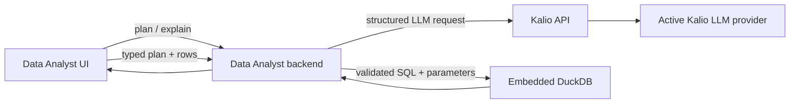

# Data Analyst with Kalio LLM Engine Design

**Date:** 2026-07-29
**Scope:** First hybrid integration slice between Kalio and `data-analitic`

## Outcome

Make Kalio the only LLM engine used by the existing Data Analyst application,
while Data Analyst remains the product-specific analysis UI and execution
backend. Add DuckDB as an embedded, local analytical engine in Data Analyst.

The first slice preserves the current Data Analyst `/api/plan` and
`/api/explain` browser contract. Its backend translates those calls to one
versioned Kalio structured-output endpoint. Data calculations move from the
browser to a new Data Analyst `/api/execute` endpoint backed by an in-memory
DuckDB instance.

## Accepted architecture



Kalio owns provider selection, credentials, model configuration, and structured
LLM generation. Data Analyst owns the analyst prompts, semantic layer,
deterministic query compilation, DuckDB execution, charts, and product UX.

DuckDB runs in the Data Analyst Node.js process through `@duckdb/node-api`. It
is not a separate Docker service. The initial database is in-memory and rebuilt
per request; persistent `.duckdb` project storage is deferred until the import
and project-lifecycle contract exists.

## Kalio API contract

Add `POST /api/v1/llm/structured`:

```json
{
  "messages": [
    { "role": "system", "content": "Return a valid analysis plan." },
    { "role": "user", "content": "Revenue by region." }
  ],
  "outputSchema": {
    "name": "data_analyst_plan",
    "description": "A deterministic query plan",
    "strict": true,
    "schema": {
      "type": "object",
      "properties": {},
      "additionalProperties": false
    }
  },
  "maxOutputTokens": 2048
}
```

Success:

```json
{
  "output": {},
  "meta": {
    "provider": "openrouter",
    "model": "configured-model",
    "source": "db"
  }
}
```

The controller accepts only bounded text messages with the
`system | user | assistant` roles, a named JSON Schema object, and an optional
bounded output-token limit. It delegates generation to the existing
`LLMService`, sends no tools, and returns the structured provider result plus
non-secret effective-provider metadata.

Invalid request bodies return `400`. A provider response that does not satisfy
the structured-output callback contract returns `502`. Provider/configuration
failures retain the API's existing error mapping and do not disclose secrets.

## Data Analyst adapter

Remove the Gemini SDK and API-key dependency from the Data Analyst server.
Introduce a small Kalio client configured by:

- `KALIO_API_URL`, defaulting to `http://127.0.0.1:3016/api`;
- required `KALIO_API_TOKEN`, matching Kalio's
  `KALIO_EXTERNAL_API_TOKEN`.

`/api/plan` sends the analyst system prompt, user request, data profile, and
semantic layer to Kalio with a strict plan schema. `/api/execute` stores a
short-lived backend receipt for the validated plan and aggregate result.
`/api/explain` sends only the question, semantic context, and the trusted
aggregate result resolved from that receipt. Raw imported rows are not sent to
Kalio.

Kalio being unavailable returns a typed `503` from Data Analyst. An invalid
Kalio response returns `502`. The browser continues to use the current
Data Analyst endpoints and does not need provider credentials or model
configuration.

The Kalio endpoint is disabled when `KALIO_EXTERNAL_API_TOKEN` is absent. Every
caller, including a loopback caller, must send the matching bearer token.

## DuckDB execution boundary

Add `POST /api/execute` to Data Analyst. The request contains raw imported rows,
a typed query plan, and the semantic layer. The backend:

1. validates the plan against the semantic layer and imported columns;
2. creates an isolated in-memory DuckDB instance;
3. loads the rows into a temporary table;
4. compiles supported dimensions, measures, aggregations, filters, ordering,
   and limits into SQL;
5. binds filter values as parameters;
6. executes the query and returns the existing `QueryResult` shape;
7. closes the DuckDB connection and instance.

The backend never executes SQL emitted by an LLM. SQL is generated only from
the typed plan. Column identifiers are resolved from known semantic-layer
fields and quoted by the compiler. User/model values are parameterized.

## Error handling and limits

- Unknown fields, unsupported operators/aggregations, malformed plans, and
  incompatible values return `422`.
- Oversized or empty datasets return `413` or `422` with a user-readable
  message.
- Unexpected DuckDB failures return `500` without exposing SQL internals.
- Kalio timeouts and connection failures return `503`.
- Data Analyst includes an explicit request timeout when calling Kalio.
- Query limits are capped by the backend even when the model requests more.

## Verification

1. Kalio controller tests prove request validation, structured generation,
   provider metadata, and failure mapping.
2. Data Analyst adapter tests prove the exact Kalio payload and error mapping.
3. DuckDB tests use a deterministic fixture and verify aggregation, grouping,
   filtering, ordering, and rejection of unknown fields.
4. The frontend calls `/api/execute` and no longer performs the primary query
   calculation in the browser.
5. Kalio focused tests, API typecheck/build, Data Analyst tests/typecheck/build,
   and an isolated local smoke test pass.
6. A live paid/cheap-provider check is optional until the repository's paid-run
   readiness gate is explicitly satisfied; the mock provider is the mandatory
   local proof.

## Out of scope

- Kalio plugin installation, paid-plugin licensing, personas, workflows, and
  RA-App packaging.
- A general-purpose SQL endpoint or execution of model-provided SQL.
- Persistent DuckDB project files, migrations, or multi-user isolation.
- Moving Data Analyst charts or specialist libraries into Kalio.
- Adding a second LLM configuration UI to Data Analyst.
