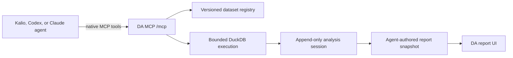
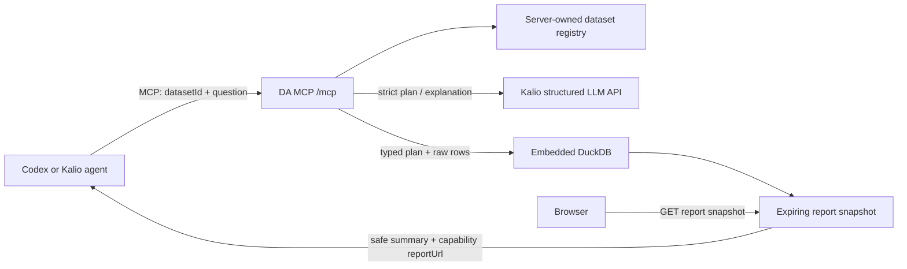

# Data Analyst MCP Tool and Report Design

**Date:** 2026-07-30
**Scope:** Local MVP exposing Data Analyst as an HTTP MCP server for Kalio and Codex

## Architecture amendment: native agent analysis

This amendment supersedes the aggregate-only workflow described later in this
document. `data_analyst_run_analysis` remains a compatibility facade, but the
native product contract is a session-scoped data and artifact engine:



The native tool set is:

- `data_analyst_list_datasets`
- `data_analyst_create_session`
- `data_analyst_profile_dataset`
- `data_analyst_query_sql`
- `data_analyst_search_text`
- `data_analyst_analyze_relationship`
- `data_analyst_read_artifact`
- `data_analyst_replay_artifact`
- `data_analyst_create_report`

Each session is tied to one analysis document and exact dataset fingerprints.
Every profile, query, search, relationship check, and replay creates an
immutable artifact with its input, output, timestamps, and lineage. The agent
interprets those artifacts and authors the final narrative; DA owns
deterministic computation, bounded raw-data access, durable history, replay,
and report rendering.

Raw SQL access is disabled by default and is enabled only for a trusted local
agent with `DA_MCP_RAW_ACCESS=enabled`. SQL is parsed as a single read-only
statement, constrained to the session datasets, and bounded by row, cell,
serialized-byte, memory, and thread limits. Raw artifacts cannot be embedded
in a report. Report-visible lineage redacts query literals while the durable
session retains the exact replay query.

Profiling covers nulls, duplicates, numeric ranges, quartiles, Tukey-IQR
outliers, suspicious mojibake markers, and likely categorical typo/encoding
variants. Text search is currently bounded literal substring search; a BM25
index is a later optimization, not part of the current contract.

The durable upload/catalog slice remains open. The current native engine uses
server-registered datasets, but the session and fingerprint model is already
designed for multiple uploaded dataset versions.

## Original compatibility-facade design

## Outcome

Data Analyst becomes a local analytical tool engine. An MCP client can discover
the available server-owned datasets, ask a business question, and receive a
deterministic aggregate result plus an expiring link to a Data Analyst report
page.

Kalio remains the LLM engine used to plan and explain the analysis. Data
Analyst remains the only owner of raw rows, DuckDB execution, report snapshots,
and the product-specific report UI.

## Accepted architecture



## MCP transport and authentication

- Endpoint: `POST /mcp`
- Protocol: stateless MCP Streamable HTTP
- Authentication: `Authorization: Bearer <DA_MCP_TOKEN>`
- Host: loopback only (`127.0.0.1`)
- Invalid or missing tokens fail before the MCP transport parses the request.
- Requests with an untrusted `Origin` header return `403`; wildcard CORS is
  never enabled.
- `GET /mcp` and `DELETE /mcp` are not session endpoints in the stateless MVP.
- The server never accepts arbitrary SQL and never accepts raw rows in MCP tool
  arguments.

## Tool contracts

### `data_analyst_list_datasets`

Input: no fields.

Output:

```json
{
  "datasets": [
    {
      "id": "sales_demo",
      "name": "Sprzedaż regionalna — demo",
      "description": "Deterministyczny zestaw testowy",
      "version": "1",
      "synthetic": true,
      "dimensions": [{ "id": "region", "label": "Region" }],
      "measures": [
        {
          "id": "revenue",
          "label": "Przychód",
          "aggregations": ["sum", "avg", "min", "max"]
        }
      ]
    }
  ]
}
```

The MVP registry contains one deterministic backend-owned fixture. Importing a
user dataset into a persistent registry is a later slice; exposing raw rows to
an LLM through MCP is explicitly forbidden.

### `data_analyst_run_analysis`

Input:

```json
{
  "datasetId": "sales_demo",
  "question": "Jaka była sprzedaż według regionu?"
}
```

The handler:

1. resolves the dataset from the local registry;
2. sends only the question, dataset summary, and semantic layer to Kalio;
3. validates the returned typed plan;
4. executes the plan against raw rows in embedded DuckDB;
5. sends only the aggregate result to Kalio for explanation;
6. stores an immutable one-hour report snapshot;
7. returns both MCP text content and structured content.

Structured result:

```json
{
  "executionId": "opaque-uuid",
  "title": "Sprzedaż według regionu",
  "datasetId": "sales_demo",
  "aggregateRowCount": 4,
  "explanation": "…",
  "explanationStatus": "complete",
  "warnings": [],
  "reportUrl": "http://127.0.0.1:3000/reports/opaque-capability-token",
  "expiresAt": "2026-07-30T12:00:00.000Z"
}
```

## Report snapshot and HTTP API

The server stores immutable snapshots in the existing bounded in-memory
execution store. Each snapshot contains:

- opaque execution id;
- an independent random report capability token of at least 192 bits;
- dataset id and safe dataset summary;
- original business question;
- validated plan;
- aggregate query result;
- explanation;
- creation and expiry timestamps.

Raw source rows are never stored in or returned by the report snapshot.

`GET /api/reports/:reportToken` returns an explicit safe report projection.
Expired or unknown tokens return `410 ANALYSIS_REPORT_EXPIRED` so the UI can
render a deliberate stale state. The internal `executionId` is a correlation
id, never the report credential. Report URLs are local previews, not public
share links.

The MCP response contains only title, explanation state, aggregate row count,
expiry, and the report URL. It does not return the plan, SQL, semantic layer,
or aggregate table into agent context.

The report response sets `Cache-Control: no-store`,
`Referrer-Policy: no-referrer`, `X-Content-Type-Options: nosniff`, and a
restrictive CSP with `frame-ancestors 'none'`. It loads no third-party assets
that could receive the capability URL.

## Report page

`/reports/:reportToken` uses the existing slate/white Data Analyst visual
system and Recharts dependency. It does not introduce a second router or design
system.

Reading order:

1. report identity, dataset, creation time, and expiry;
2. question and plain-language takeaway;
3. one primary chart with essential values visible without hover;
4. accessible result table containing the same values;
5. plan, filters, execution time, and audit metadata.

The page must work at desktop and mobile widths, expose a visible expired state,
and avoid color as the only carrier of meaning.

## Kalio and Codex integration

Kalio receives a managed `.kalio/config.toml` entry:

```toml
[mcp_servers.data_analyst]
enabled = true
required = false
url = "http://127.0.0.1:3000/mcp"
bearer_token_env_var = "DA_MCP_TOKEN"
enabled_tools = ["data_analyst_list_datasets", "data_analyst_run_analysis"]
default_tools_approval_mode = "prompt"
```

Codex receives the equivalent user-local MCP configuration using the same
environment variable. The token is never written into committed files.

## Error and safety boundaries

- Unknown datasets, invalid questions, malformed plans, and expired reports
  return typed tool errors.
- The question is bounded to 4,000 characters.
- MCP request bodies remain under the existing Express JSON limit.
- LLM and DuckDB errors are normalized without exposing credentials, raw rows,
  SQL internals, or stack traces.
- Destructive operations do not exist in this tool set.
- A local report URL is bearer-free only because the server is loopback-only
  and the path contains a short-lived independent capability token; production
  sharing requires authenticated persistent storage and is out of scope.
- The planner receives only the question plus safe registry metadata.
- Planning and explanation use Kalio's tool-free structured endpoint, avoiding
  recursive DA tool calls.
- Registry policy rejects identifiers as grouping dimensions, requires an
  aggregate measure, caps grouped rows and serialized payload bytes, and
  validates every plan field before DuckDB execution.
- The explanation receives only the approved aggregate result.
- A raw-only canary value in the demo fixture must be absent from model
  requests, MCP responses, report responses, logs, and errors.

## Verification

1. Unit tests prove dataset lookup, snapshot expiry/capability separation, MCP
   auth/origin validation, tool schemas, unknown ids, aggregate policy, and
   structured/text result compatibility.
2. A real MCP SDK client discovers and calls the tools over HTTP.
3. Data Analyst tests, typecheck, and production build pass.
4. Kalio connects through its existing MCP client, discovers the two tools,
   and calls at least the deterministic list/get path.
5. One real cheap-model run uses Kalio for plan and explanation, executes
   DuckDB, and returns a working report URL.
6. The report page is checked in the in-app browser at desktop and mobile
   widths, including the expired state.

## Out of scope

- Public or permanent share links.
- Persistent user dataset registration.
- Passing raw rows or aggregate tables through MCP/Kalio agent context.
- Model-provided SQL execution.
- A generic chart/dashboard builder inside Kalio.
- Plugin licensing, payments, personas, workflows, or RA-App packaging.
- Retrieving reports through a third MCP tool or MCP resource.
