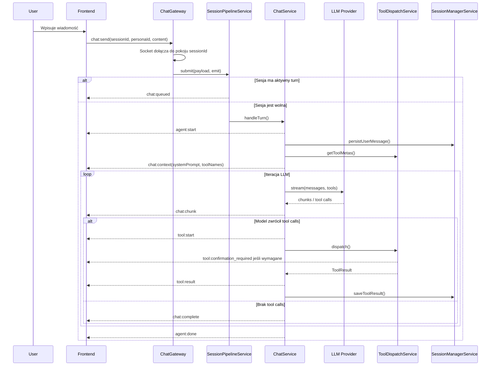
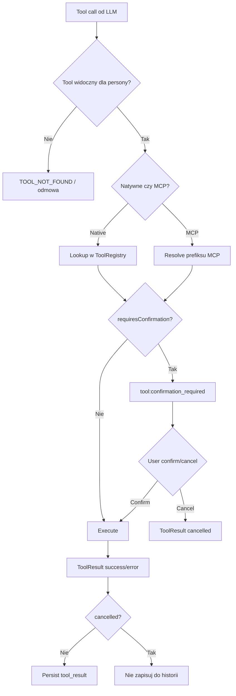
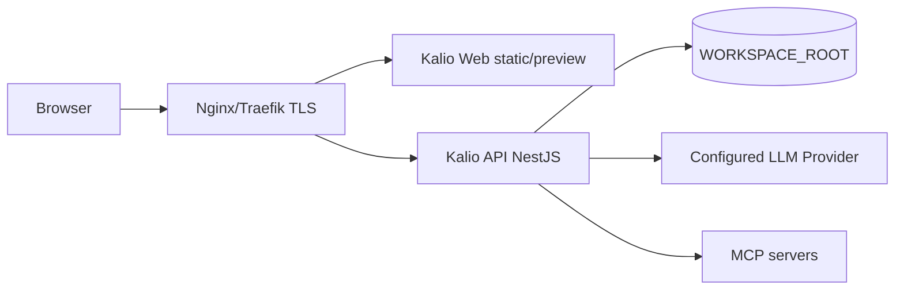

# DOKUMENTACJA TECHNICZNA KALIO

**Kalio / kalio-forever**  
**Local-first AI workspace z agentami, narzędziami, pamięcią semantyczną i izolowanym systemem plików**

| Pole | Wartość |
|---|---|
| Zakres dokumentu | Architektura, komponenty, moduły, workflow agentów, narzędzia, VFS, MCP, RA-App, pamięć, baza danych, bezpieczeństwo, eksploatacja, backup, aktualizacje, generacja kodu wynikowego, monitoring i ryzyka techniczne. |
| Podstawa opracowania | Aktualny README projektu, dokumentacja architektury narzędzi, logi sesji implementacyjnych Kalio oraz struktura referencyjnej dokumentacji technicznej portalu MK. |
| Charakter dokumentu | Dokumentacja referencyjna/as-built na poziomie technicznym. Zalecenia implementacyjne dla agentów kodujących są utrzymywane w `AGENTS.md`, a kierunki post-MVP w `docs/post-mvp-plans.md`. |
| Status | Wersja robocza gotowa do umieszczenia w repozytorium GitHub jako `docs/technical-documentation.md` lub `docs/kalio-technical-documentation.md`. |
| Odbiorcy | Autor projektu, contributorzy, agenci kodujący, reviewerzy architektury, przyszli administratorzy lokalnych/self-hosted wdrożeń. |

---

## Spis treści

1. [Cel i zakres dokumentu](#1-cel-i-zakres-dokumentu)
2. [Architektura logiczna i fizyczna](#2-architektura-logiczna-i-fizyczna)
3. [Moduły funkcjonalne](#3-moduły-funkcjonalne)
4. [Workflow konwersacji, agentów i narzędzi](#4-workflow-konwersacji-agentów-i-narzędzi)
5. [Model danych i struktura przechowywania](#5-model-danych-i-struktura-przechowywania)
6. [Interfejsy API i komunikacja](#6-interfejsy-api-i-komunikacja)
7. [Bezpieczeństwo](#7-bezpieczeństwo)
8. [Dostępność, UX i wielojęzyczność](#8-dostępność-ux-i-wielojęzyczność)
9. [Eksploatacja administracyjna](#9-eksploatacja-administracyjna)
10. [Kopie zapasowe i odtwarzanie](#10-kopie-zapasowe-i-odtwarzanie)
11. [Aktualizacje i utrzymanie](#11-aktualizacje-i-utrzymanie)
12. [Środowisko sprzętowo-systemowe wymagane do generacji kodu wynikowego](#12-środowisko-sprzętowo-systemowe-wymagane-do-generacji-kodu-wynikowego)
13. [Instrukcja generacji kodu wynikowego i wdrożenia](#13-instrukcja-generacji-kodu-wynikowego-i-wdrożenia)
14. [Monitoring, wydajność i Disaster Recovery](#14-monitoring-wydajność-i-disaster-recovery)
15. [Załączniki techniczne](#15-załączniki-techniczne)

---

## 1. Cel i zakres dokumentu

Niniejszy dokument opisuje techniczną koncepcję, aktualny model działania oraz sposób eksploatacji systemu **Kalio**. Kalio jest lokalnym lub self-hosted workspace'em AI, który łączy interfejs czatu z backendem zdolnym do wykonywania realnych narzędzi: pracy na plikach, uruchamiania procesów, wywoływania API, korzystania z pamięci semantycznej, obsługi MCP, renderowania mini-aplikacji RA-App oraz delegowania zadań do sub-agentów i zewnętrznych agentów CLI.

Dokument obejmuje:

- architekturę logiczną i fizyczną systemu,
- kluczowe moduły backendu i frontendu,
- przepływ konwersacji, streamingu, tool calli i HITL,
- model danych, storage i katalogi runtime,
- REST API, Socket.IO i kontrakty komunikacji,
- bezpieczeństwo i separację sesji,
- procedury utrzymaniowe, backupowe i aktualizacyjne,
- wymagania środowiskowe dla budowania i uruchamiania,
- monitoring, audyt, wydajność, ryzyka oraz checklisty.

Dokument ma charakter techniczny i może być traktowany jako baza dla:

- dokumentacji repozytorium GitHub,
- dokumentacji wdrożeniowej dla lokalnego/self-hosted środowiska,
- instrukcji dla agentów kodujących,
- opisu architektury dla contributorów,
- bazowego audytu bezpieczeństwa i utrzymania.

---

## 2. Architektura logiczna i fizyczna

### 2.1. Założenia architektoniczne

- Kalio działa w modelu **local-first/self-hosted**. Backend użytkownika komunikuje się bezpośrednio z wybranym providerem LLM, bez pośredniego cloud relay należącego do aplikacji.
- Frontend jest cienkim klientem: renderuje UI, obsługuje stan widoczny użytkownikowi i przekazuje zdarzenia sesyjne do backendu.
- Backend jest główną warstwą wykonawczą: zarządza kolejkami, historią, narzędziami, VFS, pamięcią, MCP, RA-App, CLI agentami, persystencją i audytem.
- Podstawową jednostką izolacji jest **ChatSession**. Z sesją powiązane są: historia wiadomości, VFS, KV store, aktywne zatwierdzenia HITL, kolejka wykonania, przerwania oraz lineage sub-agentów.
- Narzędzia są rejestrowane statycznie jako natywne klasy NestJS lub dynamicznie przez MCP. Widoczność narzędzi jest filtrowana przed przekazaniem ich do modelu.
- Operacje destrukcyjne i trwałe powinny przechodzić przez **Human-in-the-Loop confirmation gate**.
- Stan trwały MVP oparty jest o SQLite + Drizzle, pliki sesyjne oraz plikowe bazy pamięci `sqlite-vec`.
- Architektura jest modułowym monolitem NestJS. Migracja do PostgreSQL, remote VFS, pracy zespołowej i wieloużytkownikowości jest przewidziana jako post-MVP.

### 2.2. Referencyjny diagram systemu

```mermaid
flowchart LR
    subgraph FE[Frontend - React]
        App[App shell]
        ChatUI[ChatInterface]
        SessionsUI[SessionPanel]
        SettingsUI[Settings]
        RAAppUI[RA-App UI]
        SessionStore[sessionStore]
        AgentStore[agentStore]
        SDK[Kalio SDK / Socket.IO client]
    end

    subgraph Shared[Shared contracts]
        Types[@kalio/types]
        SDKPkg[@kalio/sdk]
    end

    subgraph BE[Backend - NestJS]
        Gateway[ChatGateway]
        Pipeline[SessionPipelineService]
        Chat[ChatService]
        Stream[StreamProcessorService]
        Dispatch[ToolDispatchService]
        Registry[ToolRegistryService]
        VFS[VFSService]
        MCP[MCPService]
        Memory[MemoryService]
        RAApp[RAAppService + Versioning]
        Image[ImageModule]
        CLIAgent[CLIAgentService]
        Search[SearchModule]
    end

    subgraph Data[Storage]
        DB[(SQLite / kalio.db)]
        SessionFiles[WORKSPACE_ROOT/sessions]
        KV[_kv.json per session]
        MemoryDB[memory/{personaId}.db]
        RAApps[ra-apps catalog]
        CLIConfig[~/.kalio/cli-agents]
    end

    App --> ChatUI
    App --> SessionsUI
    App --> SettingsUI
    App --> RAAppUI
    ChatUI --> SessionStore
    ChatUI --> AgentStore
    ChatUI --> SDK
    SDK --> Gateway

    Types --> SDKPkg
    Types --> Chat
    Types --> Dispatch
    SDKPkg --> SDK

    Gateway --> Pipeline
    Pipeline --> Chat
    Chat --> Stream
    Chat --> Dispatch
    Dispatch --> Registry
    Dispatch --> MCP
    Dispatch --> VFS
    Dispatch --> Memory
    Dispatch --> RAApp
    Dispatch --> Image
    Dispatch --> CLIAgent
    Dispatch --> Search

    Chat --> DB
    VFS --> SessionFiles
    VFS --> KV
    Memory --> MemoryDB
    RAApp --> RAApps
    CLIAgent --> CLIConfig
```

### 2.3. Referencyjny diagram komponentów

| Warstwa | Komponent | Rola |
|---|---|---|
| Prezentacja | `kalio-web` / React 19 | Interfejs rozmów, sesji, ustawień, narzędzi, pamięci, observability, RA-App i wyników narzędzi. |
| Komunikacja | `@kalio/sdk`, Socket.IO | Warstwa klienta zdarzeń: `chat:send`, `chat:chunk`, `tool:*`, `agent:*`, `cli_agent:progress`. |
| Aplikacja | `kalio-api` / NestJS 11 | Backend runtime: kolejki sesji, streaming, LLM loop, bezpośrednie LLM, Codex App Server, narzędzia, VFS, pamięć, MCP, RA-App, CLI agent, audyt. |
| Kontrakty | `@kalio/types` | Wspólne typy DTO, Socket events, wyniki narzędzi, konfiguracje providerów, modele RA-App i CLI. |
| Narzędzia | `ToolRegistryService` | Odczyt dekoratorów `@Tool()` / `@ConfirmedTool()`, rejestr natywnych tooli, override polityk confirmation. |
| Dispatch | `ToolDispatchService` | Łączenie narzędzi natywnych i MCP, HITL, wykonanie, obsługa błędów, `ToolResult`. |
| Integracja | `MCPService` | Dynamiczne wykrywanie narzędzi z serwerów MCP stdio/HTTP, lifecycle i filtrowanie per persona. |
| Agenci | `SubagentRuntimeService`, `CLIAgentService` | Delegacja do child sessions oraz do procesów CLI: Copilot, Gemini, Claude Code i inne adaptery. |
| Runtime agentów | `ExecutionProfileService`, `CodexAppServerHost`, `CodexAppServerLLMSource` | Wybór silnika per projekt/persona/sesja, jeden długowieczny App Server per profil auth, dynamiczne tool calls, native approvals i korelacja z run journal. |
| Pamięć | `MemoryService`, `EmbeddingService` | Ingest/search pamięci per persona, `sqlite-vec`, konfiguracja providerów embeddingów. |
| Pliki | `VFSService`, allowed paths | Izolowany VFS sesji, KV store, bezpieczna praca na host FS według allowlist. |
| Mini-aplikacje | `RAAppService`, `RAAppVersioningService` | Tworzenie/renderowanie inline RA-App, katalog ZIP, draft/current/history, rollback. |
| Multimodal | `ImageModule` | Generowanie, edycja i podgląd obrazów przez providerów kompatybilnych API. |
| Dane | SQLite + pliki | `kalio.db`, `memory/*.db`, `sessions/*`, katalog RA-App, konfiguracje CLI. |
| Obserwowalność | `audit_log`, Observability UI | Rejestr LLM request/response, tool call/result, tokenów, timingów, błędów i audytu. |

### 2.4. Środowiska

| Środowisko | Przeznaczenie | Dane | Dostęp | Uwagi |
|---|---|---|---|---|
| DEV | Codzienna praca programistyczna, szybka iteracja. | Dane lokalne, testowe lub syntetyczne. | Autor, developer, agent kodujący. | Typowo API `:3016`, Web `:5188`, hot reload. |
| QA / prod-like | Ręczne testy, stabilizacja, smoke testy bez hot reload. | Oddzielny katalog danych QA. | Autor, tester, reviewer. | Porty i ścieżki konfigurowalne, zalecany osobny `WORKSPACE_ROOT`. |
| CI | Typecheck, unit/integration, e2e, audyt. | Dane efemeryczne. | GitHub Actions lub lokalny runner. | Powinno wykonywać `pnpm test`, `pnpm test:e2e`, `pnpm audit:report`. |
| PROD local | Stabilne środowisko użytkownika. | Realne sesje, sekrety, pamięć, pliki VFS. | Właściciel instalacji. | Wymaga jawnego `CREDENTIALS_MASTER_KEY` i backupów. |
| PROD self-hosted | Wersja udostępniona w sieci lub dla firmy. | Dane użytkowników/firmowe. | Administratorzy i uprawnieni użytkownicy. | Post-MVP: auth, TLS, rate limit, backup off-site, hardened secrets. |

---

## 3. Moduły funkcjonalne

### 3.1. Chat i streaming

Moduł czatu obsługuje rozmowę użytkownika z agentem. Odpowiada za:

- przyjęcie wiadomości przez Socket.IO,
- przypisanie jej do sesji,
- zapis wiadomości użytkownika,
- przygotowanie system promptu, narzędzi i historii,
- streaming odpowiedzi z providerów LLM,
- odbiór tool calli,
- iterację LLM -> tools -> LLM,
- emisję `agent:start`, `chat:chunk`, `tool:start`, `tool:result`, `chat:complete`, `agent:done`,
- zapis trwałej historii i wyników narzędzi.

Backend pozostaje właścicielem procesu agentowego. Frontend nie wykonuje narzędzi i nie decyduje o historii przekazywanej do LLM.

Execution profile może skierować turn do bezpośredniego providera LLM albo do Codex App Server. W wariancie Codex `ChatSession` pozostaje źródłem prawdy, a zapisany `externalThreadId` jest wyłącznie bindingiem do zewnętrznego threadu. Codex wysyła dynamiczne narzędzia przez JSON-RPC do backendu; backend wykonuje je przez istniejący dispatch/policy/HITL i zwraca wynik do turnu.

### 3.2. Sesje

Sesja jest izolowanym kontekstem pracy. Zawiera:

- historię wiadomości,
- aktywny persona config,
- kolejkę aktualnego turnu,
- VFS sesji,
- KV store sesji,
- pending confirmations,
- parent/child linkage dla sub-agentów,
- trwały `runtimeContext` sesji, m.in. `runtimeKind`, powiązania parent session/tool call, scope VFS oraz kontekst uruchomienia architektury,
- identyfikację subskrybentów Socket.IO.

Wymaganie projektowe: przełączenie sesji nie może mieszać streamingu, tool activities ani chunków między sesjami. Runtime musi używać `sessionId` jako klucza izolacji w gatewayu, kolejce, VFS i UI store.

`runtimeContext` jest aktualizowany także przy launchu rozmowy lub workflow z UI. Przechowuje on stan potrzebny do odtworzenia właściwego profilu promptu i polityki narzędzi po reconnect, reloadzie lub wznowieniu child session.

### 3.3. Persony i skills

Persony definiują sposób działania agenta:

- system prompt,
- domyślny model i ustawienia,
- opcjonalny limit `maxToolAttempts` dla pętli narzędzi,
- dozwolone narzędzia natywne,
- politykę MCP (`allow_all`, `deny_all`, `allow_list`),
- podpięte skills jako prompt injections,
- trwały token avatara (`avatarSeed`, `avatarVariant`, `avatarPaletteKey`, `avatarIndex`),
- osobną pamięć semantyczną.
- opcjonalny `executionProfileId`, który wybiera runtime/model/auth profile bez zmiany tożsamości persony.

Skills są wielokrotnego użytku i mogą wzbogacać prompt persony o konkretne reguły, style pracy albo ograniczenia.

### 3.4. Natywne narzędzia

Narzędzia natywne są klasami NestJS dekorowanymi przez `@Tool()` albo `@ConfirmedTool()`.

| Rodzina | Przykładowe narzędzia | Główna odpowiedzialność |
|---|---|---|
| Session VFS | `vfs_read`, `vfs_write`, `vfs_list`, search helpers | Praca w izolowanym katalogu sesji. |
| Host FS | `fs_read`, `fs_list`, `fs_write`, `grep_search`, `file_search` | Praca na dozwolonych ścieżkach hosta. |
| KV | `kv_read`, `kv_write`, `kv_list`, `kv_delete` | Mały persistent state per sesja. |
| Terminal | `terminal_spawn`, `terminal_output`, `terminal_kill` | Procesy hosta z kontrolą sesji i UI. |
| Memory | `memory_ingest`, `memory_search`, `memory_ingest_conversation` | Pamięć semantyczna per persona. |
| Sub-agent | `run_subagent`, `spawn_subagent`, `message_subagent` | Delegacja do child sessions. |
| CLI Agent | `run_cli_agent` | Uruchamianie zewnętrznych agentów kodujących. |
| RA-App | `raapp_create`, `raapp_compile`, `run_raapp`, `list_raapps`, `raapp_get`, `raapp_edit`, `raapp_delete` | Mini-aplikacje, katalog, drafty, testowanie. |
| Image | `image_generate`, `image_edit`, `image_view` | Obrazy w VFS sesji. |
| Discovery | `list_tools`, `get_tool_details` | Samoopis narzędzi dla modelu. |
| Search | `web_search` | Wyszukiwanie przez skonfigurowanego providera. |
| Settings | `skill_*`, `persona_*` | Zarządzanie konfiguracją runtime. |

### 3.5. MCP

MCP jest zewnętrzną powierzchnią integracji. Kalio potrafi podłączyć serwery MCP przez transport stdio albo HTTP. Narzędzia MCP są wykrywane dynamicznie i eksponowane pod prefiksowanymi nazwami, np. `mcp_<serverKey>_<toolName>`, gdzie `serverKey` rozróżnia wpisy TOML i SQLite.

Zasady:

- MCP rozszerza toolbox, ale nie zastępuje core services Kalio.
- Widoczność MCP powinna być kontrolowana przez personę.
- Narzędzia MCP z efektami ubocznymi powinny mieć politykę confirmation zgodną z ryzykiem.
- Discovery MCP powinno obsługiwać paginację i restart serwera.

### 3.5a. Codex App Server i profile wykonawcze

`execution_profiles` przechowuje typ runtime (`direct-llm` albo `codex-app-server`), model, opcjonalny provider/auth profile, reasoning effort i tryb approval (`codex_guard` albo `kalio_strict`). Projekt wskazuje domyślny profil, persona może go nadpisać, a sesja zapisuje profil rozstrzygnięty przy utworzeniu. Child session dziedziczy profil rodzica.

`CodexAppServerHost` utrzymuje jeden proces `codex app-server --stdio` na profil zaufania/auth. `thread/start` otrzymuje model, cwd, sandbox, system instructions i dynamic tools. `item/tool/call` jest mapowany na `ToolDispatchService`; native command/file/permission approval w `codex_guard` pozostaje po stronie Codex auto-review, a w `kalio_strict` trafia do istniejącego kanału `tool:confirmation_required`.

Domyślnie Kalio wylicza aktywne serwery MCP z profilu Codexa przez `codex mcp list` i przekazuje dla każdego `mcp_servers.<id>.enabled=false`; pusty override `mcp_servers={}` nie wystarcza, bo Codex scala puste tabele z konfiguracją globalną. Settings > Integrations udostępnia przełącznik per auth profile przez `PATCH /api/runtime/native-cli-integrations/:authProfileId/settings`. Wartość jest trwale zapisywana w `app_settings` jako `codex.mcp.inherit.<authProfileId>`, a zmiana resetuje proces App Server, żeby następny start zastosował nową politykę. `KALIO_CODEX_INHERIT_MCP=true|false` działa tylko jako fallback, gdy nie ma ustawienia profilu; nie zmienia to osobnej polityki MCP persony dla serwerów zarejestrowanych w Kalio.

Aktywne wykonania korzystają ze wspólnego limitu pięciu lease'ów dla foreground/control/child. Run journal zapisuje `runtimeKind`, `executionProfileId`, `externalThreadId`, `externalTurnId` i `processEpoch`, a audit payload zawiera korelację auth/thread/turn/item/call.

### 3.6. VFS, FS i KV

VFS jest sesyjną przestrzenią plików pod `WORKSPACE_ROOT/sessions/{sessionId}/files/`. Narzędzia VFS nie powinny wychodzić poza sandbox sesji.

FS hosta jest oddzielnym zestawem narzędzi i powinien działać tylko w granicach dozwolonych ścieżek. Operacje zapisu powinny być potwierdzane.

KV store jest lekkim plikiem JSON per sesja: `sessions/{sessionId}/_kv.json`. Służy do małego, trwałego stanu roboczego agenta.

### 3.7. RA-App

RA-App umożliwia agentowi wygenerowanie interaktywnej mini-aplikacji w czacie. System wspiera dwa pojęcia:

- inline RA-App block, czyli wynik narzędzia renderowany w rozmowie,
- katalog RA-App, czyli trwalszy zbiór aplikacji core/user z wersjonowaniem.

Model katalogu:

| Element | Znaczenie |
|---|---|
| `current.zip` | Aktualnie zatwierdzona wersja aplikacji. |
| `draft.zip` | Wersja robocza oczekująca na akceptację. |
| `history/{version}.zip` | Archiwalne wersje. |
| `.manifest.json` | Metadane grupy, wersji i historii. |

Operacje katalogu powinny umożliwiać: upload, save as draft, approve draft, discard draft, rollback i delete group.

### 3.8. Pamięć semantyczna

Pamięć działa per persona. Dane są indeksowane i wyszukiwane semantycznie przez embedding provider oraz `sqlite-vec`.

Zakres:

- ingest pojedynczego tekstu,
- ingest rozmowy,
- search pamięci,
- konfiguracja embeddingów,
- izolacja per persona,
- status aktywnego providera.

Ważna zasada: agent nie powinien zgadywać `personaId` w tool callu. Persona powinna być rozwiązywana automatycznie z aktywnej sesji.

### 3.9. CLI Agent Runner

CLI Agent Runner uruchamia zewnętrzne narzędzia typu GitHub Copilot CLI, Gemini CLI, Claude Code albo inne adaptery procesowe. Odpowiada za:

- wykrywanie dostępności adapterów,
- konfigurację per adapter,
- uruchamianie procesu,
- streaming stdout/stderr do UI,
- kompresję outputu,
- zwrot `exitCode`, `durationMs`, `agentId` i outputu.

### 3.10. Obrazy i multimodalność

ImageModule obsługuje:

- generowanie obrazów,
- edycję obrazów,
- podgląd plików obrazów,
- zapisywanie wyników w VFS sesji,
- konfigurację providerów w Settings.

Wersje providerów mogą obejmować OpenAI-compatible endpoints, CometAPI, OpenRouter, Replicate i inne konfigurowalne API.

### 3.11. Ustawienia i konfiguracja runtime

Settings UI zarządza m.in.:

- providerami LLM,
- embeddingami,
- web search,
- MCP servers,
- allowed paths,
- image generation,
- CLI agents,
- globalnym limitem `maxToolAttempts` dla turnu,
- timeoutami i ustawieniami generacji.

Konfiguracja runtime zapisywana jest w SQLite (`app_settings`, `credentials`, tabele domenowe) albo plikach użytkownika, zależnie od modułu.

Precedence `maxToolAttempts` jest zależna od trybu runtime:

- zwykły chat: `persona.maxToolAttempts` -> globalne ustawienie runtime,
- wykonanie slotu workflow/architecture: `node.maxToolAttempts` -> `persona.maxToolAttempts` -> `run.context.maxArchitectureSubagentIterationsBySlot[slotId]` / `run.context.maxArchitectureSubagentIterations` -> globalne ustawienie runtime -> domyślny limit wykonawczy `30` dla wszystkich slotów, w tym `tool_executor`.

### 3.12. Observability i audyt

Kalio rejestruje istotne zdarzenia runtime:

- LLM request/response,
- tool_call/tool_result,
- chunk count,
- timingi,
- błędy,
- operacje administracyjne,
- clearing logów w trybie lokalnym.

Observability UI służy do diagnostyki lokalnej.

---

## 4. Workflow konwersacji, agentów i narzędzi

### 4.1. Główny cykl wiadomości



### 4.2. Reguły kolejki i izolacji

| Mechanizm | Reguła |
|---|---|
| Queue per session | Każda sesja ma własną kolejkę. Aktywna odpowiedź nie blokuje innych sesji. |
| Abort per session | Przerwanie powinno dotyczyć wyłącznie danej sesji. |
| Socket rooms | Klient musi identyfikować sesję, do której subskrybuje eventy. |
| Chunk isolation | Chunks streamingu muszą być przypisane do `sessionId`; przełączenie aktywnej rozmowy nie może mieszać wiadomości. |
| ToolActivity | Stan live narzędzi jest ephemeral i może być odbudowany z historii, ale wynik trwały to `tool_result`. |
| Budget approval | Po osiągnięciu limitu iteracji turn może wejść w stan oczekiwania `agent:budget_required`; decyzja jest wiązana z `sessionId` i `requestId` i może zostać unieważniona przy zmianie stanu sesji. |

### 4.3. Dispatch narzędzia



### 4.4. HITL confirmation gate

Narzędzia oznaczone jako wymagające potwierdzenia zatrzymują wykonanie przed efektem ubocznym. Frontend pokazuje użytkownikowi nazwę narzędzia i argumenty. Potwierdzenie lub anulowanie jest związane z `sessionId`, aby inne gniazdo/socket nie mogło rozwiązać obcej prośby.

Minimalne wymagania:

- `tool:confirmation_required` zawiera `requestId`, `toolCallId`, `sessionId`, `toolName`, `args`.
- `tool:confirm` i `tool:cancel` muszą sprawdzać własność sesji.
- Anulowane narzędzie może być widoczne w UI, ale nie powinno być trwałym `tool_result` w historii.
- Nowe narzędzia modyfikujące pliki, procesy, konfigurację, sieć albo zewnętrzne systemy powinny preferować `@ConfirmedTool()`.

### 4.5. Sub-agent i child session

Sub-agent to osobna sesja podrzędna. Nie jest osobnym protokołem; używa tych samych eventów i tych samych zasad VFS/history/context co zwykły chat.

Tryby VFS:

| Tryb | Zachowanie | Typowe użycie |
|---|---|---|
| `isolated` | Sub-agent pracuje na własnym VFS, ewentualnie z copy-back. | Bezpieczna analiza, alternatywne rozwiązania, arena mode. |
| `shared` | Sub-agent pracuje na VFS rodzica. | Szybkie, zaufane zadania z mniejszą separacją. |

Sesje podrzędne uruchamiane przez sub-agent, CLI agent albo runtime graph są prezentowane w UI jako zwykłe child sessions oraz jako preview/karty w czacie i canvasie. Frontend subskrybuje ich standardowe eventy przez `session:identify`, dzięki czemu child conversation zachowuje się jak normalna sesja, a nie osobny kanał protokołu.

### 4.6. CLI agent

CLI agent jest delegacją do procesu zewnętrznego. Działa jako narzędzie, ale jego wykonanie może długo streamować output.

Minimalny przebieg:

1. `run_cli_agent` waliduje agentId, prompt i katalog pracy.
2. `CLIAgentService` wybiera adapter.
3. Proces jest uruchamiany z limitem czasu i dozwolonym cwd.
4. stdout/stderr emitują `cli_agent:progress`.
5. Output jest kompresowany.
6. `ToolResult` wraca do czatu.

### 4.7. RA-App workflow

RA-App może być wynikiem jednorazowym albo kandydatem do katalogu:

1. Agent generuje inline RA-App block.
2. Frontend renderuje HTML iframe albo GUI DSL.
3. Jeżeli aplikacja ma być utrwalona, trafia do katalogu RA-App.
4. Wersja może zostać zapisana jako draft.
5. Użytkownik zatwierdza draft do `current.zip`.
6. Historia umożliwia rollback.

---

## 5. Model danych i struktura przechowywania

Kalio korzysta z mieszanej persystencji: SQLite dla danych aplikacyjnych, plików dla VFS/RA-App/CLI config oraz oddzielnych baz `sqlite-vec` dla pamięci.

### 5.1. Główne lokalizacje danych

| Storage | Cel | Domyślna ścieżka |
|---|---|---|
| `kalio.db` | Sesje, wiadomości, persony, credentials, settings, MCP, audit. | `$WORKSPACE_ROOT/kalio.db` |
| `memory/{personaId}.db` | Pamięć semantyczna per persona. | `$WORKSPACE_ROOT/memory/` |
| `sessions/{sessionId}/files/` | Izolowany VFS sesji. | `$WORKSPACE_ROOT/sessions/` |
| `sessions/{sessionId}/_kv.json` | KV store sesji. | `$WORKSPACE_ROOT/sessions/` |
| `ra-apps/` | Katalog RA-App core/user, wersje, drafty. | `$WORKSPACE_ROOT/ra-apps` albo `RA_APPS_PATH` |
| CLI config | Konfiguracja adapterów CLI. | `~/.kalio/cli-agents/{id}.json` |
| Logs runtime | Logi aplikacji lub stdout procesu. | Zależne od deploymentu. |

### 5.2. Tabele aplikacyjne

Nazwy tabel mają charakter referencyjny i powinny być weryfikowane z aktualnym `schema.ts`.

| Tabela / grupa | Cel | Kluczowe pola / uwagi |
|---|---|---|
| `sessions` | Rejestr sesji czatu i sesji podrzędnych. | `id`, `kind`, `title`, `personaId`, `runtimeContext`, `createdAt`, `updatedAt`, parent linkage. |
| `messages` | Historia rozmów. | `sessionId`, `role`, `content`, `toolCalls`, `reasoningContent`, timestamp. |
| `personas` | Konfiguracja person. | prompt, model, `maxToolAttempts`, allowed tools, `mcpPolicy`, token avatara i metadata. |
| `skills` | Reużywalne prompt injections. | nazwa, opis, prompt, aktywność. |
| `credentials` | Konfiguracje providerów LLM. | provider, baseUrl, model, timeout settings, `maxToolAttempts`, encrypted secret reference/value. |
| `app_settings` | Ustawienia modułów. | key/value JSON, np. embeddings, search, image config. |
| `embedding_credentials` | Dane providerów embeddingów. | provider, model, baseUrl, active flag. |
| `mcp_servers` | Konfiguracja serwerów MCP. | server id, transport, command/url, status. |
| `tool_overrides` | Nadpisania polityki narzędzi. | `toolName`, `requiresConfirmation`. |
| `agent_flow_runs` | Trwały snapshot uruchomionych workflow/Execution Graph. | `flowDefinitionId`, `status`, `parentSessionId`, sesje root/child, checkpoint, context, timestamps. |
| `agent_flow_events` | Trwały, sekwencyjny strumień zdarzeń workflow. | `runId`, `sequence`, typ/lifecycle zdarzenia, payload, timestamps. |
| `audit_log` | Audyt runtime. | typ zdarzenia, sessionId, duration, chunkCount, payload. |
| `raapp` metadata | Metadane katalogu RA-App. | Częściowo w plikach `.manifest.json`, częściowo przez API. |

### 5.3. Tabele/struktury pamięci

| Element | Cel | Uwagi |
|---|---|---|
| `memory/{personaId}.db` | Osobna baza pamięci persony. | Izolacja pamięci między personami. |
| `memories` | Chunks pamięci. | Tekst, metadane, model embeddingowy, timestamp. |
| `sqlite-vec` index | Wyszukiwanie wektorowe. | Lokalne, szybkie dla MVP, ograniczone skalą procesu. |
| Fallback text search | Wyszukiwanie tekstowe/BM25/FTS. | Zalecane jako uzupełnienie dla exact match. |

### 5.4. Dane wrażliwe i sekrety

| Dane | Lokalizacja | Wymaganie ochrony |
|---|---|---|
| API keys LLM | `credentials` / config runtime | Szyfrowanie przez `CREDENTIALS_MASTER_KEY`; brak commitowania. |
| API keys image/search/embeddings | `app_settings` / credentials modułów | Nie zwracać sekretu w GET config; zwracać tylko status obecności. |
| VFS sesji | pliki lokalne | Nie wychodzić poza sandbox; backup zgodny z polityką danych. |
| Historia czatu | SQLite | Potencjalnie zawiera dane użytkownika, kod, sekrety wklejone przez pomyłkę. |
| Audit log | SQLite/logi | Może zawierać argumenty narzędzi i fragmenty outputu; uważać przy udostępnianiu. |

### 5.5. Retencja danych

Aktualny model lokalny nie wymusza pełnej polityki retencji. Zalecane reguły:

| Typ danych | Retencja minimalna | Zalecenie |
|---|---|---|
| Sesje i wiadomości | Do ręcznego usunięcia. | Dodać cleanup/export/delete per session. |
| VFS sesji | Do ręcznego usunięcia. | Dodać TTL/archiwizację dla starych sesji. |
| Audit log | Konfigurowalne. | Rotacja, clear w dev, export w prod. |
| Memory DB | Do ręcznego usunięcia. | Dodać narzędzie cleanup orphan DB i export/import. |
| RA-App history | Długoterminowo. | Paginacja historii i limit wersji per app. |

---

## 6. Interfejsy API i komunikacja

### 6.1. Socket.IO events

| Event | Kierunek | Zakres |
|---|---|---|
| `chat:send` | FE -> BE | Wysłanie wiadomości użytkownika z `sessionId`, `personaId`, treścią i załącznikami. |
| `chat:queued` | BE -> FE | Sesja ma już aktywny turn; wiadomość trafiła do kolejki. |
| `agent:start` | BE -> FE | Początek aktywnego turnu. |
| `chat:context` | BE -> FE | Efektywny system prompt i lista tooli widocznych dla modelu. |
| `chat:chunk` | BE -> FE | Fragment odpowiedzi/model stream, również thinking jeśli wspierane. |
| `tool:start` | BE -> FE | Start wywołania narzędzia. |
| `tool:confirmation_required` | BE -> FE | Narzędzie czeka na potwierdzenie. |
| `tool:confirm` | FE -> BE | Potwierdzenie wykonania narzędzia. |
| `tool:cancel` | FE -> BE | Anulowanie wykonania narzędzia. |
| `agent:budget_required` | BE -> FE | Turn osiągnął limit iteracji narzędzi i czeka na decyzję użytkownika. |
| `agent:budget_approve` | FE -> BE | Zgoda na zwiększenie albo zniesienie limitu iteracji dla aktywnego turnu. |
| `agent:budget_invalidated` | BE -> FE | Wcześniejsza prośba o dodatkowy budżet stała się nieaktualna. |
| `tool:result` | BE -> FE | Wynik narzędzia: success/error/cancelled. |
| `chat:complete` | BE -> FE | Finalna odpowiedź asystenta gotowa. |
| `agent:done` | BE -> FE | Zamknięcie live bracketu turnu. |
| `cli_agent:progress` | BE -> FE | Fragment stdout/stderr z procesu CLI agent. |
| `session:identify` | FE -> BE | Subskrypcja socketu do sesji, także child session. |

### 6.2. REST API

Adresy mają charakter referencyjny. Dokładny kontrakt powinien być weryfikowany z kontrolerami NestJS.

| Interfejs | Metoda | Zakres |
|---|---|---|
| `/api/sessions` | GET/POST/DELETE/PATCH | Lista sesji, tworzenie, usuwanie, aktualizacja tytułu/metadanych. |
| `/api/sessions/{id}/messages` | GET | Pobranie historii sesji. |
| `/api/personas` | GET/POST/PUT/DELETE | Zarządzanie personami i ich politykami. |
| `/api/skills` | GET/POST/PUT/DELETE | Zarządzanie skills. |
| `/api/architecture-runs/*` | GET/POST | Tworzenie uruchomień architektury oraz pobieranie ich run/chat/graph/events. |
| `/api/agent-flows/runs/*` | GET/POST | Start, lista, snapshot, events, resume i stop dla trwałych AgentFlow runów. |
| `/api/tools` | GET | Lista natywnych narzędzi. |
| `/api/tools/{name}` | PATCH | Nadpisanie `requiresConfirmation`. |
| `/api/mcp/*` | GET/POST/PUT/DELETE | Konfiguracja i status serwerów MCP. |
| `/api/memory/*` | GET/POST/PUT/DELETE | Pamięć, embedding config, test providera, browse/search. |
| `/api/credentials/*` | GET/POST/PUT/DELETE | Providerzy LLM i ustawienia generacji. |
| `/api/image/config` | GET/PUT | Konfiguracja generowania obrazów. |
| `/api/search/config` | GET/PUT/POST | Konfiguracja i test web search. |
| `/api/ra-apps` | GET/POST | Lista i upload RA-App. |
| `/api/ra-apps/groups/*` | GET/POST/DELETE | Draft/current/history/rollback/delete dla RA-App groups. |
| `/api/cli-agents` | GET | Probe adapterów CLI. |
| `/api/cli-agents/{id}/config` | GET/PUT | Konfiguracja adaptera CLI. |
| `/api/audit-log` | GET/DELETE | Lista i czyszczenie audit logu. |
| `/api/health` | GET | Healthcheck deploymentu. |

### 6.3. Zasady API

- Identyfikatory sesji nie powinny być zgadywane ani ujawniane w miejscach publicznych.
- Sekrety nigdy nie powinny być zwracane pełną wartością w odpowiedziach GET.
- Konfiguracje powinny zwracać `source`, `hasApiKey` albo podobny status, ale nie sam klucz.
- Operacje destrukcyjne powinny wymagać intencjonalnego potwierdzenia UI lub parametru guard typu `confirm=true` w lokalnych narzędziach administracyjnych.
- Payloady tool result powinny być ograniczane/kompresowane przed ponownym podaniem do modelu.

---

## 7. Bezpieczeństwo

### 7.1. Uwierzytelnianie i autoryzacja

Aktualny MVP jest przede wszystkim lokalnym narzędziem jednego użytkownika. Pełne logowanie wieloużytkownikowe/JWT jest oznaczone jako post-MVP.

Referencyjne role docelowe:

| Rola | Zakres |
|---|---|
| Owner / local user | Pełny dostęp do lokalnej instancji i danych. |
| Administrator | Zarządzanie providerami, MCP, allowed paths, backupami i użytkownikami. |
| Użytkownik workspace | Praca w sesjach, własny VFS, własna pamięć i persony według uprawnień. |
| Reviewer / read-only | Podgląd wybranych sesji, logów lub rezultatów bez operacji destrukcyjnych. |
| Agent/Sub-agent | Dostęp tylko do narzędzi widocznych dla persony i sesji. |

Wdrożenie sieciowe powinno dodać: auth, sesje/JWT, rate limiting, CSRF jeśli używane są cookie sessions, role i granularną macierz uprawnień.

### 7.2. Ochrona transmisji

| Obszar | Wymaganie |
|---|---|
| Local dev | HTTP na localhost jest akceptowalny. |
| Self-hosted LAN | Zalecany reverse proxy i TLS, szczególnie przy danych firmowych. |
| Public Internet | Obowiązkowo TLS 1.2/1.3, HSTS, poprawny CORS, rate limiting i monitoring. |
| LLM provider | Ruch wychodzi bezpośrednio z backendu do skonfigurowanego API. |

### 7.3. Ochrona sekretów

- `.env`, `.env.test` i realne sekrety nie mogą być commitowane.
- `.env.example` powinien zawierać wyłącznie placeholdery.
- `CREDENTIALS_MASTER_KEY` musi być ustawiony jawnie w produkcji.
- Dev fallback keys są dopuszczalne tylko lokalnie.
- Backup sekretów powinien być wykonywany oddzielnie i w kontrolowanym procesie.
- Logi nie powinny zawierać pełnych kluczy API.

### 7.4. Izolacja VFS i host FS

| Mechanizm | Wymaganie |
|---|---|
| Session VFS | Narzędzia VFS mogą operować wyłącznie w katalogu sesji. |
| `vfsSessionId` | Tool może działać w VFS rodzica albo child session, ale musi być jawnie powiązany z kontekstem. |
| Host FS | Dostęp tylko do allowlist paths, z ochroną symlink/realpath. |
| Zapisy | Operacje zapisu, usunięcia i terminal kill powinny wymagać confirmation. |
| Sub-agent isolated | Auto-approve tylko dla wąskiej listy bezpiecznych narzędzi i tylko w izolowanym child VFS. |

### 7.5. MCP security

Ryzyka MCP:

- narzędzia mogą mieć efekty uboczne poza Kalio,
- discovery może dodać dużo narzędzi i zwiększyć powierzchnię ataku,
- nazwy narzędzi muszą być unikalne po prefiksowaniu,
- destrukcyjne MCP tools muszą mieć politykę confirmation.

Zalecane mechanizmy:

- per-persona MCP policy,
- allow list dla wrażliwych person,
- osobne profile dla narzędzi produkcyjnych i eksperymentalnych,
- logowanie tool calls,
- rate limiting na kosztowne MCP/API,
- wyłączenie MCP globalnie dla person używanych do researchu bez potrzeby narzędzi.

### 7.6. RA-App security

RA-App może renderować HTML/iframe i komunikować się przez `postMessage`. Minimalne wymagania:

- iframe sandbox z minimalnymi uprawnieniami,
- walidacja źródła wiadomości,
- brak bezpośredniego dostępu do host FS,
- jawny bridge tylko do bezpiecznych akcji,
- HITL dla natywnych efektów ubocznych,
- limit czasu/rozmiaru dla wykonywania DSL/VM.

### 7.7. Logowanie audytowe

Audyt powinien obejmować:

- LLM request/response metadata,
- tool_call i tool_result,
- błędy providerów,
- operacje na konfiguracji,
- MCP lifecycle,
- próby nieautoryzowanego dostępu do sesji,
- confirmation/cancel dla narzędzi.

W self-hosted/firmowym deploymentcie logi audytowe powinny być wysyłane do append-only storage lub systemu logowania z retencją i kontrolą dostępu.

### 7.8. Znane luki/post-MVP

| Luka | Status | Zalecenie |
|---|---|---|
| Multi-user auth | Post-MVP | Dodać Better Auth/JWT/session management przed publicznym multi-user. |
| Rate limiting `chat:send` | Zalecane | Ograniczyć liczbę aktywnych turnów i spam Socket.IO. |
| VFS cleanup | Zalecane | TTL/archiwizacja starych sesji. |
| MCP destructive policy | Zalecane | Wymusić confirmation dla ryzykownych MCP tools. |
| RA-App postMessage origin | Zalecane | Walidacja origin/source i ścisły sandbox. |
| SQLite scaling | Akceptowalne dla MVP | PostgreSQL path dla zespołów/wielu użytkowników. |

---

## 8. Dostępność, UX i wielojęzyczność

Interfejs powinien pozostać czytelny przy długich sesjach, tool callach i pracy z kodem.

### 8.1. Minimalne wymagania UX

- czytelna lista sesji posortowana od najnowszych,
- widoczny status streamingu,
- pusty host session zawsze renderuje `New Chat` launch form zamiast pustego shellu rozmowy albo pustego canvasu,
- `New Chat` dla zwyklej rozmowy i workflow uzywa tego samego shell UX: selector trybu, persona/workflow, project path, prompt, quick prompts i przycisk uruchomienia,
- po wyslaniu promptu UI natychmiast pokazuje optimistic assistant state nawet przed pierwszym tekstowym chunkiem,
- uzytkownik musi widziec, ze agent nadal odpowiada takze w luce miedzy `agent:start` a pierwszym `chat:chunk`,
- stop dla aktywnego turnu musi przechodzic w czytelny stan terminalny (`stopped`, `cancelled` albo blad), a nie w cichy zanik aktywnosci,
- workflow i zwykly chat musza miec parzysty shell launch/hydration: ta sama logika pustego hosta, optimistic bubble i reconnect/reload,
- oddzielne live tool activities od historii,
- czytelny panel confirmation z nazwą narzędzia i argumentami,
- możliwość podejrzenia inputu i outputu narzędzia,
- osobne renderery dla obrazów, CLI outputu, RA-App, sub-agentów i memory hits,
- canvas/panel child session dla sub-agentów,
- wyraźny stan błędu API, MCP, providera i sieci.

### 8.2. Dostępność

Zalecenia:

- semantyczne przyciski i etykiety,
- focus states dla klawiatury,
- brak ważnych informacji wyłącznie kolorem,
- kontrast dla dark/light mode,
- aria-label dla ikon narzędzi,
- dostępne modale confirmation,
- czytelne monospace blocks dla terminala i kodu,
- ograniczenie animacji dla trybu reduced motion.

### 8.3. Wielojęzyczność

Repozytorium powinno trzymać dokumentację publiczną po angielsku, natomiast wewnętrzne dokumenty projektowe mogą być po polsku. UI może docelowo obsługiwać i18n, ale dla MVP priorytetem jest spójna terminologia techniczna:

| Termin | Rekomendowana forma |
|---|---|
| Session | Sesja / ChatSession |
| Tool | Narzędzie / tool |
| VFS | VFS / izolowany system plików sesji |
| HITL | Human-in-the-Loop / potwierdzenie użytkownika |
| Persona | Persona |
| RA-App | RA-App / mini-aplikacja w czacie |
| Sub-agent | Sub-agent / child session |

---

## 9. Eksploatacja administracyjna

### 9.1. Kluczowe lokalizacje plików i katalogów

| Lokalizacja referencyjna | Zawartość |
|---|---|
| `/opt/kalio/app` | Kod aplikacji lub checkout repozytorium. |
| `/opt/kalio/config` | Konfiguracja deploymentu bez sekretów. |
| `/opt/kalio/data` | `WORKSPACE_ROOT`: SQLite, memory DB, sessions, RA-App. |
| `/opt/kalio/releases/<timestamp>` | Wersjonowane wydania produkcyjne. |
| `/etc/nginx/sites-available/kalio.conf` | Reverse proxy, TLS, cache, headers. |
| `/etc/systemd/system/kalio-api.service` | Usługa backendu. |
| `/etc/systemd/system/kalio-web.service` | Usługa frontendu albo statycznego preview. |
| `/var/backups/kalio` | Lokalne kopie backupowe. |
| `~/.kalio/cli-agents` | Konfiguracja adapterów CLI dla użytkownika systemowego. |

W środowisku kontenerowym odpowiadają im wolumeny mapowane do kontenerów aplikacji, reverse proxy, bazy i storage.

### 9.2. Zadania administratora

- Konfiguracja `WORKSPACE_ROOT`, `RA_APPS_PATH`, providerów LLM, embeddingów, search i image.
- Ustawienie `CREDENTIALS_MASTER_KEY` i rotacja sekretów.
- Zarządzanie allowed paths dla host FS.
- Włączanie/wyłączanie MCP i polityk person.
- Monitorowanie audit logów, błędów providerów i stanu healthchecka.
- Wykonywanie backupów i testów odtworzeniowych.
- Aktualizacja zależności i migracji DB.
- Czyszczenie starych sesji/VFS/RA-App history według polityki retencji.
- Weryfikacja, że `.env` i sekrety nie są w repozytorium.

### 9.3. Minimalny plik `.env`

```env
LLM_PROVIDER=openai
LLM_API_KEY=sk-...
LLM_BASE_URL=https://api.openai.com/v1
LLM_MODEL=gpt-4o-mini
WORKSPACE_ROOT=./data
CREDENTIALS_MASTER_KEY=replace-with-long-random-secret
```

Dla trybu offline można użyć:

```env
LLM_PROVIDER=mock
WORKSPACE_ROOT=./data
```

### 9.4. Typowe problemy eksploatacyjne

| Problem | Co sprawdzić |
|---|---|
| API nie startuje | Node >= 22, `pnpm install`, port `3016`, migracje SQLite, `.env`. |
| Web nie łączy się z API | URL API, port `3016`, CORS/proxy, czy Web działa na `5188`. |
| Provider nie działa | API key, base URL, model, timeout, logi credentials. |
| Nie można odszyfrować sekretów | Czy ustawiono ten sam `CREDENTIALS_MASTER_KEY`. |
| Tool call wisi | Pending confirmation, timeout, proces terminala, blokada providera. |
| MCP tools niewidoczne | Status serwera MCP, polityka persony, prefiks nazw, discovery. |
| Memory search nie zwraca wyników | Aktywne embedding credentials, personaId, rozmiar DB, model embeddingowy. |
| RA-App nie renderuje się | Sandbox iframe, payload tool result, katalog RA-App, manifest. |

---

## 10. Kopie zapasowe i odtwarzanie

### 10.1. Zakres backupu

Backup powinien obejmować:

- `kalio.db`,
- katalog `memory/`,
- katalog `sessions/`,
- katalog `ra-apps/`,
- konfigurację deploymentu,
- konfiguracje CLI agentów,
- manifest wersji aplikacji,
- kontrolowany export sekretów lub procedurę ich odtworzenia/rotacji.

Nie wystarczy backup samego repozytorium, ponieważ większość danych użytkownika znajduje się w `WORKSPACE_ROOT`.

### 10.2. Minimalna polityka backupowa

| Element | Częstotliwość | Retencja | Uwagi |
|---|---|---|---|
| `kalio.db` | Codziennie albo przed każdym większym testem | 30-90 dni | Snapshot pliku po zatrzymaniu API albo backup SQLite online. |
| `memory/` | Codziennie | 30-90 dni | Zawiera bazy per persona. |
| `sessions/` | Codziennie lub według retencji | 14-90 dni | Może szybko rosnąć przez pliki agentów. |
| `ra-apps/` | Po każdej zmianie + codziennie | 90 dni | Wersje aplikacji, drafty, historia. |
| Konfiguracja | Po każdej zmianie | 90 dni | Bez sekretów w repo; osobny export bezpieczny. |
| Test restore | Co najmniej raz na kwartał | Raport z testu | Potwierdzenie odtwarzalności. |

### 10.3. Procedura wykonania kopii zapasowej

1. Zweryfikować stan usług i dostępną przestrzeń dyskową.
2. Zatrzymać aplikację lub użyć mechanizmu snapshotu gwarantującego spójność SQLite.
3. Skopiować `kalio.db` oraz katalogi `memory/`, `sessions/`, `ra-apps/`.
4. Zapisać manifest backupu: data, commit hash, wersja aplikacji, rozmiary, checksumy.
5. Zaszyfrować archiwum backupowe.
6. Przenieść backup do lokalizacji off-site albo S3/R2/MinIO.
7. Uruchomić walidację: listing archiwum, checksum, test rozpakowania.
8. Przywrócić usługę i zanotować wynik backupu w rejestrze.

### 10.4. Procedura przywracania

1. Przygotować czyste środowisko z kompatybilną wersją Node, pnpm i aplikacji.
2. Ustawić zmienne środowiskowe, w tym `WORKSPACE_ROOT` i `CREDENTIALS_MASTER_KEY`.
3. Przywrócić `kalio.db` oraz katalogi runtime.
4. Uruchomić migracje aplikacji, jeśli backup jest ze starszej wersji.
5. Uruchomić API i Web.
6. Wykonać smoke test: start UI, lista sesji, wysłanie wiadomości, provider mock/real, VFS read/write, memory search, RA-App list, audit log.
7. Zweryfikować, że sekrety są odszyfrowywane i nie pojawiają się w logach.
8. Udokumentować wynik odtworzenia.

### 10.5. RPO/RTO referencyjne

| Tryb | RPO | RTO | Uwagi |
|---|---|---|---|
| Local dev | 24h lub ręcznie | 1-4h | Akceptowalne dla pracy prototypowej. |
| Local power user | 24h | < 2h | Zalecane automatyczne backupy katalogu data. |
| Small business self-hosted | 1-6h | < 1h | Zalecany snapshot, off-site i dokumentowany restore. |
| Multi-user/team | < 1h | < 30 min | Wymaga PostgreSQL/backup PITR i bardziej formalnego DR. |

---

## 11. Aktualizacje i utrzymanie

### 11.1. Procedura aktualizacji systemu i aplikacji

1. Zweryfikować aktualny commit, gałąź i status `git status`.
2. Wykonać backup `WORKSPACE_ROOT`.
3. Zweryfikować changelog/migracje DB.
4. Zaktualizować kod aplikacji.
5. Uruchomić `pnpm install` zgodnie z lockfile.
6. Uruchomić typecheck i testy.
7. Wykonać migracje bazy danych.
8. Uruchomić stack w trybie QA/prod-like.
9. Wykonać smoke testy.
10. Przełączyć środowisko produkcyjne albo zatwierdzić aktualizację lokalną.
11. Monitorować logi i audit przez okres podwyższonej obserwacji.

### 11.2. Procedura aktualizacji zależności

| Krok | Opis |
|---|---|
| 1 | Sprawdzić changelog pakietów krytycznych: NestJS, React, Vite, Socket.IO, Drizzle, sqlite-vec, provider SDK. |
| 2 | Aktualizować małymi partiami, nie mieszać refactorów z upgrade. |
| 3 | Uruchomić `pnpm test`, typecheck API/Web, e2e dla hot path. |
| 4 | Sprawdzić działanie providerów LLM/embeddings/image/search. |
| 5 | Zaktualizować dokumentację, jeżeli zmieniają się komendy lub ENV. |

### 11.3. Patch management

Dla deploymentu firmowego zaleca się klasyfikację CVE:

| Poziom | Czas reakcji | Przykłady |
|---|---|---|
| Krytyczny | 24-72h | RCE, wyciek sekretów, auth bypass. |
| Wysoki | 7 dni | SSRF, path traversal, dependency exploit. |
| Średni | 30 dni | DoS, XSS w panelu lokalnym, problemy CORS. |
| Niski | Według cyklu release | Błędy bez realnej ekspozycji. |

### 11.4. Zasady dla agentów kodujących

- Przed zmianą sprawdzić architekturę, moduł i testy.
- Nie zwiększać god objects ani plików powyżej limitów LOC.
- Nie dodawać `any` w core runtime.
- Nie commitować wygenerowanych śmieci, sekretów, lokalnych DB ani build artifacts.
- Po UI/render zmianie wykonać screenshot/dev-server proof, jeśli możliwe.
- Bugfix powinien mieć test fail-first, jeśli da się sensownie odtworzyć błąd.

---

## 12. Środowisko sprzętowo-systemowe wymagane do generacji kodu wynikowego

### 12.1. Wymagania minimalne i rekomendowane

| Składnik | Minimum | Rekomendowane |
|---|---|---|
| System build servera | Linux x86_64, Windows 11 lub macOS | Linux LTS / Windows 11 z WSL2 dla CI-like runów |
| CPU | 4 vCPU | 8+ vCPU |
| RAM | 8 GB | 16-32 GB |
| Dysk | 30-50 GB SSD | 100+ GB SSD/NVMe |
| Node.js | >= 22 | Aktualny Node 22 LTS lub nowszy wspierany przez projekt |
| pnpm | >= 9 | Wersja z lockfile repo |
| Git | Wymagany | Wymagany |
| Przeglądarki testowe | Chromium | Chromium + Firefox dla E2E/a11y |
| SQLite | Wbudowane zależności Node | Stabilny storage na SSD |
| Docker | Opcjonalnie | Zalecane dla self-hosted/prod-like |
| LLM provider | `mock` offline | OpenAI-compatible provider albo lokalny Ollama/BitNet |

### 12.2. Narzędzia build i test

| Narzędzie | Cel |
|---|---|
| `pnpm install` | Instalacja zależności z lockfile. |
| `pnpm test` | Testy unit/integration. |
| `pnpm test:e2e` | Playwright E2E, wymaga działających serwerów. |
| `pnpm audit:report` | Audyt LOC/architektury. |
| TypeScript | Typecheck API/Web/packages. |
| Playwright | Smoke/E2E i dowód działania UI. |
| LibreOffice/pandoc | Tylko jeśli generowane są dokumenty techniczne. |

### 12.3. Proces generacji kodu wynikowego

Proces generacji kodu wynikowego opiera się na standardowym toolchainie repozytorium opisanym w sekcjach 12.2 i 13.2.

---

## 13. Instrukcja generacji kodu wynikowego i wdrożenia

### 13.1. Quick start developerski

```bash
git clone https://github.com/your-org/kalio-forever.git
cd kalio-forever
pnpm install
cp .env.example .env
```

Uruchomienie Windows:

```powershell
.\start-dev.ps1
```

Uruchomienie Linux/macOS:

```bash
cd apps/kalio-api && pnpm start:dev &
cd apps/kalio-web && pnpm dev
```

Oczekiwany rezultat:

- API działa na `http://localhost:3016`,
- Web UI działa na `http://localhost:5188`,
- Settings pozwala dodać lub aktywować provider,
- można utworzyć sesję i wysłać pierwszą wiadomość.

### 13.2. Przykładowy proces build

1. Pobrać repozytorium z systemu kontroli wersji.
2. Załadować zmienne środowiskowe builda bez sekretów produkcyjnych.
3. Zainstalować zależności z lockfile.
4. Uruchomić testy statyczne i jednostkowe.
5. Zbudować backend.
6. Zbudować frontend do artefaktów produkcyjnych.
7. Spakować artefakt wydania wraz z migracjami i manifestem.
8. Wdrożyć artefakt na QA/prod.
9. Wykonać migracje.
10. Wykonać smoke testy.

### 13.3. Artefakty wydania

- build backendu lub obraz kontenera,
- build frontendu,
- migracje bazy danych,
- manifest wersji: release, commit hash, data builda, wersje Node/pnpm,
- `.env.example` zgodny z release,
- changelog,
- instrukcja rollbacku,
- lista zmian w schemacie danych.

### 13.4. Wdrożenie self-hosted z reverse proxy

Referencyjny model:



Minimalne wymagania:

- TLS na reverse proxy,
- WebSocket upgrade dla Socket.IO,
- trwały wolumen `WORKSPACE_ROOT`,
- brak sekretów w obrazie kontenera,
- healthcheck API,
- backup volume.

### 13.5. Rollback

Rollback powinien wspierać:

- przywrócenie poprzedniego artefaktu aplikacji,
- przywrócenie poprzedniej konfiguracji,
- odtworzenie snapshotu DB, jeśli migracje nie są kompatybilne wstecz,
- odtworzenie katalogów runtime, jeśli release zmieniał strukturę plików,
- test smoke po rollbacku.

Nie należy wykonywać migracji nieodwracalnych bez snapshotu `WORKSPACE_ROOT`.

---

## 14. Monitoring, wydajność i Disaster Recovery

### 14.1. Monitoring

| Obszar | Miernik | Cel operacyjny |
|---|---|---|
| API | Czas odpowiedzi health/API | Stabilne odpowiedzi < 500 ms dla endpointów lekkich. |
| Socket.IO | Liczba aktywnych sesji, disconnect/reconnect | Brak utraty streamingu po reconnect. |
| LLM | Czas pierwszego tokena, duration, błędy providerów | Szybka diagnoza problemów z providerem. |
| Tool dispatch | liczba tool_call/result, duration, errorCode | Wykrywanie zawieszonych lub awaryjnych narzędzi. |
| CLI agent | czas procesu, exitCode, output size | Kontrola długich/problematycznych zadań. |
| VFS | liczba plików, rozmiar katalogu sessions | Unikanie niekontrolowanego wzrostu. |
| Memory | rozmiar DB, liczba entries, embedding errors | Kontrola jakości pamięci. |
| RA-App | liczba draftów, wersji, błędy renderu | Kontrola katalogu i historii. |
| Backup/DR | wynik ostatniego restore test | Potwierdzona odtwarzalność. |

### 14.2. Audit log

Audit log powinien umożliwiać odpowiedź na pytania:

- który provider LLM był użyty,
- ile było chunków odpowiedzi,
- jakie tool calls uruchomiono,
- czy narzędzie wymagało confirmation,
- jaki był czas wykonania,
- czy wystąpił błąd,
- jaki był efekt końcowy.

Dla MVP wystarczy lokalna tabela `audit_log` i UI. Dla wersji firmowej zalecane jest wyprowadzenie logów do systemu append-only lub centralnego logowania.

### 14.3. Wydajność

| Ograniczenie | Skutek | Mechanizm ograniczenia |
|---|---|---|
| SQLite single-writer | Ograniczona współbieżność zapisów. | Akceptowalne lokalnie; PostgreSQL path post-MVP. |
| `sqlite-vec` lokalnie | RAM/dysk zależne od liczby memory chunks. | Retencja, indeks per persona, cleanup orphan DB. |
| Długie tool result | Wzrost contextu i kosztów LLM. | Kompresja tool outputs, raw artifact refs. |
| CLI output | Duże logi terminalowe. | Tail keep, summary, raw output ref. |
| VFS growth | Wzrost backupów i I/O. | TTL/archiwizacja. |
| MCP discovery | Duża lista narzędzi. | Per-persona filtering, allow_list. |

### 14.4. Disaster Recovery

Plan DR powinien definiować:

- RPO i RTO,
- osobę odpowiedzialną,
- lokalizację backupów,
- wersję aplikacji zgodną z backupem,
- kolejność przywracania: config -> DB -> files -> API -> Web -> smoke,
- procedurę rotacji sekretów po incydencie,
- rejestr incydentów.

### 14.5. Minimalne smoke testy po awarii

| Test | Oczekiwany wynik |
|---|---|
| Start API | `/api/health` zwraca OK. |
| Start Web | UI otwiera się bez błędów konsoli krytycznych. |
| Sesje | Lista sesji ładuje się. |
| Chat mock | Można wysłać wiadomość bez realnego providera. |
| Chat real provider | Model streamuje odpowiedź. |
| VFS | `vfs_write`/`vfs_read` działa w sandboxie. |
| HITL | Narzędzie confirmed pokazuje confirmation. |
| Memory | Memory search zwraca lub poprawnie raportuje brak wyników. |
| RA-App | Lista katalogu ładuje się. |
| Audit | Nowe zdarzenia pojawiają się w logu. |

---

## 15. Załączniki techniczne

### 15.1. Macierz dostępu referencyjna

| Funkcja | Local user | Admin | Workspace user | Reviewer | Agent/Sub-agent |
|---|---:|---:|---:|---:|---:|
| Przeglądanie własnych sesji | TAK | TAK | TAK | TAK* | Według kontekstu |
| Tworzenie sesji | TAK | TAK | TAK | NIE | NIE |
| Uruchamianie LLM | TAK | TAK | TAK | NIE | Pośrednio |
| Narzędzia VFS | TAK | TAK | TAK | NIE | Według persony |
| Host FS | TAK | TAK | Ograniczone | NIE | Według allowlist + confirmation |
| Terminal/CLI agent | TAK | TAK | Ograniczone | NIE | Według persony + confirmation |
| Konfiguracja LLM | TAK | TAK | NIE | NIE | NIE |
| Konfiguracja MCP | TAK | TAK | NIE | NIE | NIE |
| Zarządzanie personami | TAK | TAK | Ograniczone | NIE | NIE |
| Odczyt audit logu | TAK | TAK | NIE | TAK* | NIE |
| Usuwanie danych | TAK | TAK | Ograniczone | NIE | NIE |

`TAK*` oznacza dostęp zależny od przyszłego modelu multi-user/post-MVP.

### 15.2. Rejestr ryzyk technicznych

| Ryzyko | Skutek | Mechanizm ograniczenia |
|---|---|---|
| Wyciek sekretów do repozytorium | Naruszenie bezpieczeństwa providerów i danych. | `.gitignore`, secret scanning, placeholdery w `.env.example`, rotacja kluczy. |
| Błędna izolacja sesji | Mieszanie historii, plików lub tool results. | `sessionId` jako klucz izolacji, testy regresyjne, session-aware stores. |
| Tool bez confirmation | Niechciana modyfikacja plików/procesów. | `@ConfirmedTool`, ToolPanel override, audyt tool calls. |
| MCP tool destrukcyjny | Efekt uboczny w zewnętrznym systemie. | Per-persona policy, allow_list, confirmation dla MCP metadata. |
| Wzrost VFS bez cleanupu | Duży storage i backupy. | TTL, archiwizacja, narzędzie cleanup. |
| SQLite scaling limit | Blokady przy wielu użytkownikach. | PostgreSQL migration path. |
| RA-App sandbox escape | Wpływ na UI/host. | iframe sandbox, origin validation, minimal bridge. |
| Provider LLM unavailable | Brak odpowiedzi agenta. | Mock fallback, provider retry, UI error state, konfiguracje alternatywne. |
| Duży CLI output | Nadmierny context i UI lag. | Kompresja, raw output ref, limity maxOutputChars. |
| Orphan memory DB | Marnowanie dysku i błędne wyniki. | Auto-resolve personaId, cleanup orphan DB. |
| Niespójne migracje | Brak tabel/kolumn, błędy runtime. | Nie połykać krytycznych błędów migracji, test DB lifecycle. |
| Brak backup validation | Fałszywe poczucie bezpieczeństwa. | Regularne testy restore. |

### 15.3. Checklist przed publicznym wydaniem GitHub

- [ ] Brak `.env`, `.env.test`, DB, realnych kluczy w git.
- [ ] `.env.example` zawiera wyłącznie placeholdery.
- [ ] `README.md` opisuje aktualny quick start.
- [ ] `AGENTS.md` i `CONTRIBUTING.md` są aktualne.
- [ ] `docs/technical-documentation.md` istnieje i odzwierciedla runtime.
- [ ] `pnpm test` przechodzi lokalnie.
- [ ] Typecheck API/Web/packages przechodzi.
- [ ] E2E smoke dla głównego czatu działa.
- [ ] Narzędzia destrukcyjne mają confirmation.
- [ ] Tool/API docs nie obiecują funkcji post-MVP jako gotowych.
- [ ] Roadmap oznacza auth, team workspace, PostgreSQL i remote VFS jako przyszłe.

### 15.4. Checklist PR dla agentów kodujących

- [ ] Zidentyfikowano moduł i właściciela logiki.
- [ ] Nie dodano cross-module importów poza `@kalio/types`/infra.
- [ ] Dodano lub zaktualizowano test fail-first, jeśli to bugfix.
- [ ] Dla UI dodano screenshot/dev proof, jeśli ma sens.
- [ ] Dla narzędzia modyfikującego stan ustawiono confirmation.
- [ ] Nie dodano `any` w core runtime.
- [ ] Nie przekroczono limitów LOC ani nie powiększono god object.
- [ ] Zaktualizowano dokumentację/session log.
- [ ] Wykonano typecheck/testy adekwatne do zmiany.

### 15.5. Mapa dokumentacji w repozytorium

| Dokument | Zakres |
|---|---|
| `README.md` | Publiczny opis, quick start, features, roadmap. |
| `AGENTS.md` | Reguły dla agentów kodujących. |
| `CONTRIBUTING.md` | Setup, workflow, PR checklist. |
| `docs/quickstart-user.md` | Instalacja i uruchomienie lokalnego stacku użytkownika końcowego. |
| `docs/local-dev-guide.md` | Pełny workflow developerski, stack DEV/QA/PROD local i komendy operacyjne. |
| `docs/application-architecture-current.md` | Top-level runtime i encje. |
| `docs/agentflow-architecture-and-workflow.md` | Produktowy widok runtime AgentFlow, delegacji i przepływu FE -> run -> child sessions. |
| `docs/sub-agentflow-target-architecture.md` | Docelowy model `sub_agentflow`, checkpointów i projekcji runów. |
| `docs/chat-streaming-tools-architecture.md` | Hot path czatu, streamingu i narzędzi. |
| `docs/tool-architecture.md` | Rejestracja, filtracja, HITL, dispatch i persystencja tooli. |
| `docs/mcp-architecture.md` | MCP lifecycle, discovery i policy. |
| `docs/raapp-design-current.md` | RA-App inline/catalog/sandbox/approvals. |
| `docs/cli-agent-module-architecture.md` | Adaptery CLI, config, streaming outputu. |
| `docs/post-mvp-plans.md` | Kierunki post-MVP wyjęte z dokumentacji MVP/as-built. |
| `docs/database-schema-diagram.md` | ERD i aktualny schemat. |
| `docs/sessions/` | Chronologiczne logi implementacyjne i decyzje. |

### 15.6. Proponowana ścieżka dalszego rozwoju dokumentacji

| Priorytet | Dokument | Dlaczego |
|---|---|---|
| P0 | `docs/technical-documentation.md` | Jeden formalny dokument referencyjny dla repo. |
| P0 | `docs/deployment-local.md` | Konkretna instrukcja uruchomienia DEV/QA/PROD local. |
| P1 | `docs/security-model.md` | Sekrety, VFS, MCP, RA-App, HITL, threat model. |
| P1 | `docs/backup-restore.md` | Procedury backup/restore dla `WORKSPACE_ROOT`. |
| P1 | `docs/tool-authoring-guide.md` | Jak pisać nowe narzędzia bez psucia architektury. |
| P2 | `docs/postgres-migration-plan.md` | Ścieżka skalowania beyond SQLite. |
| P2 | `docs/team-workspaces-roadmap.md` | Multi-user, auth, role, workspace model. |

---

## Koniec dokumentu

Dokument ten powinien być aktualizowany przy każdej większej zmianie architektury: dodaniu nowego modułu, zmianie modelu danych, zmianie izolacji sesji, zmianie polityki bezpieczeństwa albo modyfikacji procesu build/deploy.
