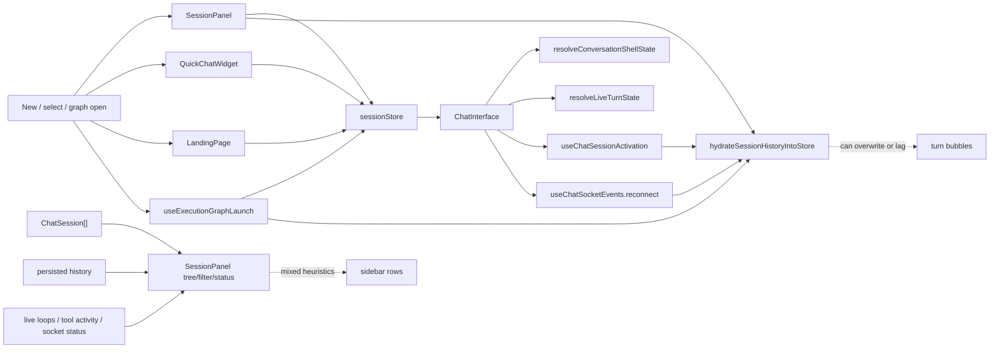
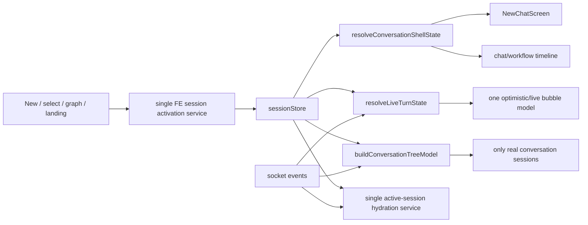
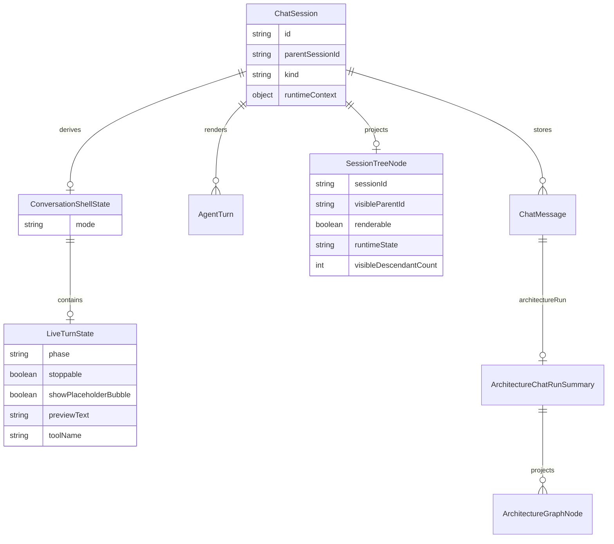
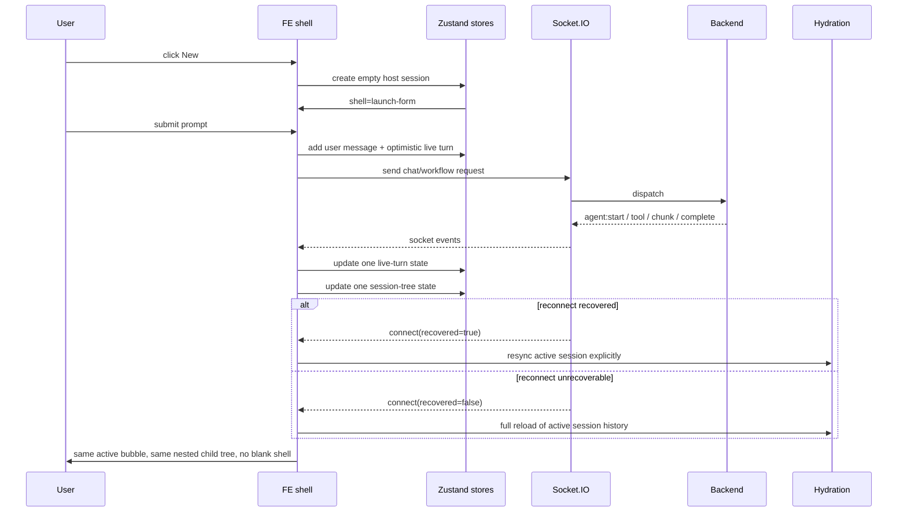

# FE Workflow Shell Cleanup Plan

## Summary

FE nie jest jeszcze demo-ready. Serena i ast-grep pokazują, że problem nie siedzi już głównie w backendzie, tylko w tym, że frontend ma kilka równoległych ścieżek dla aktywacji sesji, hydratacji historii, live turnu i drzewa sub-konwersacji.

Najważniejsze fakty z inspekcji:
- są nadal wielokrotne wejścia w aktywację sesji: `setActiveSession(...)` występuje w 13 miejscach,
- launch jest częściowo współdzielony, ale nadal rozchodzi się przez kilka ścieżek (`SessionPanel`, `QuickChatWidget`, `LandingPage`, `useExecutionGraphLaunch`),
- hydratacja historii jest współdzielona helperem, ale wywoływana z kilku niezależnych miejsc (`activation`, `reconnect`, `graph`, `panel reload`),
- sidebar dalej miesza dwa pojęcia: `realna konwersacja` vs `runtime/planned node`,
- po follow-up i reloadzie rozjeżdża się status hosta i potomków,
- UI wiersza sesji ma realny problem z obcinaniem badge’y i activity labeli.

Plan opiera się na dwóch zasadach z oficjalnych źródeł:
- React: unikać sprzecznego i zduplikowanego stanu, trzymać jeden status zamiast kilku bitów naraz ([React: Choosing the State Structure](https://react.dev/learn/choosing-the-state-structure)).
- Socket.IO: recovery może się nie udać, więc reconnect musi jawnie resynchronizować klienta, a nie zakładać, że wszystko odtworzy się samo ([Socket.IO: Connection state recovery](https://socket.io/docs/v4/connection-state-recovery/)).

## Implementation Update

- Shared FE session activation now lives in `apps/kalio-web/src/features/chat/activeConversationSession.ts`.
- `App.tsx`, `LandingPage.tsx`, `QuickChatWidget.tsx`, `SessionPanel.tsx`, `CLIChildConversationCard.tsx`, and `useExecutionGraphLaunch.ts` now use the shared activation helper instead of ad hoc session switching.
- `SessionPanel` now reloads session history through `hydrateActiveConversationSession(...)`.
- Session artifacts produced by review runs should stay local; `outputs/` and `.serena/` are ignored in git.

## Implementation Status - 2026-06-15

- Done:
  - session activation unified through shared FE helpers
  - hydration/reconnect path unified through shared history hydration
  - live session-status buffering added so status snapshots wait for hydrated conversations before materializing UI state
  - session-status buffering moved into central Zustand ownership: latest snapshot plus ordered pre-hydration buffer are now managed in `agentStore`
  - workflow host auto-expands only for real workflow branch descendants, not generic child chats
  - real workflow branch rows stay nested under the host; router/finalizer stay out of the sidebar
  - `ac-14-session-creation.spec.ts` and `architecture-follow-up-stability.spec.ts` pass on random-port Playwright stacks
  - manual Playwright proof on isolated QA stack confirms live nested branches, pending bubble, completed workflow state, and reload rehydrate
  - Playwright Orchestrator MCP proof on isolated QA stack `60635/60636` passed for `New -> workflow run -> branch open -> reload`
- Remaining:
  - hot-reload stack `3016/5188` can still drift from isolated QA because of stale local state; treat that as environment smoke, not product proof
  - session-row layout density is improved but still worth another pass if demo data uses much longer tool labels or persona names

## Current Architecture

## Target Architecture

## Affected Models

## Event Flow

## Key Changes

### 1. Ujednolicić aktywację sesji i skończyć z bezpośrednim `setActiveSession(...)`
- Wprowadzić jeden FE-level action, np. `activateConversationSession(sessionId, reason)` i drugi pomocniczy `createAndActivateEmptyHostSession(...)`.
- Każde wejście użytkownika ma przechodzić przez to samo API:
  - `SessionPanel`
  - `LandingPage`
  - `QuickChatWidget`
  - `useExecutionGraphLaunch`
  - `CanvasPanel`
  - `CLIChildConversationCard`
  - `GraphInspectorActions`
- `App.tsx` przestaje samodzielnie robić pół-aktywację sesji; ma zostać tylko przy:
  - bootstrap listy sesji,
  - replay/identify HITL root sessions,
  - nav state.
- Cel: tylko jedna ścieżka ustawia aktywną sesję, zapisuje ją do storage i odpala hydratację.

### 2. Domknąć jeden shell kontrakt dla pustej sesji, live turnu i timeline
- `resolveConversationShellState(...)` zostaje jedynym źródłem decyzji dla conversation pane i graph empty state.
- Dopuszczalne tryby pozostają:
  - `launch-form`
  - `live-turn`
  - `timeline`
  - `pending-child-session`
- Zmienić semantykę:
  - `pending-child-session` tylko dla **realnie istniejącej** child `ChatSession`, która została już wybrana, ale jeszcze nie ma transcriptu;
  - nigdy dla graph-only/planned node, bo taki node nie może być selectable jako rozmowa.
- `ChatInterface` nie może już mieć własnych lokalnych skrótów typu `hasRenderableConversation` jako drugiego źródła prawdy.

### 3. Uporządkować live turn do jednego modelu statusu
- `resolveLiveTurnState(...)` ma pozostać jedynym modelem “czy agent odpowiada”.
- Zasada:
  - optimistic pending bubble pojawia się natychmiast po wysłaniu promptu,
  - potem ten sam bubble przechodzi przez fazy:
    - `pending`
    - `thinking`
    - `streaming_text`
    - `running_tool`
    - `queued_followup`
    - `completed | stopped | failed`
- Usunąć lokalne wyjątki i wtórne heurystyki w widokach pobocznych (`CanvasPanel`, `RAAppRenderer`, `ConversationManagerPanel`), tak by one tylko konsumowały `resolveLiveTurnState(...)`.
- Stop button ma być aktywny wyłącznie z `LiveTurnState.stoppable`.

### 4. Zablokować nadpisywanie starego bubble przez nowy run i odwrotnie
- Wprowadzić jeden helper do workflow turn projection, np. `resolveWorkflowTurnProjection(turn, messages)`.
- Reguła musi być niezmienna:
  - jedna wiadomość usera = jeden run = jeden bubble,
  - follow-up workflow w tym samym hoście tworzy **nowy** optimistic envelope natychmiast,
  - poprzedni ukończony bubble już nigdy nie czyta metadanych nowszego runu,
  - revisits w ramach tego samego runu tylko aktualizują ten sam bubble/timeline.
- `hydrateSessionHistoryIntoStore(...)` nie może zastępować aktywnego follow-up turnu starszą historią z poprzedniego runu.
- `launchWorkflowPrompt(...)` i reconnect/activation muszą używać identycznego klucza powiązania: `runId + promptMessageId + turnId`.

### 5. Rozdzielić w sidebarze “czy sesja istnieje” od “jaki ma runtime status”
- Source of truth dla istnienia child row:
  - wyłącznie realny `ChatSession`.
- Source of truth dla planned workflow nodes:
  - wyłącznie `architectureRun.graphNodes` i `trace`, ale tylko dla timeline/canvas.
- `sessionRenderableFilter.ts`:
  - zachować ukrywanie `technical-node`,
  - zachować ukrywanie workflow container,
  - nigdy nie renderować graph-only placeholders jako child conversations,
  - renderować real branch sessions natychmiast, nawet bez transcriptu.
- `sessionTreeDisplay.ts`:
  - `visibleConversationTreeChildren(...)` pozostaje odpowiedzialne za “przezroczystość” kontenera i technical root,
  - ale normalizacja parent/child ma zachować realne zagnieżdżenie, bez flatteningu do top-level.
- `sessionRowRuntimeState.ts`:
  - runtime state ma mieć stałą kolejność:
    1. waiting/HITL
    2. live loop / queue
    3. socket snapshot
    4. architecture trace/graph state
    5. envelope runtime state
    6. last turn terminal state
    7. fallback `pending` tylko dla realnych branch sessions
  - host descendant badge ma liczyć tylko **widoczne realne descendants**, ale status hosta po reloadzie nie może spadać z `running/active` do zbiorczego `pending`, jeśli dzieci mają już mocniejsze live stany.
- Trzeba dodać jeden wspólny tree model, np. `buildConversationTreeModel(...)`, żeby `SessionPanel` nie liczył części rzeczy osobno.

### 6. Ustabilizować reload/reconnect jako jedną semantykę
- `useChatSessionActivation` i `useChatSocketEvents.reconnect` mają używać tego samego helpera aktywnej hydratacji.
- Różnica ma być tylko w trybie:
  - `select`
  - `reload`
  - `reconnect`
- Ten helper ma:
  - pobrać historię,
  - zmergować ją z optimistic/live stanem,
  - odbudować turns,
  - odbudować workflow envelope projection,
  - nie nadpisać aktywnego live turnu starszym snapshotem,
  - odtworzyć ten sam active host / active branch selection.
- Banner reconnectu ma się pokazywać tylko po realnym przejściu `disconnected -> recovered`, nie po świeżym otwarciu UI.

### 7. Dokończyć UI responsywności wiersza sesji
- `SessionPanelRow.tsx` wymaga osobnego cleanupu layoutu:
  - badge architecture label i descendant activity nie mogą być ścinane przez sztywne `max-w`,
  - trzeba rozdzielić metadata line od action line albo przejść na mini-grid/flex-wrap,
  - ikonka statusu ma zawsze być widoczna i nie może wypychać tytułu,
  - latest tool activity ma mieć własną linię i bez konfliktu z badge’ami.
- Akcje hover (`rename/archive/delete`) nie mogą zmieniać szerokości układu.
- Dodać snapshot/component checks dla szerokości typowych pod demo.

### 8. Formalne porządki architektoniczne w FE
- To jest FE-first cleanup, bez zmian wire contractu.
- `@kalio/types` ma już poprawny typed `ArchitectureRuntimeContext`; FE ma używać go bez dalszych heurystyk stringowych tam, gdzie jest dostępny `sessionSurface`.
- Pozostawić `legacy fallback` tylko jako ścieżkę kompatybilności, jasno oznaczoną i zamkniętą testami.
- Backendowe miejsca z `Record<string, unknown>` są poza tą iteracją, chyba że zablokują FE.

## Public Interfaces / Types

- Bez zmian API backendu.
- FE internal contracts do ujednolicenia:
  - `activateConversationSession(...)`
  - `createAndActivateEmptyHostSession(...)`
  - `hydrateActiveConversationSession(...)`
  - `buildConversationTreeModel(...)`
  - `resolveWorkflowTurnProjection(...)`
- `resolveConversationShellState(...)` i `resolveLiveTurnState(...)` pozostają centralnymi selectorami.
- `WorkflowSessionSurface` i `ArchitectureRuntimeContext` z `@kalio/types` pozostają źródłem klasyfikacji sesji workflow.

## Test Plan

### Unit / component
- `ChatInterface`
  - empty host session zawsze pokazuje `NewChatScreen`,
  - first prompt tworzy optimistic pending bubble przed pierwszym chunkiem,
  - stop przed first chunk przełącza bubble do terminalnego stanu,
  - follow-up workflow nie resetuje poprzedniego bubble.
- `liveTurnState`
  - `pending`, `thinking`, `streaming_text`, `running_tool`, `queued_followup`, `stopped`, `failed`.
- `conversationShellState`
  - graph-only/planned nodes nie uruchamiają `pending-child-session`,
  - real child session bez transcriptu uruchamia `pending-child-session`.
- `SessionPanel` / `sessionRenderableFilter` / `sessionTreeDisplay`
  - real branch sessions są nested, nie flat,
  - router/finalizer/container są ukryte,
  - host descendant count liczy tylko realne rows,
  - reload nie degraduje hosta do błędnego `pending`,
  - row status i tool preview są spójne po reconnect.
- `useChatSessionActivation` + `useChatSocketEvents.reconnect`
  - oba używają tej samej semantyki hydratacji,
  - nie nadpisują live follow-up turnu starszą historią,
  - odtwarzają aktywny host lub aktywny branch poprawnie.
- `SessionPanelRow`
  - brak clippingu badge’y i activity line przy wąskich szerokościach.

### E2E / browser QA
- `New` tworzy pustą sesję i pokazuje launch form.
- Single chat:
  - prompt -> pending bubble natychmiast,
  - partial answer streamuje się live,
  - stop działa przed i po first chunk.
- Workflow:
  - host startuje z tym samym shell UX,
  - sub-konwersacje pojawiają się jako nested child rows,
  - brak router/finalizer jako child rows,
  - kliknięcie branch row otwiera realną child conversation, nie blank screen,
  - follow-up w tym samym hoście tworzy nowy bubble bez resetu starego,
  - reload w trakcie i po runie zachowuje poprawny host + child tree + statusy.
- Finalny manual proof uruchamiać na losowych portach QA stacka, nie na `3016/5188`.

## Assumptions / Defaults

- Zakres tej iteracji: frontend only.
- Backend runtime i kontrakty sesji zostają.
- `ChatSession` jest jedynym źródłem prawdy dla istnienia rozmowy w sidebarze.
- `architectureRun.graphNodes/trace` są jedynym źródłem planned stage’ów dla timeline/canvas.
- Jeden prompt użytkownika mapuje się na jeden bubble/run; follow-up to nowy bubble, nie mutacja starego.
- W wykonaniu ten plan ma zastąpić obecny TODO w `docs/todos/2026-06-14-fe-new-chat-workflow-shell-checklist.md` i być tam dalej odhaczany checklistą.
