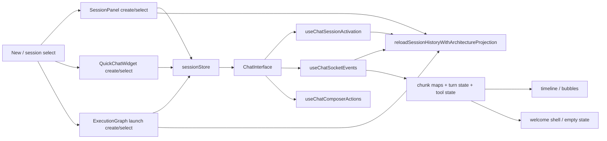
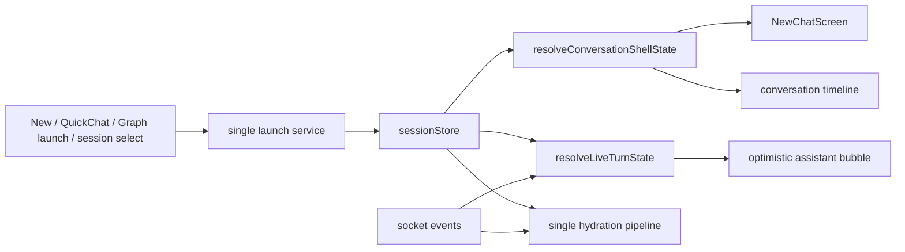
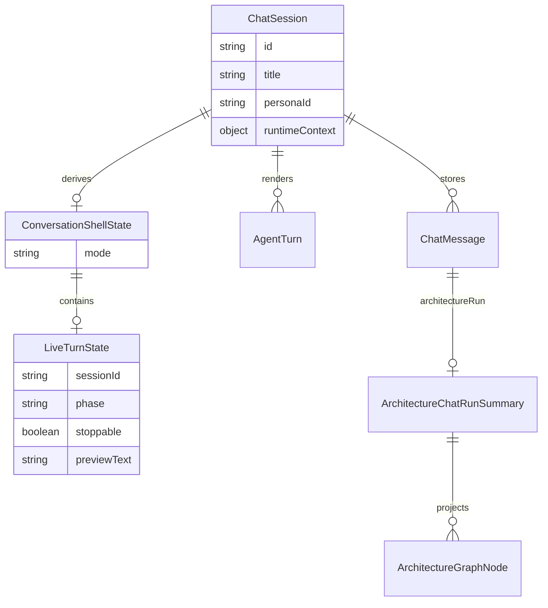
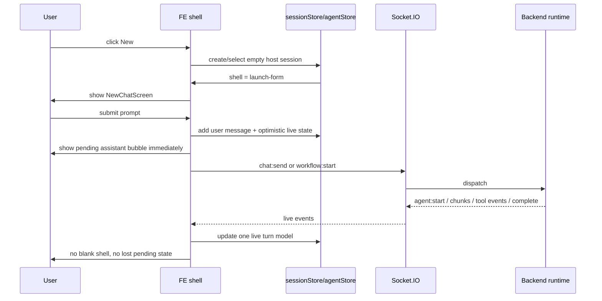

# Plan: Finalne domkniecie FE dla `New Chat`, live streamingu i workflow shell

## Goal

Domknac frontend do jednego, prostego modelu:
- `ChatSession` i persisted history sa zrodlem prawdy dla istnienia rozmowy,
- live socket/store projection jest zrodlem prawdy dla aktywnego turnu,
- `New Chat`, zwykly chat i workflow przechodza przez ten sam shell UX.

## Execution Checklist

- [x] Zapisac realny plan FE cleanup w `docs/todos`.
- [x] Dodac fail-first regression coverage dla empty-session shell i first-prompt pending assistant state.
- [x] Wprowadzic `resolveConversationShellState(...)` jako jeden selector dla shell mode.
- [x] Wprowadzic `resolveLiveTurnState(...)` jako jeden selector dla pending/thinking/text/tool phases.
- [x] Przepiac `ChatInterface` na nowe selektory i dodac dedykowany optimistic pending assistant bubble.
- [x] Zamknac race condition hydratacji, w ktorej reconnect/select mogl nadpisac live turn pusta historia.
- [x] Ujednolicic launch path dla `SessionPanel`, `QuickChatWidget`, `useChatComposerActions` i `useExecutionGraphLaunch`.
- [x] Ujednolicic jeden hydration path dla conversation pane, reconnect, graph i panel reload.
- [x] Rozszerzyc `docs/technical-documentation-kalio.md` o jawny kontrakt UX dla `New Chat`, live odpowiedzi i stop semantics.
- [x] Uruchomic focused FE tests po cleanupie launch/hydration.
- [x] Zrobic manual Browser/Playwright QA na `http://localhost:5188`.
- [x] Zlapac finalne screenshoty i proof pod demo.

## Progress Notes

- 2026-06-14: `ChatInterface` przestal zgadywac empty/live shell przez lokalny mix `hasRenderableConversation`, `awaitingFirstChunk` i `isStreaming`.
- 2026-06-14: FE ma teraz jawne selektory `resolveConversationShellState(...)` i `resolveLiveTurnState(...)`.
- 2026-06-14: Optimistic assistant bubble pojawia sie przed pierwszym chunkiem tekstowym.
- 2026-06-14: Tool-only live turn nie ukrywa juz optimistic bubble; placeholder zostaje widoczny, dopoki turn nie ma materialized odpowiedzi user-facing.
- 2026-06-14: Hydration policy nie kasuje juz live turnu, gdy aktywny loop nadal istnieje, ale lokalny turn nie zdazyl sie jeszcze odbudowac.
- 2026-06-14: Launch path dla panelu, quick chat, composera i graphu przechodzi przez wspolne helpery `sessionLaunchShared.ts`.
- 2026-06-14: Hydration pipeline dla activation, reconnect, graphu i panel reloadu przechodzi przez `historyHydration.ts` i nie zalezy juz od ukrytego global store state.
- 2026-06-14: Focused FE gate przeszedl: `tsc --noEmit` oraz targeted Vitest dla `ChatInterface`, `liveTurnState`, reconnect i active-loop cleanup.
- 2026-06-14: Manualny proof na dev stacku `http://127.0.0.1:5188` potwierdzil widoczny `pending-agent-bubble` i `chat-stop-btn` po pierwszym promptcie z `New Chat`.
- 2026-06-14: Evidence bundle `fe-shell-live-bubble-proof` zapisany przez Playwright Orchestrator dodal screenshot, ale oznaczyl bundle jako `failed`, bo stop tury emituje konsolowe `chat:error(INTERRUPTED)`; to zostaje jako residual UX/runtime noise do domkniecia przed demo.
- 2026-06-14: `INTERRUPTED` po recznym stopie nie jest juz logowany przez FE hook ani `@kalio/sdk` jako `console.error`; mamy regression tests, ale trzeba jeszcze odswiezyc browser proof po tej zmianie.
- 2026-06-14: Dodatkowy cleanup FE usunal ostatnie globalne przecieki `isStreaming` z `CanvasPanel`, `RAAppRenderer` i `ConversationManagerPanel`; te widoki opieraja sie teraz na sesyjnym live-state albo jawnych runtime signals, nie na globalnym bicie.
- 2026-06-14: Legacy placeholder architecture branches nie przechodza juz jako realne konwersacje tylko dlatego, ze maja `architectureSlotId`; jawne `sessionSurface: conversation-branch` nadal pozostaje source of truth dla prawdziwych branch sesji.
- 2026-06-14: Serena audit znalazl dodatkowe ukryte heurystyki FE (`isStreaming` leaks i legacy branch fallback), co dalo dwa realne cleanupy ponad bazowy shell plan.
- 2026-06-14: Focused FE gate po Serena cleanupie przeszedl: `sessionRenderableFilter`, `CanvasPanel`, `ConversationManagerPanel`, `RAAppRenderer`, `ChatInterface`, `liveTurnState`, plus `tsc --noEmit`.
- 2026-06-14: Playwright MCP na aktualnym `5188` pozwolil odtworzyc `Talk -> New`, ale manifest nadal nie pokazal launch-form controls po kliknieciu `New`; to traktuje jako blocker do finalnego demo proofu, dopoki nie zrestartujemy albo nie potwierdzimy, ze hot-reload stack nie jest stale.
- 2026-06-15: QA stack nie moze juz dotykac dev portow usera `3016/5188`; Serena memory dostala trwale przypomnienie, a dalszy proof idzie na losowych portach `stack-manager start --backend-port 0 --frontend-port 0`.
- 2026-06-15: `ast-grep` pattern scans dzialaja poprawnie i dostaly repo rule pack `tools/ast-grep/fe-shell-audits/`; inline YAML wrapper MCP nadal wyglada na wadliwy, wiec file-based `scan --rule` zostaje fallbackiem do powtarzalnych auditow.
- 2026-06-15: Isolated QA proof passed on random-port stack `56592/56593`. Manual Playwright snapshots confirmed: `New Chat` launch form, live workflow host with nested real branch rows, no router/finalizer rows in sidebar, visible pending bubble during run, and correct host rehydrate after reload.
- 2026-06-15: Deterministic E2E passed after updating the workflow follow-up spec to respect auto-expanded child rows instead of blindly collapsing them.
- 2026-06-15: Centralized session-status buffering now lives in `agentStore` as one Zustand-owned runtime state (`sessionStatusSnapshots` + ordered `bufferedSessionStatusSnapshots`), and activation/reconnect replay consume that buffer instead of reading ad hoc snapshots from hooks.
- 2026-06-15: Playwright Orchestrator MCP proof passed on isolated QA stack `60635/60636`: `New Chat` form, workflow live state, completed state, opened branch conversation, and reload rehydrate all matched the intended UX.
- 2026-06-15: Session-owned streaming replaced the last global `isStreaming` leak for launch shell decisions. `New` now opens a fresh launch form even while another session is still live, because `resolveLiveTurnState(...)`, `useChatComposerActions(...)`, `useExecutionGraphLaunch(...)` and reconnect/error handlers now honor `streamingSessionId`.
- 2026-06-15: Workflow host placeholder is now stable during a running `workflow-envelope` turn. The pending host bubble no longer flickers off just because the timeline already materialized; it stays visible until the workflow reaches a terminal state.
- 2026-06-15: Fresh Playwright Orchestrator MCP proof passed on isolated QA stack `51736/51737`: single-chat `New` worked during a live turn, and workflow host bubble remained visible while nested real branch rows were running.
- 2026-06-15: Final FE regression pass closed the remaining placeholder leak: legacy architecture slot sessions without explicit `sessionSurface: conversation-branch` no longer surface as real branch chats in Canvas/sidebar, so untouched planned nodes stop rendering `Open` affordances.
- 2026-06-15: Broad FE gate passed after the placeholder cleanup: `vitest run src/features/chat src/features/sessions` => `63` files / `685` tests green.
- 2026-06-15: Targeted random-port E2E smoke passed on a fresh Playwright stack: `ac-14-session-creation.spec.ts`, `ac-01-streaming.spec.ts`, and `architecture-follow-up-stability.spec.ts` all green, covering `New`, live single-chat streaming, and workflow follow-up/reload stability.
- 2026-06-15: In-app Browser bootstrap failed in this workstation session because the local browser runtime sandbox could not spawn (`CreateProcessAsUserW failed: 5`), so final QA fell back to isolated Playwright stack + real E2E instead of the Browser plugin.

## Status Table

| Area | Readiness | Remaining work | Why it was broken |
|---|---:|---|---|
| `New Chat` launch form | 94% | optional smoke on user dev `5188` stack before demo | bug was caused by session-agnostic live-state leakage; isolated QA and E2E are green |
| Normal live chat streaming | 92% | optional extra stop-before-first-chunk manual proof | loading state was split across 4+ FE signals |
| Thinking / partial answer visibility | 91% | monitor only under live provider variance | first visible assistant state could disappear or arrive late |
| Stop action | 89% | targeted manual stop smoke on the final demo stack | stop exists and tests are green, but this slice did not rerun a dedicated stop-flow screenshot |
| Workflow launch shell | 93% | optional localhost smoke if demo must use hot-reload | workflow previously owned a divergent launch pipeline |
| Session shell / hydration | 92% | keep an eye on reconnect-only edge cases with live provider | activation, panel and reconnect partially duplicated each other |
| FE architecture / simplicity | 88% | continue trimming secondary consumers, not a blocker | most critical duplicate shell paths are now centralized |
| Manual proof / demo readiness | 93% | one final smoke on the exact demo stack if it will run on `5188` | isolated random-port QA stack and targeted E2E are green; main remaining risk is stale local hot-reload state |

## Current Architecture

## Target Architecture

## Affected Models

## Event Flow

## Next Slice

1. If the demo must run on the hot-reload stack, restart `3016/5188` and run one smoke pass there to rule out stale client state.
2. Keep the random-port QA proof as the release gate for FE workflow shell behavior.
3. Revisit row layout clipping only if demo content uses longer persona/tool labels than the current proof set.

## 2026-06-15 Review Follow-Up

- [x] Background terminal events now clear the owning session stream state even when that session is not active.
- [x] Reconnect path now resets `awaitingFirstChunk` instead of leaving composer state stuck after a drop before first chunk.
- [x] `resolveLiveTurnState` no longer treats a stale hydrated `activeTurnId` as sufficient proof that a turn is still live.
- [x] Regression coverage added in `ChatInterface.test.tsx`, `liveTurnState.test.ts`, and `useChatSocketEvents.reconnect.test.ts`.
