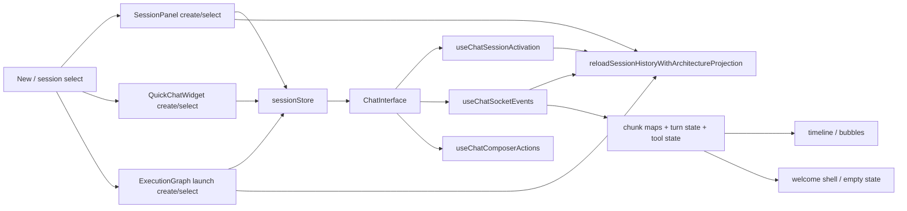
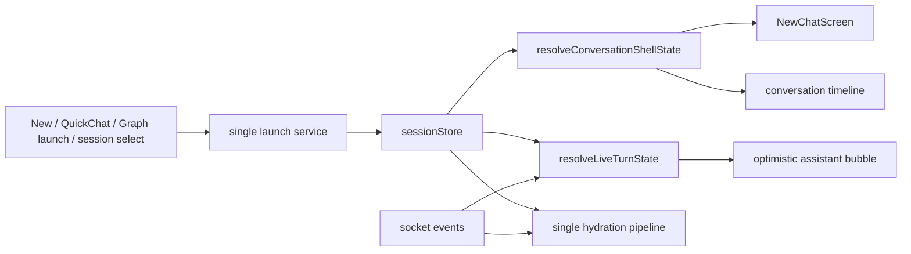
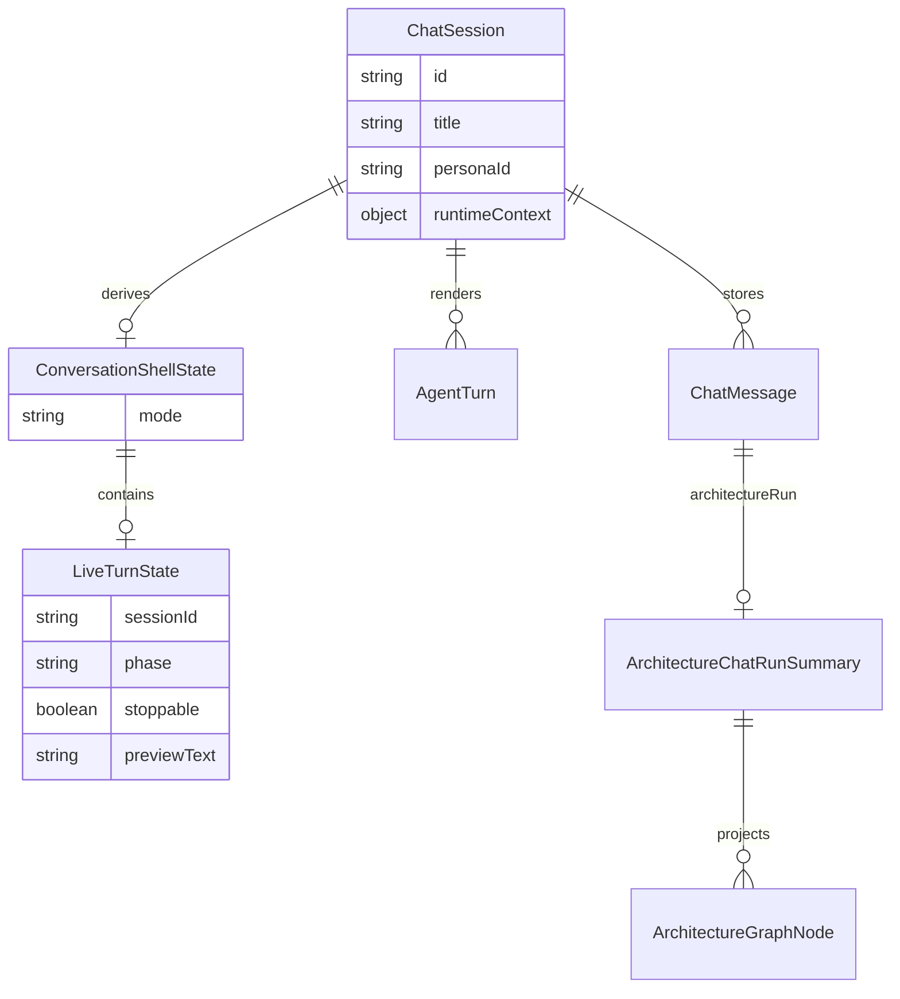
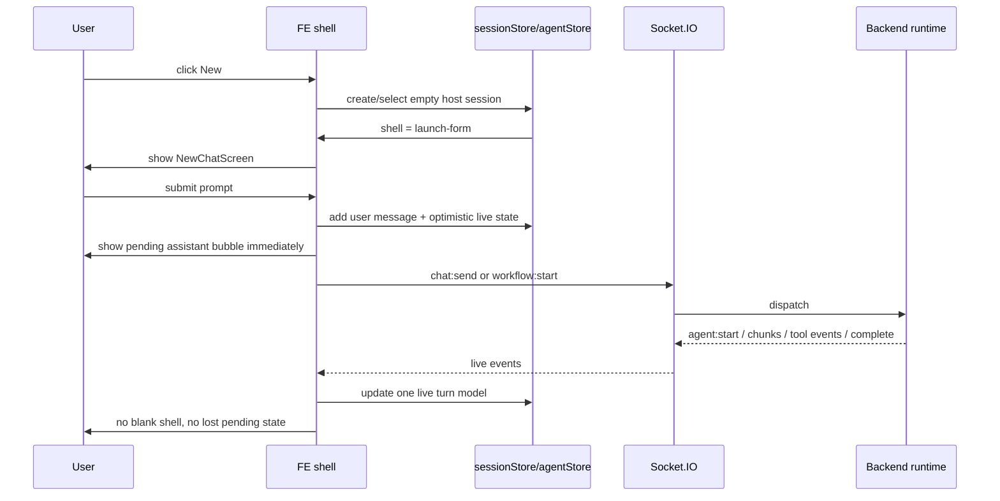

# Plan: Finalne domkniecie FE dla `New Chat`, live streamingu i workflow shell

## Goal

Domknac frontend do jednego, prostego modelu:
- `ChatSession` i persisted history sa zrodlem prawdy dla istnienia rozmowy,
- live socket/store projection jest zrodlem prawdy dla aktywnego turnu,
- `New Chat`, zwykly chat i workflow przechodza przez ten sam shell UX.

## Execution Checklist

- [x] Zapisac realny plan FE cleanup w `docs/todos`.
- [x] Dodac fail-first regression coverage dla empty-session shell i first-prompt pending assistant state.
- [x] Wprowadzic `resolveConversationShellState(...)` jako jeden selector dla shell mode.
- [x] Wprowadzic `resolveLiveTurnState(...)` jako jeden selector dla pending/thinking/text/tool phases.
- [x] Przepiac `ChatInterface` na nowe selektory i dodac dedykowany optimistic pending assistant bubble.
- [x] Zamknac race condition hydratacji, w ktorej reconnect/select mogl nadpisac live turn pusta historia.
- [x] Ujednolicic launch path dla `SessionPanel`, `QuickChatWidget`, `useChatComposerActions` i `useExecutionGraphLaunch`.
- [x] Ujednolicic jeden hydration path dla conversation pane, reconnect, graph i panel reload.
- [x] Rozszerzyc `docs/technical-documentation-kalio.md` o jawny kontrakt UX dla `New Chat`, live odpowiedzi i stop semantics.
- [x] Uruchomic focused FE tests po cleanupie launch/hydration.
- [x] Zrobic manual Browser/Playwright QA na `http://localhost:5188`.
- [ ] Zlapac finalne screenshoty i proof pod demo.

## Progress Notes

- 2026-06-14: `ChatInterface` przestal zgadywac empty/live shell przez lokalny mix `hasRenderableConversation`, `awaitingFirstChunk` i `isStreaming`.
- 2026-06-14: FE ma teraz jawne selektory `resolveConversationShellState(...)` i `resolveLiveTurnState(...)`.
- 2026-06-14: Optimistic assistant bubble pojawia sie przed pierwszym chunkiem tekstowym.
- 2026-06-14: Tool-only live turn nie ukrywa juz optimistic bubble; placeholder zostaje widoczny, dopoki turn nie ma materialized odpowiedzi user-facing.
- 2026-06-14: Hydration policy nie kasuje juz live turnu, gdy aktywny loop nadal istnieje, ale lokalny turn nie zdazyl sie jeszcze odbudowac.
- 2026-06-14: Launch path dla panelu, quick chat, composera i graphu przechodzi przez wspolne helpery `sessionLaunchShared.ts`.
- 2026-06-14: Hydration pipeline dla activation, reconnect, graphu i panel reloadu przechodzi przez `historyHydration.ts` i nie zalezy juz od ukrytego global store state.
- 2026-06-14: Focused FE gate przeszedl: `tsc --noEmit` oraz targeted Vitest dla `ChatInterface`, `liveTurnState`, reconnect i active-loop cleanup.
- 2026-06-14: Manualny proof na dev stacku `http://127.0.0.1:5188` potwierdzil widoczny `pending-agent-bubble` i `chat-stop-btn` po pierwszym promptcie z `New Chat`.
- 2026-06-14: Evidence bundle `fe-shell-live-bubble-proof` zapisany przez Playwright Orchestrator dodal screenshot, ale oznaczyl bundle jako `failed`, bo stop tury emituje konsolowe `chat:error(INTERRUPTED)`; to zostaje jako residual UX/runtime noise do domkniecia przed demo.
- 2026-06-14: `INTERRUPTED` po recznym stopie nie jest juz logowany przez FE hook ani `@kalio/sdk` jako `console.error`; mamy regression tests, ale trzeba jeszcze odswiezyc browser proof po tej zmianie.
- 2026-06-14: Dodatkowy cleanup FE usunal ostatnie globalne przecieki `isStreaming` z `CanvasPanel`, `RAAppRenderer` i `ConversationManagerPanel`; te widoki opieraja sie teraz na sesyjnym live-state albo jawnych runtime signals, nie na globalnym bicie.
- 2026-06-14: Legacy placeholder architecture branches nie przechodza juz jako realne konwersacje tylko dlatego, ze maja `architectureSlotId`; jawne `sessionSurface: conversation-branch` nadal pozostaje source of truth dla prawdziwych branch sesji.
- 2026-06-14: Serena audit znalazl dodatkowe ukryte heurystyki FE (`isStreaming` leaks i legacy branch fallback), co dalo dwa realne cleanupy ponad bazowy shell plan.
- 2026-06-14: Focused FE gate po Serena cleanupie przeszedl: `sessionRenderableFilter`, `CanvasPanel`, `ConversationManagerPanel`, `RAAppRenderer`, `ChatInterface`, `liveTurnState`, plus `tsc --noEmit`.
- 2026-06-14: Playwright MCP na aktualnym `5188` pozwolil odtworzyc `Talk -> New`, ale manifest nadal nie pokazal launch-form controls po kliknieciu `New`; to traktuje jako blocker do finalnego demo proofu, dopoki nie zrestartujemy albo nie potwierdzimy, ze hot-reload stack nie jest stale.
- 2026-06-15: QA stack nie moze juz dotykac dev portow usera `3016/5188`; Serena memory dostala trwale przypomnienie, a dalszy proof idzie na losowych portach `stack-manager start --backend-port 0 --frontend-port 0`.
- 2026-06-15: `ast-grep` pattern scans dzialaja poprawnie i dostaly repo rule pack `tools/ast-grep/fe-shell-audits/`; inline YAML wrapper MCP nadal wyglada na wadliwy, wiec file-based `scan --rule` zostaje fallbackiem do powtarzalnych auditow.

## Status Table

| Area | Readiness | Remaining work | Why it was broken |
|---|---:|---|---|
| `New Chat` launch form | 82% | restart live `5188` stack and rerun `New` proof | empty host visibility depended on scattered render heuristics, and current hot-reload stack still looks stale in MCP |
| Normal live chat streaming | 84% | prove follow-up continuity and no stale console noise | loading state was split across 4+ FE signals |
| Thinking / partial answer visibility | 82% | verify continuity on real workflow follow-up | first visible assistant state could disappear or arrive late |
| Stop action | 88% | rerun browser proof after interrupt-log cleanup | stop existed but UI contract was not explicit |
| Workflow launch shell | 80% | live workflow parity proof on localhost stack | workflow owned a second launch pipeline |
| Session shell / hydration | 82% | manual reload/reconnect proof on live app | activation, panel and reconnect partially duplicated each other |
| FE architecture / simplicity | 82% | trim remaining secondary consumers after live stack stabilizes | too many parallel code paths existed |
| Manual proof / demo readiness | 68% | restart `5188`, rerun `New`/follow-up/reload proof, then capture demo screenshots | current browser-manifest pass suggests stale or still-regressed live dev stack |

## Current Architecture

## Target Architecture

## Affected Models

## Event Flow

## Next Slice

1. Zrestartowac manualny hot-reload stack `3016/5188`, bo aktualny browser-manifest pass wyglada na stale albo dalej regresyjny dla `New`.
2. Zrobic drugi manualny pass po cleanupie `INTERRUPTED` logow i odswiezyc proof bundle.
3. Zrobic drugi manualny pass dla follow-up i reload/reconnect na dev stacku.
4. Zrobic workflow parity proof dla host shell + live pending state.
5. Zlapac finalne screenshoty przed/podczas/po runie oraz po reloadzie.
