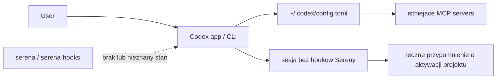
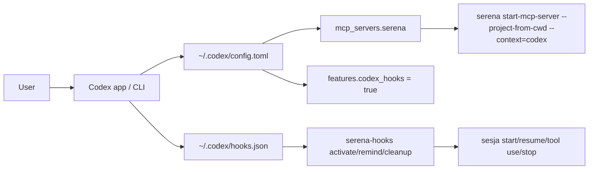
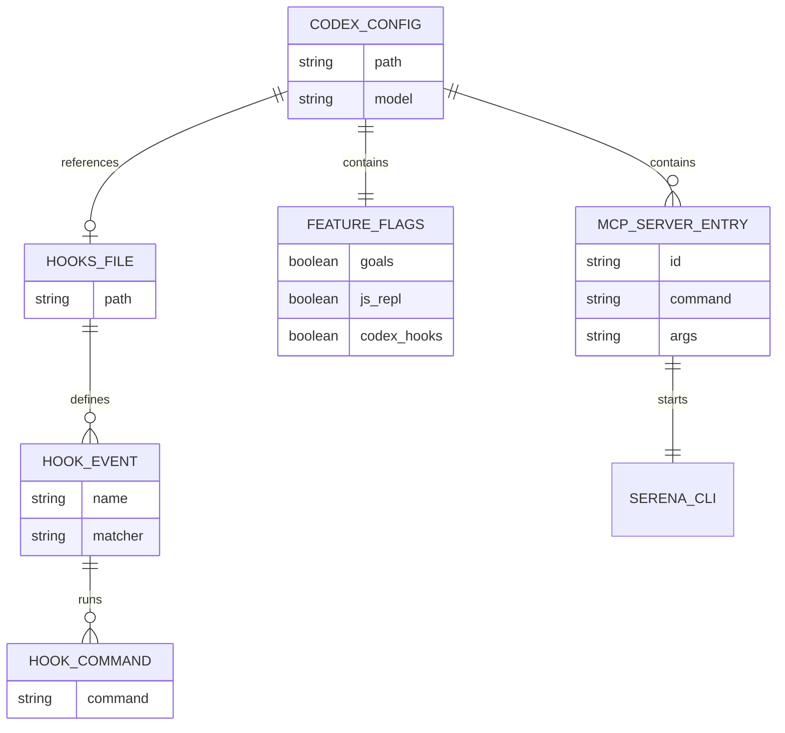

# Plan: Serena MCP i hooki dla Codexa

## Goal

Zainstalowac `serena-agent` dla lokalnego srodowiska Codexa na Windows i dodac globalna konfiguracje MCP + hooki bez naruszania istniejacych ustawien `~/.codex`.

## Acceptance Criteria

- `serena` oraz `serena-hooks` sa dostepne z terminala.
- `C:\Users\Radomiej\.codex\config.toml` zawiera aktywny wpis `mcp_servers.serena`.
- Sekcja `[features]` zachowuje obecne flagi i ma dolaczone `codex_hooks = true`.
- `C:\Users\Radomiej\.codex\hooks.json` istnieje i zawiera hooki `SessionStart`, `PreToolUse` oraz `Stop` dla Sereny.
- Zmiana jest zweryfikowana przez odczyt plikow i dostepnosc polecen.

## Execution Checklist

- [x] Sprawdzic instrukcje Serena dla instalacji i konfiguracji Codexa oraz aktualne docs OpenAI dla hookow.
- [x] Odczytac obecny `~/.codex/config.toml` i potwierdzic brak `hooks.json`.
- [x] Ustalic, czy `uv` i `serena` sa juz dostepne lokalnie.
- [x] Zainstalowac wymagany runtime/package manager dla Sereny, jesli brakuje.
- [x] Zainstalowac lub zaktualizowac `serena-agent`.
- [x] Dodac wpis `mcp_servers.serena` do `~/.codex/config.toml` bez nadpisywania innych serwerow.
- [x] Dopisac kanoniczne `hooks = true` do istniejacej sekcji `[features]`.
- [x] Utworzyc `~/.codex/hooks.json` z hookami `activate`, `remind` i `cleanup`.
- [x] Zweryfikowac instalacje i konfiguracje przez komendy oraz odczyt plikow.
- [x] Zapisac notatke sesyjna z dowodami i instrukcja dalszego kroku dla restartu/nowej sesji Codexa.
- [ ] Zweryfikowac po nowej sesji Codexa, ze `/mcp` pokazuje `serena` jako polaczony serwer.

## Progress Notes

- 2026-06-14: Serena docs dla Codexa wskazuja `serena setup codex` albo reczny wpis `mcp_servers.serena` z `start-mcp-server --project-from-cwd --context=codex`.
- 2026-06-14: Serena docs zalecaja wlaczenie `codex_hooks = true`, ale aktualne docs OpenAI dla Codexa uzywaja kanonicznego `[features].hooks = true`; ustawienie zrobione po tej nowszej nazwie.
- 2026-06-14: Obecny `~/.codex/config.toml` ma juz sekcje `[features]` z `goals = true` i `js_repl = false`; trzeba ja rozszerzyc, a nie zastapic.
- 2026-06-14: `C:\Users\Radomiej\.codex\hooks.json` obecnie nie istnieje.
- 2026-06-14: `uv` nie bylo dostepne w `PATH`; zainstalowane lokalnie przez `py -m pip install --user uv` w wersji `0.11.21`.
- 2026-06-14: `serena-agent` zainstalowany przez `uv tool install -p 3.13 serena-agent`, co pobralo `cpython-3.13.14` i zainstalowalo `serena`, `serena-agent` oraz `serena-hooks`.
- 2026-06-14: Serena zostala zainicjalizowana przez `serena init -b LSP`; globalny config powstal w `C:\Users\Radomiej\.serena\serena_config.yml`.
- 2026-06-14: `~/.codex/config.toml` dostal backup `config.toml.bak-serena-20260614-232216`, wpis `mcp_servers.serena` z pelna sciezka do `serena.exe` oraz `hooks = true`.
- 2026-06-14: `~/.codex/hooks.json` zostal utworzony z pelnymi sciezkami do `serena-hooks.exe`, zeby nie polegac na `PATH`.

## Current Architecture

## Target Architecture

## Affected Models

