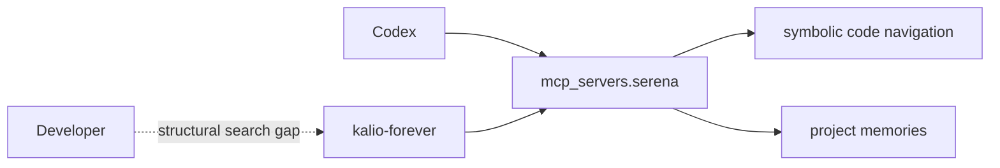
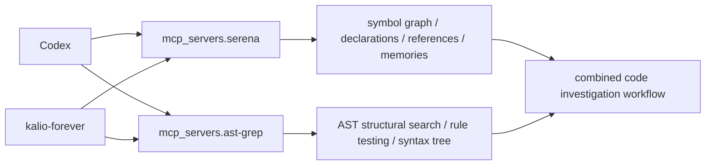
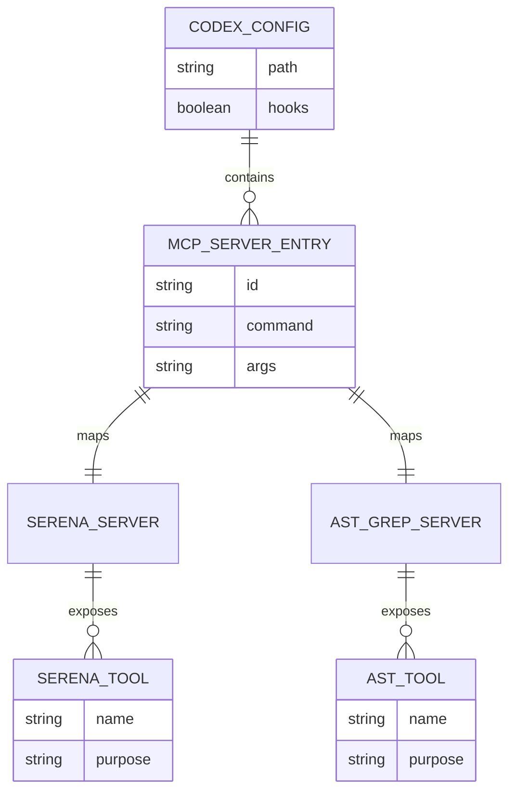

# Plan: ast-grep MCP dla Codexa i porownanie z Serena

## Goal

Dodac `ast-grep-mcp` do globalnej konfiguracji Codexa, uruchomic realny smoke test w `kalio-forever` i ocenic, czy uzupelnia Serene przy pracy na kodzie.

## Acceptance Criteria

- Potwierdzony aktualny sposob uruchamiania `ast-grep-mcp` z oficjalnego repo.
- Zainstalowane wymagane zaleznosci runtime (`ast-grep`, `uv` lub ich odpowiedniki juz obecne lokalnie).
- `C:\Users\Radomiej\.codex\config.toml` zawiera wpis `mcp_servers.ast-grep`.
- Po restarcie lub odswiezeniu sesji Codexa narzedzia `ast-grep-mcp` sa widoczne i odpowiadaja.
- Wykonany smoke test na kodzie `kalio-forever`.
- Udokumentowana praktyczna roznica: kiedy uzywac Serena, kiedy `ast-grep-mcp`, a kiedy obu razem.

## Execution Checklist

- [x] Sprawdzic upstream `ast-grep-mcp` i potwierdzic obecny sposob instalacji/uruchomienia.
- [x] Odczytac obecny `~/.codex/config.toml` i potwierdzic stan MCP po Serenie.
- [x] Sprawdzic lokalna dostepnosc `ast-grep`, `sg`, `uv` i ewentualnych binarek MCP.
- [x] Wybrac najmniej kruchy wariant instalacji na Windows dla Codexa.
- [x] Zainstalowac brakujace zaleznosci w profilu uzytkownika.
- [x] Dodac wpis `mcp_servers.ast-grep` do `~/.codex/config.toml` z backupem.
- [x] Zweryfikowac, ze `ast-grep-mcp` odpowiada na co najmniej jedno zapytanie przez MCP handshake/client test.
- [x] Wykonac porownawczy test `Serena vs ast-grep-mcp` na tym repo.
- [x] Zapisac notatke sesyjna z evidence, ryzykami i rekomendacja uzycia.
- [ ] Po nowej sesji Codexa potwierdzic, ze namespace/narzedzia `ast-grep` sa widoczne natywnie w tool list.

## Progress Notes

- 2026-06-15: Oficjalny README `ast-grep-mcp` wskazuje Python MCP server uruchamiany przez `uv`, z szybkim trybem `uvx --from git+https://github.com/ast-grep/ast-grep-mcp ast-grep-server`.
- 2026-06-15: Upstream deklaruje entrypoint `ast-grep-server = "main:run_mcp_server"` i wymaga Python `>=3.13`.
- 2026-06-15: Lokalny `~/.codex/config.toml` ma juz aktywny wpis `mcp_servers.serena`; `ast-grep` nie jest jeszcze skonfigurowany.
- 2026-06-15: Na Windows stabilniejszy od `uvx` przy kazdym starcie jest `uv tool install git+https://github.com/ast-grep/ast-grep-mcp`, bo daje lokalny `ast-grep-server.exe` bez zaleznosci od sieci przy kolejnych startach.
- 2026-06-15: `ast-grep-cli 0.42.3` zostal zainstalowany przez `py -m pip install --user ast-grep-cli`, co dalo `ast-grep.exe` w `C:\Users\Radomiej\AppData\Roaming\Python\Python314\Scripts`.
- 2026-06-15: `sg-mcp 0.1.0` zostal zainstalowany przez `uv tool install git+https://github.com/ast-grep/ast-grep-mcp`, co dalo `C:\Users\Radomiej\.local\bin\ast-grep-server.exe`.
- 2026-06-15: `~/.codex/config.toml` dostal backup `config.toml.bak-ast-grep-20260615-000448` i wpis `mcp_servers."ast-grep"` z kontrolowanym `PATH`, bo server wywoluje literalnie `ast-grep` przez subprocess.
- 2026-06-15: Reczny klient MCP uruchomiony z Pythona z venv `sg-mcp` potwierdzil `initialize` + `tools/list`, zwracajac `dump_syntax_tree`, `test_match_code_rule`, `find_code`, `find_code_by_rule`.
- 2026-06-15: Porownawczy test na `resolveLiveTurnState` pokazal, ze Serena lepiej nadaje sie do symbol graph (`find_referencing_symbols`), a `ast-grep-mcp` do structural search po wywolaniach i ksztaltach AST.

## Current Architecture

## Target Architecture

## Affected Models

