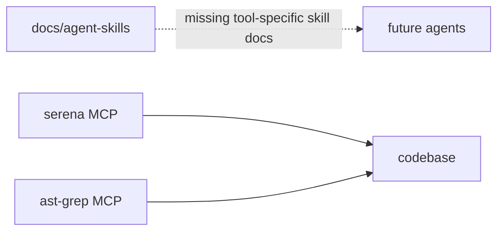
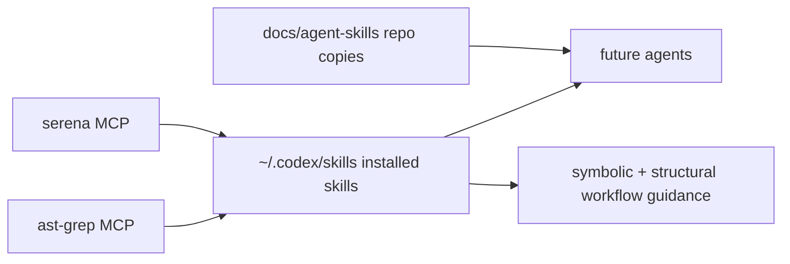

# Plan: Skille dla Sereny i ast-grep-mcp

## Goal

Dodac dwa praktyczne skille do Codexa i repo-copy w `docs/agent-skills`, aby przyszli agenci wiedzieli kiedy i jak uzywac Sereny oraz `ast-grep-mcp` w `kalio-forever`.

## Acceptance Criteria

- Istnieje skill dla Sereny z naciskiem na symbol graph, memories i oszczedne czytanie kodu.
- Istnieje skill dla `ast-grep-mcp` z naciskiem na structural search, YAML rules i workflow z Serena.
- Repo-copy skilli istnieja w `docs/agent-skills`.
- Zainstalowane kopie skilli istnieja pod `C:\Users\Radomiej\.codex\skills\...`.
- Tresc skilli jest zgodna z aktualnym stanem repo i narzedzi po ostatnich instalacjach.

## Execution Checklist

- [x] Sprawdzic format lokalnych skilli w `~/.codex/skills` i repo-copy w `docs/agent-skills`.
- [x] Napisac repo-copy skilla Sereny.
- [x] Napisac repo-copy skilla `ast-grep-mcp`.
- [x] Zainstalowac oba skille do `~/.codex/skills`.
- [x] Zweryfikowac odczyt i lokalizacje plikow.
- [x] Zapisac krotka notatke sesyjna.

## Current Architecture

## Target Architecture

