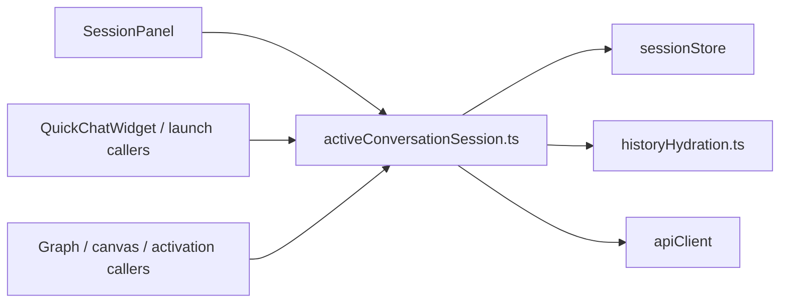
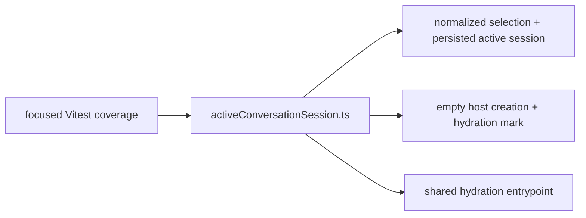
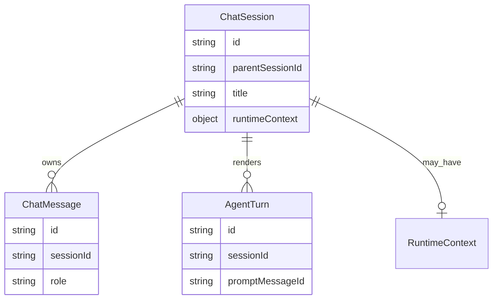

# Plan: Test gaps around active conversation session helpers

## Goal

Close the most direct uncovered paths introduced by the latest FE session-routing cleanup without expanding scope beyond the changed files.

## Execution Checklist

- [x] Identify changed helpers with weak or missing direct coverage.
- [x] Add focused regression tests for `activeConversationSession.ts`.
- [x] Add sharper regression coverage for session-scoped streaming isolation and workflow turn completion.
- [x] Verify the focused Vitest file passes.
- [x] Record what remains intentionally untested in this slice.

## Progress Notes

- 2026-06-15: Current diff introduces new shared helper module `apps/kalio-web/src/features/chat/activeConversationSession.ts` and shifts multiple call sites onto it.
- 2026-06-15: Existing FE tests cover downstream hooks and panel behavior, but direct unit coverage for selection persistence and shared host-session activation helper is missing.
- 2026-06-15: Added direct tests for selection persistence, shared host creation hydration mark, explicit/default hydration fetch path, session-scoped streaming stop isolation, and workflow turn completion semantics for terminal / `waiting_on_orchestrator` runs.
- 2026-06-15: First red run exposed a wrong test assumption: conversation branches intentionally stay branch-scoped; only hidden technical workflow sessions normalize back to the visible host. The test was corrected to the real product rule before the green verification pass.

## Current Architecture

## Target Architecture

## Affected Models

## Next Slice

1. Cover only the new shared helper behavior that current integration tests do not pin directly.
2. Re-run only the touched FE test file unless a failure forces a wider local gate.
3. Remaining likely high-value gaps in the current diff are reconnect replay edge cases and session-status fast-path materialization in `useChatSocketEvents.helpers.ts`.
