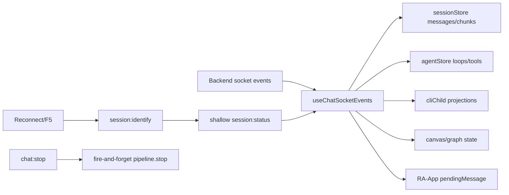
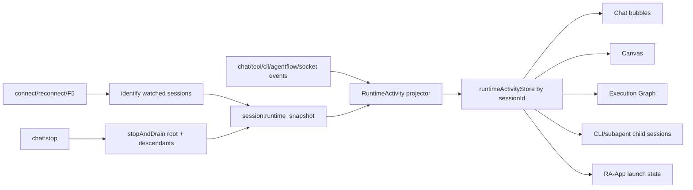
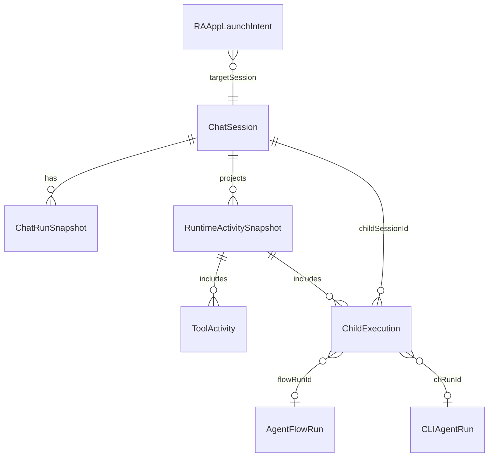

# AppFlow Runtime Unification

Date: 2026-06-19
Status: core slice verified with runtime-first child execution projections and built-stack smoke

## Goal

Stabilize Kalio AppFlow/runtime transitions by making chat, RA-App launch, CLI/subagent children, AgentFlow, and graph panels consume one rebuildable runtime activity projection. Backend remains the durable source of truth; frontend live state is disposable and can be reconstructed after F5/reconnect.

## Current Architecture

## Target Architecture

## Affected Model Relations

## Implementation Checklist

- [x] Add shared runtime activity types in `@kalio/types`.
- [x] Build backend runtime snapshot aggregation from session status, pending confirmations, CLI runtime status, and AgentFlow runtime.
- [x] Emit `session:runtime_snapshot` on identify/reconnect hydration and after terminal transitions.
- [x] Await root and descendant drain for `chat:stop`.
- [x] Update SDK reconnect behavior so recovered reconnects still trigger app-level re-identify.
- [x] Add frontend runtime activity snapshot store and hydrate it from snapshots.
- [x] Route RA-App home tile through a typed launch intent instead of plain `pendingMessage`.
- [x] Treat CLI/subagent/AgentFlow launches as shared child execution contracts and key entry actions in UI.
- [x] Add semantic CLI workdir context and safe explicit file search scope.
- [x] Add focused regression tests for launch, reconnect/snapshot, stop drain, and child execution actions.
- [x] Run focused tests, affected typecheck/build, and QA smoke where practical.
- [x] Write `docs/sessions/2026-06-19-appflow-runtime-unification.md` with evidence and remaining blockers.

## Deferred Non-Critical UX

- Tool label wording and ordering.
- Autoscroll tuning.
- Thinking animation polish.
- Bottom status copy duplication.
- Manual graph collapse controls.
- Visual grouping refinements.

## Notes During Execution

- User explicitly prioritized generic/unified flow over one-off bug fixes.
- Socket.IO connection-state recovery is best-effort; app-level re-identify and snapshot synchronization remain mandatory.
- React state should avoid duplicated or contradictory sources of truth; runtime activity should be a single projection source.
- `pendingRAAppLaunchIntent` can arrive after `activeSessionId` on the real app path; launch dispatch had to be split from session hydration to avoid missing home-tile auto-start.
- Frontend now stores runtime snapshots in `agentStore`; the main user-facing chat/canvas/graph/session surfaces are runtime-first, while remaining legacy fallbacks are concentrated in store/helpers instead of direct panel read paths.
- History hydration now re-synchronizes the active transcript projection from per-session state after reload/reconnect so welcome-screen fallback does not win over persisted transcript data.
- Runtime snapshot aggregation no longer calls `agentFlowRuntime.findAll()` during `session:identify`; it uses parent-scoped lookup to avoid identifying one session by reconciling the entire historical AgentFlow archive and blowing the backend heap.
- Frontend runtime-aware selectors now merge `session:runtime_snapshot` into session/canvas/graph/session-manager read paths, so reconnect-rehydrated runtime survives even when legacy `activeAgentLoops` did not.
- CLI child cards, tool bubbles, agent-turn CLI live/completed decisions, and canvas CLI previews now resolve child runtime from `runtimeActivitySnapshots` first and only fall back to `cliChildProjections` for compatibility metadata like title/toolName/history-only output.
- Subagent canvas previews now resolve runtime status from `RuntimeChildExecution` first; legacy `activeAgentLoops` are only a fallback when no runtime child execution exists.
- Execution Graph child nodes now use `RuntimeChildExecution` for live/terminal status and can render runtime-only placeholder nodes for subagent / CLI / AgentFlow children before durable `tool_result` payloads arrive.
- `agentStore` now projects live CLI child runs and subagent loops back into the parent session `runtimeActivitySnapshots[sessionId].childExecutions`, so parent chat/canvas/graph panels consume one child-execution model instead of stitching separate loop/projection stores together.
- The first runtime-first CLI child selector attempt exposed a real Zustand loop hazard: returning a freshly merged object directly from the store selector caused React `getSnapshot` / maximum-update-depth failures. The fix was to select raw store slices and memoize the merged projection inside the hook.
- `useChatSocketEvents.cliChild.test.ts` was missing the newer `onRuntimeActivitySnapshot` eventBus mock; the test suite now matches the runtime lifecycle contract instead of failing with a false regression.
- `useChatSocketEvents.queued.test.ts` also needed the runtime snapshot eventBus mock once lifecycle registration moved onto `session:runtime_snapshot`; queue-depth and interrupted-session socket tests now run against the real lifecycle shape instead of a stale mock surface.
- Backend runtime snapshot building now silently skips the known legacy case where an old CLI child session has no saved runtime metadata; that case is recoverable from persisted history and no longer emits noisy `CLI_AGENT_SESSION_METADATA_MISSING` warnings during `session:identify`.
- Activation and reconnect now restore the live turn from `runtimeActivitySnapshots` first. Legacy `session:status` buffering remains only as a compatibility fallback when no runtime snapshot exists, so stale status packets cannot resurrect a completed turn after hydration.
- Official Socket.IO 4.x connection-state-recovery docs (last updated 2026-06-04) still describe recovery as best-effort and explicitly require app-level state resynchronization when recovery is not successful. That validates keeping `session:identify` + `session:runtime_snapshot` mandatory even when `socket.recovered === true`.
- Added a dedicated Playwright regression for `stop -> drain -> follow-up` (`apps/e2e/tests/regression-stop-follow-up.spec.ts`). It proves the unified runtime path clears the active slot before the next send, instead of silently degrading into a queued follow-up.
- Queue read paths are now runtime-first in the main frontend surfaces. `ChatInterface`, `RAAppRenderer`, `CanvasPanel`, `AgentTurnBubble`, `conversationTreeModel`, and `SessionPanel` merge `queueLength` from `runtimeActivitySnapshots` ahead of legacy `queuedDepthBySession`, so queue state is no longer reconstructed independently per panel.
- `ConversationManagerPanel`, `SessionPanel`, `conversationTreeModel`, `AgentTurnBubble`, `CanvasPanel`, and `ExecutionGraphView` no longer read raw `activeAgentLoops` directly. They now derive live state from runtime snapshots or from runtime-aware selectors that keep any remaining fallback logic behind the store boundary.
- Legacy-path audit result:
  - keep `bufferedSessionStatusSnapshots` as a bounded hydration/reconnect fallback until runtime snapshots are guaranteed to arrive before any replayable live-turn state is needed;
  - keep `activeAgentLoops` as a bounded optimistic/live-seed fallback inside runtime selectors/store helpers, not as a direct truth source for the main UI panels;
  - keep `cliChildProjections` as a bounded compatibility fallback for history-only CLI metadata and titles that are richer than the current runtime child contract;
  - treat direct panel reads from raw `queuedDepthBySession` as redundant and migrate them toward runtime-first selectors first.
- Random-port built-stack smoke after the queue-selector cleanup passed for reload history, streaming queue/anti-spam, and stop-then-follow-up. Current remaining QA concern is therefore classified as fixed-stack environment drift, not a product-runtime regression in the unified appflow slice.
- Final random-port built-stack smoke after removing the last direct `activeAgentLoops` panel reads also passed for CLI child canvas preview, seeded graph/chat runtime states, and stop-then-follow-up.
- The current QA stack still reports an effective `/api/llm/config` provider from DB (`xiaomimimo`) even when stack startup logs say `mock`; mock-only Goal Guard smoke therefore remains environment-blocked, not product-blocked.
